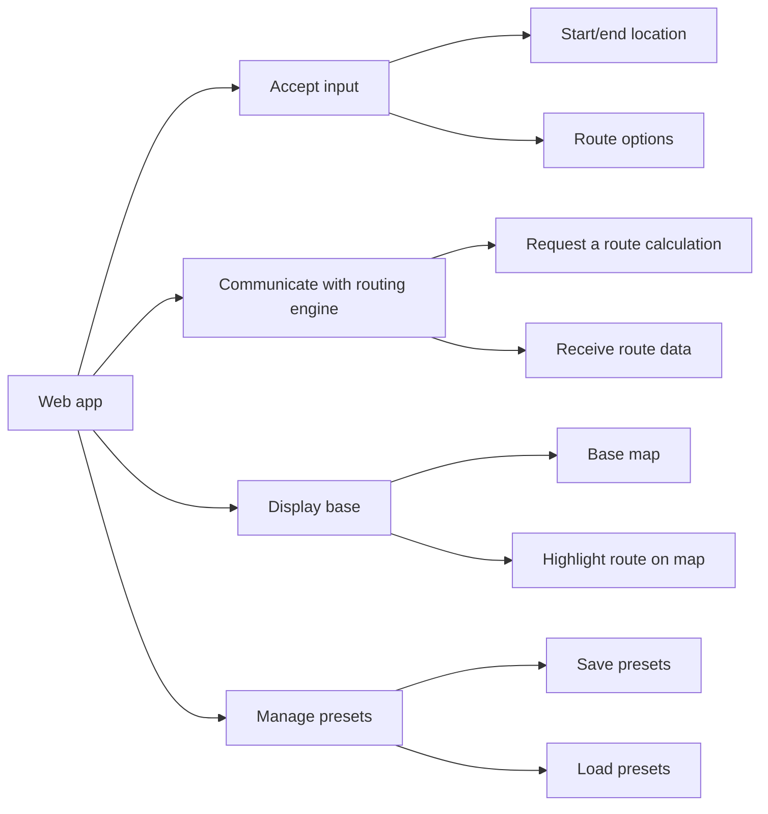

# Pedestrian routing using open map data

A-level Computer Science programming project

## Contents

- [Pedestrian routing using open map data](#pedestrian-routing-using-open-map-data)
  - [Contents](#contents)
  - [Analysis](#analysis)
    - [Stakeholder identification](#stakeholder-identification)
      - [James](#james)
      - [Andrew](#andrew)
      - [Ili](#ili)
    - [Problem definition](#problem-definition)
    - [Justification of computational approach](#justification-of-computational-approach)
      - [Initial situation](#initial-situation)
      - [Clear goal](#clear-goal)
      - [Clear inputs and outputs](#clear-inputs-and-outputs)
      - [Clearly defined logic](#clearly-defined-logic)
    - [Problem research](#problem-research)
      - [Initial stakeholder interviews](#initial-stakeholder-interviews)
        - [Initial interview with Andrew](#initial-interview-with-andrew)
          - [Key takeaways](#key-takeaways)
          - [Transcript](#transcript)
        - [Initial interview with James](#initial-interview-with-james)
          - [Key takeaways](#key-takeaways-1)
          - [Desired features](#desired-features)
          - [Transcript](#transcript-1)
        - [Initial interview with Ili](#initial-interview-with-ili)
          - [Key takeaways](#key-takeaways-2)
          - [Desired features](#desired-features-1)
          - [Transcript](#transcript-2)
        - [Follow-up discussion with Andrew](#follow-up-discussion-with-andrew)
      - [Similar solutions](#similar-solutions)
        - [OsmAnd (map app)](#osmand-map-app)
        - [Magic Earth (map app)](#magic-earth-map-app)
        - [Google Maps (map app)](#google-maps-map-app)
        - [Valhalla (routing engine)](#valhalla-routing-engine)
        - [Open Source Routing Machine (routing engine)](#open-source-routing-machine-routing-engine)
          - [Algorithm](#algorithm)
          - [Experience](#experience)
        - [GraphHopper](#graphhopper)
          - [Algorithm](#algorithm-1)
    - [Project goals and branding](#project-goals-and-branding)
      - [One-line description](#one-line-description)
        - [Brainstorming](#brainstorming)
        - [Conclusion](#conclusion)
      - [App name](#app-name)
    - [Essential features](#essential-features)
      - [Essential routing engine features](#essential-routing-engine-features)
        - [`B1` Route generation](#b1-route-generation)
        - [`B2` API for route requests](#b2-api-for-route-requests)
        - [`B3` Range of options to customise routing](#b3-range-of-options-to-customise-routing)
      - [Essential UI features](#essential-ui-features)
        - [`F1` Communication with the routing engine](#f1-communication-with-the-routing-engine)
        - [`F2` Drawing the route on a map](#f2-drawing-the-route-on-a-map)
        - [`F3` Fields to set the available options](#f3-fields-to-set-the-available-options)
        - [`F4` Saving options as presets](#f4-saving-options-as-presets)
        - [`F5` Accessibility](#f5-accessibility)
    - [User requirements](#user-requirements)
      - [User requirements signatures](#user-requirements-signatures)
    - [Limitations of the system](#limitations-of-the-system)
      - [Geographic limitations](#geographic-limitations)
      - [Routing feature limitations](#routing-feature-limitations)
      - [Navigation feature limitations](#navigation-feature-limitations)
    - [Hardware and software requirements](#hardware-and-software-requirements)
      - [Software requirements (routing engine)](#software-requirements-routing-engine)
      - [Hardware requirements (routing engine)](#hardware-requirements-routing-engine)
      - [Requirements (web app)](#requirements-web-app)
  - [Design](#design)
    - [Program structure diagrams](#program-structure-diagrams)
      - [Overall architecture](#overall-architecture)
      - [Routing engine structure](#routing-engine-structure)
      - [Web app structure](#web-app-structure)

## Analysis

### Stakeholder identification

#### James

James is a member of my computing class and is interested in using OpenStreetMap (OSM) data for navigation, but needs a program that can reliably do this. He has already tried a few apps that use map data from OSM, so he will be able to provide insights to how my engine compares to results from other programs, as well as suggest areas where other engines fall short.

#### Andrew

Andrew is also in my computing class so I will have frequent contact with him. He uses pedestrian navigation for a variety of purposes in our local area, from going for runs in green spaces to goal-oriented navigation in a city centre. This wide range of uses in a small geographic area will be invaluable for rapid feedback cycles and adjustment of the routing engine during development. One use case he looks forward to trying is finding the optimal route to get to the local bakery from school. He wants to have easy-to read instructions and the total distance he'll have to walk.

#### Ili

Ili is a family member who will be able to provide feedback and ideas often. While he doesn't use pedestrian routing as often as my other stakeholders, he often uses navigation apps for driving and enjoys using maps. This means that he will certainly offer valuable opinions on map design, how intuitive the UI is, and the general user experience. He has highlighted the need for safety in pedestrian navigation, i.e. while crossing roads. My navigation app will provide him with an alternative to Google Maps for shorter journeys that better understands the pavements and crossings in our area.

### Problem definition

A routing engine is a piece of software that calculates a route between two points in the world, following a pre-defined network of paths or roads. Routing engines first became commonly used with satnavs and similar automotive navigation systems ([Wikipedia: w.wiki/BUn$](https://en.wikipedia.org/wiki/Automotive_navigation)) that provide live directions for driving.

Nowadays, "navigation apps" are the most common way to interact with a routing engine. They make the features of a routing engine accessible through a graphical interface that lets users enter a starting point and destination, from which a route will be calculated and plotted on a map.

 <!-- perform the same task, and can be used for driving as well as walking or cycling. -->

<!-- Modern routing engines use geographic data of roads to  -->

### Justification of computational approach

The task of finding an efficient route between two geographic locations has some complexities, such as the need for an algorithm to chose which paths to explore without knowing for sure which ones will be optimal. However, these challenges have successfully been overcome by a variety of programs that incorporate routing engines. This task is solvable with an algorithm because it of four characteristics: an initial situation, clear inputs and outputs, clearly defined logic, and a clear goal. These will be discussed in detail below.

#### Initial situation

The routing engine is provided with coordinates for a starting point, and coordinates for the ending point. The initial situation for the program will be a graph that represents a network of paths for the area that will be covered by the routing query. The graph will be generated by processing map data from OpenStreetMap with the following steps:

1. Extract ways that represent a walkable section of a route, e.g. paths, roads, plazas. This will be done by checking for corresponding top-level tags, e.g. `highway=footway`.
2. Also extract the nodes from each way. Untagged nodes that aren't intersections can be ignored.
3. Use a recursive algorithm to walk through the extracted map data, building a graph where intersections and barriers are represented as graph nodes, and segments of walkable ways are represented as edges. A weight for each node and edge will be calculated to represent how desirable it would be to navigate that node, or walk along that edge.

#### Clear goal

Its goal is to provide the user with a real-world path that they can follow on foot to navigate from the start to the end point, as well as a series of steps that describe the route in text. The route should follow walkable map objects to ensure it makes sense as a route. The engine should generate routes that are desirable to a user looking to travel safely and efficiently (i.e. minimising the effort required to follow the route).<!-- Planing walks for leisure (e.g. circular path walks through woods) --> To achieve this, the engine will follow the following principles:

- Prefer a shorter-distance route, all else being equal
- Prefer pavements over roads without pavements
- Prefer paved paths over unpaved ones
- Prefer signalled crossings to unsignalled ones, especially if crossing a busy road
- Prefer well-marked paths to difficult-to-spot ones
- Avoid obstructions that may pose an issue for pedestrians (e.g. fallen trees)

In addition to the points above, the most desirable route for a user will depend on their own preferences and physical abilities. To accommodate this, the engine will be configurable to prioritise routes that are suitable for the specific user. Goals that should be configurable are:

- Avoid high kerbs, and prefer crossings with flush kerbs
- Prefer crossings with tactile paving
- Prefer paths that are lit at night
- Avoid steps
- Avoid large numbers of steps
- Prefer steps where a handrail is available
- Prefer paths wide enough for a wheelchair
- Prefer crossings with audible indicators
- Prefer crossings with tactile indicators

#### Clear inputs and outputs

Users will interact with the routing engine through a basic web-based UI. There will be text fields to enter start and end points, using either coordinates or addresses (which are converted to coordinates using a geocoding API).

Once the route is calculated, it will be outputted by rendering it on a map rendered by the [Leaflet library](https://leafletjs.com/). It will also display a textual list of directions that can be followed.

#### Clearly defined logic

The front-end will use the [Nominatim API](https://nominatim.org/) to convert the inputted start and end locations to coordinates, or use coordinates directly if provided. The pair of coordinate pairs will then be passed to the routing engine.

The routing engine will use the routing graph to find the optimal route between the two points using a pathfinding algorithm, such as A\*, to find a route that will be desirable for the user (as defined above).

### Problem research

While I have a general mental idea of what the routing engine should accomplish, it's essential to research similar programs, as well as stakeholders, to gain a well-rounded idea of what features are most important for my program, as well as how to make the user interface as intuitive as possible for my target audience.

#### Initial stakeholder interviews

I will interview each of my stakeholders to gain an understanding of what they would like from a routing engine, and accompanying GUI. I plan to ask the following questions:

<table>
  <thead>
    <tr>
      <th>Question</th>
      <th>Justification</th>
    </tr>
  </thead>
  <tbody>
    <tr>
      <td>How often do you use an app or website to get directions?</td>
      <td>An idea of how frequently my app will guide my UI design, e.g. I may prioritise/deprioritise being able to quickly get directions</td>
    </tr>
    <tr>
      <td>How often do you use an app or website to get directions for walking?</td>
      <td>To confirm or deny my hypothesis that predict that navigation apps will be used for pedestrian navigation much less frequently than for other modes of transport</td>
    </tr>
    <tr>
      <td>In what situations are you more likely to use an app for pedestrian navigation?</td>
      <td>Tells me the specific situations that my app will likely be used in, so that I can optimise the features and UI accordingly. I hypothesise unknown city centres to be one such situation.</td>
    </tr>
    <tr>
      <td>What apps do you use to get directions?</td>
      <td>This could indicate other projects that would be useful to research</td>
    </tr>
    <tr>
      <td>What are your main issues with the currently-available apps for routing?</td>
      <td>Identifying pain points in similar apps will provide ideas for areas to focus on to give my app unique appeal.</td>
    </tr>
    <tr>
      <td>Is it more helpful to see a pedestrian route plotted on a map, or a list of directions?</td>
      <td>To decide how much development time to dedicate to different features, and ensure the result is presented in the most useful way.</td>
    </tr>
    <tr>
      <td>What factors should be considered when the program decides which route is best?</td>
      <td>Gives ideas for which factors should be included into the graph weights, and how much time to spend optimising those factors.</td>
    </tr>
    <tr>
      <td>Would a mobile or desktop app be more important for you?</td>
      <td>I expect that mobile support will be very useful, so that directions can be obtained while out and about. Gauging the importance of a mobile app will determine how much time I might spend on mobile-specific features and optimising the UI for mobile devices.</td>
    </tr>
    <tr>
      <td>If the navigation app is used through a web browser, is that a disadvantage or an advantage to you?</td>
      <td>Although I am almost certainly going to make the front-end using web technologies, it will be useful to know if my users have any complaints or perceived drawbacks regarding web apps, so that I can try and address them.</td>
    </tr>
    <tr>
      <td>Is it important for the navigation app to work while you're offline? What situations could you see yourself using this feature in?</td>
      <td>This will help determine how much of the app should work offline, e.g. whether map data should be downloaded on demand or pre-downloaded. I may use tools like service workers to keep the web app functional when offline.</td>
    </tr>
  </tbody>
</table>

##### Initial interview with Andrew

I asked Andrew my research questions and gained useful insight into how pedestrian routing is used in the real world.

###### Key takeaways

- Google Maps lacks most smaller paths, making it less useful for countryside navigation or walks. An app that includes these would be very desirable.
- Otherwise, Andrew found Google Maps intuitive and easy to use
- He uses pedestrian navigation quite often, as he doesn't drive yet
- Having the route shown as an overlay on a map would "definitely" be more useful than presenting it as a list of directions
- Path surface preference can be situational, e.g. avoiding muddy or unpaved paths will be even more desirable if it's just been raining
  - This could be accomplished by adding an option to further deprioritise those path types
- Preferring lit paths after sunset would also be a very useful factor to include
- He brought up the idea of incorporating foot traffic data, so that really busy paths can be avoided
  - This could be especially important in some specific situations, e.g. if social distancing is desired, or for users who don't like crowds of people

###### Transcript

In this transcript, Andrew's words are labelled as "AS" and my words are labelled as "MR". I have removed most stuttering, filler words, and interjections that don't add any meaning.

- **MR**: Alright, I'm going to be recording-
- **AS**: Hi Mish
- **MR**: Hello! Are you alright if I ask you some questions for my project?
- **AS**: No.
- **MR**: Yes.
- **AS**: Yes, I am
- **MR**: Which is going to be a project on pedestrian routing, so it will be a navigation app, basically. Okay, I'd like to know first of all, how often you use a app or website to get directions, at all.
- **AS**: Probably about once every two weeks, when I'm going somewhere new... how long a journey will take, \[by] car or just walking
- **MR**: So you'd say it's especially useful if you're going somewhere new?
- **AS**: Yes, definitely
- **MR**: Okay. And how often do you use an app for pedestrian navigation? So for just walking
- **AS**: I'd say it's about 50/50 with using it for cars, honestly... if I need to just find out how to get somewhere if I don't have a car, which is quite important for me-
- **MR**: Yeah, that's fair, yeah. Any situations where you find it especially useful to have that pedestrian routing available? Or is it just in general if you're walking somewhere?
- **AS**: Well, yeah, that, but I've found it's also quite useful when I'm trying to find out where someone is, if they give you their location so you can route to that using, Google Maps, usually.
- **MR**: Yeah, so have your map coordinates that you can just go to, okay
- **AS**: Just checking if it's recording?
- **MR**: No, I was just reading my questions.
- **MR**: And, what apps do you use or have you used to get directions?
- **AS**: Pretty much entirely Google Maps, yeah
- **MR**: Sounds good. Do you find its interface intuitive?
- **AS**: Yeah-
- **MR**: Do you find it, _\[incomprehensible]_ laid out?
- **AS**: I have actually used Google maps to find someone before, so there's that. Yeah, it's intuitive, easy.
- **MR**: Nice, okay. Anything you don't like about how Google Maps does pedestrian routing?
- **AS**: It doesn't have a very good layout of paths, like smaller paths, it just doesn't show, which isn't nice, so I was trying to run to Shere, and I was trying to use the compass to find out which paths to take.
- **MR**: Okay, yeah. That's definitely something I'm hoping to improve with this app.
- **AS**: Great.
- **MR**: So if you're using a navigation app, so you find it more helpful to have a list of directions with road names &mdash; "turn on to this road, turn on to that road, cross at this road" &mdash; or the route overlaid onto a map, that's highlighted in blue or whatever.
- **AS**: Ah, definitely overlaid onto a map. It's quite nice to be able to visualise that.
- **MR**: Yep. And how useful is it to have your location on it, so it can be updated live?
- **AS**: Yeah, very very useful. Otherwise you're just _\[incomprehensible]_
- **MR**: Mhm, sounds good. And finally, what factors do you think I should consider when deciding which route is best?
- **AS**: So when you've got multiple different routes... to get to a place?
- **MR**: Yeah, so, which properties or aspects of the paths and roads to consider. Like, obviously, everything else being equal, we'll go for the shortest path, because it's likely to be the quickest, but that's not the only thing that will affect how enjoyable your route will actually be.
- **AS**: Oh, okay. That is an interesting comment.
- **MR**: Take your time. It's one that requires some thinking.
- **AS**: I can only think of really specific things, like if it's been raining, and there's a muddy path, you might want to stick to roads
- **MR**: Yeah, that's useful yeah. So, maybe having "avoiding unpaved paths" as an option, as well as just a default thing?
- **AS**: And maybe, what, elevation... you don't wanna climb a really steep thing and then go down a really steep thing when you can go around.
- **MR**: That's a good point, yeah. That sounds good.
- **AS**: I suppose if you could get foot traffic data, but it doesn't really matter if there's a lot of people blocking your path unless there's a lot and a lot of people
- **MR**: Yeah, that's good. What about paths being lit at night?
- **AS**: Oh yeah, that's a very good point. Yeah, you definitely want to go down lit paths at night.
- **MR**: Okay, sounds good! Alright, thanks for answering my questions-
- **AS**: No worries.
- **MR**: And if you have any other feedback you can email me or tell me.
- **AS**: Yep, I probably won't email you.
- **MR**: As great as emails are.

[Download the full recording (05:16, m4v, 0.5 MB)](./assets/interviews/andrew/2024-09-20-andrew-initial-interview.m4v)

##### Initial interview with James

My initial interview with James was conducted via email. It was very valuable to understand he uses similar navigation apps, and how they compare.

###### Key takeaways

- There are a variety of navigation apps available, each with their own advantages and drawbacks
- Battery usage during navigation on mobile is a an important consideration for James
- Pedestrian navigation is most useful in unfamiliar urban areas (as I expected)
- Many navigation apps (Google Maps, Magic Earth) are optimised for driving and therefore don't give ideal pedestrian routes

###### Desired features

- Efficient battery use during navigation (if a live navigation feature is added)
- Warnings if the surfaces on the route are poor
- Avoiding wet and muddy routes based on time of year and surface type
- A list of directions for sharing with others

###### Transcript

> Hi Mish,
>
> Sorry for the slow response,
>
> 1. **How often do you use an app or website to get directions?**
>
>    2 or 3 Times a week at least, I normally use it to plan a route before going.
>
> 1. **How often do you use an app or website to get directions for walking?**
>
>    Quite often whenever I'm in an area which I don't know that well
>
> 1. **In what situations (i.e. what places) are you more likely to use an app for pedestrian navigation?**
>
>    I'm most likely to use the app in cities or town which I don't know very well, I also often use a navigation app if I'm a looking for a specific building and I'm not completely sure where it is.
>
> 1. **What apps do you use to get directions**
>
>    I use a mixture if different apps as they all have there advantages:
>
>    OsmAnd for walking as it provides much better and faster pedestrian routes than its rivals, I also find that the location seems a bit more accurate compared to other apps on this list which is partially helpful when walking.
>
>    Magic Earth for driving but this app uses a lot of battery so it is only really suitable for shorter routes
>
>    Google Maps for planning routes as it shows me all the different modes of transport I can get there. I also often use it to navigate long journeys in a car because it uses much less battery than Magic earth.
>
> 1. **What are your main issues with the currently-available apps?**
>
>    The OsmAnd UI can be much harder to use at times and it doesn't give you the ability to search along route.
>
>    Magic Earth is primarily a car focus app and therefore regularly give you very inefficient pedestrian routes, It also use too much battery limits how long I can use it for.
>
>    Google maps is also car focused and rarely gives you the most efficient pedestrian route, It also almost never gets the direction you are facing when walking correct which can made following it directions very difficult.
>
> 1. **Is it more helpful to see a pedestrian route plotted on a map, or a list of directions?**
>
>    I like to be able to see a map, but a list of instructions can be easier to follow and much easier to share with others.
>
> 1. **What factors should be considered when the program decides which route is best?**
>
>    The speed and distance of the route, how accessible the route is, and the surface of the route depending on the time of year (I probably don't want to walk down a wet and muddy route) the program could give me a warning and offer me an alternative route which avoids these kind if areas.
>
> If you need more details or have any follow up questions let me know,
>
> Thank you,
>
> James
>
> > Hi James,
> >
> > I'd like to ask you a few questions to help research for my pedestrian navigation app:
> >
> > 1. How often do you use an app or website to get directions?
> > 1. How often do you use an app or website to get directions for walking?
> > 1. In what situations (i.e. what places) are you more likely to use an app for pedestrian navigation?
> > 1. What apps do you use to get directions?
> > 1. What are your main issues with the currently-available apps?
> > 1. Is it more helpful to see a pedestrian route plotted on a map, or a list of directions?
> > 1. What factors should be considered when the program decides which route is best?
> >
> > If you have any other thoughts or ideas, please share them too.
> >
> > I look forward to working with you to ensure the navigation app can be as useful as possible.
> >
> > Mish

##### Initial interview with Ili

My interview with Ili was done two weeks later than my other two initial stakeholder interviews, so I decided to add a few more questions about the platforms that the app will be available on, in order to back up my plans to make it a cross-platform web app. These questions have been listed and justified at the top of the [initial interviews section](#initial-stakeholder-interviews).

###### Key takeaways

- Similarly to Andrew, Ili would strongly prefer a route rendered on a map to a list of directions
- Unlike my other two stakeholders, he uses navigation apps for walking much less than for driving
- His only gripe with Google Maps is how it is sometimes uncertain when finding more complex addresses
  - While I could try improving on this in my project, I plan to focus more on improving the routing between two given points, rather than improving the geocoding and destination input.
  - In addition, we will likely be limited by the number of addresses in the OSM database. OSM address coverage in the UK is not particularly extensive, so it's unlikely that I will be able to do better than Google Maps in that regard.
- He is indifferent on the matter of a native app vs a web app, caring more about what it looks like than technical differences

###### Desired features

- Considering colour blind users when designing the map
  - While I will be using off-the-shelf raster map tiles for the base map, which limits my ability to customise its colour scheme, I can ensure the rest of the UI remains accessible to those with colour blindness.
  - Because the frontend runs in the browser, I will be able to use colour blindness emulation in browser dev tools to help ensure the app is usable, even for people with various vision difficulties.

###### Transcript

In this transcript, Ili's words are labelled as "IR" and my words are labelled as "MR". I have removed most stuttering, filler words, and interjections that don't add any meaning.

- **MR**: Okay, there we are. Bring that a bit closer. Right, first of all, what I'd like to know is how often you use an app or website to get any sort of directions, on foot or by car.
- **IR**: I would say, probably 3 times a week.
- **MR**: Okay. And how often do you use an app for pedestrian directions?
- **IR**: Less frequently, but a couple of times a month maybe.
- **MR**: Okay, yeah. And what situations do you use pedestrian navigation in?
- **IR**: If I'm in a large city or something, and I need to find a new place I haven't been to before, and I'm not driving, then I'll walk there.
- **MR**: Yeah, sounds good. What app do you use for that? For any sort of navigation.
- **IR**: Google Maps. The only-
- **MR**: Yep, the most common one. Can you think of any issues you have with the currently-available apps &mdash; so, Google Maps, basically &mdash; for pedestrian routing?
- **IR**: I'm not always sure if Google \[Maps] pinpoints the place I want to go to accurately. So you don't know until you get there.
- **MR**: Oh okay. Is that like location within a large place, like a shopping centre, or just a specific address where it might not know where you are?
- **IR**: A specific address. If it's not a straightforward "Number 5, Acacia Avenue", \[there] can be a margin of uncertainty as to whether its gotten it right or not.
- **MR**: Mhm, yeah. If it's 50 or 52 instead of 51 to 53. <!-- Note: this was an in-joke -->
- **IR**: Yeah.
- **MR**: If you're using an app for pedestrian routing, is it more helpful to have a route plotted on a map (like, highlighted on a map) or to get a list of directions?
- **IR**: Well I'm quite good with maps, so I prefer a map rather than... directions I find are not so clear, specific, as-
- **MR**: Yep.
- **IR**: "turn right on a map": I can see where the actual... I prefer a map.
- **MR**: Mhm, sounds good. And there are a lot of options for this question, but when the app's calculating a route, it will want to pick the shortest route, but there'll be other factors as well that will influence which route it prefers. Stuff to do with the path or the road that you're on. Are there any aspects that you think would be important to factor in?
- **IR**: Yes, so obviously selecting roads that have footpaths on them, rather than a country lane without a footpath, if at all possible. Selecting a route in a busy city centre via pedestrian crossings might be useful, rather than get dual carriageways in the middle of-
- **MR**: Yeah, we can definitely do that.
- **IR**: ...the middle of Birmingham, for example, and you want to avoid asking people to cross those. You want to go via footbridge or other crossing facilities.
- **MR**: Yeah, sounds good. And... I can probably guess the answer to this, but would a mobile or desktop app be more useful for you?
- **IR**: Mobile. I don't carry the desktop around.
- **MR**: So you can use it when you're actually needing the directions. And if you're accessing the navigation app through a web browser, would that be an advantage or disadvantage to you?
- **IR**: To me, it's what I see that counts. I'm not really sure of the technical differences between viewing a picture that's on a web browser or through some other interface, from an app or something.
- **MR**: Yep, mhm
- **IR**: I mean, if I'm presented with a map I can understand, then it doesn't worry my how it gets there, really
- **MR**: Yep. And finally, is it important for you for the navigation app to work while it's offline?
- **IR**: That'd be useful, yes. If I had to pick between two apps, and that was the only difference between them, then I'd pick the one that worked offline as well.
- **MR**: Yep.
- **IR**: One thing that might be useful in a city centre scenario would be a dry route, as opposed to a shortest route. Through a shopping centre, or...
- **MR**: So anywhere, sort of, covered?
- **IR**: Covered, yeah.
- **MR**: Prioritise those places.
- **IR**: Yeah.
- **MR**: Yeah.
- **MR**: Yeah, sounds good. Any specific situations where offline support would be most helpful? Or is it just whenever mobile data is patchy.
- **IR**: Yeah, patchy or...
- **IR**: Yeah, that's when it's gonna be useful, is when you're in the countryside or something, and the signal's not so common, you might find it useful.
- **MR**: Yeah.
- **IR**: If you're doing a walk route, which might be across a big hill or something, you might like to have one that works offline.
- **MR**: Yeah. Is there anything else you've thought of that you'd want to suggest or mention? Or any questions you have about the project?
- **IR**: I don't know whether most mapping apps these days take into account people with colour blindness and suchlike. Was it red and green, or red and blue, that's commonly indistinguishable by people who are colour blind, whether that's something to bear in mind.
- **MR**: So, when thinking about how the map's presented, or how it's highlighted.
- **IR**: Yeah, the colour of the map. I mean, I'm not colour blind, so I can see things... I don't appreciate, necessarily, that a red route on a green background or something might not stick out very well. So you have that kind of colour blindness.
- **MR**: Mhm, yep
- **IR**: Apart from that, nothing else spring to mind.
- **MR**: Okay, cool. Thank you very much.
- **IR**: You're welcome.
- **MR**: Hopefully you'll be able to find some use for the app.
- **IR**: Yep.

[Download the full recording (08:36, m4v, 0.8 MB)](./assets/interviews/ili/2024-10-06-ili-initial-interview.m4v)

##### Follow-up discussion with Andrew

On 17 October 2024, I had an informal discussion with Andrew. When I asked him if mobile or desktop support would me more important, he told me that mobile support would be very important. I also asked him about accessing the app through the browser, to which he told me the only disadvantage of that would be the lack of offline access. I mentioned how I could make the web app work offline, which he agreed with.

#### Similar solutions

As part of my research, I will investigate other programs that provide pedestrian routing. This will include programs that are solely routing engines, as well as map apps that have routing features built in.

##### OsmAnd (map app)

OsmAnd ([osmand.net](https://osmand.net/), [w.wiki/BV4b](https://en.wikipedia.org/wiki/OsmAnd#Navigation)) is a mobile map app that uses OSM data and has routing that runs on-device for a range of transport modes. I have personally found its pedestrian routing to be very good in real-word use, so I will be using it as my primary point of reference to compare my engine's routes with.

| Route overlay                                                                                           | Directions list                                                                                    | Navigation options                                                                                                                                                      |
| ------------------------------------------------------------------------------------------------------- | -------------------------------------------------------------------------------------------------- | ----------------------------------------------------------------------------------------------------------------------------------------------------------------------- |
|  |  |  |

##### Magic Earth (map app)

Magic Earth ([magicearth.com](https://www.magicearth.com/)) is a similar mobile map app, suggested by my stakeholder James.

##### Google Maps (map app)

Google Maps ([google.co.uk/maps/about](https://www.google.co.uk/maps/about), [w.wiki/BV4d](https://en.wikipedia.org/wiki/Google_Maps#Directions_and_transit)) is a popular web app and mobile app.

| Route overlay                                                                                                                                 | Directions list                                                                                              | Navigation options                                                                                                |
| --------------------------------------------------------------------------------------------------------------------------------------------- | ------------------------------------------------------------------------------------------------------------ | ----------------------------------------------------------------------------------------------------------------- |
|  |  |  |

##### Valhalla (routing engine)

> Valhalla is an open source routing engine and accompanying libraries for use with OpenStreetMap data. Valhalla also includes tools like time+distance matrix computation, isochrones, elevation sampling, map matching and tour optimization (Travelling Salesman).[^valhalla-readme]

[^valhalla-readme]: Valhalla readme file (<https://github.com/valhalla/valhalla/blob/3a385045919967a14d5c9cc57610b2111936ac64/README.md>), accessed 17 September 2024

Valhalla is written in C++.

##### Open Source Routing Machine (routing engine)

> High performance routing engine written in C++ designed to run on OpenStreetMap data.[^osrm-readme]

[^osrm-readme]: OSRM readme file (<https://github.com/Project-OSRM/osrm-backend/blob/203314b1aa5a4cbbd32b8bd47a5c68399bd9d04e/README.md>), accessed 19 September 2024

Open Source Routing Machine (OSRM) ([project-osrm.org](https://project-osrm.org/)) is a car, bicycle, and pedestrian routing engine with source code available on GitHub ([Project-OSRM/osrm-backend](https://github.com/Project-OSRM/osrm-backend)).

###### Algorithm

OSRM either uses contraction hierarchies or multilevel Dijkstra's algorithm, with its documentation recommending to use the multi-level Dijkstra pipeline.[^osrm-pipelines]

[^osrm-pipelines]: OSRM Readme file, "Quick Start" (<https://github.com/Project-OSRM/osrm-backend/blob/203314b1aa5a4cbbd32b8bd47a5c68399bd9d04e/README.md#quick-start>), accessed 19 September 2024

###### Experience

Below is an example route that demonstrates two features I like about OSRM: it suggests an equally-valid alternative route (translucent and dotted) as well as the main one (solid), and it gets onto the pavement as soon as possible.

##### GraphHopper

> GraphHopper is a fast and memory-efficient routing engine released under Apache License 2.0.[^graphhopper-readme]

GraphHopper ([www.graphhopper.com/open-source](https://www.graphhopper.com/open-source/)) is the third main open-source routing engine that uses OSM data. It's written in Java and supports a range of transport modes, including walking. Its source code is available at <https://github.com/graphhopper/graphhopper>, and has a useful technical overview document ([docs/core/technical.md](https://github.com/graphhopper/graphhopper/blob/master/docs/core/technical.md)).

[^graphhopper-readme]: GraphHopper readme file (<https://github.com/graphhopper/graphhopper/blob/c0ad6b040b8930ad2a5a28661b211b1289a5d93d/README.md>), accessed 9 October 2024

###### Algorithm

GraphHopper supports Dijkstra's algorithm and the A\* algorithm. It also supports contraction hierarchies, which improves speed at the cost of less flexibility to incorporate additional factors (e.g. traffic data).[^graphhopper-technical-overview]

[^graphhopper-technical-overview]: GraphHopper technical overview (<https://github.com/graphhopper/graphhopper/blob/c0ad6b040b8930ad2a5a28661b211b1289a5d93d/README.md#technical-overview>), accessed 9 October 2024

### Project goals and branding

After gaining an idea of exactly what my stakeholders want from a navigation app, I can think about what the high-level goals of the project should be. I will then transform this into some example prose for describing the app, to create a sort of branding that describes what the project will do and what features it will have. I want to capture the "vibe" of the project before I start developing it.

Thinking about branding early on in the project will have a few advantages, e.g. to:

- Provide a consistent mindset that I can keep during development, to help keep the project moving in the right direction
- Inspire the specific features that I add
- Be a "guiding star" of what the end product should look like
- Describe what the app will provide, to effectively communicate the app's purpose to stakeholders or anyone else interested
- Make it easier to explain what the project is, by providing a sentence or set of sentences that I know will do a good job at describing the app.

#### One-line description

I want a one-line description to succinctly capture a few key points of my app:

- Accessibility
  - The app will have lots of options to aid with accessible pedestrian travel
  - This is a key unique feature of the app, so I want to mention it in a one-line description
- Cross-platform support
- Keeping it simple
- Benefit to the environment (perhaps)
  - As the app will make it easier for people to get around by walking, which is better for the environment than powered transport

##### Brainstorming

1. "Pedestrian routing for anyone, anywhere"
   - I like how "for anyone" represent the accessibility features
   - "for anyone" could also represent its wide platform support due to running in the browser
   - "pedestrian routing" is perhaps too much of a technical term
   - "anywhere" is intended to represent how you can use it on a mobile device when outdoors, or from your desktop at home. It will also suggest that it supports a wide range of real-world situations. However, the routing engine will be limited geographically to Great Britain, so routing can't actually be done "anywhere"
2. "Pedestrian navigation, optimised for you"
   - "optimised for you" represents the variety of options that will make it able to cater for a variety of users and situations
   - "pedestrian navigation" is easier to understand than "pedestrian routing"
   - The pronoun in "optimised for you" perhaps sounds a bit vague and overly promotional, where I want it to be mainly descriptive
3. "Easy pedestrian navigation for anyone"
   - This returns to the "for anyone" phrasing
   - I wanted a nicer synonym for "simple" (as it will be a no-frills app), so I went for "easy"
   - "easy" should also capture the ease of use that I hope to build in to the app by working closely with my stakeholders and holding accessibility as a priority.
4. "Easy pedestrian navigation for everyone"
   - I changed "anyone" to "everyone" as I feel it elicits an even greater sense of inclusivity and accessibility
5. "Pedestrian navigation, done right"
   - "done right" signifies the attention to detail that will be put into the routing engine to ensure it uses footpaths, pavements, and other paths correctly
   - "done right" also highlights how the project will improve upon other navigation apps like Google Maps that have inadequate coverage of paths.
   - However, this one lacks the description of benefits to users, like the others have

##### Conclusion

For users:

> Easy pedestrian navigation for everyone

For developers (tentative):

> Pedestrian navigation, done right

#### App name

An overall name for the project (which will also be the app name) will be very important, because it will:

- Make it easier for stakeholders (and others) to refer to and discuss the app
- Provide something that sticks in the head of potential users, so that they can remember the project after hearing about it
- Provide branding for the web app, e.g. HTML page title, or app name when installed as a progressive web app (PWA)

With that said, I don't consider it necessary to decide on an app name at this point, as the app is only being discussed by a small number of stakeholders. It is also likely to be easier to come up with a project name after I've worked on it for a while.

### Essential features

Based on my own ideas, initial stakeholder interviews, and research of similar programs, I have produced a list of essential features which will provide the most value to my program's users.

These features are split by features that will need to be implemented on the frontend and the backend. They are listed in order of priority, and designated codes starting from `B1` (most important backend feature) and `F1` (most important frontend feature). This codes will make the essential features easy to reference later on in the project.

#### Essential routing engine features

The backend for the project will be the routing engine itself, written in Python.

##### `B1` Route generation

The core utility of a navigation app comes from the route it can generate. It should be able to produce a safe, legal, and fast route between the two provided points.

This is the key functionality of the program, as demonstrated by the fact that all the other features build on top of it: either making it easier to use or adding extra customisability.

##### `B2` API for route requests

The routing engine needs to be accessible from the frontend, so it must have an API that allows programs to request routes to be calculated, and return the results.

##### `B3` Range of options to customise routing

Pedestrians using my app will have varying needs and preferences, so an important feature of the routing engine will be the ability to customise how different paths are weighted to match the user's preferences.

#### Essential UI features

The user interface (frontend of the project) will run in the browser, and will need a few key features to be a minimum viable product for my stakeholders. Most of these features will depend on a corresponding feature on the backend.

##### `F1` Communication with the routing engine

The frontend will have to send and receive data to/from the routing engine using some form of API. This may be over HTTP, or using some sort of internal communication between the JavaScript and WebAssembly (WASM) runtimes.

This will be essential so that the UI can get the calculated route that so that it can then draw it on the map (as described below).

##### `F2` Drawing the route on a map

My stakeholder interviews, especially with Andrew and Ili, have shown that having the route displayed on a map is often the most valuable way to present the information. This will be done with the Leaflet.js library, by displaying an interactive base map that uses the OpenStreetMap Foundation (OSMF) raster tile server (<https://tile.openstreetmap.org/>). The route will then be overlaid with a coloured highlight along the paths that make up the route.

##### `F3` Fields to set the available options

The UI should include some form elements that let the user access the different options supported by the routing engine.

The focus should be on providing a good user experience when wanting to plan a route, so not all possible options need to be included, especially those relating to specifics of OSM feature tags. For example, the it may be possible to ask routing engine to prefer paths that are lit at night but not lit 24/7, but this is highly unlikely to be useful in the real world so doesn't need to be catered for in the UI.

##### `F4` Saving options as presets

As discussed above, he UI will include a variety of options, and each user might have their own preferred set of options. They may have a few different preferred sets of options for different situations, e.g. walking at night, jogging, walking for pleasure.

Saving options as "presets" that can be loaded as the start/end locations are being entered, or automatically loaded when the app starts. This will have a number of important advantages:

- Users don't have to remember their preferred options
- If a user wants to tweak their options over time, saved options can be iteratively refined
- It will be much faster to simply get a route, as the user won't me wasting time manually adjusting options
- Having to repeat the same action each time the app is used will likely cause frustration

Forcing the user to enter their preferred options manually would be very undesirable because it would cause the inverse of those advantages.

This should be a feature entirely within the frontend, as the presents just need to be stored individually on each user's device.

While not essential, adding the ability to import and export presets will facilitate sharing them between devices and users, if this is desired.

##### `F5` Accessibility

As a modern web app, it should be expected that the UI will be accessible, working with built-in browser features and accessibility tools to ensure that the UI can be used comfortably, whatever situation the user is in, and whatever accessibility requirements they have.

This is especially important for my routing engine, as part of its target persona is those wanting a routing app that takes into account urban accessibility. For example, a number of routing options (e.g. preferring tactile paving) will bew catered towards those with reduced vision, who may also use a screen reader, or have increased system-wide font size. The UI should accommodate this and work with these tools.

### User requirements

Based on the essential features as well as other ideas from stakeholder interviews, I have produced a list of user requirements, i.e. user-facing features that I plan to add to the app. As a user-oriented list, it covers both the frontend and backend of the project. Each requirement has been numbered and justified, and linked to the corresponding essential feature where there is one.

1. The system should be able to calculate a route between two points ([`B1`](#b1-route-generation))
   - This is the core functionality of the app, as it is what will provide the most value to users
   - This is because that all my stakeholders mentioned that they use navigation apps to get routes between two points
2. The system should be able to display the route on a map ([`F2`](#f2-drawing-the-route-on-a-map))
   - Both Andrew and Ili mentioned that they prefer to see the route on a map, rather than as a list of directions
   - This will be the most intuitive and user-friendly way to present the route
3. The system should be able to customise the route based on a range of options ([`B3`](#b3-range-of-options-to-customise-routing))
   - This will allow the user to get a route that is tailored to their specific needs, which will make the app more useful to them
   - I have decided that this will one of the the key areas where my app will stand out from other navigation apps, so it is important to include this feature
   - In addition, my stakeholders James (avoiding wet and muddy routes), Andrew (sticking to lit paths at night), and Ili (sticking to covered paths) have all given examples of routing customisation that can be made available as an option
4. The system should be able to save routing options as presets ([`F4`](#f4-saving-options-as-presets))
   - This is an essential companion to the highly-customisable nature of the routing engine, as it will allow users to quickly access their preferred routing options
   - This will make the app more user-friendly, as it will save the user time and effort
5. The system should be accessible to those with a variety of needs and preferences ([`F5`](#f5-accessibility))
   - Andrew is colour blind, so keeping the visuals of the app within accessibility best practices will ensure he can use it to its fullest extent
   - Ili also mentioned that it is important to consider colour blindness when designing the map, so this will be a key consideration when designing the UI
   - In addition, following accessibility best practices will make the app more usable for everyone, e.g. keeping it usable in bright sunlight (a likely situation for an outdoors-focused app) or allowing for faster data input with a keyboard
6. The system should function offline, once the necessary data has been downloaded
   - This will make the app more useful to my stakeholders, as it will allow them to use the app in a wider range of situations
   - Andrew told me in his [follow-up discussion](#follow-up-discussion-with-andrew) that offline support would be a very important factor, so ensuring a smooth offline experience will be key to making the app useful to him
   - Ili has also said that offline support would be useful, because you can often find yourself in areas with poor internet access when using a navigation app
7. The system should be able to import and export routing options presets
   - This is a companion feature to the ability to save presets, as it will allow users to share their presets between devices, or with other users
   - This grants more flexibility to the user, putting them in control of their data, which helps facilitate a sense of openness and trust in the app, as well as making it more user-friendly
8. The system should perform well and be responsive to a variety of devices, across mobile and desktop
   - All my stakeholders have told me they're most likely to want to use the app on a mobile device, so ensuring it runs well on mobile is key
   - This will dramatically increase the usefulness of the app, as it can be used on the ground for real-time navigation, as well as for planning routes ahead of time on a desktop
   - Testing on a number of different devices will ensure that the app is usable, even on lower-end or unusual devices
   - Ensuring the app adapts to different screen sizes will help it feel like a native app, which will satisfy Ili's statement that it's how the app looks that counts

#### User requirements signatures

| Stakeholder | Signature | Date                                             |
| ----------- | --------- | ------------------------------------------------ |
|             |           | \_\_\_\_\_\_\_\_\_\_\_\_\_\_\_\_\_\_\_\_\_\_\_\_ |
|             |           | \_\_\_\_\_\_\_\_\_\_\_\_\_\_\_\_\_\_\_\_\_\_\_\_ |
|             |           | \_\_\_\_\_\_\_\_\_\_\_\_\_\_\_\_\_\_\_\_\_\_\_\_ |
|             |           | \_\_\_\_\_\_\_\_\_\_\_\_\_\_\_\_\_\_\_\_\_\_\_\_ |

### Limitations of the system

To keep the project manageable and ensure I can focus on producing the features that will be of most value to my stakeholders, I have limited the scope in a few key areas: geographic scope, routing scope, and navigation features.

#### Geographic limitations

The navigation app will only support start and end locations that are in the United Kingdom, specifically those that are within the United Kingdom region provided by Geofabrik, as specified in the .poly file at <https://download.geofabrik.de/europe/united-kingdom.poly>.

Advantages of limiting this scope:

- OSM tagging conventions can vary based on region, but conventions are consistent within the United Kingdom
- I am familiar with the UK's road (e.g. A-road, B-road) classifications, and path classifications (e.g. bridleways, public footpaths), which will mean I can appropriately adjust routing weights
- If I want to download the entire map data for the UK during development, it will be a manageable file size (1.7 GB, compared to 76.6 GB for the entire planet)
- It will help ensure only land routing is necessary, which aligns with the fact that transportation methods for crossing water, like ferries, won't be supported (as specified below)

#### Routing feature limitations

While the app will support a number of options to customise the routing graph weights for different pedestrian routing use-cases, the scope of routing features will be limited to those useful for pedestrians (including walking, or using a scooter or wheelchair). Adding support for other modes of transport, like public transport, ferries, cycling, or driving, is out of scope for this project.

Focusing on pedestrian navigation is justified because it has been identified as an important tool for my target persona (as shown in my [initial interview with Andrew](#initial-interview-with-andrew)), as well as being an area where other navigation apps like Google Maps and Magic Earth fall short (as mentioned by James in [his initial interview](#initial-interview-with-james)). By filling this gap in the market of available apps, I will be able to achieve the app's goal of making it easier to navigate by foot.

This will help keep the development time of the project manageable, as well as ensuring that the app does its one job well.

#### Navigation feature limitations

The navigation app will provide a high-quality route and present it to the user. However, most auxiliary features found in other apps, especially Google Maps, are out of scope for the project. This is because these features can be very technically-complex, meaning that they will take a great length of time to research, analyse and develop. Deciding not to implement these features will help the project avoid scope creep, allow me to focus on the core product, should help keep the app performant, and avoid cluttering the UI with features that aren't wanted by my stakeholders.

Some examples of auxiliary navigation features that are out of scope:

- AR navigation
  - Features that use a device's built in camera and GPS to overlay directions, instructions, or other routing information onto a live picture of the real-world environment the user is in
  - For example, _Live View_ for pedestrian navigation in Google Maps
- Points of interest (POIs) along the route
  - After calculating a route, this feature could suggest POIs, such as restaurants, petrol stations, or parks
  - While this feature would be very useful for planning long car or public transport journeys, it is of much less use for a pedestrian navigation app, where routes tend to be shorter, and often focused on simply getting to the desired point.
  - In addition, OSM data about POIs will require a lot of development to parse the tags for POI data, and POI details on OSM are limited in a lot of places.
- Route shown in 3D aerial imagery
  - This uses aerial and street-level imagery to create a close-to-the-ground visualisation of the route, before it is embarked on
  - For example, _Immersive View for routes_ in Google Maps
  - This would also require a lot of development time, as well as imagery which isn't freely available

There are also some auxiliary features that may be implementable within a reasonable amount of time, so it is possible that they will be added if time allows and they are desired by stakeholders. This includes:

- Voice directions
  - This involves using a text-to-speech (TTS) system to "speak" the instructions through a mobile phone's speakers, so that the route can be followed without needing to watch the phone screen.
  - Will rely on a "live" turn-by-turn navigation mode being implemented, so that voice instructions can be called at the appropriate time
  - An off-the-shelf TTS library could be used, perhaps using an neural TTS system like Piper (<https://github.com/rhasspy/piper>). However, this will require work to integrate, and may not perform well on mobile devices, especially lower-end ones.
  - Text-to-speech libraries may also need extra work to run in a browser WASM environment

### Hardware and software requirements

Most users will access the software through the web app, which only requires a modern browser environment. However, the Python routing engine can also be run separately, in which case it will have its own specific requirements.

#### Software requirements (routing engine)

- Python 3.10 or later
  - This is required because the routing engine will be written in Python, so will need a Python interpreter
  - I've selected Python 3.10 as the minimum supported version because it is the oldest version that supports writing union types as `X | Y`, a feature that I have found has improved my developer experience in past projects
  - Python 3.10 was released in October 2021, so it is reasonable to expect a modern operating system to have at least Python 3.10 available.
  - For example, most Linux distributions package a newer version of Python, e.g. Debian 12 "bookworm" ships Python 3.11.[^debian-python-pkg]
  - Python 2 will not be supported, as it reached end-of-life in 2020.[^python-2-eol]
- Python packages as specified in the `requirements.txt`
  - The final program will depend on a number of packages, although a list cannot be given for certain during the analysis phase
  - It is recommended that these are installed in a Python virtual environment, as per best practices for running Python code, but this is not strictly necessary
- A Windows or GNU/Linux operating system
  - This is because the program will use certain OS-specific features, such as file paths, and I am only able to test on Windows and GNU/Linux environments.
  - Other similar environments (e.g. BSD, Linux with `musl`) may work, but won't be tested and are therefore unsupported.

[^debian-python-pkg]: See <https://packages.debian.org/bookworm/python3>
[^python-2-eol]: See <https://www.python.org/doc/sunset-python-2/>

#### Hardware requirements (routing engine)

- Recommended: A reasonably fast desktop or mobile CPU from the past 10 years, clock speed around 1 GHz or greater
  - In theory a slower processor, even one in an embedded system, will be able to run the routing engine, but any processor that is too slow will mean that routing calculations take an comically long time
  - This low requirement will keep the program accessible and ensure that older devices remain useful. Example baseline systems that should be able to run the routing engine include:
    - A desktop system with an Intel Haswell CPU
    - A budget mobile phone with a Snapdragon 600 series CPU
    - A Raspberry Pi 3
- Around 512 MB of free memory, depending on how much of the routing graph is loaded into memory
  - The routing engine will need to store the routing graph in memory before it can calculate a route, so a sizeable amount of memory is justified
  - The actual amount of memory required will depend on how much memory the routing graph takes up, as well as if a large geographical area is pre-loaded, or only the area around the start and end points. This has not been determined yet.
  - Similarly to the CPU requirement, keeping this requirement low will ensure that the program is usable on a range of devices
- Around 2 GB of free disk space
  - The routing engine will most likely have to store the OSM data for the entirety of the UK locally, which is around 2 GB when compressed. If the data is stored decompressed, this requirement will be greater.
  - Similarly to the memory requirement above, the exact requirement cannot be reasonably determined until the solution is coded
  - The program will also need enough space for its own code, but this is likely to me negligible compared to the map data
  - This requirement may pose an issue when integrating it into the web app, as web apps are not expected to require such a large amount of persistent storage. This could be mitigated by downloading smaller regions of map data before a route is calculated.

#### Requirements (web app)

- A modern web browser that supports WASM (A browser based on Chromium or Firefox is recommended)
  - The "modern" browser requirement will allow me to use modern JavaScript, HTML, and CSS features, which will make the app easier to develop, and in a lot of cases, more accessible and performant
  - WASM is required because the routing engine is written in Python, and will be executed in a WASM runtime in the browser. Without the routing engine embedded, the web app will be about as useful as subtitles for a silent movie.
  - Testing will be done on Firefox Developer Edition (primarily), Google Chrome, and Brave, so the requirements will match the environment used for development and testing
  - With that said, any browser that supports the required web standards will be able to run the app. This helps to keep the app accessible users in unusual environments, or using a less-popular or novel browser engine
- A pointing device, touch interface, or keyboard that can interact with web pages
  - This is required so that the user can interact with buttons, text inputs, and other elements in the web app
  - Without such a device, there will be no way for the user to interact with the app
  - A range of input methods are supported to ensure that the app is accessible to as many users as possible
- An internet connection (for the initial load of the app)
  - As a web app, the code will be requested from a web server when the app is loaded, which requires an internet connection
  - Users may not be able to access the app if they have a censored internet connection, in which case a VPN, proxy, or similar technology can be used for the first load.
  - Since I plan to build it as a PWA, the app will use caching and service workers to ensure it can work offline once it has been loaded once or twice. Therefore, an internet connection will only be required for the first load, or to update the app to a new version.

Any other software or hardware requirements will depend on the requirements of the web browser used, so are not included here as they will depend between browser, browser version, and environment.

## Design

### Program structure diagrams

#### Overall architecture

<!-- TODO: do this in excallidraw -->

#### Routing engine structure

<!-- TODO -->

#### Web app structure

<!-- TODO: Finish this -->

---

<!-- Import CSS styles for VSCode's markdown preview -->

