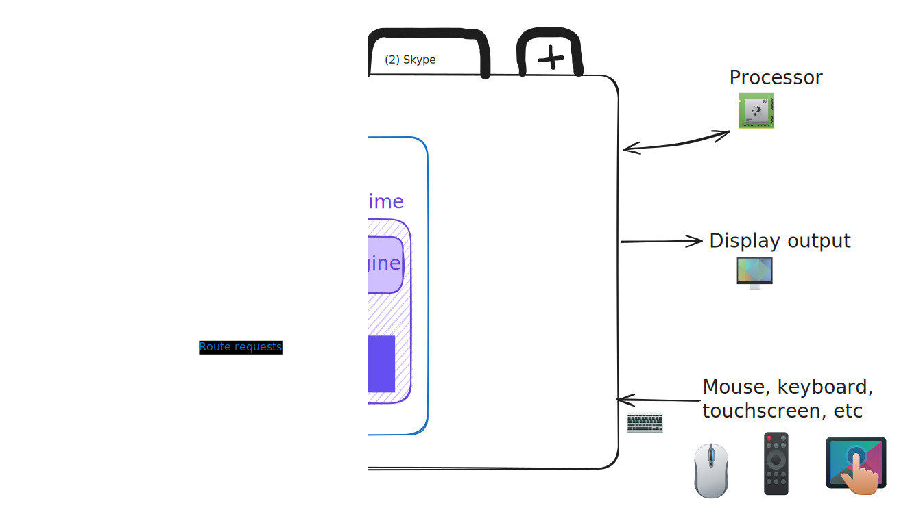
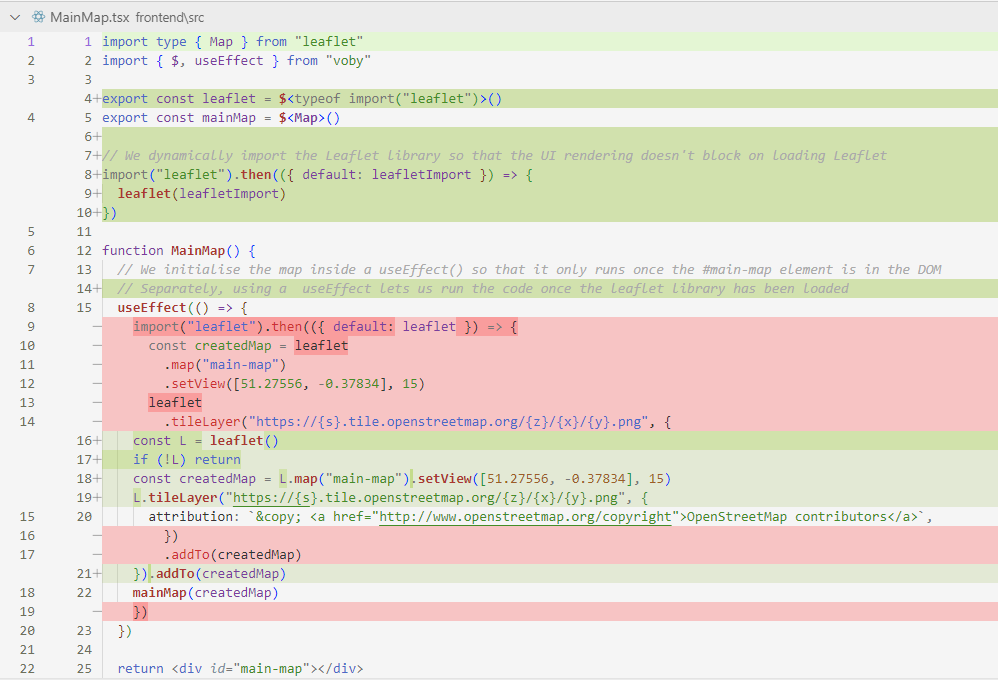
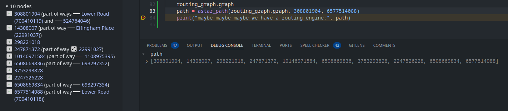
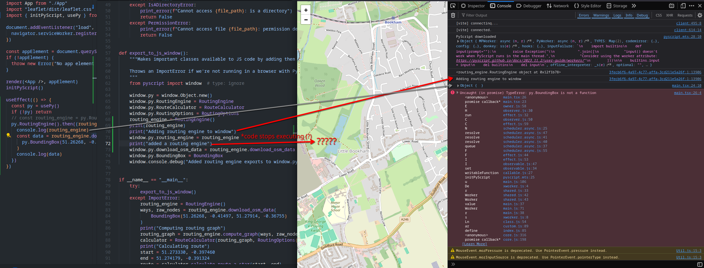
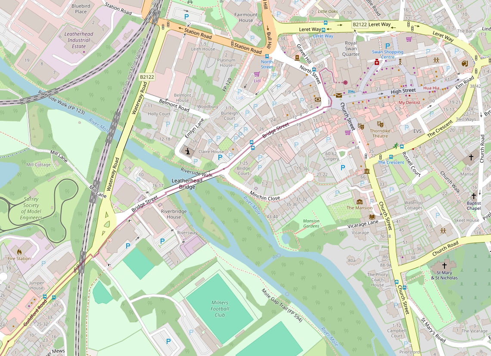

A-level Computer Science programming project

<div class="toc">

## Contents

- [Contents](#contents)
- [Analysis](#analysis)
  - [Stakeholder identification](#stakeholder-identification)
    - [James](#james)
    - [Andrew](#andrew)
    - [Ili](#ili)
  - [Problem definition](#problem-definition)
  - [Justification of computational approach](#justification-of-computational-approach)
    - [Initial situation](#initial-situation)
    - [Clear goal](#clear-goal)
    - [Clear inputs and outputs](#clear-inputs-and-outputs)
    - [Clearly defined logic](#clearly-defined-logic)
  - [Problem research](#problem-research)
    - [Initial stakeholder interviews](#initial-stakeholder-interviews)
      - [Initial interview with Andrew](#initial-interview-with-andrew)
        - [Key takeaways](#key-takeaways)
        - [Transcript](#transcript)
      - [Initial interview with James](#initial-interview-with-james)
        - [Key takeaways](#key-takeaways-1)
        - [Desired features](#desired-features)
        - [Transcript](#transcript-1)
      - [Initial interview with Ili](#initial-interview-with-ili)
        - [Key takeaways](#key-takeaways-2)
        - [Desired features](#desired-features-1)
        - [Transcript](#transcript-2)
      - [Follow-up discussion with Andrew](#follow-up-discussion-with-andrew)
    - [Similar solutions](#similar-solutions)
      - [OsmAnd (map app)](#osmand-map-app)
      - [Magic Earth (map app)](#magic-earth-map-app)
      - [Google Maps (map app)](#google-maps-map-app)
      - [Valhalla (routing engine)](#valhalla-routing-engine)
      - [Open Source Routing Machine (routing engine)](#open-source-routing-machine-routing-engine)
        - [Algorithm](#algorithm)
        - [Experience](#experience)
      - [GraphHopper](#graphhopper)
        - [Algorithm](#algorithm-1)
  - [Project goals and branding](#project-goals-and-branding)
    - [One-line description](#one-line-description)
      - [Brainstorming](#brainstorming)
      - [Conclusion](#conclusion)
    - [App name](#app-name)
  - [Essential features](#essential-features)
    - [Essential routing engine features](#essential-routing-engine-features)
      - [`B1` Route generation](#b1-route-generation)
      - [`B2` API for route requests](#b2-api-for-route-requests)
      - [`B3` Range of options to customise routing](#b3-range-of-options-to-customise-routing)
    - [Essential UI features](#essential-ui-features)
      - [`F1` Communication with the routing engine](#f1-communication-with-the-routing-engine)
      - [`F2` Drawing the route on a map](#f2-drawing-the-route-on-a-map)
      - [`F3` Fields to set the available options](#f3-fields-to-set-the-available-options)
      - [`F4` Saving options as presets](#f4-saving-options-as-presets)
      - [`F5` Accessibility](#f5-accessibility)
  - [User requirements](#user-requirements)
    - [User requirements signatures](#user-requirements-signatures)
  - [Limitations of the system](#limitations-of-the-system)
    - [Geographic limitations](#geographic-limitations)
    - [Routing feature limitations](#routing-feature-limitations)
    - [Navigation feature limitations](#navigation-feature-limitations)
  - [Hardware and software requirements](#hardware-and-software-requirements)
    - [Software requirements (routing engine)](#software-requirements-routing-engine)
    - [Hardware requirements (routing engine)](#hardware-requirements-routing-engine)
    - [Requirements (web app)](#requirements-web-app)
- [Design](#design)
  - [Program structure diagrams](#program-structure-diagrams)
    - [Overall architecture](#overall-architecture)
    - [Routing engine structure](#routing-engine-structure)
      - [Map data](#map-data)
        - [Download region](#download-region)
        - [Parse OSM tags](#parse-osm-tags)
        - [Compute routing graph](#compute-routing-graph)
      - [Route calculation](#route-calculation)
        - [Perform A\* algorithm](#perform-a-algorithm)
      - [Communicate with frontend](#communicate-with-frontend)
        - [HTTP API](#http-api)
    - [Web app structure](#web-app-structure)
      - [Accept input](#accept-input)
      - [Communicate with routing engine](#communicate-with-routing-engine)
      - [Display interactive map](#display-interactive-map)
        - [Base map](#base-map)
        - [Highlight route on map](#highlight-route-on-map)
      - [Manage presets](#manage-presets)
      - [Offline support](#offline-support)
  - [Technology decisions](#technology-decisions)
    - [Frontend technologies](#frontend-technologies)
      - [TypeScript](#typescript)
      - [Vite](#vite)
      - [Yarn](#yarn)
      - [daisyUI](#daisyui)
      - [Python interpreter (undecided)](#python-interpreter-undecided)
        - [Stakeholder discussions about daisyUI](#stakeholder-discussions-about-daisyui)
  - [Data structure research](#data-structure-research)
    - [Routing graph research](#routing-graph-research)
      - [Deciding between an undirected or directed graph](#deciding-between-an-undirected-or-directed-graph)
      - [Explanatory diagrams for the routing graph](#explanatory-diagrams-for-the-routing-graph)
      - [How graph nodes/edges relate to OSM elements](#how-graph-nodesedges-relate-to-osm-elements)
      - [Investigating the routing graph in Routor](#investigating-the-routing-graph-in-routor)
      - [Investigating the suitability of NetworkX](#investigating-the-suitability-of-networkx)
      - [Routing graph research conclusion](#routing-graph-research-conclusion)
  - [Class diagrams](#class-diagrams)
    - [Class diagrams for OSM data](#class-diagrams-for-osm-data)
    - [Class diagrams for routing](#class-diagrams-for-routing)
  - [Inputs and outputs](#inputs-and-outputs)
    - [Inputs](#inputs)
      - [UI inputs](#ui-inputs)
      - [Data from a file](#data-from-a-file)
      - [Sensor data](#sensor-data)
    - [Outputs](#outputs)
  - [UI mockups](#ui-mockups)
    - [UI component mockups](#ui-component-mockups)
      - [Combination button](#combination-button)
        - [Combination button (iteration 1)](#combination-button-iteration-1)
        - [Combination button (iteration 2)](#combination-button-iteration-2)
        - [Combination button (iteration 3)](#combination-button-iteration-3)
        - [Combination button (iteration 4)](#combination-button-iteration-4)
        - [Combination button (iteration 5)](#combination-button-iteration-5)
  - [Sprint planning](#sprint-planning)
    - [Sprint 1 upfront plan](#sprint-1-upfront-plan)
    - [Sprint 2 upfront plan](#sprint-2-upfront-plan)
    - [Sprint 3 upfront plan](#sprint-3-upfront-plan)
    - [Sprint 4 upfront plan](#sprint-4-upfront-plan)
    - [Sprint 5 upfront plan](#sprint-5-upfront-plan)
- [Sprint 1 (2024-11-17 to 2024-12-05)](#sprint-1-2024-11-17-to-2024-12-05)
  - [Sprint 1 goals](#sprint-1-goals)
    - [Sprint 1 user stories](#sprint-1-user-stories)
  - [Sprint 1 design](#sprint-1-design)
    - [Sprint 1 library research](#sprint-1-library-research)
      - [OSM data parsing requirements](#osm-data-parsing-requirements)
      - [OSMnx research](#osmnx-research)
        - [OSMnx citation](#osmnx-citation)
      - [PyOsmium research](#pyosmium-research)
      - [OSM library research conclusion](#osm-library-research-conclusion)
    - [Sprint 1 UI design](#sprint-1-ui-design)
      - [Sprint 1 UI mockup v1](#sprint-1-ui-mockup-v1)
      - [Sprint 1 UI mockup v2](#sprint-1-ui-mockup-v2)
        - [Sprint 1 UI mockup v2 feedback](#sprint-1-ui-mockup-v2-feedback)
    - [Sprint 1 modules](#sprint-1-modules)
      - [Backend: Creating a very basic graph](#backend-creating-a-very-basic-graph)
        - [Approach](#approach)
        - [Pseudocode](#pseudocode)
        - [Validation table](#validation-table)
        - [Variables and data structures](#variables-and-data-structures)
        - [Test data](#test-data)
        - [During development](#during-development)
        - [After development](#after-development)
  - [Sprint 1 development](#sprint-1-development)
    - [Starting work on the frontend](#starting-work-on-the-frontend)
      - [Initial web app bootstrap](#initial-web-app-bootstrap)
      - [Using unusual file extensions](#using-unusual-file-extensions)
    - [Starting work on the backend](#starting-work-on-the-backend)
      - [Preparing to start the backend](#preparing-to-start-the-backend)
      - [Command-line argument parsing functions](#command-line-argument-parsing-functions)
      - [Validating the provided file path](#validating-the-provided-file-path)
    - [Backend: Loading OSM data with OSMnx](#backend-loading-osm-data-with-osmnx)
      - [Installing OSMnx](#installing-osmnx)
      - [Downloading a region file](#downloading-a-region-file)
      - [Experimenting with `graph_from_xml()`](#experimenting-with-graph_from_xml)
      - [Connecting the graph to the OSM data](#connecting-the-graph-to-the-osm-data)
      - [Converting the graph to the desired format](#converting-the-graph-to-the-desired-format)
      - [Creating classes](#creating-classes)
      - [Creating more classes](#creating-more-classes)
    - [Frontend: Implementing the UI design](#frontend-implementing-the-ui-design)
      - [Development instructions](#development-instructions)
      - [Getting Voby JSX working](#getting-voby-jsx-working)
    - [Frontend: Implementing the UI design (2)](#frontend-implementing-the-ui-design-2)
      - [Leaflet map](#leaflet-map)
      - [Bottom navigation bar](#bottom-navigation-bar)
      - [Bottom navigation bar functionality](#bottom-navigation-bar-functionality)
      - [Deploying to Cloudflare Pages](#deploying-to-cloudflare-pages)
      - [Show current location button](#show-current-location-button)
      - [GPS location dot](#gps-location-dot)
  - [Sprint 1 conclusion](#sprint-1-conclusion)
    - [Sprint 1 post-development testing](#sprint-1-post-development-testing)
      - [Sprint 1 post-development test table](#sprint-1-post-development-test-table)
      - [Sprint 1 post-development test log](#sprint-1-post-development-test-log)
      - [Sprint 1 post-development test resolutions](#sprint-1-post-development-test-resolutions)
    - [Sprint 1 stakeholder opinions](#sprint-1-stakeholder-opinions)
      - [Sprint 1 feedback from Andrew](#sprint-1-feedback-from-andrew)
      - [Sprint 1 feedback from James](#sprint-1-feedback-from-james)
      - [Sprint 1 feedback from Ili](#sprint-1-feedback-from-ili)
    - [Sprint 1 user story checklist](#sprint-1-user-story-checklist)
- [Sprint 2 (2024-12-09 to 2025-01-14)](#sprint-2-2024-12-09-to-2025-01-14)
  - [Sprint 2 goals](#sprint-2-goals)
    - [Sprint 2 user stories](#sprint-2-user-stories)
    - [Sprint 2 research tasks](#sprint-2-research-tasks)
  - [Sprint 2 design](#sprint-2-design)
    - [Sprint 2 design: Running Python in the browser](#sprint-2-design-running-python-in-the-browser)
      - [Potential tools for Python in the browser](#potential-tools-for-python-in-the-browser)
      - [Official WASM platform support from Python](#official-wasm-platform-support-from-python)
      - [Researching PyScript (and Pyodide)](#researching-pyscript-and-pyodide)
      - [Researching `py2wasm`](#researching-py2wasm)
    - [Sprint 2 design: OSM tags to use in the routing engine](#sprint-2-design-osm-tags-to-use-in-the-routing-engine)
      - [Research approach for OSM tags](#research-approach-for-osm-tags)
      - [General approach for parsing OSM tags](#general-approach-for-parsing-osm-tags)
      - [Top-level tags to parse for roads](#top-level-tags-to-parse-for-roads)
      - [Top-level tags to parse for paths](#top-level-tags-to-parse-for-paths)
        - [`highway=path` controversy](#highwaypath-controversy)
      - [Other routable features](#other-routable-features)
      - [Attribute tags to parse for paths and roads](#attribute-tags-to-parse-for-paths-and-roads)
        - [Tags that apply to paths (or roads being walked along)](#tags-that-apply-to-paths-or-roads-being-walked-along)
        - [Tags for walking along paths](#tags-for-walking-along-paths)
        - [Tags for pavements mapped as attributes on road ways](#tags-for-pavements-mapped-as-attributes-on-road-ways)
        - [Tags for walking along roads or attached pavements](#tags-for-walking-along-roads-or-attached-pavements)
        - [Tags only for walking along roads](#tags-only-for-walking-along-roads)
        - [Tags for nodes encountered along a path or road](#tags-for-nodes-encountered-along-a-path-or-road)
        - [Tags for names and references](#tags-for-names-and-references)
        - [Access tags](#access-tags)
        - [Tags on areas that the route goes through](#tags-on-areas-that-the-route-goes-through)
        - [Chasing pavements](#chasing-pavements)
        - [Road crossings](#road-crossings)
    - [Sprint 2 UI design](#sprint-2-ui-design)
      - [Route screen mockups](#route-screen-mockups)
      - [Stakeholder feedback for route screen mockups](#stakeholder-feedback-for-route-screen-mockups)
      - [Sprint 2 UI validation table](#sprint-2-ui-validation-table)
    - [Sprint 2 modules](#sprint-2-modules)
      - [A\* algorithm design](#a-algorithm-design)
        - [A\* algorithm justification](#a-algorithm-justification)
        - [A\* algorithm implementation plan](#a-algorithm-implementation-plan)
        - [A\* algorithm pseudocode](#a-algorithm-pseudocode)
        - [A\* algorithm test data](#a-algorithm-test-data)
      - [Routing graph generation design](#routing-graph-generation-design)
        - [Routing graph generation justification](#routing-graph-generation-justification)
        - [Routing graph generation implementation plan](#routing-graph-generation-implementation-plan)
        - [Routing graph generation pseudocode](#routing-graph-generation-pseudocode)
  - [Sprint 2 development](#sprint-2-development)
    - [Sprint 2: Converting the frontend code to JSX components](#sprint-2-converting-the-frontend-code-to-jsx-components)
      - [Creating `App.tsx`](#creating-apptsx)
      - [Creating `BottomBar.tsx`](#creating-bottombartsx)
      - [Creating `CurrentLocationButton.tsx`](#creating-currentlocationbuttontsx)
      - [Updating `BottomBar.tsx` to use observables](#updating-bottombartsx-to-use-observables)
      - [Updating `BottomBar.tsx` to reduce manual observable updates](#updating-bottombartsx-to-reduce-manual-observable-updates)
    - [Sprint 2: Improving performance](#sprint-2-improving-performance)
      - [Proof of concept for async Leaflet loading](#proof-of-concept-for-async-leaflet-loading)
      - [Properly implementing async Leaflet loading](#properly-implementing-async-leaflet-loading)
      - [Disabling `CurrentLocationButton.tsx` when Leaflet hasn't loaded yet](#disabling-currentlocationbuttontsx-when-leaflet-hasnt-loaded-yet)
      - [Evaluation of async Leaflet loading](#evaluation-of-async-leaflet-loading)
    - [Sprint 2: Implementing the graph generation code](#sprint-2-implementing-the-graph-generation-code)
    - [Sprint 2: Embed the routing engine into the web app](#sprint-2-embed-the-routing-engine-into-the-web-app)
      - [Making python classes accessible from JavaScript](#making-python-classes-accessible-from-javascript)
      - [Stopping Pyscript from blocking the main tread](#stopping-pyscript-from-blocking-the-main-tread)
      - [Ensuring PyScript works on Cloudflare Pages](#ensuring-pyscript-works-on-cloudflare-pages)
      - [Implementing a service worker](#implementing-a-service-worker)
      - [More issues with PyScript workers](#more-issues-with-pyscript-workers)
      - [Implementing the Route screen and calculating a route](#implementing-the-route-screen-and-calculating-a-route)
      - [Adding the loading state to the UI](#adding-the-loading-state-to-the-ui)
      - [Debugging bounding boxes on the map](#debugging-bounding-boxes-on-the-map)
      - [Rendering route on map](#rendering-route-on-map)
    - [Sprint 2: Implementing the route info screen](#sprint-2-implementing-the-route-info-screen)
    - [Sprint 2: Fixing colours in light mode](#sprint-2-fixing-colours-in-light-mode)
  - [Sprint 2 evaluation](#sprint-2-evaluation)
    - [Sprint 2 qualitative evaluation](#sprint-2-qualitative-evaluation)
    - [Sprint 2 user story checklist](#sprint-2-user-story-checklist)
    - [Sprint 2 post-development testing](#sprint-2-post-development-testing)
      - [Sprint 2 post-development test table](#sprint-2-post-development-test-table)
        - [Sprint 2 post-development test evidence](#sprint-2-post-development-test-evidence)
      - [Sprint 2 stress-testing](#sprint-2-stress-testing)
- [Sprint 3 (2025-01-14 to 2025-02-14)](#sprint-3-2025-01-14-to-2025-02-14)
  - [Sprint 3 goals](#sprint-3-goals)
    - [Sprint 3 user stories](#sprint-3-user-stories)
  - [Sprint 3 design](#sprint-3-design)
    - [Sprint 3 UI mockups](#sprint-3-ui-mockups)
      - [Sprint 3 combination button mockups](#sprint-3-combination-button-mockups)
      - [Sprint 3 routing options mockups](#sprint-3-routing-options-mockups)
    - [Geocoding design](#geocoding-design)
      - [Geocoding UI mockup](#geocoding-ui-mockup)
      - [Geocoding pseudocode](#geocoding-pseudocode)
      - [Geocoding implementation notes](#geocoding-implementation-notes)
    - [Sprint 3 test data](#sprint-3-test-data)
      - [Test data for geocoding](#test-data-for-geocoding)
    - [Weight calculation design](#weight-calculation-design)
      - [Weight calculation pseudocode](#weight-calculation-pseudocode)
  - [Sprint 3 development](#sprint-3-development)
    - [Sprint 3: Adding more options for specifying start/end points](#sprint-3-adding-more-options-for-specifying-startend-points)
      - [Adding geocoding support](#adding-geocoding-support)
        - [Helper function for parsing simple coordinates](#helper-function-for-parsing-simple-coordinates)
        - [Updating `getCoordsFromInput()` to match pseudocode](#updating-getcoordsfrominput-to-match-pseudocode)
        - [Validation and error handling for Route screen inputs](#validation-and-error-handling-for-route-screen-inputs)
        - [Adding API calls to Nominatim](#adding-api-calls-to-nominatim)
      - [Implementing stating from the current location](#implementing-stating-from-the-current-location)
      - [Adding buttons to check addresses](#adding-buttons-to-check-addresses)
      - [Making the location marker smaller](#making-the-location-marker-smaller)
    - [Sprint 3: Adding weights to the routing algorithm](#sprint-3-adding-weights-to-the-routing-algorithm)
      - [Implementing weight calculation for walking along roads](#implementing-weight-calculation-for-walking-along-roads)
      - [Testing the road weight calculation in comparison to the old version](#testing-the-road-weight-calculation-in-comparison-to-the-old-version)
      - [Implementing sidewalk tag parsing](#implementing-sidewalk-tag-parsing)
      - [Implementing `calculate_node_weight()`](#implementing-calculate_node_weight)
      - [Considering access tags on ways](#considering-access-tags-on-ways)
      - [Investigating an odd route through graveyard](#investigating-an-odd-route-through-graveyard)
      - [Implementing `weight_path()`](#implementing-weight_path)
      - [Implementing `additional_weight_road()`](#implementing-additional_weight_road)
      - [Testing of the new weights](#testing-of-the-new-weights)
      - [Stakeholder feedback for routing weights](#stakeholder-feedback-for-routing-weights)
    - [Sprint 3: Responding to Nominatim API access blocked](#sprint-3-responding-to-nominatim-api-access-blocked)
      - [Implementing request throttling](#implementing-request-throttling)
      - [Improving the `User-Agent` header](#improving-the-user-agent-header)
    - [Sprint 3: Implementing the Options screen](#sprint-3-implementing-the-options-screen)
      - [Basic options storage and toggle-able weight overlay](#basic-options-storage-and-toggle-able-weight-overlay)
      - [Writing the `RoutingOptions` class](#writing-the-routingoptions-class)
      - [Updating the frontend to specify routing options](#updating-the-frontend-to-specify-routing-options)
      - [Adding some routing option lines to the Options screen](#adding-some-routing-option-lines-to-the-options-screen)
      - [Adding the rest of the routing options to the UI](#adding-the-rest-of-the-routing-options-to-the-ui)
    - [Sprint 3: Ensuring the routing engine considers all the options](#sprint-3-ensuring-the-routing-engine-considers-all-the-options)
      - [`truthy_tag()` helper function](#truthy_tag-helper-function)
      - [Handling path type preferences](#handling-path-type-preferences)
        - [Pavement preference](#pavement-preference)
        - [Paved/unpaved path preference](#pavedunpaved-path-preference)
        - [Lit, indoor, covered path preference](#lit-indoor-covered-path-preference)
      - [Handling crossing preferences](#handling-crossing-preferences)
      - [Handling access preferences](#handling-access-preferences)
      - [Handling safety and designation preferences](#handling-safety-and-designation-preferences)
        - [PRoW preference](#prow-preference)
        - [Informal/maintained path preference](#informalmaintained-path-preference)
        - [Walking on roads preference](#walking-on-roads-preference)
    - [Sprint 3: Fixing parsing of `incline=up|down` tags](#sprint-3-fixing-parsing-of-inclineupdown-tags)
  - [Sprint 3 evaluation](#sprint-3-evaluation)
    - [Sprint 3 user story checklist](#sprint-3-user-story-checklist)
    - [Sprint 3 stakeholder feedback](#sprint-3-stakeholder-feedback)
    - [Sprint 3 post-development testing](#sprint-3-post-development-testing)
- [Sprint 4 (2025-02-18 onwards)](#sprint-4-2025-02-18-onwards)
  - [Sprint 4 goals](#sprint-4-goals)
    - [Sprint 4 user stories](#sprint-4-user-stories)
  - [Sprint 4 design](#sprint-4-design)
    - [Presets design](#presets-design)
      - [Presets screen mockup](#presets-screen-mockup)
        - [Presets screen mockup v1](#presets-screen-mockup-v1)
        - [Presets screen mockup v2](#presets-screen-mockup-v2)
      - [Presets data structures](#presets-data-structures)
  - [Debug buttons design](#debug-buttons-design)
    - [Debug buttons description and justification](#debug-buttons-description-and-justification)
    - [Debug buttons pseudocode](#debug-buttons-pseudocode)
      - [Clear local storage pseudocode](#clear-local-storage-pseudocode)
      - [Clear cache pseudocode](#clear-cache-pseudocode)
    - [Debug buttons mockup](#debug-buttons-mockup)
    - [Sprint 4 test plan](#sprint-4-test-plan)
  - [Sprint 4 development](#sprint-4-development)
    - [Sprint 4: Refining the routing weights](#sprint-4-refining-the-routing-weights)
      - [Path through Bookham Common](#path-through-bookham-common)
    - [Testing using the geodesic model for the heuristic](#testing-using-the-geodesic-model-for-the-heuristic)
    - [Sprint 4: Adding debug buttons](#sprint-4-adding-debug-buttons)
      - [Debug buttons markup](#debug-buttons-markup)
      - [Clear stored data button functionality](#clear-stored-data-button-functionality)
      - [Clear cache button functionality](#clear-cache-button-functionality)
      - [Debug buttons stakeholder feedback](#debug-buttons-stakeholder-feedback)
    - [Sprint 4: Live location updates](#sprint-4-live-location-updates)
      - [Testing the routing app in Portsmouth](#testing-the-routing-app-in-portsmouth)
      - [Pseudocode for live location updates](#pseudocode-for-live-location-updates)
      - [Fixing a vertical scrollbar](#fixing-a-vertical-scrollbar)
      - [Live location updates with Leaflet's built-in feature](#live-location-updates-with-leaflets-built-in-feature)
      - [Nicer handling for location errors](#nicer-handling-for-location-errors)
  - [Sprint 4 evaluation](#sprint-4-evaluation)
    - [Sprint 4 post-development testing](#sprint-4-post-development-testing)
      - [Sprint 4 post-development testing log](#sprint-4-post-development-testing-log)
    - [Sprint 4 qualitative evaluation](#sprint-4-qualitative-evaluation)
- [Evaluation](#evaluation)
  - [Testing for evaluation](#testing-for-evaluation)
    - [Testing a route to Leatherhead](#testing-a-route-to-leatherhead)
    - [Testing a route through Slyfield Industrial Estate](#testing-a-route-through-slyfield-industrial-estate)
    - [Testing a route near the A3](#testing-a-route-near-the-a3)
    - [Testing routing through corridors](#testing-routing-through-corridors)
    - [Testing the desire paths option](#testing-the-desire-paths-option)
    - [Testing keyboard navigation](#testing-keyboard-navigation)
    - [Testing responsiveness to small viewports](#testing-responsiveness-to-small-viewports)
    - [Performance testing](#performance-testing)
  - [Final stakeholder feedback](#final-stakeholder-feedback)
    - [Final stakeholder feedback form](#final-stakeholder-feedback-form)
    - [Final stakeholder feedback from Andrew](#final-stakeholder-feedback-from-andrew)
    - [Final stakeholder feedback from James](#final-stakeholder-feedback-from-james)
    - [Final stakeholder feedback from Ili](#final-stakeholder-feedback-from-ili)
  - [Evaluation of user requirements](#evaluation-of-user-requirements)
    - [Evaluation of UR1](#evaluation-of-ur1)
    - [Evaluation of UR2](#evaluation-of-ur2)
    - [Evaluation of UR3](#evaluation-of-ur3)
    - [Evaluation of UR4](#evaluation-of-ur4)
    - [Evaluation of UR5](#evaluation-of-ur5)
    - [Evaluation of UR6](#evaluation-of-ur6)
    - [Evaluation of UR7](#evaluation-of-ur7)
    - [Evaluation of UR8](#evaluation-of-ur8)
  - [Final project limitations](#final-project-limitations)
    - [Lack of feedback when the route is being calculated](#lack-of-feedback-when-the-route-is-being-calculated)
    - [Map data limitations](#map-data-limitations)
    - [Limitations of being a web app](#limitations-of-being-a-web-app)
- [Appendix](#appendix)
  - [Appendix A: Glossary](#appendix-a-glossary)
    - [OpenStreetMap glossary](#openstreetmap-glossary)
    - [Voby glossary](#voby-glossary)
    - [Other abbreviations](#other-abbreviations)
    - [Glossary for other technologies](#glossary-for-other-technologies)
  - [Appendix B: Bibliography](#appendix-b-bibliography)
    - [Services used](#services-used)
    - [APIs used](#apis-used)
    - [Data used](#data-used)
    - [Libraries used](#libraries-used)
      - [Frontend](#frontend)
      - [Backend](#backend)
    - [Assets used](#assets-used)

</div>

## Analysis

### Stakeholder identification

#### James

James is a member of my computing class and is interested in using OpenStreetMap (OSM) data for navigation, but needs a program that can reliably do this. He has already tried a few apps that use map data from OSM, so he will be able to provide insights to how my engine compares to results from other programs, as well as suggest areas where other engines fall short.

#### Andrew

Andrew is also in my computing class so I will have frequent contact with him. He uses pedestrian navigation for a variety of purposes in our local area, from going for runs in green spaces to goal-oriented navigation in a city centre. This wide range of uses in a small geographic area will be invaluable for rapid feedback cycles and adjustment of the routing engine during development. One use case he looks forward to trying is finding the optimal route to get to the local bakery from school. He wants to have easy-to read instructions and the total distance he'll have to walk.

#### Ili

Ili is a family member who will be able to provide feedback and ideas often. While he doesn't use pedestrian routing as often as my other stakeholders, he often uses navigation apps for driving and enjoys using maps. This means that he will certainly offer valuable opinions on map design, how intuitive the UI is, and the general user experience. He has highlighted the need for safety in pedestrian navigation, i.e. while crossing roads. My navigation app will provide him with an alternative to Google Maps for shorter journeys that better understands the pavements and crossings in our area.

### Problem definition

A routing engine is a piece of software that calculates a route between two points in the world, following a pre-defined network of paths or roads. Routing engines first became commonly used with satnavs and similar automotive navigation systems ([Wikipedia: w.wiki/BUn$](https://en.wikipedia.org/wiki/Automotive_navigation)) that provide live directions for driving.

Nowadays, "navigation apps" are the most common way to interact with a routing engine. They make the features of a routing engine accessible through a graphical interface that lets users enter a starting point and destination, from which a route will be calculated and plotted on a map.

 <!-- perform the same task, and can be used for driving as well as walking or cycling. -->

<!-- Modern routing engines use geographic data of roads to  -->

### Justification of computational approach

The task of finding an efficient route between two geographic locations has some complexities, such as the need for an algorithm to chose which paths to explore without knowing for sure which ones will be optimal. However, these challenges have successfully been overcome by a variety of programs that incorporate routing engines. This task is solvable with an algorithm because it of four characteristics: an initial situation, clear inputs and outputs, clearly defined logic, and a clear goal. These will be discussed in detail below.

#### Initial situation

The routing engine is provided with coordinates for a starting point, and coordinates for the ending point. The initial situation for the program will be a graph that represents a network of paths for the area that will be covered by the routing query. The graph will be generated by processing map data from OpenStreetMap with the following steps:

1. Extract ways that represent a walkable section of a route, e.g. paths, roads, plazas. This will be done by checking for corresponding top-level tags, e.g. `highway=footway`.
2. Also extract the nodes from each way. Untagged nodes that aren't intersections can be ignored.
3. Use a recursive algorithm to walk through the extracted map data, building a graph where intersections and barriers are represented as graph nodes, and segments of walkable ways are represented as edges. A weight for each node and edge will be calculated to represent how desirable it would be to navigate that node, or walk along that edge.

#### Clear goal

Its goal is to provide the user with a real-world path that they can follow on foot to navigate from the start to the end point, as well as a series of steps that describe the route in text. The route should follow walkable map objects to ensure it makes sense as a route. The engine should generate routes that are desirable to a user looking to travel safely and efficiently (i.e. minimising the effort required to follow the route).<!-- Planing walks for leisure (e.g. circular path walks through woods) --> To achieve this, the engine will follow the following principles:

- Prefer a shorter-distance route, all else being equal
- Prefer pavements over roads without pavements
- Prefer paved paths over unpaved ones
- Prefer signalled crossings to unsignalled ones, especially if crossing a busy road
- Prefer well-marked paths to difficult-to-spot ones
- Avoid obstructions that may pose an issue for pedestrians (e.g. fallen trees)

In addition to the points above, the most desirable route for a user will depend on their own preferences and physical abilities. To accommodate this, the engine will be configurable to prioritise routes that are suitable for the specific user. Goals that should be configurable are:

- Avoid high kerbs, and prefer crossings with flush kerbs
- Prefer crossings with tactile paving
- Prefer paths that are lit at night
- Avoid steps
- Avoid large numbers of steps
- Prefer steps where a handrail is available
- Prefer paths wide enough for a wheelchair
- Prefer crossings with audible indicators
- Prefer crossings with tactile indicators

#### Clear inputs and outputs

Users will interact with the routing engine through a basic web-based UI. There will be text fields to enter start and end points, using either coordinates or addresses (which are converted to coordinates using a geocoding API).

Once the route is calculated, it will be outputted by rendering it on a map rendered by the [Leaflet library](https://leafletjs.com/). It will also display a textual list of directions that can be followed.

#### Clearly defined logic

The front-end will use the [Nominatim API](https://nominatim.org/) to convert the inputted start and end locations to coordinates, or use coordinates directly if provided. The pair of coordinate pairs will then be passed to the routing engine.

The routing engine will use the routing graph to find the optimal route between the two points using a pathfinding algorithm, such as A\*, to find a route that will be desirable for the user (as defined above).

### Problem research

While I have a general mental idea of what the routing engine should accomplish, it's essential to research similar programs, as well as stakeholders, to gain a well-rounded idea of what features are most important for my program, as well as how to make the user interface as intuitive as possible for my target audience.

#### Initial stakeholder interviews

I will interview each of my stakeholders to gain an understanding of what they would like from a routing engine, and accompanying GUI. I plan to ask the following questions:

<table>
  <thead>
    <tr>
      <th>Question</th>
      <th>Justification</th>
    </tr>
  </thead>
  <tbody>
    <tr>
      <td>How often do you use an app or website to get directions?</td>
      <td>An idea of how frequently my app will guide my UI design, e.g. I may prioritise/deprioritise being able to quickly get directions</td>
    </tr>
    <tr>
      <td>How often do you use an app or website to get directions for walking?</td>
      <td>To confirm or deny my hypothesis that predict that navigation apps will be used for pedestrian navigation much less frequently than for other modes of transport</td>
    </tr>
    <tr>
      <td>In what situations are you more likely to use an app for pedestrian navigation?</td>
      <td>Tells me the specific situations that my app will likely be used in, so that I can optimise the features and UI accordingly. I hypothesise unknown city centres to be one such situation.</td>
    </tr>
    <tr>
      <td>What apps do you use to get directions?</td>
      <td>This could indicate other projects that would be useful to research</td>
    </tr>
    <tr>
      <td>What are your main issues with the currently-available apps for routing?</td>
      <td>Identifying pain points in similar apps will provide ideas for areas to focus on to give my app unique appeal.</td>
    </tr>
    <tr>
      <td>Is it more helpful to see a pedestrian route plotted on a map, or a list of directions?</td>
      <td>To decide how much development time to dedicate to different features, and ensure the result is presented in the most useful way.</td>
    </tr>
    <tr>
      <td>What factors should be considered when the program decides which route is best?</td>
      <td>Gives ideas for which factors should be included into the graph weights, and how much time to spend optimising those factors.</td>
    </tr>
    <tr>
      <td>Would a mobile or desktop app be more important for you?</td>
      <td>I expect that mobile support will be very useful, so that directions can be obtained while out and about. Gauging the importance of a mobile app will determine how much time I might spend on mobile-specific features and optimising the UI for mobile devices.</td>
    </tr>
    <tr>
      <td>If the navigation app is used through a web browser, is that a disadvantage or an advantage to you?</td>
      <td>Although I am almost certainly going to make the front-end using web technologies, it will be useful to know if my users have any complaints or perceived drawbacks regarding web apps, so that I can try and address them.</td>
    </tr>
    <tr>
      <td>Is it important for the navigation app to work while you're offline? What situations could you see yourself using this feature in?</td>
      <td>This will help determine how much of the app should work offline, e.g. whether map data should be downloaded on demand or pre-downloaded. I may use tools like service workers to keep the web app functional when offline.</td>
    </tr>
  </tbody>
</table>

##### Initial interview with Andrew

I asked Andrew my research questions and gained useful insight into how pedestrian routing is used in the real world.

###### Key takeaways

- Google Maps lacks most smaller paths, making it less useful for countryside navigation or walks. An app that includes these would be very desirable.
- Otherwise, Andrew found Google Maps intuitive and easy to use
- He uses pedestrian navigation quite often, as he doesn't drive yet
- Having the route shown as an overlay on a map would "definitely" be more useful than presenting it as a list of directions
- Path surface preference can be situational, e.g. avoiding muddy or unpaved paths will be even more desirable if it's just been raining
  - This could be accomplished by adding an option to further deprioritise those path types
- Preferring lit paths after sunset would also be a very useful factor to include
- He brought up the idea of incorporating foot traffic data, so that really busy paths can be avoided
  - This could be especially important in some specific situations, e.g. if social distancing is desired, or for users who don't like crowds of people

###### Transcript

In this transcript, Andrew's words are labelled as "AS" and my words are labelled as "MR". I have removed most stuttering, filler words, and interjections that don't add any meaning.

<div class="transcript">

- **MR**: Alright, I'm going to be recording-
- **AS**: Hi Mish
- **MR**: Hello! Are you alright if I ask you some questions for my project?
- **AS**: No.
- **MR**: Yes.
- **AS**: Yes, I am
- **MR**: Which is going to be a project on pedestrian routing, so it will be a navigation app, basically. Okay, I'd like to know first of all, how often you use a app or website to get directions, at all.
- **AS**: Probably about once every two weeks, when I'm going somewhere new... how long a journey will take, \[by] car or just walking
- **MR**: So you'd say it's especially useful if you're going somewhere new?
- **AS**: Yes, definitely
- **MR**: Okay. And how often do you use an app for pedestrian navigation? So for just walking
- **AS**: I'd say it's about 50/50 with using it for cars, honestly... if I need to just find out how to get somewhere if I don't have a car, which is quite important for me-
- **MR**: Yeah, that's fair, yeah. Any situations where you find it especially useful to have that pedestrian routing available? Or is it just in general if you're walking somewhere?
- **AS**: Well, yeah, that, but I've found it's also quite useful when I'm trying to find out where someone is, if they give you their location so you can route to that using, Google Maps, usually.
- **MR**: Yeah, so have your map coordinates that you can just go to, okay
- **AS**: Just checking if it's recording?
- **MR**: No, I was just reading my questions.
- **MR**: And, what apps do you use or have you used to get directions?
- **AS**: Pretty much entirely Google Maps, yeah
- **MR**: Sounds good. Do you find its interface intuitive?
- **AS**: Yeah-
- **MR**: Do you find it, _\[incomprehensible]_ laid out?
- **AS**: I have actually used Google maps to find someone before, so there's that. Yeah, it's intuitive, easy.
- **MR**: Nice, okay. Anything you don't like about how Google Maps does pedestrian routing?
- **AS**: It doesn't have a very good layout of paths, like smaller paths, it just doesn't show, which isn't nice, so I was trying to run to Shere, and I was trying to use the compass to find out which paths to take.
- **MR**: Okay, yeah. That's definitely something I'm hoping to improve with this app.
- **AS**: Great.
- **MR**: So if you're using a navigation app, so you find it more helpful to have a list of directions with road names &mdash; "turn on to this road, turn on to that road, cross at this road" &mdash; or the route overlaid onto a map, that's highlighted in blue or whatever.
- **AS**: Ah, definitely overlaid onto a map. It's quite nice to be able to visualise that.
- **MR**: Yep. And how useful is it to have your location on it, so it can be updated live?
- **AS**: Yeah, very very useful. Otherwise you're just _\[incomprehensible]_
- **MR**: Mhm, sounds good. And finally, what factors do you think I should consider when deciding which route is best?
- **AS**: So when you've got multiple different routes... to get to a place?
- **MR**: Yeah, so, which properties or aspects of the paths and roads to consider. Like, obviously, everything else being equal, we'll go for the shortest path, because it's likely to be the quickest, but that's not the only thing that will affect how enjoyable your route will actually be.
- **AS**: Oh, okay. That is an interesting comment.
- **MR**: Take your time. It's one that requires some thinking.
- **AS**: I can only think of really specific things, like if it's been raining, and there's a muddy path, you might want to stick to roads
- **MR**: Yeah, that's useful yeah. So, maybe having "avoiding unpaved paths" as an option, as well as just a default thing?
- **AS**: And maybe, what, elevation... you don't wanna climb a really steep thing and then go down a really steep thing when you can go around.
- **MR**: That's a good point, yeah. That sounds good.
- **AS**: I suppose if you could get foot traffic data, but it doesn't really matter if there's a lot of people blocking your path unless there's a lot and a lot of people
- **MR**: Yeah, that's good. What about paths being lit at night?
- **AS**: Oh yeah, that's a very good point. Yeah, you definitely want to go down lit paths at night.
- **MR**: Okay, sounds good! Alright, thanks for answering my questions-
- **AS**: No worries.
- **MR**: And if you have any other feedback you can email me or tell me.
- **AS**: Yep, I probably won't email you.
- **MR**: As great as emails are.

</div>

[Download the full recording (05:16, m4v, 0.5 MB)](./assets/interviews/andrew/2024-09-20-andrew-initial-interview.m4v)

##### Initial interview with James

My initial interview with James was conducted via email. It was very valuable to understand he uses similar navigation apps, and how they compare.

###### Key takeaways

- There are a variety of navigation apps available, each with their own advantages and drawbacks
- Battery usage during navigation on mobile is a an important consideration for James
- Pedestrian navigation is most useful in unfamiliar urban areas (as I expected)
- Many navigation apps (Google Maps, Magic Earth) are optimised for driving and therefore don't give ideal pedestrian routes

###### Desired features

- Efficient battery use during navigation (if a live navigation feature is added)
- Warnings if the surfaces on the route are poor
- Avoiding wet and muddy routes based on time of year and surface type
- A list of directions for sharing with others

###### Transcript

> Hi Mish,
>
> Sorry for the slow response,
>
> 1. **How often do you use an app or website to get directions?**
>
>    2 or 3 Times a week at least, I normally use it to plan a route before going.
>
> 1. **How often do you use an app or website to get directions for walking?**
>
>    Quite often whenever I'm in an area which I don't know that well
>
> 1. **In what situations (i.e. what places) are you more likely to use an app for pedestrian navigation?**
>
>    I'm most likely to use the app in cities or town which I don't know very well, I also often use a navigation app if I'm a looking for a specific building and I'm not completely sure where it is.
>
> 1. **What apps do you use to get directions**
>
>    I use a mixture if different apps as they all have there advantages:
>
>    OsmAnd for walking as it provides much better and faster pedestrian routes than its rivals, I also find that the location seems a bit more accurate compared to other apps on this list which is partially helpful when walking.
>
>    Magic Earth for driving but this app uses a lot of battery so it is only really suitable for shorter routes
>
>    Google Maps for planning routes as it shows me all the different modes of transport I can get there. I also often use it to navigate long journeys in a car because it uses much less battery than Magic earth.
>
> 1. **What are your main issues with the currently-available apps?**
>
>    The OsmAnd UI can be much harder to use at times and it doesn't give you the ability to search along route.
>
>    Magic Earth is primarily a car focus app and therefore regularly give you very inefficient pedestrian routes, It also use too much battery limits how long I can use it for.
>
>    Google maps is also car focused and rarely gives you the most efficient pedestrian route, It also almost never gets the direction you are facing when walking correct which can made following it directions very difficult.
>
> 1. **Is it more helpful to see a pedestrian route plotted on a map, or a list of directions?**
>
>    I like to be able to see a map, but a list of instructions can be easier to follow and much easier to share with others.
>
> 1. **What factors should be considered when the program decides which route is best?**
>
>    The speed and distance of the route, how accessible the route is, and the surface of the route depending on the time of year (I probably don't want to walk down a wet and muddy route) the program could give me a warning and offer me an alternative route which avoids these kind if areas.
>
> If you need more details or have any follow up questions let me know,
>
> Thank you,
>
> James
>
> > Hi James,
> >
> > I'd like to ask you a few questions to help research for my pedestrian navigation app:
> >
> > 1. How often do you use an app or website to get directions?
> > 1. How often do you use an app or website to get directions for walking?
> > 1. In what situations (i.e. what places) are you more likely to use an app for pedestrian navigation?
> > 1. What apps do you use to get directions?
> > 1. What are your main issues with the currently-available apps?
> > 1. Is it more helpful to see a pedestrian route plotted on a map, or a list of directions?
> > 1. What factors should be considered when the program decides which route is best?
> >
> > If you have any other thoughts or ideas, please share them too.
> >
> > I look forward to working with you to ensure the navigation app can be as useful as possible.
> >
> > Mish

##### Initial interview with Ili

My interview with Ili was done two weeks later than my other two initial stakeholder interviews, so I decided to add a few more questions about the platforms that the app will be available on, in order to back up my plans to make it a cross-platform web app. These questions have been listed and justified at the top of the [initial interviews section](#initial-stakeholder-interviews).

###### Key takeaways

- Similarly to Andrew, Ili would strongly prefer a route rendered on a map to a list of directions
- Unlike my other two stakeholders, he uses navigation apps for walking much less than for driving
- His only gripe with Google Maps is how it is sometimes uncertain when finding more complex addresses
  - While I could try improving on this in my project, I plan to focus more on improving the routing between two given points, rather than improving the geocoding and destination input.
  - In addition, we will likely be limited by the number of addresses in the OSM database. OSM address coverage in the UK is not particularly extensive, so it's unlikely that I will be able to do better than Google Maps in that regard.
- He is indifferent on the matter of a native app vs a web app, caring more about what it looks like than technical differences

###### Desired features

- Considering colour blind users when designing the map
  - While I will be using off-the-shelf raster map tiles for the base map, which limits my ability to customise its colour scheme, I can ensure the rest of the UI remains accessible to those with colour blindness.
  - Because the frontend runs in the browser, I will be able to use colour blindness emulation in browser dev tools to help ensure the app is usable, even for people with various vision difficulties.

###### Transcript

In this transcript, Ili's words are labelled as "IR" and my words are labelled as "MR". I have removed most stuttering, filler words, and interjections that don't add any meaning.

<div class="transcript">

- **MR**: Okay, there we are. Bring that a bit closer. Right, first of all, what I'd like to know is how often you use an app or website to get any sort of directions, on foot or by car.
- **IR**: I would say, probably 3 times a week.
- **MR**: Okay. And how often do you use an app for pedestrian directions?
- **IR**: Less frequently, but a couple of times a month maybe.
- **MR**: Okay, yeah. And what situations do you use pedestrian navigation in?
- **IR**: If I'm in a large city or something, and I need to find a new place I haven't been to before, and I'm not driving, then I'll walk there.
- **MR**: Yeah, sounds good. What app do you use for that? For any sort of navigation.
- **IR**: Google Maps. The only-
- **MR**: Yep, the most common one. Can you think of any issues you have with the currently-available apps &mdash; so, Google Maps, basically &mdash; for pedestrian routing?
- **IR**: I'm not always sure if Google \[Maps] pinpoints the place I want to go to accurately. So you don't know until you get there.
- **MR**: Oh okay. Is that like location within a large place, like a shopping centre, or just a specific address where it might not know where you are?
- **IR**: A specific address. If it's not a straightforward "Number 5, Acacia Avenue", \[there] can be a margin of uncertainty as to whether its gotten it right or not.
- **MR**: Mhm, yeah. If it's 50 or 52 instead of 51 to 53. <!-- Note: this was an in-joke -->
- **IR**: Yeah.
- **MR**: If you're using an app for pedestrian routing, is it more helpful to have a route plotted on a map (like, highlighted on a map) or to get a list of directions?
- **IR**: Well I'm quite good with maps, so I prefer a map rather than... directions I find are not so clear, specific, as-
- **MR**: Yep.
- **IR**: "turn right on a map": I can see where the actual... I prefer a map.
- **MR**: Mhm, sounds good. And there are a lot of options for this question, but when the app's calculating a route, it will want to pick the shortest route, but there'll be other factors as well that will influence which route it prefers. Stuff to do with the path or the road that you're on. Are there any aspects that you think would be important to factor in?
- **IR**: Yes, so obviously selecting roads that have footpaths on them, rather than a country lane without a footpath, if at all possible. Selecting a route in a busy city centre via pedestrian crossings might be useful, rather than get dual carriageways in the middle of-
- **MR**: Yeah, we can definitely do that.
- **IR**: ...the middle of Birmingham, for example, and you want to avoid asking people to cross those. You want to go via footbridge or other crossing facilities.
- **MR**: Yeah, sounds good. And... I can probably guess the answer to this, but would a mobile or desktop app be more useful for you?
- **IR**: Mobile. I don't carry the desktop around.
- **MR**: So you can use it when you're actually needing the directions. And if you're accessing the navigation app through a web browser, would that be an advantage or disadvantage to you?
- **IR**: To me, it's what I see that counts. I'm not really sure of the technical differences between viewing a picture that's on a web browser or through some other interface, from an app or something.
- **MR**: Yep, mhm
- **IR**: I mean, if I'm presented with a map I can understand, then it doesn't worry my how it gets there, really
- **MR**: Yep. And finally, is it important for you for the navigation app to work while it's offline?
- **IR**: That'd be useful, yes. If I had to pick between two apps, and that was the only difference between them, then I'd pick the one that worked offline as well.
- **MR**: Yep.
- **IR**: One thing that might be useful in a city centre scenario would be a dry route, as opposed to a shortest route. Through a shopping centre, or...
- **MR**: So anywhere, sort of, covered?
- **IR**: Covered, yeah.
- **MR**: Prioritise those places.
- **IR**: Yeah.
- **MR**: Yeah.
- **MR**: Yeah, sounds good. Any specific situations where offline support would be most helpful? Or is it just whenever mobile data is patchy.
- **IR**: Yeah, patchy or...
- **IR**: Yeah, that's when it's gonna be useful, is when you're in the countryside or something, and the signal's not so common, you might find it useful.
- **MR**: Yeah.
- **IR**: If you're doing a walk route, which might be across a big hill or something, you might like to have one that works offline.
- **MR**: Yeah. Is there anything else you've thought of that you'd want to suggest or mention? Or any questions you have about the project?
- **IR**: I don't know whether most mapping apps these days take into account people with colour blindness and suchlike. Was it red and green, or red and blue, that's commonly indistinguishable by people who are colour blind, whether that's something to bear in mind.
- **MR**: So, when thinking about how the map's presented, or how it's highlighted.
- **IR**: Yeah, the colour of the map. I mean, I'm not colour blind, so I can see things... I don't appreciate, necessarily, that a red route on a green background or something might not stick out very well. So you have that kind of colour blindness.
- **MR**: Mhm, yep
- **IR**: Apart from that, nothing else spring to mind.
- **MR**: Okay, cool. Thank you very much.
- **IR**: You're welcome.
- **MR**: Hopefully you'll be able to find some use for the app.
- **IR**: Yep.

</div>

[Download the full recording (08:36, m4v, 0.8 MB)](./assets/interviews/ili/2024-10-06-ili-initial-interview.m4v)

##### Follow-up discussion with Andrew

On 17 October 2024, I had an informal discussion with Andrew. When I asked him if mobile or desktop support would me more important, he told me that mobile support would be very important. I also asked him about accessing the app through the browser, to which he told me the only disadvantage of that would be the lack of offline access. I mentioned how I could make the web app work offline, which he agreed with.

#### Similar solutions

As part of my research, I will investigate other programs that provide pedestrian routing. This will include programs that are solely routing engines, as well as map apps that have routing features built in.

##### OsmAnd (map app)

OsmAnd ([osmand.net](https://osmand.net/), [w.wiki/BV4b](https://en.wikipedia.org/wiki/OsmAnd#Navigation)) is a mobile map app that uses OSM data and has routing that runs on-device for a range of transport modes. I have personally found its pedestrian routing to be very good in real-word use, so I will be using it as my primary point of reference to compare my engine's routes with.

| Route overlay                                                                                                   | Directions list                                                                                             | Navigation options                                                                                                                                                               |
| --------------------------------------------------------------------------------------------------------------- | ----------------------------------------------------------------------------------------------------------- | -------------------------------------------------------------------------------------------------------------------------------------------------------------------------------- |
|  |  |  |

##### Magic Earth (map app)

Magic Earth ([magicearth.com](https://www.magicearth.com/)) is a similar mobile map app, suggested by my stakeholder James.

##### Google Maps (map app)

Google Maps ([google.co.uk/maps/about](https://www.google.co.uk/maps/about), [w.wiki/BV4d](https://en.wikipedia.org/wiki/Google_Maps#Directions_and_transit)) is a popular web app and mobile app.

| Route overlay                                                                                                                                          | Directions list                                                                                                       | Navigation options                                                                                                         |
| ------------------------------------------------------------------------------------------------------------------------------------------------------ | --------------------------------------------------------------------------------------------------------------------- | -------------------------------------------------------------------------------------------------------------------------- |
|  |  |  |

##### Valhalla (routing engine)

> Valhalla is an open source routing engine and accompanying libraries for use with OpenStreetMap data. Valhalla also includes tools like time+distance matrix computation, isochrones, elevation sampling, map matching and tour optimization (Travelling Salesman).[^valhalla-readme]

[^valhalla-readme]: Valhalla readme file (<https://github.com/valhalla/valhalla/blob/3a385045919967a14d5c9cc57610b2111936ac64/README.md>), accessed 17 September 2024

Valhalla is written in C++.

##### Open Source Routing Machine (routing engine)

> High performance routing engine written in C++ designed to run on OpenStreetMap data.[^osrm-readme]

[^osrm-readme]: OSRM readme file (<https://github.com/Project-OSRM/osrm-backend/blob/203314b1aa5a4cbbd32b8bd47a5c68399bd9d04e/README.md>), accessed 19 September 2024

Open Source Routing Machine (OSRM) ([project-osrm.org](https://project-osrm.org/)) is a car, bicycle, and pedestrian routing engine with source code available on GitHub ([Project-OSRM/osrm-backend](https://github.com/Project-OSRM/osrm-backend)).

###### Algorithm

OSRM either uses contraction hierarchies or multilevel Dijkstra's algorithm, with its documentation recommending to use the multi-level Dijkstra pipeline.[^osrm-pipelines]

[^osrm-pipelines]: OSRM Readme file, "Quick Start" (<https://github.com/Project-OSRM/osrm-backend/blob/203314b1aa5a4cbbd32b8bd47a5c68399bd9d04e/README.md#quick-start>), accessed 19 September 2024

###### Experience

Below is an example route that demonstrates two features I like about OSRM: it suggests an equally-valid alternative route (translucent and dotted) as well as the main one (solid), and it gets onto the pavement as soon as possible.


##### GraphHopper

> GraphHopper is a fast and memory-efficient routing engine released under Apache License 2.0.[^graphhopper-readme]

GraphHopper ([www.graphhopper.com/open-source](https://www.graphhopper.com/open-source/)) is the third main open-source routing engine that uses OSM data. It's written in Java and supports a range of transport modes, including walking. Its source code is available at <https://github.com/graphhopper/graphhopper>, and has a useful technical overview document ([docs/core/technical.md](https://github.com/graphhopper/graphhopper/blob/master/docs/core/technical.md)).

[^graphhopper-readme]: GraphHopper readme file (<https://github.com/graphhopper/graphhopper/blob/c0ad6b040b8930ad2a5a28661b211b1289a5d93d/README.md>), accessed 9 October 2024

###### Algorithm

GraphHopper supports Dijkstra's algorithm and the A\* algorithm. It also supports contraction hierarchies, which improves speed at the cost of less flexibility to incorporate additional factors (e.g. traffic data).[^graphhopper-technical-overview]

[^graphhopper-technical-overview]: GraphHopper technical overview (<https://github.com/graphhopper/graphhopper/blob/c0ad6b040b8930ad2a5a28661b211b1289a5d93d/README.md#technical-overview>), accessed 9 October 2024

### Project goals and branding

After gaining an idea of exactly what my stakeholders want from a navigation app, I can think about what the high-level goals of the project should be. I will then transform this into some example prose for describing the app, to create a sort of branding that describes what the project will do and what features it will have. I want to capture the "vibe" of the project before I start developing it.

Thinking about branding early on in the project will have a few advantages, e.g. to:

- Provide a consistent mindset that I can keep during development, to help keep the project moving in the right direction
- Inspire the specific features that I add
- Be a "guiding star" of what the end product should look like
- Describe what the app will provide, to effectively communicate the app's purpose to stakeholders or anyone else interested
- Make it easier to explain what the project is, by providing a sentence or set of sentences that I know will do a good job at describing the app.

#### One-line description

I want a one-line description to succinctly capture a few key points of my app:

- Accessibility
  - The app will have lots of options to aid with accessible pedestrian travel
  - This is a key unique feature of the app, so I want to mention it in a one-line description
- Cross-platform support
- Keeping it simple
- Benefit to the environment (perhaps)
  - As the app will make it easier for people to get around by walking, which is better for the environment than powered transport

##### Brainstorming

1. "Pedestrian routing for anyone, anywhere"
   - I like how "for anyone" represent the accessibility features
   - "for anyone" could also represent its wide platform support due to running in the browser
   - "pedestrian routing" is perhaps too much of a technical term
   - "anywhere" is intended to represent how you can use it on a mobile device when outdoors, or from your desktop at home. It will also suggest that it supports a wide range of real-world situations. However, the routing engine will be limited geographically to Great Britain, so routing can't actually be done "anywhere"
2. "Pedestrian navigation, optimised for you"
   - "optimised for you" represents the variety of options that will make it able to cater for a variety of users and situations
   - "pedestrian navigation" is easier to understand than "pedestrian routing"
   - The pronoun in "optimised for you" perhaps sounds a bit vague and overly promotional, where I want it to be mainly descriptive
3. "Easy pedestrian navigation for anyone"
   - This returns to the "for anyone" phrasing
   - I wanted a nicer synonym for "simple" (as it will be a no-frills app), so I went for "easy"
   - "easy" should also capture the ease of use that I hope to build in to the app by working closely with my stakeholders and holding accessibility as a priority.
4. "Easy pedestrian navigation for everyone"
   - I changed "anyone" to "everyone" as I feel it elicits an even greater sense of inclusivity and accessibility
5. "Pedestrian navigation, done right"
   - "done right" signifies the attention to detail that will be put into the routing engine to ensure it uses footpaths, pavements, and other paths correctly
   - "done right" also highlights how the project will improve upon other navigation apps like Google Maps that have inadequate coverage of paths.
   - However, this one lacks the description of benefits to users, like the others have

##### Conclusion

For users:

> Easy pedestrian navigation for everyone

For developers (tentative):

> Pedestrian navigation, done right

#### App name

An overall name for the project (which will also be the app name) will be very important, because it will:

- Make it easier for stakeholders (and others) to refer to and discuss the app
- Provide something that sticks in the head of potential users, so that they can remember the project after hearing about it
- Provide branding for the web app, e.g. HTML page title, or app name when installed as a progressive web app (PWA)

With that said, I don't consider it necessary to decide on an app name at this point, as the app is only being discussed by a small number of stakeholders. It is also likely to be easier to come up with a project name after I've worked on it for a while.

### Essential features

Based on my own ideas, initial stakeholder interviews, and research of similar programs, I have produced a list of essential features which will provide the most value to my program's users.

These features are split by features that will need to be implemented on the frontend and the backend. They are listed in order of priority, and designated codes starting from `B1` (most important backend feature) and `F1` (most important frontend feature). This codes will make the essential features easy to reference later on in the project.

#### Essential routing engine features

The backend for the project will be the routing engine itself, written in Python.

##### `B1` Route generation

The core utility of a navigation app comes from the route it can generate. It should be able to produce a safe, legal, and fast route between the two provided points.

This is the key functionality of the program, as demonstrated by the fact that all the other features build on top of it: either making it easier to use or adding extra customisability.

##### `B2` API for route requests

The routing engine needs to be accessible from the frontend, so it must have an API that allows programs to request routes to be calculated, and return the results.

##### `B3` Range of options to customise routing

Pedestrians using my app will have varying needs and preferences, so an important feature of the routing engine will be the ability to customise how different paths are weighted to match the user's preferences.

#### Essential UI features

The user interface (frontend of the project) will run in the browser, and will need a few key features to be a minimum viable product for my stakeholders. Most of these features will depend on a corresponding feature on the backend.

##### `F1` Communication with the routing engine

The frontend will have to send and receive data to/from the routing engine using some form of API. This may be over HTTP, or using some sort of internal communication between the JavaScript and WebAssembly (WASM) runtimes.

This will be essential so that the UI can get the calculated route that so that it can then draw it on the map (as described below).

##### `F2` Drawing the route on a map

My stakeholder interviews, especially with Andrew and Ili, have shown that having the route displayed on a map is often the most valuable way to present the information. This will be done with the Leaflet.js library, by displaying an interactive base map that uses the OpenStreetMap Foundation (OSMF) raster tile server (<https://tile.openstreetmap.org/>). The route will then be overlaid with a coloured highlight along the paths that make up the route.

##### `F3` Fields to set the available options

The UI should include some form elements that let the user access the different options supported by the routing engine.

The focus should be on providing a good user experience when wanting to plan a route, so not all possible options need to be included, especially those relating to specifics of OSM feature tags. For example, the it may be possible to ask routing engine to prefer paths that are lit at night but not lit 24/7, but this is highly unlikely to be useful in the real world so doesn't need to be catered for in the UI.

##### `F4` Saving options as presets

As discussed above, he UI will include a variety of options, and each user might have their own preferred set of options. They may have a few different preferred sets of options for different situations, e.g. walking at night, jogging, walking for pleasure.

Saving options as "presets" that can be loaded as the start/end locations are being entered, or automatically loaded when the app starts. This will have a number of important advantages:

- Users don't have to remember their preferred options
- If a user wants to tweak their options over time, saved options can be iteratively refined
- It will be much faster to simply get a route, as the user won't me wasting time manually adjusting options
- Having to repeat the same action each time the app is used will likely cause frustration

Forcing the user to enter their preferred options manually would be very undesirable because it would cause the inverse of those advantages.

This should be a feature entirely within the frontend, as the presents just need to be stored individually on each user's device.

While not essential, adding the ability to import and export presets will facilitate sharing them between devices and users, if this is desired.

##### `F5` Accessibility

As a modern web app, it should be expected that the UI will be accessible, working with built-in browser features and accessibility tools to ensure that the UI can be used comfortably, whatever situation the user is in, and whatever accessibility requirements they have.

This is especially important for my routing engine, as part of its target persona is those wanting a routing app that takes into account urban accessibility. For example, a number of routing options (e.g. preferring tactile paving) will bew catered towards those with reduced vision, who may also use a screen reader, or have increased system-wide font size. The UI should accommodate this and work with these tools.

### User requirements

Based on the essential features as well as other ideas from stakeholder interviews, I have produced a list of user requirements, i.e. user-facing features that I plan to add to the app. As a user-oriented list, it covers both the frontend and backend of the project. Each requirement has been numbered and justified, and linked to the corresponding essential feature where there is one.

1. The system should be able to calculate a route between two points ([`B1`](#b1-route-generation))
   - This is the core functionality of the app, as it is what will provide the most value to users
   - This is because that all my stakeholders mentioned that they use navigation apps to get routes between two points
2. The system should be able to display the route on a map ([`F2`](#f2-drawing-the-route-on-a-map))
   - Both Andrew and Ili mentioned that they prefer to see the route on a map, rather than as a list of directions
   - This will be the most intuitive and user-friendly way to present the route
3. The system should be able to customise the route based on a range of options ([`B3`](#b3-range-of-options-to-customise-routing))
   - This will allow the user to get a route that is tailored to their specific needs, which will make the app more useful to them
   - I have decided that this will one of the the key areas where my app will stand out from other navigation apps, so it is important to include this feature
   - In addition, my stakeholders James (avoiding wet and muddy routes), Andrew (sticking to lit paths at night), and Ili (sticking to covered paths) have all given examples of routing customisation that can be made available as an option
4. The system should be able to save routing options as presets ([`F4`](#f4-saving-options-as-presets))
   - This is an essential companion to the highly-customisable nature of the routing engine, as it will allow users to quickly access their preferred routing options
   - This will make the app more user-friendly, as it will save the user time and effort
5. The system should be accessible to those with a variety of needs and preferences ([`F5`](#f5-accessibility))
   - Andrew is colour blind, so keeping the visuals of the app within accessibility best practices will ensure he can use it to its fullest extent
   - Ili also mentioned that it is important to consider colour blindness when designing the map, so this will be a key consideration when designing the UI
   - In addition, following accessibility best practices will make the app more usable for everyone, e.g. keeping it usable in bright sunlight (a likely situation for an outdoors-focused app) or allowing for faster data input with a keyboard
6. The system should function offline, once the necessary data has been downloaded
   - This will make the app more useful to my stakeholders, as it will allow them to use the app in a wider range of situations
   - Andrew told me in his [follow-up discussion](#follow-up-discussion-with-andrew) that offline support would be a very important factor, so ensuring a smooth offline experience will be key to making the app useful to him
   - Ili has also said that offline support would be useful, because you can often find yourself in areas with poor internet access when using a navigation app
7. The system should be able to import and export routing options presets
   - This is a companion feature to the ability to save presets, as it will allow users to share their presets between devices, or with other users
   - This grants more flexibility to the user, putting them in control of their data, which helps facilitate a sense of openness and trust in the app, as well as making it more user-friendly
8. The system should perform well and be responsive to a variety of devices, across mobile and desktop
   - All my stakeholders have told me they're most likely to want to use the app on a mobile device, so ensuring it runs well on mobile is key
   - This will dramatically increase the usefulness of the app, as it can be used on the ground for real-time navigation, as well as for planning routes ahead of time on a desktop
   - Testing on a number of different devices will ensure that the app is usable, even on lower-end or unusual devices
   - Ensuring the app adapts to different screen sizes will help it feel like a native app, which will satisfy Ili's statement that it's how the app looks that counts

#### User requirements signatures

| Stakeholder | Signature | Date                                             |
| ----------- | --------- | ------------------------------------------------ |
|             |           | \_\_\_\_\_\_\_\_\_\_\_\_\_\_\_\_\_\_\_\_\_\_\_\_ |
|             |           | \_\_\_\_\_\_\_\_\_\_\_\_\_\_\_\_\_\_\_\_\_\_\_\_ |
|             |           | \_\_\_\_\_\_\_\_\_\_\_\_\_\_\_\_\_\_\_\_\_\_\_\_ |
|             |           | \_\_\_\_\_\_\_\_\_\_\_\_\_\_\_\_\_\_\_\_\_\_\_\_ |

### Limitations of the system

To keep the project manageable and ensure I can focus on producing the features that will be of most value to my stakeholders, I have limited the scope in a few key areas: geographic scope, routing scope, and navigation features.

#### Geographic limitations

The navigation app will only support start and end locations that are in the United Kingdom, specifically those that are within the United Kingdom region provided by Geofabrik, as specified in the .poly file at <https://download.geofabrik.de/europe/united-kingdom.poly>.

Advantages of limiting this scope:

- OSM tagging conventions can vary based on region, but conventions are consistent within the United Kingdom
- I am familiar with the UK's road (e.g. A-road, B-road) classifications, and path classifications (e.g. bridleways, public footpaths), which will mean I can appropriately adjust routing weights
- If I want to download the entire map data for the UK during development, it will be a manageable file size (1.7 GB, compared to 76.6 GB for the entire planet)
- It will help ensure only land routing is necessary, which aligns with the fact that transportation methods for crossing water, like ferries, won't be supported (as specified below)

#### Routing feature limitations

While the app will support a number of options to customise the routing graph weights for different pedestrian routing use-cases, the scope of routing features will be limited to those useful for pedestrians (including walking, or using a scooter or wheelchair). Adding support for other modes of transport, like public transport, ferries, cycling, or driving, is out of scope for this project.

Focusing on pedestrian navigation is justified because it has been identified as an important tool for my target persona (as shown in my [initial interview with Andrew](#initial-interview-with-andrew)), as well as being an area where other navigation apps like Google Maps and Magic Earth fall short (as mentioned by James in [his initial interview](#initial-interview-with-james)). By filling this gap in the market of available apps, I will be able to achieve the app's goal of making it easier to navigate by foot.

This will help keep the development time of the project manageable, as well as ensuring that the app does its one job well.

#### Navigation feature limitations

The navigation app will provide a high-quality route and present it to the user. However, most auxiliary features found in other apps, especially Google Maps, are out of scope for the project. This is because these features can be very technically-complex, meaning that they will take a great length of time to research, analyse and develop. Deciding not to implement these features will help the project avoid scope creep, allow me to focus on the core product, should help keep the app performant, and avoid cluttering the UI with features that aren't wanted by my stakeholders.

Some examples of auxiliary navigation features that are out of scope:

- AR navigation
  - Features that use a device's built in camera and GPS to overlay directions, instructions, or other routing information onto a live picture of the real-world environment the user is in
  - For example, _Live View_ for pedestrian navigation in Google Maps
- Points of interest (POIs) along the route
  - After calculating a route, this feature could suggest POIs, such as restaurants, petrol stations, or parks
  - While this feature would be very useful for planning long car or public transport journeys, it is of much less use for a pedestrian navigation app, where routes tend to be shorter, and often focused on simply getting to the desired point.
  - In addition, OSM data about POIs will require a lot of development to parse the tags for POI data, and POI details on OSM are limited in a lot of places.
- Route shown in 3D aerial imagery
  - This uses aerial and street-level imagery to create a close-to-the-ground visualisation of the route, before it is embarked on
  - For example, _Immersive View for routes_ in Google Maps
  - This would also require a lot of development time, as well as imagery which isn't freely available

There are also some auxiliary features that may be implementable within a reasonable amount of time, so it is possible that they will be added if time allows and they are desired by stakeholders. This includes:

- Voice directions
  - This involves using a text-to-speech (TTS) system to "speak" the instructions through a mobile phone's speakers, so that the route can be followed without needing to watch the phone screen.
  - Will rely on a "live" turn-by-turn navigation mode being implemented, so that voice instructions can be called at the appropriate time
  - An off-the-shelf TTS library could be used, perhaps using an neural TTS system like Piper (<https://github.com/rhasspy/piper>). However, this will require work to integrate, and may not perform well on mobile devices, especially lower-end ones.
  - Text-to-speech libraries may also need extra work to run in a browser WASM environment

### Hardware and software requirements

Most users will access the software through the web app, which only requires a modern browser environment. However, the Python routing engine can also be run separately, in which case it will have its own specific requirements.

#### Software requirements (routing engine)

- Python 3.10 or later
  - This is required because the routing engine will be written in Python, so will need a Python interpreter
  - I've selected Python 3.10 as the minimum supported version because it is the oldest version that supports writing union types as `X | Y`, a feature that I have found has improved my developer experience in past projects
  - Python 3.10 was released in October 2021, so it is reasonable to expect a modern operating system to have at least Python 3.10 available.
  - For example, most Linux distributions package a newer version of Python, e.g. Debian 12 "bookworm" ships Python 3.11.[^debian-python-pkg]
  - Python 2 will not be supported, as it reached end-of-life in 2020.[^python-2-eol]
- Python packages as specified in the `requirements.txt`
  - The final program will depend on a number of packages, although a list cannot be given for certain during the analysis phase
  - It is recommended that these are installed in a Python virtual environment, as per best practices for running Python code, but this is not strictly necessary
- A Windows or GNU/Linux operating system
  - This is because the program will use certain OS-specific features, such as file paths, and I am only able to test on Windows and GNU/Linux environments.
  - Other similar environments (e.g. BSD, Linux with `musl`) may work, but won't be tested and are therefore unsupported.

[^debian-python-pkg]: See <https://packages.debian.org/bookworm/python3>
[^python-2-eol]: See <https://www.python.org/doc/sunset-python-2/>

#### Hardware requirements (routing engine)

- Recommended: A reasonably fast desktop or mobile CPU from the past 10 years, clock speed around 1 GHz or greater
  - In theory a slower processor, even one in an embedded system, will be able to run the routing engine, but any processor that is too slow will mean that routing calculations take an comically long time
  - This low requirement will keep the program accessible and ensure that older devices remain useful. Example baseline systems that should be able to run the routing engine include:
    - A desktop system with an Intel Haswell CPU
    - A budget mobile phone with a Snapdragon 600 series CPU
    - A Raspberry Pi 3
- Around 512 MB of free memory, depending on how much of the routing graph is loaded into memory
  - The routing engine will need to store the routing graph in memory before it can calculate a route, so a sizeable amount of memory is justified
  - The actual amount of memory required will depend on how much memory the routing graph takes up, as well as if a large geographical area is pre-loaded, or only the area around the start and end points. This has not been determined yet.
  - Similarly to the CPU requirement, keeping this requirement low will ensure that the program is usable on a range of devices
- Around 2 GB of free disk space
  - The routing engine will most likely have to store the OSM data for the entirety of the UK locally, which is around 2 GB when compressed. If the data is stored decompressed, this requirement will be greater.
  - Similarly to the memory requirement above, the exact requirement cannot be reasonably determined until the solution is coded
  - The program will also need enough space for its own code, but this is likely to me negligible compared to the map data
  - This requirement may pose an issue when integrating it into the web app, as web apps are not expected to require such a large amount of persistent storage. This could be mitigated by downloading smaller regions of map data before a route is calculated.

#### Requirements (web app)

- A modern web browser that supports WASM (A browser based on Chromium or Firefox is recommended)
  - The "modern" browser requirement will allow me to use modern JavaScript, HTML, and CSS features, which will make the app easier to develop, and in a lot of cases, more accessible and performant
  - WASM is required because the routing engine is written in Python, and will be executed in a WASM runtime in the browser. Without the routing engine embedded, the web app will be about as useful as subtitles for a silent movie.
  - Testing will be done on Firefox Developer Edition (primarily), Google Chrome, and Brave, so the requirements will match the environment used for development and testing
  - With that said, any browser that supports the required web standards will be able to run the app. This helps to keep the app accessible users in unusual environments, or using a less-popular or novel browser engine
- A pointing device, touch interface, or keyboard that can interact with web pages
  - This is required so that the user can interact with buttons, text inputs, and other elements in the web app
  - Without such a device, there will be no way for the user to interact with the app
  - A range of input methods are supported to ensure that the app is accessible to as many users as possible
- An internet connection (for the initial load of the app)
  - As a web app, the code will be requested from a web server when the app is loaded, which requires an internet connection
  - Users may not be able to access the app if they have a censored internet connection, in which case a VPN, proxy, or similar technology can be used for the first load.
  - Since I plan to build it as a PWA, the app will use caching and service workers to ensure it can work offline once it has been loaded once or twice. Therefore, an internet connection will only be required for the first load, or to update the app to a new version.

Any other software or hardware requirements will depend on the requirements of the web browser used, so are not included here as they will depend between browser, browser version, and environment.

## Design

### Program structure diagrams

I have decomposed the main problem into sub-problems, showing the different aspects of the frontend and backend that will need to be implemented. I have considered the [essential features list](#essential-features) and the [user requirements list](#user-requirements) during this process, and have linked boxes to user requirements (e.g. "UR1") where appropriate.

#### Overall architecture



_Icons provided by the KDE Breeze icon theme, licenced under LGPL, <https://github.com/KDE/breeze-icons>_

#### Routing engine structure


##### Map data

This subsection contains all the features related to downloading, saving, and processing map data, including creating the graph that will be used to compute the route. I have grouped these tasks together because they are all dealing with the map data, which can then be used by the routing engine to actually compute the route.

###### Download region

Before the routing graph is computed, the appropriate region of map data will have to be downloaded. Therefore, it makes sense for this to be grouped with the task for computing the routing graph.

###### Parse OSM tags

OpenStreetMap has its own text-based tag format, which uses plain text attributes to describe properties about map features. I will need to parse the tags that are relevant to the routing engine, so that they can be used to appropriately create the routing graph, set the routing graph weights, and provide additional information to the user after the route is computed, e.g. road names or statistics on surface types.

Since the routing graph will be the primary consumer of OSM tag data, I have grouped this task with the routing graph computation.

###### Compute routing graph

The routing graph is the data structure that the routing engine will use to calculate routes. It will contain nodes and edges, with each edge representing a path between two nodes. The edges will have weights that represent the cost of traversing that path, which will be used by the A\* algorithm to find the best route during the route calculation task.

##### Route calculation

This subsection contains the task of actually calculating the route between two points, given the routing graph and other parameters to conform to (i.e. types of paths to avoid). The nodes and edges will first be computed, and then weighted based on attributes of the corresponding OSM objects. Those tasks can be done separately to each other so I have placed them as subtasks of this one.

###### Perform A\* algorithm

The route will be calculated using the A\* algorithm, so I will need to implement an A\* pathfinding algorithm to work on the routing graph. I've added it as a separate box as it is essentially a standalone algorithm that can have its own subprogram.

##### Communicate with frontend

This subsection contains the tasks related to passing data between the routing engine and the frontend. This will be done using an internal API.

The two subtasks here are receiving a route request from the frontend, and sending the route data back to the frontend. I have separated them out as they will use different data formats and will happen at different times during the route calculation process.

###### HTTP API

The HTTP API is a potential feature that might be added to allow for more flexibility with using the routing engine in various situations. It will allow the routing engine to be used by other programs, or by the frontend, without needing to be embedded directly into the frontend code. This also means that a HTTP API could be implemented and used if embedding the routing engine is shown to not be feasible during development, ensuring that the project can still be made in some form.

#### Web app structure


##### Accept input

This will likely be the first thing the user looks to do when they open the web app and see the UI, so I have listed it first. This will primarily mean selecting the start and end locations, but route options will be input in a similar way and at the same time, so they are grouped in here.

##### Communicate with routing engine

This is the part that will prompt the routing engine to calculate a route, which is naturally quite an important part of the frontend. It corresponds to the [communicate with frontend](#communicate-with-frontend) task of the routing engine, and they have similar sub-tasks: communicating the route request information, and receiving the route data.

##### Display interactive map

An interactive map is user requirement 3 for the project, so it is important that it is implemented.

###### Base map

The base map will provide important context of where the route is, what roads and paths are in that area, and what paths are being followed. The base map is also useful for orienting the user to make it easier for them to follow the route.

###### Highlight route on map

After the route has been calculated, it should be highlighted on the map, as this is the most intuitive way to present the route to the user. I will use Leaflet.js's features to accomplish this.

##### Manage presets

Presets make the wide number of options more manageable to work with, as well as allowing transferring of options between devices, making the app more useful.

Saving and loading presets are the two actions that any preset feature will need to have implemented, so those are the first two sub-tasks (corresponding to user requirement 4).

The other sub-task is importing and exporting presets, which allows working with presets in more ways (as per user requirement 7).

##### Offline support

Offline support is user requirement 6, and implementing it will require both the app's code (managed by a service worker) and the map data to be stored locally.

### Technology decisions

#### Frontend technologies

| Thingy               | Technology to use         |
| -------------------- | ------------------------- |
| Programming language | [Typescript](#typescript) |
| Other languages      | HTML, CSS                 |
| Build tool           | [Vite](#vite)             |
| Package manager      | [Yarn](#yarn)             |
| Python interpreter   | _Undecided_               |
| UI library           | daisyUI                   |

##### TypeScript

TypeScript ([typescriptlang.org](https://www.typescriptlang.org/)) is a superset of JavaScript designed to improve developer experience by adding a type system to catch type errors while writing code. I have chosen it for a number of reasons:

- I am familiar with TypeScript, having used it in a number of projects across the past few years.
  - This will mean I can immediately get the most out of the language
  - I won't be slowed down when working on new features by having to learn the complexities of a new language
- TypeScript compiles to human-readable JavaScript
  - This means the code can be directly run by the browser, without an additional runtime
  - Any browser that supports JavaScript will also be able to run my TypeScript code (once it has been compiled)
- If necessary, the TypeScript compiler (`tsc`) can target older browser versions that support fewer modern JavaScript features
  - This might be necessary to keep supporting my defined [system requirements](#requirements-web-app), although I don't expect it to be because modern browsers run on a large range of devices.
- Its types and static analysis features are well-loved by developers[^stack-overflow-survey-admired-languages] (including me) and I have found that they make it more enjoyable to write JavaScript code
- TypeScript is very popular in the web development community
  - This means that many libraries will have type definitions to make them easier to use with TypeScript (speeding up development)
  - Also, there's good tooling support for TypeScript, minimising the additional work I will have to put in to get the development environment working
- TypeScript supports, and will let me enforce, various object-oriented programming (OOP) techniques, such as private and protected properties and methods, abstract classes, and static properties.
  - This will ensure I can make the most of OOP best practices, to help reduce bugs and keep my code readable

[^stack-overflow-survey-admired-languages]: Most-admired programming, scripting, and markup languages, Stack Overflow Developer Survey 2023 (<https://survey.stackoverflow.co/2023/#programming-scripting-and-markup-languages>)

##### Vite

Vite ([vite.dev](https://vite.dev)) is a build tool for JavaScript and TypeScript code, which will handle compiling my TypeScript code to JavaScript, as well as including my dependencies. I have picked it for the following reasons:

- Vite is quick to set up and works without needing to create configuration files
- It has built-in support for TypeScript
- I have used it a lot in the past, so I know how it works
- It has good documentation on its website (<https://vite.dev/guide/>)
- It's popular tool for modern web development
  - Different plugins are available to customise the tool
  - There's a range of help available on Q&A sites like Stack Overflow

##### Yarn

Yarn is a package manager for JavaScript/TypeScript, which will mean that it can help me use any Javascript libraries I'll need in my project. The reasons I've chosen it are similar to my other technology decisions:

- I have used it in the past so know how it works and can use it easily
- It is faster to install packages than its alternatives (e.g. `npm`), which will mean I can quickly set up a development environment on various machines

##### daisyUI

daisyUI ([daisyui.com](https://daisyui.com/)) is a UI library for web development. It will provide ready-made styles for components like buttons, dropdowns, and switches, which should greatly help with developing the frontend because I won't have to reinvent the wheel with my own styles for very element I need. While I haven't used it before, I have used the tool that it's built on top of (Tailwind CSS) so it should be easy for me to install and start using it. Other advantages are:

- It works with "vanilla JavaScript", which means that it doesn't depend on any specific JavaScript framework like React or Vue
  - This will be helpful because I plan on keeping my app simple by using a simple framework or no framework at all
- It has pre-made components for UI elements that I plan to use, including: toasts for displaying status updates; buttons; range sliders and input boxes for numerical input; dropdown lists and radio buttons for selecting options; and modals for displaying overlays on the screen.
  - This will save me time when developing the frontend, as I won't have to write my own styles for these components
- Using a UI library will ensure consistency in my UI, which should make the app more enjoyable and easier to use for my stakeholders

After creating mockups of parts of the app using daisyUI, and showing them as well as the official demos to my stakeholders, I've decided to stick with daisyUI for the project.

##### Python interpreter (undecided)

I will decide what technique and library to use for running Python code in the browser during the design part of Sprint 2, as written in my [Sprint 2 upfront plan](#sprint-2-upfront-plan).

###### Stakeholder discussions about daisyUI

I showed Andrew a demo of daisyUI and he liked the different components available, saying that they seemed easy to use.

### Data structure research

> Bad programmers worry about the code. Good programmers worry about data structures and their relationships.  Linus Torvalds

#### Routing graph research

The routing graph is the most important data structure to get right in the program, as almost every part of the routing engine will use it.

It has the following requirements:

1. Nodes and edges that I can attach extra data to, perhaps through object references
2. Weights on edges and nodes
3. Ability to transverse the edges in either direction

   - This could be implemented either by having two edges for each path, or by having a single edge that can be traversed in either direction
   - Even if one-way roads are best represented as directed edges, it is very uncommon for one-way restrictions to apply to pedestrians in the UK

4. Decent performance for creating the graph

   - The graph will only be computed once for a certain region

5. Great performance for traversing the graph
   - The graph will need to be widely traversed during route calculation, which may also happen multiple times if the user adjusts a route slightly

##### Deciding between an undirected or directed graph

It may be desirable for routing graphs to be directed for a number of reasons. I will consider them, as well as considering the extent to which they apply to my project.

- **One-way roads**: One-way roads legally restrict vehicles from travelling in a certain direction. Therefore, it would make sense to represent them as a single directed edge to match how the path should be traversed.
  - However, it is very uncommon for one-way restrictions to apply to pedestrians in the UK, so this won't be a necessary feature
- **Turning restrictions**: OSM data includes turn restrictions, another kind of legal restriction that limits how vehicles can turn at an intersection. These might be easier to represent with a directed graph that has multiple edges for each OSM way.
  - However, once again, turn restrictions don't apply to pedestrians. Since pedestrians simply have to follow the physical shape of pavements and footpaths, it makes more sense to pick an abstraction that's closer to the physical layout of paths.
- **Different weights based on direction of travel**: Factors such as steepness of the path would be different depending on which way the path is being traversed, so it would be derivable to have separate edges for each direction, each with their own weights.
  - In my eyes, this is the most compelling technical reason to choose a directed graph, as having weights that depend on direction wouldn't make sense to implement with an undirected graph
  - In this project, I don't plan to incorporate elevation data into the routing engine, and I can't think of any other common-enough cases where weight should differ based on direction, I should still be able to use an undirected graph.

I have not tested or researched the differences in performance between undirected and directed graphs, but I don't expect a directed graph to be drastically faster than an undirected graph.

The main advantage of an undirected graph is its simplicity: in a similar way to how each graph node will have a 1:1 relationship with a OSM node, each edge will have a 1:1 relationship with a specific segment of an OSM way. This should make it easier to implement, and easier to calculate edge weights, as a corresponding OSM way will always be present.

##### Explanatory diagrams for the routing graph

##### How graph nodes/edges relate to OSM elements


##### Investigating the routing graph in Routor

A valuable program to investigate at this point is Routor, a routing engine for OpenStreetMap that is also written in Python ([github.com/routeco/routor](https://github.com/routeco/routor), [routor/engine.py](https://github.com/routeco/routor/blob/main/routor/engine.py)). It uses the NetworkX library to implement a directed graph.

Routor, as a general-purpose OSM routing engine, uses a directed graph (`networkx.DiGraph`) to implement its routing graph. However, I plan to use a undirected graph (`networkx.Graph`) instead, as discussed under [deciding between an undirected or directed graph](#deciding-between-an-undirected-or-directed-graph).

##### Investigating the suitability of NetworkX

NetworkX ([networkx.org](https://networkx.org/)) is a Python library that implements various graph data structures and algorithms. I looked for a library that implemented a graph data structure for a couple of reasons:

- Tt will make implementing the routing graph quicker and easier, so that I can get a working prototype to my stakeholders sooner
- The routing graph will be more performant, because it's a widely-used library that will have been optimised better than I can do myself
  - This helps satisfy requirements 4 and 5 for the routing graph, [as specified at the top of the routing graph research section](#routing-graph-research)

NetworkX would be a good choice for the following reasons:

- It allows nodes and edges to have arbitrary data attached to them, which will be useful for storing OSM data or other data that will be helpful for routing (satisfies routing graph requirement 1)
- While it doesn't have a specific feature for adding weights to nodes or edges, weights are a common use for its flexible attribute support, so weights can be stored that way, or dynamically calculated based on attached info if this option is chosen during development (satisfies routing graph requirement 2)
- It has a large number of features, including supporting undirected graphs (with the `networkx.Graph` class) (satisfies routing graph requirement 3)
- It also implements a range of useful pathfinding algorithms, including A\* and bidirectional Dijkstra's algorithm
  - While I plan to implement an A\* routing algorithm myself, the built-in algorithms may be useful for any smaller-scale calculations that need to be done
    - I may want to use Dijkstra's algorithm to improve accuracy and reproducibility of results for small sections of a route, like intersections with a large number of pavements and crossings
    - With that said, that is by no means an important feature to implement, and may not be necessary at all
- Looking through its documentation ([networkx.org/documentation/stable/reference](https://networkx.org/documentation/stable/reference/introduction.html)), the different classes and functions available in the library appear to be very well-documented and explained
  - This will be important as it will help me to understand how to use the library and any best practices
- It has successfully been used in Routor, which proves that it can work for a very similar use-case to mine
  - While this gives me extra confidence that it will be an appropriate choice, my research has also determined that it will be a good option.
- It is a large active open-source project, with a large number of contributors and recent commits and releases.
  - Ensuring I use open-source libraries is important to me, as they are more likely to run in a range of environments, and can be used under a permissive licence
  - Bugs are likely to be found and fixed quickly due to its large community
  - It is actively maintained for modern Python versions and continues to receive performance (and other) enhancements

<!-- TODO: Networkx drops py 3.10 support?! https://github.com/networkx/networkx/pull/7668 -->

While NetworkX implements shortest path algorithms, including A\*, I still plan to implement my own A\* algorithm. This will:

- Ensure I understand exactly how the algorithm calculates shortest paths, making it easier to debug and tweak
- Make it easier to adjust the result based on the routing preferences from the user or the app

##### Routing graph research conclusion

With this research in mind, I plan to use the NetworkX library to store and interface with the routing graph in-memory, using the `networkx.Graph` class to implement an undirected graph.

### Class diagrams

#### Class diagrams for OSM data


#### Class diagrams for routing


### Inputs and outputs

#### Inputs

##### UI inputs

- Starting coordinates
- Destination coordinates
- A list of routing option values

##### Data from a file

- OSM map data excerpt

##### Sensor data

- Current location

#### Outputs

- List of directions
- Route rendered on a map
  - With a base map layer to show general map data

### UI mockups

Some of my mockups were made in Figma, and interactive versions can be accessed online: <https://www.figma.com/design/jbFmOUqG90DkDqRnpOlqAF/Routing-app-UI-mockups>.

#### UI component mockups

##### Combination button

This would be used to select a preference for a certain routing option, like whether to avoid or prefer a certain type of path.

###### Combination button (iteration 1)

This button was made with Excalidraw.


Andrew's feedback:

- Neutral state is not very obvious
  - He just saw it as a separator
- Wanted to ensure that the circular bits are lined up with the rectangular bits
- He agreed that "avoid" and "prefer" should be that way around

###### Combination button (iteration 2)

I used Figma to make this mockup, so that the rounded corners could be neater.


- James likes rectangle 2 (the red part of the pill shape)
- Andrew likes:
  - Curved edges
    - Smooth
      - Smooth operator
  - The "neutral" is more obvious

###### Combination button (iteration 3)

I need to add a way to show which option is selected and which can be pressed. This should be intuitive to make the app easy to use.


- Andrew liked the top version best
  - He liked the shadow
- James also liked the top version best

###### Combination button (iteration 4)

I decided it'd be helpful to create a UI mockup using daisyUI, the component library that I'll be using.


###### Combination button (iteration 5)


- James preferred this style to the one with solid-filled buttons (i.e. [iteration 4](#combination-button-iteration-4))

### Sprint planning


#### Sprint 1 upfront plan

- Start work on the backend, completing a proof of concept of the following tasks:
  - Loading a provided OSM region file into an appropriate Python data structure, likely by using an appropriate library
    - This will require researching the best library to use
  - Generate a routing graph based on a very simple filter, e.g. `highway=*`
- Also start work on the frontend
  - Create the general layout of the UI
    - Will require roughly designing what the UI will look like, and running it past my stakeholders
  - Add an interactive map using Leaflet.js
  - Show the user's current location on the map
  - This will be the initial deliverable to my stakeholders

#### Sprint 2 upfront plan

- Make the routing engine functional
  - Implement my own version of the A\* algorithm to find the shortest path between two points
  - Refine the routing graph to appropriately take OSM tags into account
    - Will require researching which OSM tags to use, using the OSM Wiki
  - Implement a way of passing data between the frontend and backend
- Integrate the routing engine into the frontend
  - Will require investigating the best solution for running Python in the browser
  - Fields should be added to the UI to select a start and end location and summon the routing engine

#### Sprint 3 upfront plan

- Add support for a number of routing options
  - First will require planning and defining the set of routing options, and agreeing with my stakeholders
  - Allow setting options in the routing engine
  - Incorporate the routing options into the routing graph
  - Add the appropriate form elements to the frontend

#### Sprint 4 upfront plan

- Tweak the routing graph so that the routing results better match the requirements of a good route
  - This will require a lot of testing and stakeholder involvement to ensure that the routing engine is producing good results
  - It may include updating OSM data for specific areas to improve the quality of data
- Add the presets feature to the frontend

#### Sprint 5 upfront plan

Sprint 5 will be added if required, and will be planned in more detail once the results of the previous sprints are known. I may use it to work on improving the frontend to ensure it works offline, has a good mobile experience, etc.

## Sprint 1 (2024-11-17 to 2024-12-05)

### Sprint 1 goals

#### Sprint 1 user stories

1. As a user, I want an interactive map that is intuitive and readable
2. As a user, I want the map to clearly show my current location
3. As a mobile user, I want the UI to fit well on my screen and be easy to use
4. As a stakeholder, I want to get an initial idea of the UI layout so that I can give feedback
5. As a technically-minded stakeholder, I want to see a proof of concept of the start of the routing engine

### Sprint 1 design

#### Sprint 1 library research

Before writing my pseudocode, I would like to research the libraries available for parsing OSM data in Python.

##### OSM data parsing requirements

- Supports `osm.pbf` files
  - This is the format of region files from geofabrik.de
- Supports `.osm` files
  - This is the format of map data exports from openstreetmap.org and the Overpass API
- Allows pythonic access to nodes, ways, relations and their tags
  - Because this is the data that I wil be using to build the routing graph

##### OSMnx research

> OSMnx is a Python package to easily download, model, analyze, and visualize street networks and other geospatial features from OpenStreetMap. You can download and model walking, driving, or biking networks with a single line of code then analyze and visualize them. You can just as easily work with urban amenities/points of interest, building footprints, transit stops, elevation data, street orientations, speed/travel time, and routing.
> &mdash; [osmnx.readthedocs.io](https://osmnx.readthedocs.io/en/stable/index.html)

From reading its documentation, OSMnx appears to be a highly-featured tool for working with OpenStreetMap data, including routing use-cases. It also handles downloading of OSM data, although I might bypass this feature so that I can use a pre-downloaded data file for offline use. Its `graph` module will also help me to create a routing graph from OSM data, and it uses NetworkX, which is what I plan to use. While it's usually used for creating directional graphs, it also supports undirected graphs through its `convert` module.

Since it uses the Overpass.de API, and Nominatim, I will need to ensure I follow their usage policies, i.e. the [Overpass API Commons documentation](https://dev.overpass-api.de/overpass-doc/en/preface/commons.html) and the [Nominatim Usage Policy](https://operations.osmfoundation.org/policies/nominatim/).

My one concern with OSMnx is that, since it handles a large part of processing OSM data, it may not be customisable enough for my needs. For example, it may be too vehicle-oriented, making it difficult to construct a routing graph specific to pedestrians as I envisioned. However, it should mean that I can get a working prototype of the routing engine to my stakeholders sooner, which is a key goal of Sprint 1.

OSMnx is also used by Routor, my beloved Python routing engine.

###### OSMnx citation

Boeing, G. 2024. "Modeling and Analyzing Urban Networks and Amenities with OSMnx." Working paper. URL: <https://geoffboeing.com/publications/osmnx-paper/> <!-- cspell:disable-line -->

##### PyOsmium research

PyOsmium ([osmcode.org/pyosmium](https://osmcode.org/pyosmium/)) is a Python library for using Osmium ([wiki.osm.org/Osmium](https://wiki.openstreetmap.org/wiki/Osmium)), a general library for working with OSM data formats. It supports converting between OSM data formats, and extracting geographical areas from a larger OSM file.

While it may be useful if I need to store OSM data in a specific format, its other features would be redundant if I use OSMnx, so I don't expect to need this library.

##### OSM library research conclusion

Due to its large number of features that are appropriate to my routing engine, OSMnx seems like a clear choice to use for my routing engine, and I look forward to experimenting with and making use of its features.

#### Sprint 1 UI design

I used Excalidraw to create some basic mockups that show the general layout of the UI. I can then collaborate with my stakeholders to improve the design.

##### Sprint 1 UI mockup v1

This mockup shows an idea for how the app could look on mobile, with a bottom navigation bar, and two screens to demonstrate its use.

I chose to split the functions of the app into three sections ("screens"): "map", "route", and "options", and only show one section at a time on small screens. I have done this because:

- The three screens represent actions that the user will want to focus their attention on
  - Therefore, they'll only need to see one screen at a time
  - This makes it easier to e.g. browse the map without extra UI clutter
- The bottom navigation bar is a common pattern for switching between tasks/screens in mobile apps
  - This helps ensure that the app is intuitive to use
- It gives more screen space for the different sections, meaning that they can have a number of buttons/fields without compromising on usability


##### Sprint 1 UI mockup v2

For this mockup, I refined the map screen by adding a blue dot and circle to show the user's current location. I also added more colour to the bottom navigation bar, because I think a big problem with modern UI design is that too many surfaces are plain white, making it physically harsh on the eyes and not as nice to look at.


###### Sprint 1 UI mockup v2 feedback

Andrew liked it: "I can't think of a better way of implementing it". He wanted to be able to swipe between the screens, although I mentioned that this wouldn't be possible from the map screen because it would interfere with the map's panning feature.

#### Sprint 1 modules

##### Backend: Creating a very basic graph

###### Approach

I will take an OSM data file as a command-line argument, because that will be the easiest way to get map data for an initial prototype. Later on managing and downloading map data will be automatically managed by the program, but for now I shall manually download some data for development.

I plan to use OSMnx to parse the data as planned in my [library research](#sprint-1-library-research), and create a graph using NetworkX as planned in my [routing graph research](#routing-graph-research-conclusion). I will use the very basic filter of the `highway` tag being any value that isn't "no" to decide which ways to include in my graph.

To process the graph, I will first convert is from OSMnx's default directed graph format to an undirected graph, as I plan to use an undirected graph for the routing engine (which was also described in [routing graph research](#routing-graph-research-conclusion)). I will then simplify the graph, removing nodes that aren't intersections, to make it easier to work with.

Since there isn't much I can do with the graph yet, I will print it to the screen to check that it looks alright.

###### Pseudocode

- data_file = argv[1]
- osm_data = osmnx.parse(data_file)
- print("Successfully loaded OSM data from {data_file}")
- graph = osmnx.create_digraph(osm_data, filter="highway!=no")
- converted_graph = osmnx.to_undirected_graph(graph)
- simplified_graph = osmnx.simplify_graph(converted_graph)
- print(graph)

###### Validation table

| Expectation                       | Example unexpected data              | Response                                                            |
| --------------------------------- | ------------------------------------ | ------------------------------------------------------------------- |
| Command-line argument is provided | 0 arguments                          | Print "Please provide the OSM file, e.g. python main.py region.osm" |
| Data file is present              | File does not exist                  | Print "File {path} not found"                                       |
| Data file is an actual file       | Path to a block device provided      | Print "Cannot access {path}: not a file"                            |
| Data file is readable             | Filesystem permissions forbid access | Print "Cannot access file {path}: permission denied"                |
| Map data is valid                 | OSMnx throws an error while parsing  | Print "Failed to parse OSM data" and print the error from OSMnx     |

###### Variables and data structures

- `data_file`
- `osm_data`
  - This data structure will be OSMnx's data format for map data
- `graph`
  - This will be a directed graph, in the default OSMnx format, which is based on a NetworkX graph
- `converted_graph`
  - This will be an undirected graph, which is the format we want to use for the routing engine
- `simplified_graph`
  - This will be another NetworkX undirected graph, but after graph simplification (removing nodes that aren't intersections)

###### Test data

I will download OSM data files from <https://www.openstreetmap.org/export> for testing and development.

###### During development

<!-- prettier-ignore-ignore -->

| Test                        | Reason for test                              | Type      | Test data                                | Expected outcome                                 |
| --------------------------- | -------------------------------------------- | --------- | ---------------------------------------- | ------------------------------------------------ |
| Accepts file                | Ensure the program uses the provided CLI arg | Normal    | `my-data-file.osm` (a valid data file)   | Output shows that data was loaded from that file |
| File exists                 | Program should check that the file exists    | Erroneous | `missing-file.osm` (a non-existent file) | Print "File missing-file.osm not found"          |
| Graph is created with edges | Ensure that the graph is created correctly   | Normal    | `my-data-file.osm` (small region file)   | Graph is printed, containing some edges          |

###### After development

<!-- prettier-ignore-ignore -->

| Test                   | Reason for test                                                             | Type      | Test data                                        | Expected outcome                                                                            |
| ---------------------- | --------------------------------------------------------------------------- | --------- | ------------------------------------------------ | ------------------------------------------------------------------------------------------- |
| File is a file         | Paths should only be accepted if they point to files that are file-y enough | Erroneous | `/tmp` (a directory)                             | Print "Cannot access /tmp: not a file"                                                      |
| File is readable       | Should notify the user if it can't read the file due to permissions         | Erroneous | `my-data-file.osm` (file with permissions `333`) | Print "Cannot access file my-data-file.osm: permission denied"                              |
| Check data file syntax | Errors from OSMnx should be handled, and the user should be notified        | Erroneous | `.osm` file with a missing `>`                   | Print "Failed to parse OSM data" and some error from OSMnx relating to the specific problem |

### Sprint 1 development

#### Starting work on the frontend

##### Initial web app bootstrap

I will bootstrap the frontend using the files from the web mockup I made, since it already has the important tools like Tailwind, Vite, and daisyUI set up.

To separate frontend and backend code, I have put the files in a `frontend` directory, and shall create a similar `backend` directory when I start work on the backend.

I started setting up my development environment by installing dependencies with Yarn (as per my [frontend technologies](#frontend-technologies) decision). While ideally I would use a modern Yarn version, I've decided to stick with Yarn 1, because it's installed by default in GitHub Codespaces (which I plan to use for some of my development), and I won't be using any advanced Yarn features.

I initialised a Git repository, giving it the name `marvellous-mapping-machine`, because version control will be very useful. I also published it to a GitHub repository to let me access my code from different machines, and to allow anyone interested to view my code.

##### Using unusual file extensions

I made a couple of changes to the file extensions I use, away from what the Vite template used:

- I changed my two JavaScript-language config files (`vite.config.js` and `tailwind.config.js`) to have the `.config.mjs` extension
- I changed my empty TypeScript code file from `main.ts` to `main.mts`
- Any future TypeScript files that I create will also use the `.mts` extension

This decision was made to work around two different restrictions that I encounter when programming at school:

- `.js` files are prohibited to be created in my home directory on the school network, so I wouldn't be able to work on them locally at school
- When accessing the internet at school, any URL ending in `.ts` is blocked, which would make it more difficult to view those files on GitHub. This would be an inconvenience rather than a show-stopper though.

To avoid those problems, I will use the `.mjs` and `.mts` extensions for my JavaScript and TypeScript files, respectively. While these are less common, they still have essentially the same meaning, and are supported by my tools (e.g. VSCode, Vite).

#### Starting work on the backend

##### Preparing to start the backend

I created a `backend` folder next to the `frontend` one. I considered using codenames for the frontend and backend to make the code project more interesting and unique, but decided against it because the names would be harder to remember and identify at a glance.

##### Command-line argument parsing functions

I then started implementing the command-line argument parsing functions that will be required to find the OSM data file.

```python
from sys import argv, stderr


def print_error(message):
    print(message, file=stderr)


def validate_args():
    if len(argv) == 2:
        return True
    if len(argv) < 2:
        print_error(
            f"Please provide a path to the OSM data file, e.g. {argv[0]} region.osm",
        )
        return False
    print_error(
        f"Too many arguments provided. Please provide a path to the OSM data file, e.g. {argv[0]} region.osm",
    )
    return False


def get_data_file_path():
    return argv[1]


if __name__ == "__main__":
    if not validate_args():
        exit(1)

    data_file_path = get_data_file_path()
    print(data_file_path)
```

I decided to give the validation for arguments its own function, `validate_args()`, because it will allow me to write unit tests for it later on. I also decided to give the error printing its own procedure, `print_error()`, in case I want to use a library for logging or make it more complicated in some other way later on. Similarly, `get_data_file_path()` is its own function in case I want to make the logic more complicated later on, and to make it easier to test.

I also improved my validation from my validation plan to also check if too many arguments are provided, to match usual argument parsing conventions.

I then tested the too many/few arguments cases:

```shell
$ python main.py
Please provide a path to the OSM data file, e.g. main.py region.osm
$ python main.py arg1 arg2
Too many arguments provided. Please provide a path to the OSM data file, e.g. main.py region.osm
```

The results are successful, but I wanted to adjust the error messages to be more consistent:

```diff
- Please provide a path to the OSM data file, e.g. {argv[0]} region.osm
+ Too few arguments. Please provide a path to the OSM data file, e.g. {argv[0]} region.osm

- Too many arguments provided. Please provide a path to the OSM data file, e.g. {argv[0]} region.osm
+ Too many arguments. Please provide a path to the OSM data file, e.g. {argv[0]} region.osm
```

I then checked that it printed the filename I provided it with:

```shell
$ python main.py filee
filee
```

This test was also successful.

##### Validating the provided file path

I created a function to handle validation of the file path provided, keeping it similar in structure to the argument validation function:

```python
def validate_file_is_readable(file_path: str):
    """Returns True if the provided path points to an existing, readable, file-y file.
    Otherwise, prints an appropriate error message and returns False."""
    try:
        with open(file_path, "r") as file:
            if not Path(file.name).is_file():
                print_error(f"Cannot access {file_path}: not a file")
            return True

    except FileNotFoundError:
        print_error(f"File {file_path} not found.")
        return False
    except PermissionError:
        print_error(f"Cannot access file {file_path}: permission denied")
        return False
```

I then realised that my other functions didn't have docstrings or type annotations, so I added them to aid maintainability and readability:

```python
def print_error(message: str):
    """Prints an error message to stderr"""
```

```python
def validate_args():
    """Returns True if the number of command-line arguments to the program is correct.
    Otherwise, prints an appropriate error message and returns False."""
```

```python
def get_data_file_path():
    """Returns the path to the OSM data file that should be used by the routing engine"""
```

I called the file validation function in the main procedure:

```python
if not validate_file_is_readable(data_file_path):
    exit(1)
```

And tested:

```shell
$ python main.py fake.osm
File fake.osm not found.
```

```shell
$ python main.py /tmp
Traceback (most recent call last):
  File "/mnt/zorin/home/mmk21/Code/marvelous-mapping-machine/backend/main.py", line 54, in <module>
    if not validate_file_is_readable(data_file_path):
           ^^^^^^^^^^^^^^^^^^^^^^^^^^^^^^^^^^^^^^^^^
  File "/mnt/zorin/home/mmk21/Code/marvelous-mapping-machine/backend/main.py", line 35, in validate_file_is_readable
    with open(file_path, "r") as file:
         ^^^^^^^^^^^^^^^^^^^^
IsADirectoryError: [Errno 21] Is a directory: '/tmp'
```

As demonstrated in the output above, providing a directory to the program threw an `IsADirectoryError` that I was not expecting when I wrote the code. I added another `except` clause to catch this and print an appropriate error message:

```python
except IsADirectoryError:
    print_error(f"Cannot access {file_path}: is a directory")
    return False
```

I then tested:


```shell
$ sudo python main.py /dev/sda1
Cannot access /dev/sda1: not a file
$ python main.py /etc/
Cannot access /etc/: is a directory
$ python main.py /
Cannot access /: is a directory
$ python main.py main.py
$ echo $?
0
```

I noticed that when the script prints "not a file", it still returns a `0` exit code. I fixed this by adding a `return False` line to `validate_file_is_readable()` after that error message is shown:

```diff
 if not Path(file.name).is_file():
     print_error(f"Cannot access {file_path}: not a file")
+    return False
```

I re-tested this case and it now returns a `1` exit code as expected.

This section is done now. Note that the code from the last two sections is equivalent to the first line of pseudocode for this module ("data_file = argv[1]"). The actual code is much longer because it includes validation and splits things into functions, whereas the pseudocode just shows the basic flow of the program.

#### Backend: Loading OSM data with OSMnx

##### Installing OSMnx

For the next task, I will be using the `osmnx` library, so I added the latest version to my `requirements.txt` file (pinning the version to avoid issues with breaking changes in the future), and created a `venv` virtual environment to install it in. This is not the recommended way to install OSMnx (they recommend Conda), but the `venv` tool is more widely available and I am familiar with it. If I have issues installing then I can look into switching to Conda.

##### Downloading a region file

I want to use the [`osmnx.graph.graph_from_xml()`](https://osmnx.readthedocs.io/en/stable/user-reference.html#osmnx.graph.graph_from_xml) function from OSMnx, which means I will need to download an OSM XML file to test the program, which I was expecting to have to do. I downloaded a region file of my local area from osm.org and saved it as `map.osm` in my repository for convenience (and added it to `.gitignore` so that it isn't committed).

##### Experimenting with `graph_from_xml()`

To gain an understanding of how the OSMnx graph works and what it looks like, I used my debugger to inspect the graph object after creating it with `graph_from_xml()`.

```python
# Use OSMnx to parse the data and create a graph
graph = osmnx.graph.graph_from_xml(data_file_path, bidirectional=True)
print(graph)
```


##### Connecting the graph to the OSM data

I wanted to see how the graph data corresponds to OSM nodes and tags. I noticed that graph nodes are indexed based on what looked like their OSM node IDs, so I tried looking up some nodes from my region in my graph, using osm.org as a reference. However, the node I checked didn't seem to be present in my graph, which was perplexing.


To investigate thus further, I chose to download a very small region of OSM data, so that I can individually check and verify the nodes and ways in the graph. I want to ensure I can access the raw OSM data to enable the more complicated routing options that I want to implement.

For nodes, I found that the node IDs under `graph.nodes` did match OSM nodes on the online map and in the `.osm` (XML) file. Not all nodes from the XML file were present in the graph, but this is because they aren't part of the road network. I found that nodes with attributes had their attributes directly added as a dictionary entry to the value of the node in the graph.

| Python graph                        | OSM.org                                                                            |
| ----------------------------------- | ---------------------------------------------------------------------------------- |
|  | [](https://www.openstreetmap.org/node/1551819044) |

I then went on to investigating ways, and how they correspond to edges in the graph. Unlike the `graph.nodes` object, which could be viewed in my debugger like a dictionary, the `graph.edges` object didn't have any easy way to click through the edges and view their attributes.


However, I could see that there appeared to be items keyed by tuples like `(3753293827, 3753283823, 0)`. I guessed that these could be the node IDs of the start and end point of the edge.

I tried accessing edges by their OSM way ID, and the error message confirmed that I was looking for a tuple as a key.

```python
>>> graph.edges[28112739]
Traceback (most recent call last):
  File "/mnt/zorin/home/mmk21/Code/marvelous-mapping-machine/.venv/lib/python3.12/site-packages/networkx/classes/reportviews.py", line 1359, in __getitem__
    u, v, k = e
    ^^^^^^^
TypeError: cannot unpack non-iterable int object
```

I then tried providing a tuple of a start and end node ID that I knew corresponded to a way (from OSM.org), and got an error message that confirmed that the tuple must have 3 items:

```python
graph.edges[(1551819044, 1551819044)]
Traceback (most recent call last):
  File "/mnt/zorin/home/mmk21/Code/marvelous-mapping-machine/.venv/lib/python3.12/site-packages/networkx/classes/reportviews.py", line 1359, in __getitem__
    u, v, k = e
    ^^^^^^^
ValueError: not enough values to unpack (expected 3, got 2)
```

I wasn't sure what the third value was, but it seemed to most commonly be set to `0` (and occasionally set to `1` or `2`), so I tried looking up the way with the third tuple value set to `0`:

| Python graph                          | OSM.org                                                                       |
| ------------------------------------- | ----------------------------------------------------------------------------- |
|  | [](https://www.openstreetmap.org/way/28112739) |

Success! I could now confirm that:

- Edges are keyed based on their start and end node IDs, but have their corresponding OSM way ID linked as an attribute
  - This matches the way I planned to implement the routing graph in the section [routing graph research, how graph nodes/edges relate to OSM elements](#how-graph-nodesedges-relate-to-osm-elements).
- Edges have attributes that correspond to the OSM way tags
  - This will be very useful for implementing routing options and general route calculation work
- The `oneway` attribute, although it look like a tag from the OSM object, has been added by the graph creation process
  - This information is likely be helpful to consistently work with the graph data, and perhaps when converting the graph to an undirected graph
  - I might want to manually change any `oneway=yes` ways to be bidirectional, to match my requirements for a pedestrian routing graph
- Other attributes added by OSMnx are `length` (which will be essential for calculating cost), `reversed` (which will probably be important for making graph operations work correctly), and `geometry` (which I probably won't use, but is nice to have, since it means none of the data from OSM is lost)

I also tested looking up an edge by setting the third tuple value for the index to `1`, which successfully returned a value, and setting it to `2`, which threw an error. I suppose that this may be a discriminator for when multiple ways exist that start and end at with same node.

##### Converting the graph to the desired format

Following my pseudocode, I added lines to convert the graph to an undirected graph and simplify it:

```python
directed_graph = osmnx.graph.graph_from_xml(map_data_path, bidirectional=True)
undirected_graph = osmnx.convert.to_undirected(directed_graph)
```

I inspected the directed graph and it looked quite like the undirected graph, with similar attributes on the edges. Accessing my test edge `(3753293827, 3753283823, 0)` worked as expected (although curiously, testing with `(3753293827, 3753283823, 1)` didn't work).

I decided not to simplify the graph, because I encountered an error when trying to do so:

> `osmnx._errors.GraphSimplificationError`: This graph has already been simplified, cannot simplify it again.


This error suggested that I don't need to simplify the graph anyway, so I can drop that line from my code.

##### Creating classes

The next step, now that I had logic implemented, was to align my code to [my class diagrams](#class-diagrams-for-routing). I created a `routing_engine.py` file to hold my routing engine class. Within it, I created a `RoutingEngine` class, leaving a blank `__init__` method, and a `compute_graph` method that would contain the graph-generating logic I had already written, and return a `RoutingGraph`. With this return type came for a need to create the `RoutingGraph` class, which I promptly added to the top of my file. Deciding that it would be best for the `RoutingGraph` class to simply be a storage object for the routing engine data, I made it take in the routing graph as a parameter and store it in an attribute. My class diagram also called for an `osm_data` attribute, but since I don't yet have a representation for OSM data, I've set the attribute to `None` and added a to-do comment.

```python
class RoutingGraph:
    def __init__(self, graph: networkx.Graph):
        self.osm_data = None  # TO-DO
        self.graph = graph
```

```python
class RoutingEngine:
    def __init__(self):
        pass

    def compute_graph(self, map_data_path: str) -> RoutingGraph:
        # Use OSMnx to parse the map data and create a graph
        directed_graph = osmnx.graph.graph_from_xml(map_data_path, bidirectional=True)
        undirected_graph = osmnx.convert.to_undirected(directed_graph)
        return RoutingGraph(undirected_graph)
```

I then went to `main.py` and made use of my routing engine class and its `compute_graph()` method. I decided to import from the `routing_engine.py` file using `.routing_engine`, because I figured that it would look for the `routing_engine` module in the same directory as `main.py`.

```python
from .routing_engine import RoutingEngine
```

```python
routing_engine = RoutingEngine()
routing_graph = routing_engine.compute_graph(data_file_path)
```

Unfortunately, my thinking regarding the import syntax did not pull through, and I was met with an `ImportError` when I tried to run the program:

> `ImportError`: attempted relative import with no known parent package


I didn't want to have to set up a package and other things I don't yet understand, so I decided to just run the program from the `backend` folder and import it simply:

```python
from routing_engine import RoutingEngine
```

I also adjusted my VSCode `launch.json` configuration file to set the working directory to the backend folder, so that it runs correctly when I press <kbd>F5</kbd>.

##### Creating more classes

I continued to work on creating the classes and data structures from my class diagram, implementing:

- The `Coordinates` data structure (in a new `osm_data_types.py` file)
- The `RouteCalculator` class
- Stubs for the `RouteResult` and `RoutingOptions` classes

I added `raise NotImplementedError` lines, and to-do comments where appropriate, because I will implement the logic for the other classes in future sprints.

#### Frontend: Implementing the UI design

##### Development instructions

To ensure that I am documenting my work, and to make it easier for me to develop the project on a wide range of machines, I improved the development instructions, and added development instructions for the frontend.

##### Getting Voby JSX working

I created a initial app component, with a placeholder string "AAAA" to symbolise my frustration at VSCode not functioning consistently, and how most of its features don't work half of the time:

```tsx
function App() {
  return <div>AAAAAAAAAA</div>
}

export default App
```

#### Frontend: Implementing the UI design (2)

I created a new Git branch named `aaaaaaaaaaaaaaaaaa` to represent my growing stress over the looming deadline, added to by the fact that I hadn't pushed my changes to GitHub from school.

I then set to work implementing the UI design, as planned and approved by my stakeholders. I will split the UI up into components later, because then I'll have a better idea of what the overall implementation will look like.

##### Leaflet map

When implementing the map, I planned to set the map to a height of 100%:

```css
#main-map {
  height: 100%;
  width: 100%;
}
```

However, Leaflet requires that the map element has a fixed height. For development, I picked an arbitrary height, and I will later adjust it so that it correctly fills the screen without using `100%`, probably with `calc()` and `dvh` units.

```diff
-  height: 100%;
+  height: 90vh;
```

With that adjustment made, I added a tile layer (the default tile.openstreetmap.org server) and suddenly, I had a map:

```ts
import leaflet from "leaflet"
import "leaflet/dist/leaflet.css"

const mainMap = leaflet.map("main-map").setView([51.27556, -0.37834], 15)

leaflet
  .tileLayer("https://{s}.tile.openstreetmap.org/{z}/{x}/{y}.png", {
    attribution: `&copy; <a href="http://www.openstreetmap.org/copyright">OpenStreetMap contributors</a>`,
  })
  .addTo(mainMap)
```


##### Bottom navigation bar

I then added a bottom navigation bar using DaisyUI's `btm-nav` class, as well as a few of my own adjustments to bring it closer to my mockup:

```html
<div class="btm-nav">
  <button class="active border-pink-600 bg-pink-200 text-pink-600">
    <span class="btm-nav-label">Map</span>
  </button>
  <button class="bg-pink-200 text-pink-600">
    <span class="btm-nav-label">Route</span>
  </button>
  <button class="bg-pink-200 text-pink-600">
    <span class="btm-nav-label">Options</span>
  </button>
</div>
```

I also adjusted the main map to have the correct height:

```diff
-  height: 90vh;
+  height: calc(100dvh - 4rem);
```

And made the page title screen-reader-only, so that the view matches my mockup, while preserving accessibility:

```diff
-<h1>Marvellous mapping machine</h1>
+<h1 class="sr-only">Marvellous mapping machine</h1>
```


##### Bottom navigation bar functionality

I then added some code for the interactivity of the bottom bar, starting with updating the `active` class when a button is clicked:

```ts
const bottomBar = document.querySelector("#bottom-bar")!

bottomBar.addEventListener("click", (event) => {
  const target = event.target as HTMLElement
  if (target.classList.contains("active")) return
  const activeButton = bottomBar.querySelector(".active")!
  activeButton.classList.remove("active")
  target.classList.add("active")
})
```

I went on to add more code for actually changing the screen that is being displayed when a button is clicked.

```ts
const activeScreen = document.querySelector("#active-screen")
const nextScreen = document.querySelector(
  `[data-screen="${target.innerText.toLowerCase()}"]`
)
if (!nextScreen) {
  throw new Error(`No screen found for ${target.innerText}`)
}
if (activeScreen) {
  activeScreen.id = ""
} else {
  console.warn("No active screen to deactivate")
}
nextScreen.id = "active-screen"
```


I noticed a bug where occasionally when clicking a bottom bar button, the active classes and styles would not be applied to that button, meaning the bar would look like it had nothing selected. What was perplexing was this seemed to happen randomly without any clear pattern.

However, I had a brain wave and suspected that the `target` of the `ClickEvent` might not be consistent between different clicks, depending on where exactly the button was clicked, which would explain the fuzziness. I added a `console.debug()` call to log the target to confirm my suspicions:


As the image above shows, the event target is not always the button itself, but sometimes the `span` inside the button. Because I need to apply the active class to the button, I decided to use the `closest()` method to find the corresponding button element consistently:

```ts
const eventTarget = event.target as HTMLElement
const target = eventTarget.closest("button")
if (!target) {
  console.warn("Handling bottom bar click event without a button")
  return
}
```

I also adjusted my variable names to make more sense:

- `target` became `button` because that's what it is
- `activeButton` became `oldActiveButton` to better differentiate it from the just-clicked button

##### Deploying to Cloudflare Pages

To make the site easier to share with my stakeholders (and other interested parties), I want to deploy it to the web. I have used Cloudflare Pages before, and it is a good fit for this project because it:

- is free
- supports running a build tool like Vite
- supports building and deploying from a GitHub repository
- has a `*.pages.dev` free subdomain that isn't blocked on the school network


I clicked Save and Deploy, but when building the site, Pages gave me an error. Turns out that the build output directory is relative to the "root directory", but I had assumed it wasn't. I adjusted the build output setting from `frontend/dist` to `dist` to solve it. This time it built successfully.

##### Show current location button

I added a floating button that would show the user's current location on the map when clicked. I used the `bottom` CSS property to ensure that is shows above the bottom navigation bar and the licence notice. At first, it didn't show up despite the element being in the correct position, so I increased its z-index to `1000` to make sure it was above the map.

I also wrapped it in a `.tooltip` element, which is a daisyUI feature that provides informative text when the user hovers over the element. I set the `data-tip` attribute to "Show current location" to give the user a hint about what the button does.

```html
<div class="fixed bottom-[6rem] right-2 z-[1000]">
  <div class="tooltip tooltip-left" data-tip="Show current location">
    <button
      class="btn btn-square btn-md btn-primary text-2xl"
      id="show-location"
    >
      <span class="sr-only">Show current location</span>
      
    </button>
  </div>
</div>
```


##### GPS location dot

I used Leaflet's `locate()` method to show the user's location on the map when the button is clicked.

To display a location indicator, I draw one large circle with a low opacity to show the user the precision of the location, and a smaller, more opaque circle to act as the dot in the middle. I also set the `maxZoom` option to `16` to prevent the map from zooming in too far when the user's location is found.

```ts
import leaflet from "leaflet"
import { mainMap } from "./mainMap.mjs"

mainMap.on("locationfound", (event) => {
  const radius = event.accuracy / 2
  leaflet
    .circle(event.latlng, {
      radius: Math.min(20, radius),
      fillOpacity: 1,
    })
    .addTo(mainMap)
  leaflet
    .circle(event.latlng, {
      radius,
    })
    .addTo(mainMap)
  console.debug("Location found", event)
})

mainMap.on("locationerror", (event) => {
  console.error("Leaflet location error", event)
})

const showLocationButton = document.querySelector("#show-location")!
showLocationButton.addEventListener("click", () => {
  mainMap.locate({ setView: true, maxZoom: 16 })
})
```

### Sprint 1 conclusion

#### Sprint 1 post-development testing

Testing was focused on the backend, as it is where the logic has been implemented, and has most things to test.

##### Sprint 1 post-development test table

Note that my "during development" tests have been discussed in the above sections of sprint 1, so won't be repeated here.

I have adjusted the input data slightly from my initial test plan for the backend, to make it slightly easier to run the tests in a way that can be captured in a single screenshot. This won't materially affect the tests, as the data still matches the test reason, type, and outcome that should be expected.

<!-- prettier-ignore-ignore -->

| Test                   | Reason for test                                                             | Type      | Test data                                  | Expected outcome                                                                            | Actual outcome                                     | Pass? |
| ---------------------- | --------------------------------------------------------------------------- | --------- | ------------------------------------------ | ------------------------------------------------------------------------------------------- | -------------------------------------------------- | ----- |
| File is a file         | Paths should only be accepted if they point to files that are file-y enough | Erroneous | `/tmp` (a directory)                       | Print "Cannot access /tmp: not a file"                                                      | "Cannot access /tmp: is a directory"               | \*  |
| File is readable       | Should notify the user if it can't read the file due to permissions         | Erroneous | `../map.osm` (file with permissions `333`) | Print "Cannot access file ../map.osm: permission denied"                                    | "Cannot access file ../map.osm: permission denied" |     |
| Check data file syntax | Errors from OSMnx should be handled, and the user should be notified        | Erroneous | `.osm` file with an extra `</invalid>`     | Print "Failed to parse OSM data" and some error from OSMnx relating to the specific problem | A long traceback and error message from OSMnx      |     |

##### Sprint 1 post-development test log

Right out of the gate, when running my code normally, discovered an error:

```python
Traceback (most recent call last):
  File "/mnt/zorin/home/mmk21/Code/marvelous-mapping-machine/backend/main.py", line 3, in <module>
    from routing_engine import RoutingEngine
  File "/mnt/zorin/home/mmk21/Code/marvelous-mapping-machine/backend/routing_engine.py", line 5, in <module>
    from backend.osm_data_types import Coordinates
ModuleNotFoundError: No module named 'backend'
```


I realised that my `import` statement in `routing_engine.py` had a reference to the `backend` folder, probably automatically added by my editor. It may have not been an issue when running the code in my debugger, but clearly it matters when running it normally in the terminal.

```diff
-from backend.osm_data_types import Coordinates
+from osm_data_types import Coordinates
```

I fixed the `import` statement, so it is now importing the `osm_data_types` module as I originally intended. I could then proceed with my tests.

I used the same OSM data file that I used during development, as it fits the requirements of the tests, and downloading a new one or renaming it to exactly match my test plan would be a waste of time.


All the tests passed apart from the final test ("Check data file syntax"). I realised that I hadn't implemented custom handling for the XML parse error, which means the error was uncaught and caused the whole traceback to be printed instead of a user-friendly message.

##### Sprint 1 post-development test resolutions

To fix my failing test, I added a `try`/`except` block to catch the `xml.etree.ElementTree.ParseError` exception that was being raised by OSMnx. I then printed a user-friendly error message, and the error message from OSMnx, to help the user understand what went wrong.

```python
try:
    routing_graph = routing_engine.compute_graph(data_file_path)#
    # [...]
except xml.etree.ElementTree.ParseError as error:
    print_error(f"Failed to parse OSM data")
    print_error(f"Invalid XML: {error}")
```

I then re-ran the test, and it passed successfully:


#### Sprint 1 stakeholder opinions

##### Sprint 1 feedback from Andrew

I contacted Andrew by text message, giving him the link to the deployed site on Cloudflare Pages.

Andrew was very happy with the frontend. He accessed it on his phone and noted that it was very easy to pan and zoom the map, and "none of the extra UI gets in the way".

This conformed that my choice of a bottom navigation bar for mobile was a sensible decision, and means that I have met my goal of having an intuitive map that can be browsed.

##### Sprint 1 feedback from James

I showed him the deployed site on a school computer. Overall, he liked the usability of the tabs and the UI in general. He also adjusted the responsive viewport and was happy to see that the UI expanded appropriately.

He tested the "show my location" feature and we were both very impressed with its precision and accuracy, identifying us correctly down to the room we were in. He wanted to know how it was so accurate.

He also enjoyed zooming through the map, and although tiles occasionally took a moment to load on the lower zoom levels, this didn't bother him. He noted that when zoomed far out, multiple copies of the world are visible, but our location was only visible on one. He asked if it could be visible on all of them, if that wouldn't be too hard to implement. James was able to successfully and quickly find the Old Trafford football stadium, which proves that the app was intuitive and fast to use.

##### Sprint 1 feedback from Ili

I showed Ili the deployed site being accessed on my computer.

<!-- "what have you spent all this time doing?" -->

He found the bottom navigation bar intuitive, although he seemed unimpressed with the amount of features I'd implemented myself. He looked forward to the routing functionality being implemented, and was curious as to what options would be available.

He also asked why the location indicator was inaccurate, and I explained that since it was running on my computer, the browser was giving a best-effort guess, instead of an accurate GPS position.

While he was experimenting with the "show current location" button, I noticed that the location ring was drawn multiple times, each time the button was clicked. I should fix this in the next sprint.

In addition, he also asked about text contrast, wondering if the dark pink on pink is appropriate for all vision types. I checked the contrast in Firefox's dev tools and found out that its contrast ratio was 3.33, which does not meet WCAG accessibility standards. I will need to adjust these colours in the next sprint to meet my accessibility goals, and my stakeholders' requests.

#### Sprint 1 user story checklist


1.  As a user, I want an interactive map that is intuitive and readable
   - This has been implemented, and my feedback has proven that the map is intuitive to navigate and easy to interpret
2.  As a user, I want the map to clearly show my current location
   - All my stakeholders tested the feature successfully, and could tell that it was showing their location
3.  As a mobile user, I want the UI to fit well on my screen and be easy to use
   - The web app was developed mobile-first, and my stakeholders liked the mobile UI
4.  As a stakeholder, I want to get an initial idea of the UI layout so that I can give feedback
   - This sprint successfully displayed a basic UI layout, and I got a useful range of positive and negative feedback from my stakeholders
5.  As a technically-minded stakeholder, I want to see a proof of concept of the start of the routing engine
   - I showed Andrew a representation of the the routing graph in my debugger, and he was satisfied that I was getting backend work done

All user story requirements have been met with largely positive stakeholder responses, and I have also identified features I can touch up on in the next sprint.

## Sprint 2 (2024-12-09 to 2025-01-14)

### Sprint 2 goals

#### Sprint 2 user stories

1. As a user, I want to be able to use the program by simply visiting a URL in my web browser
2. As a user, I want to see a basic route between two points that I choose
3. As a user, I want to see the route highlighted on the map

#### Sprint 2 research tasks

I will need to complete two large pieces of research during the design phase of sprint 2.

1. Investigate ways to run Python in the browser
   - This is to integrate the routing engine into the web app
2. Determine which OSM tags to use to help calculate the routing graph
   - This is to meet my planned task of refining the routing graph

### Sprint 2 design

#### Sprint 2 design: Running Python in the browser

I have encountered a number of different methods for running Python code in the browser, and I will need to investigate them to determine which is the best for my project.

##### Potential tools for Python in the browser

- PyScript (<https://pyscript.net/>)
- Pyodide (<https://pyodide.org/en/stable/>)
- `py2wasm` (<https://wasmer.io/posts/py2wasm-a-python-to-wasm-compiler>)

##### Official WASM platform support from Python

[Python Enhancement Proposal 11 (PEP 11)](https://peps.python.org/pep-0011/) describes the platforms supported by CPython, the most-used Python interpreter. The `wasm32-unknown-wasip1` target is included in Tier 2 support, which means it's officially supported by the CPython project. However, this platform uses the WASI specification amd a runtime called Wasmtime, which is intended for running outside of browsers, so it won't help me here. The `wasm32-unknown-emscripten` target, which uses Emscripten and therefore runs in the browser, used to be supported, but this is no longer the case as of 2024.[^cpython-emscripten-support]

However, this is not an issue as there are other Python interpreters available, as well as projects in the broader Python community that add WebAssembly support to CPython.

[^cpython-emscripten-support]: "Looking for a new sponsor for `wasm32-unknown-emscripten`", Discussions on Python.org, accessed 2024-12-09 (<https://discuss.python.org/t/looking-for-a-new-sponsor-for-wasm32-unknown-emscripten/41063>)

##### Researching PyScript (and Pyodide)

I found out that PyScript is built on top of Pyodide, so it won't be a choice between two competitors as I had assumed. This makes me meel like PyScript would be a very good choice, as it should provide quite a user-friendly interface for Python in the browser.

I found out that PyScript supports either Pyodide or MicroPython as its runtime.[^pyscript-upy] I will likely want to use Pyodide, as I have relatively large libraries that my project depends on, as well as things like file access that will probably be more difficult to implement with MicroPython, and my libraries are likely to be more compatible with Pyodide. In addition, it's acceptable to have to wait a few moments for the Pyodide runtime to load, and I will be able to cache it for repeat visits.

With that said, Pyodide doesn't have perfect library support, as it uses Micropip, which only supports pure Python libraries and a select number of others.[^micropip-install] I shall check if my libraries are written in pure Python.

- NetworkX claims to be written in pure Python.[^networkx-backends]
- OSMnx is also written in pure Python,[^osmnx-installation] which makes sense as it uses NetworkX.

Therefore, I feel reasonably confident that my libraries will work in a PyScript+Pyodide environment.

[^pyscript-upy]: <https://www.anaconda.com/blog/pyscript-updates-bytecode-alliance-pyodide-and-micropython>
[^micropip-install]: `micropip.install()`, Micropip API reference (<https://micropip.pyodide.org/en/v0.2.2/project/api.html#micropip.install>), accessed 2024-12-12
[^networkx-backends]: Page "Install", section "Backends", NetworkX documentation (<https://networkx.org/documentation/stable/install.html#backends>), accessed 2024-12-12
[^osmnx-installation]: Page "Installation", section "Pip", OSMnx 2.0.0 documentation (<https://osmnx.readthedocs.io/en/stable/installation.html#pip>)

##### Researching `py2wasm`


`py2wasm` is a fork of Nuitka, a Python compiler, with changes to allow it to compile Python code to WebAssembly. It promises to execute faster than CPython running in WebAssembly.[^py2wasm] However, while it is exciting, it doesn't seem suitable for my project for the following reasons

- I'm not sure if it's intended to be used on the web, or just in WASI environments (like Wasmer)
- It doesn't (yet) have a proper project page or documentation, just a blog post from the Wasmer company
- It's more of a proof of concept for how Python could be run in the browser (or other WebAssembly environments) in the near future, whereas PyScript is a tool that has been used by a range of products and already has good developer experience.
- The blog posts describes targeting a subset of Python features, prioritising speed over compatibility, and not supporting all libraries. I want a high chance that my libraries will work.

It seems that `py2wasm`'s only advantage over PyScript is having a cool banner image at the top of its blog post, which I have included above.

[^py2wasm]: Announcing py2wasm: A Python to Wasm compiler, wasmer.io (<https://wasmer.io/posts/py2wasm-a-python-to-wasm-compiler>), accessed 2024-12-13

#### Sprint 2 design: OSM tags to use in the routing engine

##### Research approach for OSM tags


My main source of information will be the OSM Wiki (<https://wiki.openstreetmap.org/>). It will be a very valuable source of information, as it is maintained by the community and gives information on the agreed standards for tagging (i.e. how data is specified on OSM objects), as well as any de-facto standards. While local variations for tagging sometimes exist in the OSM community, the wiki does a very good job of documenting them for the UK, which is where the scope of my project is, so I shouldn't have to often resort to researching things on my own.

The following pages from the OSM Wiki provide a very good summary of the top-level tags that I will need to use:

- [Key:highway](https://wiki.openstreetmap.org/wiki/Key:highway)
- [Roads in the United Kingdom](https://wiki.openstreetmap.org/wiki/Roads_in_the_United_Kingdom)

Other very useful pages are:

- [United Kingdom Tagging Guidelines](https://wiki.openstreetmap.org/wiki/United_Kingdom#Guidelines) lists other pages that document UK-specific tagging
- [International highway classification equivalence](https://wiki.openstreetmap.org/wiki/International_highway_classification_equivalence) describes how OSM highway tags correspond to the legal road classifications in the UK
- [Guidelines for pedestrian navigation](https://wiki.openstreetmap.org/wiki/Guidelines_for_pedestrian_navigation)

I will also investigate the OSM tags commonly used in my local area to get a sense of what tags are used in practice, to ensure I'm making the most of the data available. Similarly, I will use the Taginfo tool for Great Britain ([taginfo.openstreetmap.org.uk]), which displays statistics for different tags and tag+value pairs in the UK, to get a sense of what tags are most commonly used. For example, the image above shows the tags that are most-commonly present on `highway=path` objects in the UK.

If necessary to help understand a tagging scheme, I could ask the community on the OSM Community Forum ([c.osm.org](https://community.openstreetmap.org/)) for clarification and discussion, although since highway tagging is relatively simple and well-specified and standardised, I don't expect to need to do this.

##### General approach for parsing OSM tags

I will adopt a relaxed, liberal approach to parsing OSM tags (i.e. following Postel's Law) to help me extract as much value out of OSM data, even if it is imperfect, missing detail, or no longer follows best practices.

<!-- For example, the `sidewalk=separate` tag isn't recommended to be used because it doesn't describe which side of the road has a separate sidewalk, or if a second side does have a sidewalk that's not separate. No that's a rubbish example. -->

For example, the tag `sidewalk=none` is not recommended to be used, but where it does exist in the database, we can assume it's equivalent to `sidewalk=no` (which means `sidewalk:both=no`).

This also matches the approach that other projects that consume OSM data take.

##### Top-level tags to parse for roads

Top-level tags are OSM tags that define what an object actually _is_. In the case of the `highway=*` key, it groups roads and paths into broad categories depending on importance and function.

I will recognise a number of top-level tags to classify a way as a road, according to the [Key:highway#Highway](https://wiki.openstreetmap.org/wiki/Key:highway#Highway) section on the wiki. Roads may or may not be traversable by foot on the main road surface, and may or may not have sidewalk (i.e. pavement) tags that specifies that the road has a pavement that can be traversed. Naturally, a road with a pavement would be nearly as preferable, or more preferable (depending on additional tags and settings), than a footpath separate from a road. On the other hand, a road without a pavement would be less advisable to walk across, and its utility will depend on the classification of the road.

In addition, for some roads, it may be illegal to walk along them, either explicitly specified by the `foot=*` access tag, or implicitly by the road's classification (motorways and motorway links cannot be walked on in the UK).

Below is a list of road tags I will include, and notes regarding them, e.g. their suitability for walking along (ignoring pavements):

- `highway=motorway`
  - Corresponds to motorways (blue signs), e.g. M25
  - Very very very bad, absolutely do not even think about it
  - Assume `foot=no`
- `highway=trunk`
  - Corresponds to "primary" A-roads (with green signs), e.g. A3
  - Contain multiple lanes of fast-flowing traffic, so very unsafe to walk along
- `highway=primary`
  - Corresponds to "non-primary" A-roads in UK terminology (white signs), e.g. A246
  - While not as lethal as larger A-roads, drivers would not expect a pedestrian on the road, and you would likely feel unsafe, so they similarly should be avoided
- `highway=secondary`
  - Corresponds to B-roads
  - There are not many B-roads in my area so I don't have a good sense for them
  - However, I doubt that people would want to walk along them and would try and scramble along a grass verge instead (such scrambling outside of paths is outside of the scope of my project)
  - Therefore, they should also be avoided, apart from very small sections
- `highway=tertiary`
  - "Smaller through roads linking cities, towns or villages, or linking suburbs within built up areas. Generally used only on roads wide enough to allow two cars to pass safely where adequate road markings are in place; may have unsigned classifications such as C, D or U" (from [Roads in the United Kingdom](https://wiki.openstreetmap.org/wiki/Roads_in_the_United_Kingdom))
  - e.g. Effingham Common Road
  - This is the first kind of road where it might be advisable and safe to walk along the road, depending on traffic levels, speed limits, as well as visibility of the pedestrian
  - However, if a footpath is at all near, that should be preferred
  - If a walker is well-equipped (e.g. high-visibility clothing) they may want to give these roads more of a consideration (potential for an option), but it would not be sensible to send pedestrians along them in most situations
- `highway=unclassified`
  - "Other non-residential roads in towns. Examples include: minor shopping streets, roads in commercial districts, and public roads in industrial areas. Country lanes." (from [Roads in the United Kingdom](https://wiki.openstreetmap.org/wiki/Roads_in_the_United_Kingdom))
  - e.g. Manor House Lane
  - Unclassified roads are likely to have slower traffic, with more reasons to slow down naturally present in the road.
  - While a path would be preferred, walking along an unclassified road for a short distance, or where there is no nearby alternative available, would be acceptable
- `highway=residential`
  - Corresponds to residential roads, i.e. roads used for accessing the houses along them and general residential purposes. The majority of roads in UK villages are residential roads.
  - e.g. Orestan Lane, Cock Lane, Sheeplands Avenue, etc.
  - These roads aren't usually used for through traffic, so cars shouldn't be going too fast. Also, there might be children playing in the road and other residential activities, so hazards should be expected by drivers.
  - Therefore, this road type is appropriate to walk along when required to get to a destination (I imagine this will often be the case, as residential roads form the start and/or end of many routes), and also acceptable to walk along if any nearby footpaths would be less convenient
  - Of course, the routing engine should still prefer to route along pavements where possible
- `highway=motorway_link`
  - Corresponds to motorway slip roads
  - Similarly to `highway=motorway`s, they are under motorway regulations and are unsafe and illegal to walk on
  - Should have the same weight factor as motorways
- `highway=trunk_link`, `highway=primary_link`
  - Corresponds to A-road slip roads
  - Should be treated the same as their respective road types
- `highway=secondary_link`, `highway=tertiary_link`
  - Corresponds to the short "shortcut" roads that you get at an intersection
  - Should be treated the same as their respective road types
- `highway=living_street`
  - Corresponds to Home Zones in the UK road system
  - Home Zones are shared-use areas intended to be used for activities such as playing or community events,[^rule-218] where cars should be prepared to wait for pedestrians to move out of the way
  - Cars can still be present on these roads so they aren't as safe and convenient as footpaths, but they are the first road for which it would be advisable to walk along the road when a pavement isn't present
- `highway=service`
  - Corresponds to access roads or service roads. Roads used for more-or-less a single purpose, including driveways, car park aisles, or business/industrial access roads
  - The exact nature of this road is described by the `service=*` key. If it isn't present, a safe assumption would be similar metrics to residential roads
  - Many of these roads will be infrequently used by cars, but subjectively they aren't as "nice" to walk along as a footpath
  - However, they are likely to be pretty narrow with pretty slow traffic speeds, so they can be used if other options aren't present, or if they would be a very efficient shortcut
  - Notes specific to sub-types:
    - `service=driveway`
      - Likely to have very low traffic volume
      - Most likely to be encountered at the very start or end of a route, as they are used for accessing one specific building
      - However, we should assume `access=private`
    - `service=parking_aisle`
      - Car parks can be dangerous places due to cars moving in and out of spaces
      - Again, likely to be found at the start/end of a route, but may also be valuable as a cut-through in more built-up areas
      - `foot=yes` is probably a safe assumption, as even if you aren't allowed to park there, walking through is probably fine
    - `service=alley`
      - These are narrow roads used to access the rear of buildings, bins, and other utilities
      - Not as nice ao walk along as a path, but can be used instead of a path if it's the most convenient route
      - Should have a small penalty
      - Similarly parking aisles, I expect them to be used as a way to access a precise destination, or sometimes as a cut-through (although they are usually dead-ends)
    - `service=emergency_access`
      - Roads for emergency access only
      - Should be treated as `access=no` unless otherwise specified
      - If foot access is allowed, should be treated as a generic service road
      - There may be a risk of needing to move out of the way of emergency vehicles, but this should be a rare occurrence
    - `service=drive-through`
      - Drive-throughs, e.g. at fast food restaurants
      - These are intended for cars only, and it would be awkward to walk there as a pedestrian, so they should have quite a high penalty
      - However, they may be useful in some rarer cases where there aren't any desirable main paths, and if the drive-through isn't busy
    - `service=slipway`
      - This is a ramp used for launching boats into water
      - It wouldn't make sense to route pedestrians along the slipway, but in a similar way to drive-throughs, some users may want to walk along them anyway
      - In addition, there may be risk of obstructing boats, which are the designated users of the slipway
      - They should have a high penalty
    - `service=bus`
      - This is a deprecated tag, but there are 381 instances in the UK, so following my Postel's Law approach, I will handle it
      - `access=no` would be a safe assumption here as they are probably bus-only roads
      - Otherwise, parse access tags as per usual and treat as a generic service road
    - `service=layby`
      - This is an undocumented tag that appears 270 times in the UK database
      - Based on examples of usage (from [an Overpass Turbo query of `service=layby`](https://overpass-turbo.eu/s/1Wnq)) and its name, I can safely assume that it refers to a "lay-by" lane, where cars can park for a short time
      - They would be further from traffic than working on the road itself, so we should probably route along them where possible if a pavement isn't present and we're on a road
      - Penalty should be similar to a generic service road, lower than most roads, but higher than pavements and home zones
      - It is not clear what the documented way to tag these roads is, or if one even exists
    - `service=parking` seems to be a synonym for `service=parking_aisle`, so I should treat it as such
      - 252 objects with this tag in the UK
    - `service=access`
      - Undocumented but seems to be used to describe a generic access road, so I should treat it the same as a `highway=service` with no specific `service=*` tag
      - There are 264 of these roads mapped in the UK
    - Any other uses of `service=*` on roads have <100 uses in the UK, so I won't give them any special behaviour past the generic service road behaviour
- `highway=pedestrian`
  - These are pedestrianised roads, intended for primarily pedestrians, often found in city/town centres
  - e.g. Chapel Street and Friary Street (Guildford); High Street (Leatherhead); St Martin's Walk (Dorking)
  - These are roads intended for walking, shopping, and other relaxed activities on foot, so they are probably even more desirable than most paths as they are wider and subjectively nicer
  - These are the best roads to walk along
- `highway=track`
  - Tracks are part-way between a road that isn't part of the main road network, and a wide footpath
  - They are used as minor land-access roads in farms, forests, or parks
  - e.g. Chalkpit Lane, Connicut Lane (near Polesden Lacey)
  - They are usually similar in function to a nice wide path, so they should be considered along with the other main OSM path types
  - Default `access=*` assumptions on tracks is dubious in the UK, but the best way to handle this is probably to assume access is allowed by default, and let the user use their own discretion when they encounter the track on the ground
  - Since these will only rarely or very rarely be used by cars, it's appropriate to consider them closer to paths than roads
  - As with paths such as `highway=path`, their accompanying tags will be important for accurately determining their weight.
  - Tracks in particular often (23% of the time) carry an accompanying `tracktype=*` value, which describes how well-maintained a track is, using surface firmness as a proxy indicator. The tracktype values and my notes are as follows:
    - `tracktype=grade1`
      - Solid surface, usually paved
      - Should be very nice and easy to walk along, so should be highly preferred to a generic path
    - `tracktype=grade2`
      - Mostly-solid surface, usually unpaved with a mixture of materials of varying softness
      - Quite nice to walk on, but could possibly become muddy or slippery in bad weather (this is relatively unlikely though, compared to the poorer tracktypes)
      - Should be preferred to a generic path
    - `tracktype=grade3`
      - Even mixture of hard and soft materials
      - Neutral preference to a generic path
    - `tracktype=grade4`
      - Mostly soft. An unpaved track with some hard materials like stones mixed in
      - Still a perfectly fine path, so I won't have any weight penalty/advantage to this one either
    - `tracktype=grade5`
      - Soft surface, made up of soil, sand, grass, or similar
      - This is closest to a path that hasn't been worn down by trampling, and is therefore less preferable than a generic path
      - It could get quite muddy after bad weather, or be difficult to walk on
      - It is usually especially unsuitable for wheelchair users
- `highway=road`
  - This is a generic road of an unknown type, meaning that the road could be any kind of road
  - This is a difficult case to deal with and there aren't really any safe assumptions to make, apart from not routing on it at all
  - Fortunately, there are only 325 occurrences of it in the UK
  - Despite this, I shall follow Postel's Law and treat it as a generic path, perhaps raising a warning somewhere


[^rule-218]: Rule 218, The Highway Code, GOV.UK (<https://www.gov.uk/guidance/the-highway-code/road-users-requiring-extra-care-204-to-225#rule218>), accessed 2024-12-13

I will not consider the following top-level highway tags:

- `highway=bus_guideway` - These are bus tracks, where it would not be legal nor safe to walk in all or almost all situations
- `highway=escape` - These are emergency escape lanes sometimes found on motorways, so it would be very unwise to instruct a pedestrian to walk along them
- `highway=raceway` - It is unlikely that my users will want to walk along a race track or a similar track/course
- `highway=busway` - This is a kind of bus-only road, not meant to be used by pedestrians

##### Top-level tags to parse for paths

Similarly to roads, there exist a number of `highway=*` keys for paths, which are often the best choices for pedestrian navigation paths.

Note that despite `highway=path` being a specific key, I will continue to use the word "path" in this document to refer to any walkable footpath, pavement, or small road, because that keeps things simpler.

These are the `highway=*` keys that are used as top-level tags for paths:

- `highway=footway`
  - These are footpaths intended to be primarily used by pedestrians
  - They might be signed with a blue circular footpath sign (or might not), and are often paved because they are usually constructed with the intention of being easy to walk along
  - They should have a pretty highly preference, as a smooth, well-lit, well-maintained, wide path with a nice surface is the best kind of path to walk along. These properties can be factored in using the standard OSM tags that I will consider for all paths
- `highway=bridleway`
  - These are paths designated for horse riders, and correspond to bridleway terminology in the UK
  - They may or may not be public bridleways, i.e. have a legal right of way (this is specified with the `designation=*` key)
  - They might have a range of surfaces, so weight factor should be neutral (subject to modification from other tags)
- `highway=steps`
  - There's nothing wrong with steps, but they can be quite arduous to climb up, so I should add to their weight to reflect that
  - I may also want to consider the `step_count=*` tag
  - Since I'm using an undirected graph, I won't be able to have different weights for going up and down steps, so I'll have to pick a compromise
  - A handrail can make steps easier and safer to climb, so the presence of a handrail would make the steps more preferable
    - I will need to consider the `handrail=*` key, as well as `handrail:left=*`, `handrail:right=*`, and `handrail:center=*`
  - Steps should be avoided wherever possible for wheelchair users, although if `step_count=*` is just one or two, that is perhaps acceptable
  - I considered using the `step:height=*` tag to adjust the weight factor based on the step height, but it is a poorly-documented tag (only one mention on the wiki, [Stairs modelling#Parameter](https://wiki.openstreetmap.org/wiki/Stairs_modelling#Parameter)) with only 7 uses in the UK (with [way 1318084635](https://www.openstreetmap.org/way/1318084635) pretending that cm is the default unit, for an unknown reason)
  - Instead, I could provide less of a weight penalty for steps with a truthy `flat_steps=*` value, because they should be easier to climb (although still problematic for wheelchair users)
    - Sadly `flat_steps=*` seems to be pretty uncommon in the UK, with only 49 uses
  - If the stairs have a ramp, this suggests that they're there as a potentially easier option for people who don't want to climb stairs, which should improve the weight a bit
    - And for wheelchair users, this should almost entirely cancel out the weight penalty from stairs (but not entirely because ramps have a slight inconvenience usually)
    - If `ramp=yes` is present, we will assume that the ramp is accessible to wheelchair users (which I reckon is a safe assumption as I feel that if mappers don't feel the need to specify a ramp type, it'll probably be a wheelchair ramp)
      - If any `ramp:*=*` keys (e.g. `ramp:bicycle=*`, `ramp:stroller=*`, `ramp:wheelchair=*`) are present, it means that the type of ramp has been specified, so we won't make that assumption. Instead, we will use the `ramp:wheelchair=*` key to determine if there is a wheelchair ramp, and if that tag isn't present, assume that the ramp is only for a non-wheelchair purpose
  - The extra wheelchair penalty should also be removed if the steps are tagged with `wheelchair=yes` or `wheelchair=designated`, as this states that the steps are wheelchair-accessible in one way or another
  - If the user has stated that they prefer tactile paving, we should highly prioritise steps with tactile paving at the top and bottom (i.e. `tactile_paving=yes` or `tactile_paving=partial`) and increase the weight of steps without tactile paving (`tactile_paving=no`).
    - If tactile paving is present but incorrect (`tactile_paving=incorrect`), we should also increase its weight, as the tactile paving could just lead someone into a wall or similar
    - I won't bother dealing with the `tactile_paving=contrasted` value, because it only has 35 UK uses at the moment and is only mentioned in one bullet point on the wiki ([Key:tactile_paving#Common values](https://wiki.openstreetmap.org/wiki/Key:tactile_paving))
  - I won't consider the `tactile_writing=*` key, as it only has 35 uses in the UK, and I've never personally encountered it in real life
  - I won't consider the incline of the steps (`incline=*` when it has a numeric value), because I doubt many steps ways will specify the incline value (usually direction is just specified), and it'd require a lot of thinking to work out a formula for how the incline affects the weight for when the incline isn't a "normal"/"generic" incline of steps (that we would otherwise assume that the steps have for the sake of roughly calculating a weight)
  - If `conveying=*` is truthy on a steps way, that means it's an escalator
    - This tag won't change the wheelchair accessibility status
    - But escalators are easier and more fun to use than steps, so any weight penalty from being steps should be eliminated (and perhaps a slight preference given, because they're moving so less effort is required per unit distance)
- `highway=corridor`
  - Represents an indoor corridor
  - Corridors can be assumed to have a good surface,be well-lit, and be covered, due to being indoors, which could make them very attractive to walk along
  - Some people may not wish to walk indoors (e.g. they just want fresh air) so there should be an option to avoid indoor paths like corridors
  - It will be especially important to consider access tags for corridors, as many indoor places have restricted access
  - A `highway=corridor` way seems to be semantically equivalent to a `highway=footway` + `indoor=yes` way, so I will treat them the same
  - `highway=corridor` implies `indoor=yes`
- `highway=path`
  - Represents a generic path. A less-specific tag than the ones above.
  - Whilst it is likely that `highway=path`s are traversable by foot, this cannot be assumed, as things like mountaineering routes or near-impassable trails are all tagged using `highway=path`
  - More than any other of the tags, it is important to consider the accompanying tags on a `highway=path` to determine its weight, especially `surface=*`, as well as `sac_scale=*` and `trail_visibility=*`
- `highway=via_ferrata`
  - This is a route intended to be traversed using climbing equipment
  - Such mountaineering and climbing activities are outside of the scope of a pedestrian routing engine, so I will not consider these ways to be navigable

###### `highway=path` controversy


Image credit: [Openstreetmap Paths Collage.jpg](https://commons.wikimedia.org/wiki/File:Openstreetmap_Paths_Collage.jpg) by Hungerburg, [CC BY 4.0](https://creativecommons.org/licenses/by/4.0), via Wikimedia Commons

Because of its broad scope, and no defined distinction between it and `highway=footway`, `highway=path` is notorious for being difficult to interpret as a data consumer, especially for routers like mine. From many people's prospectives, the there is no consensus on the distinction between a `highway=path` and a `highway=footway`, with the presence of one tag or another only showing the preference of the last editor, rather than any meaningful information about the path.

I will include below a few quotes from members of the OSM community regarding this topic:

> Right now I am consuming data for a cycling router and highway=path is the bane of my life.[^richard-diary]

[^richard-diary]: _What does the path say?_, Richard's Diary (<https://www.openstreetmap.org/user/Richard/diary/20333>), accessed 2024-12-31

> Horridly complex tag, everyone uses it differently.[^cyclestreets]

[^cyclestreets]: _Conversion from OpenStreetMap data_, CycleStreets Help and Documentation (<https://www.cyclestreets.net/help/journey/osmconversion/>), accessed 2024-12-31

> Every mapper has their own opinions as to the difference between footway and path, they are all contradictory.
>
> For example, mapper A marks two paths, one as footway and path. Mapper B thinks "oh, that's path, that must mean it's unsurfaced, and the footway must be surfaced". Mapper C thinks "oh, that's path, that must mean it's open to all non-motorised traffic, and that's footway so that means it's only available for pedestrians". Mapper D thinks "oh, that's path, so it must have been created by people walking over open ground repeatedly, and that's footway, so it must have been constructed". Mapper E looks at these same two paths as everyone else and thinks "oh, that's path, so that must be in a rural area, but the footway means it's in an urban area". Mapper F looks and thinks "Oh, that's strange, why did mapper A not just use path for both since it's the modern way to tag all kinds of footpaths". Mapper G realises nobody has actually asked Mapper A why they used different tags, so everyone else has just been making false assumptions.[^gravitystorm]

[^gravitystorm]: Quote from Andy Allan (@gravitystorm) in a GitHub issue comment (<https://github.com/gravitystorm/openstreetmap-carto/issues/1698#issuecomment-134905532>)

However, despite it being difficult to interpret and considered "evil"[^path-evil] by some, `highway=path` is an important tag that has is very common in the UK (375k `highway=path`s, compared to 1518k `highway=footway`s). Therefore it's essential that put adequate thought into my plan for processing it.

[^path-evil]: _New road style for the Default map style - highway=path is evil_, Mateusz Konieczny's Diary (<https://www.openstreetmap.org/user/Mateusz%20Konieczny/diary/35389>), accessed 2025-01-01

The main principle I will follow to parse `highway=path` ways is to use their accompanying tags to differentiate between the different and varied uses of `highway=path`, which is also the practice recommended by the wiki, and the approach taken by the other routing engines I've researched, as well as some map renderers.

The `trail_visibility=*` and `sac_scale=*` tags are the most important to determine if a path is walkable, but the way they should be treated for a `highway=path` is the same as they would be for any other path, so I won't go into them specifically here.

`surface=*` will probably be the most useful tag to help interpret `highway=path` ways. While this isn't specified on the wiki, I will assume that a `highway=path` is unpaved by default, and that `highway=footway`s are likely to be paved or have a decent surface. This is despite the fact that the wiki says that the usage of `highway=path` can almost entirely overlap with what `highway=footway` is documented to be used for.[^uk-path-tagging]

- If a `highway=path` is paved (i.e. has a `surface=*` value listed in the Paved section of the table on the wiki at [Key:surface#Paved](https://wiki.openstreetmap.org/wiki/Key:surface#Paved)), I shall treat it equivalent to a generic or paved `highway=footway`
- If a `highway=path` is unpaved (using the table section [Key:surface#Unpaved](https://wiki.openstreetmap.org/wiki/Key:surface#Unpaved)), it will be by default slightly worse than an unpaved `highway=footway`, as footways are in theory purpose-built for pedestrians, while paths might be only maintained by people walking on them
- If a `highway=path` has no surface tag, and is also missing other important tags (i.e. `sac_scale=*`, `trail_visibility=*`, `access=*`, `informal=*`, `operator=*`, and possibly others if I find them to be useful), I will apply a penalty to it, as it is potentially unsafe to route users over a "path" that could be very perilous
- As per usual, it is imperative that access tags are checked to verify if pedestrian usage is legal or not
- Because `highway=path` is used in the same way as `highway=footway` sometimes, I will need to make sure that any logic specific to `highway=footway` is also applied to `highway=path` ways

[^uk-path-tagging]: "Paths kept mainly by the fact of people walking on them or paths that are only minimally constructed are usually tagged as highway=path. [...] However, in some countries like the UK or others, this distinction does not hold and highway=footway can be used for these too.", [Tag:highway=footway](https://wiki.openstreetmap.org/wiki/Tag:highway%3Dfootway), OSM Wiki, accessed 2025-01-01

##### Other routable features

Some features don't fall under any of the tags for `highway=*` features examined above, but can still be walked along by pedestrians and therefore are still a good idea to be considered routable.


Image credit: [Path and cycle path, Comber](https://commons.wikimedia.org/wiki/File:Path_and_cycle_path,_Comber_-_geograph.org.uk_-_3575344.jpg) by Albert Bridge, [CC BY-SA 2.0](https://creativecommons.org/licenses/by-sa/2.0), via Geograph and Wikimedia Commons

- `highway=emergency_bay`
  - This corresponds to Emergency Refuge Areas (on motorways) in the UK
  - They are only for emergency use, and I can't imagine them being used by pedestrians in day-to-day life
  - However, if a user is in an emergency situation, it they might have to slightly walk along the emergency bay
  - ~~They are similar to lay-bys but should have a higher weight as they are only for emergencies~~
  - I have checked the usage of the tag in the UK using Overpass Turbo, and have noticed that the tag does not get used as a line representing the path of the emergency bay (because there is no physical separation between the bay and the road), and instead is either mapped as a node (which is correct but doesn't add anything to the routing graph), or incorrectly as an area (which isn't useful for routing either). Therefore, I will ignore this tag.
- `highway=cycleway`
  - This represents a cycle path (physically separated from any roads)
  - While these are designated for cyclists, in the UK they are also accessible to pedestrians by default (i.e. we can assume `foot=yes`)[^uk-access-defaults] so they should be considered in the routing graph
  - Similarly to `highway=footway`, they are usually purpose-built, and therefore likely to be well-maintained, with a good surface, and nice to walk along
  - Because they are mainly intended for cyclists, they should be less preferable than `highway=footway`s by default
  - However, in many cases (e.g. the pavement on Lower Road), they are signposted as mixed-use paths (i.e. pedestrians and cyclists)
    - This is indicated by the `foot=designated` tag being present, and/or `segregated=yes` or `segregated=no` (both of which indicate that a road sign has designated the path for both pedestrians and cyclists)
  - `highway=cycleway`s (along with `highway=footway`s) are the main path types that will use the `segregated=*` tag. I will describe how this tag will be treated in a below section, with all the other path attributes.

[^uk-access-defaults]: [OSM tags for routing/Access restrictions#United Kingdom](https://wiki.openstreetmap.org/wiki/OSM_tags_for_routing/Access_restrictions#United_Kingdom), OSM Wiki, accessed 2025-01-02

##### Attribute tags to parse for paths and roads

Any OSM tags that aren't top-level tags provide additional information (or attributes, sometimes called metadata) about the path (or road) they are present on, and therefore I will call them "attribute tags". There is a large number of of documented tags for describing tags, and it is essential that I process them bo build a more accurate picture of the path in the real-world, to ensure my routing graph weights are as accurate and useful as possible.

Because of the massive number of different attribute tags that exist for roads (Taginfo UK lists 3070 different keys with at least 2 uses on `highway=*` objects, and 725 with at least 100 uses), I will have to carefully decide which tags will give me the most value, and avoid wasting time on other tags. For this reason, I will simply skip writing about a tag that won't be useful to me or the routing engine, which could be for one or more of the following reasons:

- Tag is only useful for car routing, e.g. `change=*`
- Tag doesn't seem relevant to the UK, or I have never encountered what it describes, e.g. `bicycle_road=*`
- Tag describe the presence of something that isn't relevant to pedestrian routing, e.g. `bus_bay=*`
- Tag describes an attribute that is very unlikely to be a useful thing to factor into weights, e.g. `abutters=*`
- Tag is only useful for another mode of transport or sport, e.g. `mtb:scale=*`

Here I will very briefly describe the purpose of the tags (additional information is available on the OSM Wiki), and justify and explain how they will be used in the routing engine.

###### Tags that apply to paths (or roads being walked along)

- `ford=yes` should increase weight very significantly, as it is difficult for pedestrians to cross a ford
  - If it's a `ford=stepping_stones`, then that's much better for pedestrians, although they still need care to cross, and there is a possible risk of injury, so it should still increase weight by a similar amount to a `sac_scale=mountain_hiking` path
    - Any path with `surface=stepping_stones` should be treated this way too
    - We should assume `wheelchair=no` for stepping stones
  - `ford=yes` can be present on a way or on a node on a way, and we should parse both
- If `incline=*` is a non-zero value (including `up` or `down` or `yes`), we should add a slight penalty
  - It has been suggested that the maximum incline that is suitable for wheelchair users is 2.5%[^wheelchair-incline]
  - Parsing numerical values of this tag will require me to convert degrees to percentages, where that is the unit used
  - For non-wheelchair users, I won't scale the penalty based on steepness of the incline, as this is difficult to get an intuition for so it would be hard to make a good formula for it
- `smoothness=*` is an important tag that, where present, describes how smooth the surface is
  - It'll be easier and nicer to walk along a smooth path
  - Very rough paths might pose a trip hazard, which could be dangerous if unprepared
  - `smoothness=intermediate` and above are all pretty good for walking along, so they should be preferred
  - `smoothness=intermediate` and above should also bee good for wheelchair users
  - `smoothness=very_bad` to `smoothness=very_horrible` paths are likely walkable but will be less pleasant to walk along
  - `smoothness=impassable` refers to being impassable for wheeled vehicles, but might be traversable on foot. We should avoid unless `sac_scale=*` is present and indicates that it is a walkable path
- `surface=*` is a very important tag for deciding how desirable a path will be
  - Tarmac surfaces are usually nice and smooth, so we'll assume `smoothness=good` for `asphalt` and `chipseal`
  - Similarly smooth paved surfaces: `paving_stones:lanes`, `paving_stones`, `bricks`, `concrete:plates`, `concrete:lanes`, `concrete`
  - Other paved surfaces are still nice to walk on but may not be as smooth: `grass_paver`, `sett`, `unhewn_cobblestone`, `metal`, `metal_grid`, `wood`, `rubber`, `tiles`
    - I will also include the generic value `paved`, the ambiguous value `cobblestone`, and the deprecated value `cobblestone:flattened` in this category, as the distinctions for these values doesn't matter in this case
  - The following surfaces are unpaved but nice to walk on: `compacted`, `fine_gravel`, `gravel`, `shells`, `rock`, `pebblestone`, `woodchips`
  - And the following surfaces are unpaved and bare ground, so not quite as nice to walk on: `dirt`, `grass`, `sand`, `snow`
    - I will also include `earth` as an alias for `dirt`, as well as considering the generic `unpaved` value to be among these values
  - `mud` isn't fun to walk on, so I should add a particularly high penalty for it

[^wheelchair-incline]: "The thesis concludes that current crossfall guidelines of 2.5% seem reasonable, and that inexperienced users may struggle when these guidelines are exceeded.", _The Effect of Footway Crossfall Gradient on Wheelchair Accessibility_ by Catherine Holloway (<https://discovery.ucl.ac.uk/id/eprint/1310252/1/1310252.pdf>), accessed 2025-01-02

###### Tags for walking along paths

- `sac_scale=*` describes how difficult it is to walk along a path
  - It has
  - `sac_scale=strolling` paths can be very easily walked along, e.g. even with flip-flops, or using crutches, or pushing a pushchair
    - We'll assume `smoothness=intermediate` for these paths, because they shouldn't have any obstacles that can be tripped over
    - These are likely to be nice, accessible paths, so they should be highly preferred
    - This is a very new tag (proposal accepted 2024-10-29) and unfortunately has no uses in the UK currently, but I will implement support for it anyway in preparation for when it becomes more widely used and to help encourage use of the tag
  - `sac_scale=hiking` can be navigated with normal shoes
    - Since paths that would now be categorised as `sac_scale=strolling` are still tagged as `sac_scale=hiking`, I won't add any penalties for this tag, even for wheelchair users
  - `sac_scale=mountain_hiking` requires attention to be paid to the path, with "somewhat bigger obstacles like stones or smaller rocks"
    - 29% of UK paths with `sac_scale=*` are `sac_scale=mountain_hiking`
    - These paths should be avoided if a nice path is available, but they are still okay if they're the only path in an area
    - We will assume `wheelchair=no` for this level and above
  - `sac_scale=demanding_mountain_hiking` could be dangerous due to obstacles like boulders, and needing to use hands for balance
    - This value is used 5% of the time in the UK
    - These paths can be fun to traverse, but can also be a major inconvenience, so they should have a high weight factor and the user should be able to decide if they want to consider them, using the options system
  - `sac_scale=alpine_hiking` requires basic mountaineering skills (e.g. steep grassy pitches) so should have an even higher weight
  - `sac_scale=demanding_alpine_hiking` and `sac_scale=difficult_alpine_hiking` require climbing skills, so should be considered impassable for the purposes of this pedestrian navigation tool
- `trail_visibility=*` describes how easy the path is to make out on the ground
  - `trail_visibility=excellent` means that the path is obvious and can easily be followed, which makes them much easier to walk along than the other values. This should be given a slight preference.
    - By default, we'll assume that purpose-built paths (`highway=footway`, `highway=cycleway`, anything with `operator=*`) will have `trail_visibility=excellent`
    - For `highway=path`s, it's important that `trail_visibility=*` is tagged explicitly
  - With `trail_visibility=good`, the route can mostly be followed, but you'd have to pay attention and check the map every so often. This is extra effort so we'll add a slight penalty.
  - With any of the worse values, you'll need to follow along with a map.
    - Since the user will have a map with live directions and GPS, it should still be okay to follow the path, even if it's entirely invisible on the ground (e.g. some less-used public footpaths)
    - However, we should tell the user that the route won't be very visible on the ground
    - We'll add a slightly greater penalty than `trail_visibility=good` for these paths
- If `trailblazed=*` has a truthy value, we should prefer it, because:
  - It's more likely to be an upkept path, either officially or by the community
  - It'd be easier to follow when there are markers
- `width=*`
  - Wider paths should be preferred because they're easier to walk along, and it's easier to pass people
  - We should start reducing the weight of paths when they're more than 2 metres wide
  - If `width=*` isn't tagged, we'll check `est_width=*` too
  - I don't think we'll need to consider width of roads, since I'm not sure if wider or narrower roads should be preferred for walking
- `designation=*`: In the UK this is used to mark public rights of way
  - If a path is tagged with the value `public_footpath`, `public_bridleway`, `restricted_byway`, `byway_open_to_all_traffic`, or the generic `public_right_of_way`, we should prefer it, as they are legally guaranteed to be accessible and we can safely assume `foot=yes`
  - Scotland has `designation=core_path`s, which are similar, so we should treat those in the same way
  - I am not aware of any equivalent for Northern Ireland
- `segregated=yes` paths should be preferred to paths where `segregated=no`
  - This is because it'll likely to be more comfortable and safe to walk along a footpath where pedestrians and cyclists are segregated
  - If the tag is missing, we won't change the weight (although we also use `segregated=*` to decide if a `highway=cycleway` is mixed-use or not)
- If `wheelchair=no`, we'll add a very high penalty if the user has requested a wheelchair-accessible route, and `wheelchair=yes` paths should be quite significantly preferred also
- `obstacle=vegetation` should increase weight slightly, as it is slower to walk through these paths, more annoying, and there might be risk of injury.
  - Other `obstacle=*` values exist, but are even rarer than the already-rare `obstacle=vegetation` value, and the proposal for specifying the key is inactive

###### Tags for pavements mapped as attributes on road ways

When routing along a pavement that is mapped by specifying `sidewalk=*` or `sidewalk:left=*`/`sidewalk:right=*`, the `sidewalk:left:surface` and `sidewalk:right:surface` tags should be interpreted in the same way as the `surface=*` tag for separately-mapped pavements (and paths in general).

Other `sidewalk:*:*=*` keys (e.g. `sidewalk:left:width=*`) are too rare in the UK to bother parsing.

###### Tags for walking along roads or attached pavements

- We should parse common `maxspeed=*` values, reducing weight if the limit is 20 or below, and increasing if it's 50 or above
  - This is because pedestrians will likely feel more comfortable walking along or beside slower roads
  - This factor should be significantly increased if we're walking on the actual road

###### Tags only for walking along roads

- If `lanes=*` is above or equal to 2, we should add a large penalty, as it would feel dangerous to walk along a road with multiple lanes of car traffic
- `shoulder=yes` (or another truthy value) suggests that the road might be a bit easier and safer to walk along
  - e.g. Part of the A22 through East Grinstead is tagged as `shoulder=yes` and `sidewalk=no`
- `verge=yes` will similarly be better than a road with no verges (or a missing `verge=*` tag)

###### Tags for nodes encountered along a path or road

Nodes can sometimes contribute a nonzero weight value, if they present a hazard, restriction, or inconvenience to pedestrians.

- `obstacle=vegetation` should be treated as is on ways
- Access tags should be considered as specified in the [access tags](#access-tags) section
  - There is an exception to this behaviour for `highway=crossing` nodes on roads (where access tags only apply to users of the crossing, not the road).[^access-on-crossing] However, this is very unlikely to affect pedestrian access, so I won't consider it

[^access-on-crossing]: "A `no` value for an access tag like `bicycle=*` or `horse=*` on a `highway=crossing` node is meant to apply only to traffic on the crossing, not on the main road: (`highway=crossing` + `bicycle=no`) means that cyclists must dismount before crossing the road; it does not mean that cyclists on road must do this.", [Key:crossing#Support](https://wiki.openstreetmap.org/wiki/Key:crossing#Support), OSM Wiki, accessed 2025-01-03

###### Tags for names and references

Tags like `name=*` and `ref=*` are used to specify names (e.g. Portsmouth Road) and references numbers (e.g. A3) for roads and paths. While they are useful when outputting a list of instructions, that is outside the scope of my routing engine, so I won't be including them.

- `destination=*` - I won't use, as it is a lot of effort to parse correctly, is mainly useful for drivers (especially on major roads), and including (e.g. "towards London") in instructions will be of very limited use to a pedestrian on a pavement

###### Access tags

While OSM data is community-contributed and therefore not a source of truth for legal access, it does have a system for describing legal access, and when the data is present it is quite accurate.

As a routing engine, it is important to consider the legality of any route that is provided to users. While it can't guarantee that a route will be legal (users must ensure they respect any signs or laws they encounter while walking), it should make the most of the data it has, so that illegal routes aren't suggested.

OSM has a system of "access tags", including a number of keys and values, that describe legal restrictions for areas, nodes, and paths.

I will consider access tags on both nodes and ways in the same way, but I won't consider access tags on areas as per my section about [tags on areas](#tags-on-areas-that-the-route-goes-through).

Access keys cover a massive range of transport options, but since this is a pedestrian-only router, we will only need to consider the `foot=*` key, with the `access=*` key as a broader fallback. I won't be considering `dog=*` as none of my stakeholder plan to use my router for dog-walking.

`wheelchair=*` describes a physical access restriction, not a legal one. That key has been addressed above.

Below is a list of access tag values I will consider. For all of them, we will fall back to checking the `access=*` key if the `foot=*` key isn't present.

- When `foot=yes` or `foot=permissive`, pedestrians are allowed to walk along the path, so we can proceed to route along them.
- `foot=designated` should be treated as `foot=yes` and given a preference, as we should prefer to route pedestrians over paths designated for them
- If `foot=private`, the route isn't intended to be used by members of the public
  - We will assume that the user is not allowed to walk along these paths, so avoid routing over them
  - However, it's possible that the user wants to route through a private-access area that they _do_ have permission to access, so we should provide an option to allow routing through private paths, but ensure we highlight private sections of the route so that the user can double-check that they have permission to walk there
- If `foot=no`, it is entirely illegal to walk along this path, so we shouldn't allow it in any situations
  - e.g. illegal railway crossings, roads you aren't allowed to walk along
- For `foot=customers` (access for customers only), they should be allowed by default (with an option to avoid them), and the user should be notified of this restriction
- For `foot=destination`, we will similarly assume that the user is allowed to walk along these paths, but they should be notified of the restriction and allowed to avoid them
- We will treat `foot=agricultural`, `foot=forestry`, `foot=delivery`, and `foot=military` as `foot=private`, as we can assume that users of this routing engine won't be in any of those respective categories
- If `foot=use_sidepath`, we will never route along the road itself, but allow routing along a pavement (i.e. tagged with `sidewalk=*` or similar)
- We will treat `foot=permit` the same way as `foot=customers`, ensuring we point out that a permit may be required
- `foot=official` is deprecated but we can treat it as `foot=yes`

###### Tags on areas that the route goes through

Ideally, I would like to consider tags added to areas that paths go through, e.g. `hazard=shooting_range` areas, or access tags on areas. However, I can't think of a way to implement this with my routing graph system, so for now, I won't consider any enclosing areas when calculating routes.

###### Chasing pavements

Pavements are a crucial piece of pedestrian infrastructure, and I expect many routes to almost entirely use pavements. However, they aren't as easy to deal with as other footpaths, because of how they are attached to a road.

OpenStreetMap has two different (and valid) ways of describing pavements, both of which are widely used within the UK, so I will need to ensure I research them adequately and handle them thoroughly. Note that the OSM community uses the word "sidewalk" to describe pavements, to avoid the ambiguous international meaning of "pavement".


The first strategy is to represent pavements as `highway=footway` + `footway=sidewalk` ways that are drawn parallel to the road. This allows the pavement ways to be routed along just like any other path, which will mean it'll be the simplest for me to implement. The image above shows sidewalk and crossing ways (outlined in red) along the A246 (orange) and Groveside.

Alternatively, the presence of a pavement can be described using sidewalk tags on the road itself, called the "refinement of the highway" approach. This is done with the `sidewalk:*` key, or the `sidewalk:left=*`/`sidewalk:right=*`/`sidewalk:both=*` keys. Things to note about this system:

- By default, it naturally lends itself to representing a situation where pedestrians can cross at any part on the road
- While I could write an algorithm to create virtual sidewalk ways before the routing graph is generated (so that they can be routed on in the same way as other paths), this would get messy and ambiguous in cases such as paths attached to the road (which pavement should they be attached to?), and intersections (geometry of pavements is not obvious). It would also be a lot of work to implement and hasn't been done by any existing routing engines I've researched.
- So, when working with sidewalks as tags on a road, I will ignore crossings (`highway=crossing` nodes) and make the simplifying assumption that pedestrians can cross the road at any point

I will parse sidewalk tags with the following rules:

- The `sidewalk:left=*`, `sidewalk:right=*` and `sidewalk:both=*` keys unambiguously describe sidewalk status
  - These keys take precedence over any `sidewalk=*` value (if also present)
  - `sidewalk:both=*` sets a value for the left and right sides of the road
  - If `sidewalk:both=*` and `sidewalk:left=*` or `sidewalk:right=*` are both present (which is bad mapping practice), `sidewalk:left=*`/`sidewalk:right=*` should take precedence
  - For any of the keys, a value of `no` indicates a lack of a sidewalk, `yes` indicates a sidewalk is present (and being represented by this tag), and `separate` indicates that a sidewalk is present but mapped as a separate way (i.e. the above strategy)
- `sidewalk=both` is equivalent to `sidewalk:both=yes`
- `sidewalk=left` and `sidewalk=right` are equivalent to `sidewalk:left=yes` and `sidewalk:right=yes` respectively
- `sidewalk=no` is equivalent to `sidewalk:both=no`
- `sidewalk=none` is a deprecated synonym for `sidewalk=no`, so is equivalent to `sidewalk:both=no`
- `sidewalk=yes` is ambiguous, but we will assume that both sides have a sidewalk, so `sidewalk:both=yes`
- `sidewalk=separate` is also ambiguous, but we will similarly assume `sidewalk:both=separate`
- `sidewalk=lane` specifies that there is a lane for pedestrians painted onto the road. This is not a proper pavement, so we will treat it as no sidewalk, but reduce the weight for walking along the road.

When a road has a pavement on at least one side, we should follow pavement rules for calculating weights for the road, i.e. assuming we're walking along a `surface=asphalt`, `smoothness=good` footpath, and considering any [tags for walking along attached pavements](#tags-for-walking-along-roads-or-attached-pavements) present on the road way.

When a road has no pavement, we should follow the rules for walking along roads, depending on the [type of road](#top-level-tags-to-parse-for-roads) and any additional tags on the road way (see sections [tags only for walking along roads](#tags-only-for-walking-along-roads) and [tags for walking along roads or attached pavements](#tags-for-walking-along-roads-or-attached-pavements)).

When a road has a side with a pavement mapped separately, we should give the road a very high weight to ensure that the user is routed onto the pavement as soon as possible. In addition, when calculating the node to start a route on, we should look for a nearby pavement to start on before falling back to starting on the road.

To correctly handle sidewalks mapped as separate ways, I will process the following tags on any path:

- A `footway=sidewalk` is a pavement
  - We'll assume `surface=asphalt` and `smoothness=good`
  - Provide an option to avoid pavements if users don't want to walk along roads
  - Provide an option to prefer pavements, e.g. if users would feel safer on them
  - Of course, tags on pavements would be processed in the same way as any other path to ensure that the desirability of different pavements is taken into account
- A `footway=crossing` is a crossing, i.e. a path that crosses from one side of the road to the other, almost always by walking along the main carriageway surface
  - This includes controlled (e.g. with traffic lights), marked, and unmarked crossings (e.g. dipped kerbs only)
  - While ideally, crossing sections would all be tagged as `footway=crossing`, when the mapping is less detailed, a `footway=sidewalk` way may just continue across the road. However, we can expect a `highway=crossing` node to be present at the intersection of the road and footway way
  - For this reason, we should check the tags on a `highway=crossing` node rather than on a `footway=crossing` way to find crossing information. I will detail how the various types of crossing should be handled in a section below.
- `footway=traffic_island` ways are present where the crossing is mapped in high detail, and represent the bit of the crossing on a pedestrian island in the middle of the road
  - This should have a significantly lower weight than `footway=crossing` ways, to encourage routing along crossings with islands

###### Road crossings

Controlled crossings are safer and more comfortable to use than uncontrolled crossings, and it is road safety best practice to look for one, so we should prefer them as long as it doesn't come at a significant distance cost.

- `crossing=traffic_signals` is the best kind of crossing so should be strongly preferred
- Zebra crossings give pedestrians priority, so are the next best crossing
  - They are represented by `crossing_ref=zebra`, or `crossing=zebra` tags
- `crossing=uncontrolled` have road markings, so are somewhat safer than unmarked crossings
  - `crossing=marked` is a synonym for `crossing=uncontrolled`, so we should treat it the same way
- `crossing=unmarked` are the least preferable, but still valid if they're the only nearby option
- `crossing=informal` is a place where pedestrians will likely want to cross, but isn't a designated crossing. They're the least ideal kind of crossings, but we can route over them.
- If we encounter a `crossing=no` then crossing is impossible or illegal, so we should very much avoid it

Additional tags:

- If `traffic_calming=table` is present, it's a raised crossing, which is safer so should be preferred
- If `crossing:continuous=yes`, the path continues across the road (e.g. some residential streets in London), which is even nicer than a raised crossing, so prefer it a bit more
- If `crossing:island`, the road is easier to cross, so prefer these crossings
  - Ideally, we'd also consider cases where the crossing has an island and the carriageway is two separate ways, but since I don't consider tags on the road being crossed, this is out of scope
- Follow the same rules as `highway=steps` for parsing `tactile_paving=*`
- If the user has specified they prefer an audible signal, prefer `traffic_signals:sound=yes` or `traffic_signals:sound=walk` and deprioritise `traffic_signals:sound=no`
- For wheelchair users, prefer `kerb=lowered`, and `kerb=flush` even more so
- If the user prefers tactile paving, any crossings with `kerb=flush` but no tactile paving should be strongly avoided, as there is even less tactile indication than you'd get at a normal dipped-kerb crossing

#### Sprint 2 UI design

##### Route screen mockups

I used Excalidraw to create mockups for the route screen in various states. The purpose of this screen is to display the information about the route that doesn't go on a map (e.g. distance), and to give an intuitive way to input the start and end points of the route, by address or coordinates.


I will be able to use the [loading spinner](https://daisyui.com/components/loading/#loading-spinner) daisyUI component to signal when Python/PyScript is working in the background to load the routing engine/map data or calculate the route.

##### Stakeholder feedback for route screen mockups

I gave the Excalidraw share link for the mockups to James and Andrew. James said that it "looks really good". Andrew loved the pink and also thinks it "looks really really good". He was concerned about the "Calculate" button being difficult to read on some of the screens, but I told him that that was representing the disabled state, so it would look cleaner in the real thing. He also wasn't sure about the loading spinner, but after I told him what it was he thought it would be a good idea. He especially liked the "route info" mockup.

I showed the mockup to Ili in-person, and at first he found the way I had presented the different screens confusing, as it wasn't clear that they were transitions through a flow (he assumed they were different options to choose from). I explained this to him and also updated the diagram to have arrows to show progression.


Similarly to Andrew, I had to tell him what the hatched FAB and the loading spinner were, but that was just a limitation of my mockup. For the route info, he suggested putting the "walking from" and "walking to" next to each other, as well as showing the address for the destination instead of just the coordinates. These seemed like good small suggestions to me.

Since the feedback from my stakeholders is very positive, I will go forward with this design for my sprint.

##### Sprint 2 UI validation table

This sprint will implement the route screen with two inputs (which will have the same validation logic), one button, and one floating action button. They will need validation as follows:

<!-- prettier-ignore -->
| Element | Condition | If valid | If invalid | Example invalid data/state |
| ------- | --------- | -------- | ---------- | -------------------------- |
| Inputs  | Not empty | Allow calculation | Show `alert` | Empty string |
| Inputs  | If coordinates, must valid coordinates | Allow calculation | Show `alert` | `51.0, -170.1` |
| Inputs  | Any text that isn't in a coordinates format is processed as address | Geocode address and allow calculation | N/A | N/A |
| FAB  | Can't be pressed when routing engine is loading | Calculate route | Noop | Pyscript is downloading |
| FAB  | Can't be pressed when route is being calculated | Calculate route | Noop | A\* algo is running |
| Toggle button | Can't be pressed when route is being calculated | Toggle GPS/address mode | Noop | A\* algo is running |
| Inputs | Can't be edited when route is being calculated | Allow editing | Disallow editing | A\* algo is running |

#### Sprint 2 modules

Sprint 2 has a number of goals across different parts of the project. The modules of code that I will implement in Sprint 2 are as follows:

- An implementation of the A\* algorithm, which will be added to the `RouteCalculator` class
  - This is an important module for the project, as it will be the part that allows me to generate a route between two points using a routing graph
  - I will add it to the `RouteCalculator` class, because it only needs to access data that is present on attributes of that class, and it would make sense for the class named "route calculator" to contain the code that calculates routes
  - I have decided to implement my own A\* algorithm, rather than using a built-in NetworkX method, because the routing algorithm is the core piece of value for this project, so I want to be able to fully understand and customise it
    - Implementing the routing algorithm myself will also let me calculate weights within the routing algorithm, which I plan to do as per the [A\* algorithm implementation plan](#a-algorithm-implementation-plan) below
- A function to generate the routing graph with precise control over which kinds of tags it uses
  - At the moment, I am using OSMnx's `graph_from_xml()` method in a basic way to create a routing graph with its default filters for which ways to include. However, it is important that this is a pedestrian routing graph, not a car one, so I will need to ensure that foot-traversable paths are properly included. Its weights should also change based on the settings for the routing engine.
- I will need to implement a simple communication system between the frontend and backend, so that the frontend can send the routing request to the backend, and the backend can send the route back to the frontend
  - This is important because the routing engine is Python code and the frontend uses JavaScript, so they need a way to communicate
  - This may be as simple as directly calling Python functions from JavaScript code, but I will need to investigate best practices for communicating with Python code with PyScript
  - I won't need to worry about authentication or security, as the routing engine will simply be running in the browser, as if it's a piece of code within the website.
- Implement the "route" screen on the frontend
  - This will be its own component, probably called `RouteScreen`, and I will add it as a screen to the `App` component
  - It will consist of a form for the user to input their start and end points, with a button to calculate the route
  - This is important because calculating a route is what my stakeholders actually want to do with the app, and this part of the UI will be for inputting essential data to make that happen
  - It is its own module of code because it is its own page, and distinct from the other parts of the app
- I will need to implement a way to display the route on the map
  - My stakeholders want the route to be displayed as a highlighted line on the map, so I will need to implement this
  - I will need to find out the best way to draw a line along a series of coordinates on a Leaflet map, and then implement this in my code
  - This will be implemented in the frontend, within the `MainMap` component, and it will likely access a global observable that contains the route data, to keep everything reactive

##### A\* algorithm design

###### A\* algorithm justification

I have chosen to use the A\* algorithm for routing for the following reasons:

- It's a common algorithm, which should make it easier to find resources and help if I get stuck
- Its use of heuristics makes it more efficient than Dijkstra's algorithm, and users will definitely appreciate the route being calculated quickly
- It is simple enough to implement myself, and I can customise how it deals with weights and heuristics to match the requirements and settings of the routing engine

###### A\* algorithm implementation plan

I have decided to calculate node and edge weights within the A\* algorithm, rather than in the graph generation code. This was for two main reasons:

- In the current iteration of my program, the routing graph is generated by OSMnx, which means adding my own weights to it would either require changing OSMnx's behaviour in some way, or computing a second graph with my weights.
- The weights for different paths will depend on the settings of the routing engine, which can be frequently changed by the user. This means it would make more sense to calculate the weights during the actual routing part of each routing request, rather than when the graph is generated.
  - This will also mean I can likely generate the routing graph once for an area, and keep it in memory to be used for multiple routing requests, which should be more efficient but will require refactoring of my classes to implement.

Specifically, I plan for the A\* algorithm subprogram to look at the OSM tags on the nodes and ways it encounters and follow logic that corresponds to my OSM tag research, as well as taking into account the settings of the routing engine, to calculate the weight of each edge and node. It is also important that I cache these weights in a dictionary, because the A\* algorithm accesses weights many times, and recalculating them each time would be inefficient.

For my heuristic, I have decided to use Euclidean distance, as I understand it well, it's intuitive, and it's simple to calculate. It will also always be an underestimate of the actual distance, which is essential for the A\* algorithm to work properly.

I considered alternative heuristics that would attempt to predict the cost between two points (i.e. considering weights) but decided that this would be far too complicated to implement in this project with its dynamic weights, and Euclidean distance is a common and suitable choice for my graph and what it represents (points in the real world). In mathematical terms, this ensures that the heuristic is admissible ([Wikipedia](https://en.wikipedia.org/wiki/Admissible_heuristic)) and consistent ([Wikipedia](https://en.wikipedia.org/wiki/Consistent_heuristic)).

I've used the article _Introduction to the A\* Algorithm_ by Red Blob Games (<https://www.redblobgames.com/pathfinding/a-star/introduction.html>, accessed 2024-12-29), as well as a bit of its accompanying [_Implementation of A\*_ article](https://www.redblobgames.com/pathfinding/a-star/implementation.html), to help me understand the A\* algorithm and some best practices for implementing it.

###### A\* algorithm pseudocode

The `calculate_route_a_star()` method will exist in the `RouteCalculator` class. When implementing it in Python, I will likely split it into multiple functions, but I have kept it as a single one here so that the flow of the algorithm is clear.

- RouteCalculator#calculate_route_a_star(start: Coordinates, end: Coordinates):

  - // Convert coordinates to nodes:
  - start_node = find_nearest_node(start)
  - end_node = find_nearest_node(end)
  - // Initialise data structures
  - frontier = PriorityQueue()
  - pointers = {}
  - weights = {}
  - // Add the first node
  - frontier.add(start_node, 0)
  - pointers[start_node] = None
  - weights[start_node] = 0
  - // Perform the algorithm
  - while frontier has items:
    - current_node = frontier.pop()
    - if current_node == end_node:
      - break
    - for discovered_node in routing_graph.neighbours_of(current_node):
      - discovered_cost = weights[current_node] + calculate_edge_weight((current_node, discovered_node)) + calculate_node_weight(discovered_node)
      - if discovered_node not in weights or discovered_cost < weights[discovered_node]:
        - weights[discovered_node] = discovered_cost
        - priority = discovered_cost + routing_graph.euclidean_distance(discovered_node, end_node)
        - frontier.add(discovered_node, priority)
        - pointers[discovered_node] = current_node
  - // Reconstruct a route to the end goal
  - route_nodes = []
  - current_node = end_node
  - until current_node is None:
    - route_nodes.prepend(current_node)
    - current_node = pointers[current_node]
  - return route_nodes

- RoutingGraph#euclidean_distance(node_a, node_b):
  - $a_x$, $a_y$ = node_a.coordinates
  - $b_x$, $b_y$ = node_b.coordinates
  - return $\sqrt{(a_x - b_x)^2 + (a_y - b_y)^2}$

###### A\* algorithm test data

<!-- prettier-ignore -->
| Test                        | Reason for test                              | Type      | Test data                                       | Expected outcome                                |
|-----------------------------|----------------------------------------------|-----------|-------------------------------------------------|-------------------------------------------------|
| Routes along a straight road| Test the most basic case of routing engine   | Normal    | From 51.272639,-0.399783 to 51.274479,-0.393767 | Returns corresponding nodes along that road     |
| Routes along multiple roads | Test if it can turn onto other roads         | Normal    | From 51.272639,-0.399783 to 51.270939,-0.390562 | A route that goes along both roads              |
| Routes along paths          | Test if paths are properly considered        | Normal    | From 51.272642,-0.394765 to 51.269150,-0.394298 | A route that follows tracks and pavements       |
| Prefers pavements           | Router should go from a road to a pavement ASAP | Normal | From 51.269016,-0.394413 to 51.270395,-0.384361 | Routes goes mostly along pavement               |
| Routes through St Lawrence churchyard instead of road | Test if it can use nearby footpaths when pavements are absent | Normal | 51.272612,-0.399660 to 51.270404,-0.399223 | Route prefers paths through graveyard to road   |

##### Routing graph generation design

###### Routing graph generation justification

While the use of the `osmnx.graph.graph_from_xml()` method worked for creating a proof-of-concept routing graph, I have limited understanding of the exact metadata attached to the graph and the way it's formatted. In addition, it's difficult for me to customise the types of elements that are included in the graph, and the OSM tags that are included as metadata on graph nodes and edges.

For these reasons, I will write my own code for generating the routing graph from an OSM XML file. In addition, I will write an Overpass Query Language query that I can use when downloading the data, so that only the types of nodes and ways that I require are downloaded. This should be much more efficient in terms of download time, storage space, and processing requirements than downloading all OSM objects in an area.

###### Routing graph generation implementation plan

The Overpass query I plan to use is written below. I have written it as so to include all elements that I want to use in the routing engine, as per the [top-level tags to parse for roads](#top-level-tags-to-parse-for-roads) and [top-level tags to parse for paths](#top-level-tags-to-parse-for-paths) sections. `{{bbox}}` should be replaced by an appropriate bounding box (shortened to "bbox") that represents the area data should be downloaded for.

Run this query in Overpass Turbo with the share link <https://overpass-turbo.eu/s/1WBt> to see it in action.

```overpass
[out:json][timeout:300];
(
  way["highway"~"^(motorway|trunk|primary|secondary|tertiary|unclassified|residential|motorway_link|trunk_link|primary_link|secondary_link|tertiary_link|living_street|service|pedestrian|track|road|footway|bridleway|steps|corridor|path|emergency_bay|cycleway)$"]({{bbox}});
  node(w);
);

out geom;
```


I have also decided to adjust my `OSMElement` class to use less memory, because creating a `OSMTag` class for every tag might be too much.


I realised when writing the pseudocode for graph generation that attributes on my graph elements need to be serialisable, so I can't have an `OSMTags` class at all. Here's the simplified class diagram:


I won't simplify my graph because I plan on relying on nodes when working out where the route should start/finish (which isn't ideal but should be easier to implement than somehow using the geometry of the ways). However, I may need to simplify the graph if I run into performance issues, in which case I will also have to ensure I preserve any nodes with tags.

###### Routing graph generation pseudocode

- `RoutingEngine#download_osm_data(bbox: BoundingBox) -> list[OSMWay], dict`:

  - construct Overpass query, substituting `bbox` into the pre-set query string
  - send HTTP Get request to `https://overpass-api.de/api/interpreter`, with the `?data=` parameter set to the url-encoded query string
  - decode the JSON response
  - raw_nodes = {}
  - ways = []
  - for node in response_json:
    - if node.type == "node":
      - raw_nodes[node.id] = node
  - for way in response_json:
    - if way.type == "way":
      - nodes = []
      - for node_id in way.nodes:
        - node = raw_nodes[node_id]
        - nodes.append(OSMNode(pos=(node.lat, node.lon), tags=node.tags))
      - ways.append(OSMWay(nodes=nodes, tags=way.tags))
  - return ways, raw_nodes

- `RoutingEngine#compute_graph(ways: list[OSMWay], nodes: dict) -> RoutingGraph`:
  - graph = networkx.Graph()
  - for way in ways:
    - for i in range(len(way.nodes) - 1):
      - node_from = way.nodes[i]
      - node_to = way.nodes[i + 1]
      - graph.add_edge(node_from, node_to, tags=way.tags)
  - for node in (nodes with tags):
    - if node in graph.nodes:
      - graph.nodes[node\]["tags"] = node.tags
      - graph.nodes[node\]["pos"] = (node.lat, node.lon)
  - return RoutingGraph(graph)

### Sprint 2 development

#### Sprint 2: Converting the frontend code to JSX components

Last sprint, I implemented the HTML structure for my components in the `index.html` file, and the logic in TypeScript files that I imported in `main.mts`.

Since the code is much more maintainable when using JSX components, I will convert these parts of my code to `.tsx` files that will contain the markup and logic for each component.

##### Creating `App.tsx`

I started by putting all my HTML code for the app into `App.tsx`, rendering that with Voby, and then importing my logic files like I had before:

```ts
import { render } from "voby"
import App from "./App"
import "leaflet/dist/leaflet.css"

const appElement = document.querySelector("#app")
if (!appElement) {
  throw new Error("No app element found")
}

render(<App />, appElement)

import("./bottomBar.mjs")
import("./showCurrentLocation.mjs")
import("./mainMap.mjs")
```

##### Creating `BottomBar.tsx`

I then moved the bottom bar markup into `BottomBar.tsx`, and included the logic from `bottomBar.mts`. Then, I decided to make use of observables so that I didn't have to manually toggle classes on the buttons when they are clicked. At the same time, I defined the bottom bar buttons as an array of button names, from which a map of names to observables is created, with the observable specifying if the button is active or not. The object is iterated through using the Voby `<For>` component, which dynamically creates the JSX elements.

```jsx
function BottomBar() {
  function onClick(event: MouseEvent) {
    // [...]
  }

  const bottomBarButtons = Object.fromEntries(
    ["Map", "Route", "Options"].map((name) => [name, $(false)])
  )

  // Map is the default view
  bottomBarButtons["Map"](true)

  return (
    <div class="btm-nav" id="bottom-bar" onClick={onClick}>
      <For values={Object.entries(bottomBarButtons)}>
        {([name, active]) => <BottomBarButton active={active} name={name} />}
      </For>
    </div>
  )
}
```

I split off the markup for each actual bottom bar button into a separate component, which uses observables to ensure its Tailwind styles are always correct:

```tsx
function BottomBarButton({
  active,
  name,
}: {
  active: () => boolean
  name: string
}) {
  return (
    <button
      class={() =>
        active()
          ? "active border-t-4 border-pink-800 bg-pink-200 text-pink-800"
          : "bg-pink-100 text-pink-800"
      }
    >
      <span class="btm-nav-label">{name}</span>
    </button>
  )
}

export default BottomBar
```

##### Creating `CurrentLocationButton.tsx`

I migrated the `showCurrentLocation.mts` logic to a `CurrentLocationButton.tsx` component. However, when running it I got an error about `mainMap` not being defined. After a bit of investigation and debugging, I realised that I had a sort of circular logic problem, mainly resulting from the fact that the main map was being created in `mainMap.mts`, separate to the Voby component tree. I shall explain the conundrum:

<!-- 1. `CurrentLocationButton.tsx` imports the `mainMap` variable from `mainMap.mts` (in the same way as `showCurrentLocation.mts` did previously) -->

1. `showCurrentLocation.mts` imports the `mainMap` variable from `mainMap.mts`, to add event listeners to it
2. Therefore, `showCurrentLocation.mts` had to be ran (i.e. imported) after `mainMap.mts`.
3. However, when converting `showCurrentLocation.mts` to a Voby component, its logic runs when the component is initialised in memory, which happens before the logic (e.g. `mainMap.mts`) files are imported
4. But `mainMap.mts` must be imported after the Voby components are rendered, because the `#main-map` element must exist in the DOM before the Leaflet map is created


I decided to resolve this by converting `mainMap.mts` to a Voby component while I was doing `CurrentLocationButton.tsx`. I also changed the `mainMap` variable whose value is only defined once the map has been created. That way, the `mainMap` variable can be accessed from any part of the code without causing circular dependencies, and I can use Voby's reactivity to automatically run code on the `mainMap` observable once it becomes defined.

My next challenge was implementing `MainMap` as a Voby component. I knew that I couldn't simply tell Leaflet to create the map in the component function, as that code runs before the component's HTML is actually added to the DOM. To get around this, I took inspiration from a code example for creating a Leaflet map as a Solid component (as Voby is similar conceptually to Solid) at <https://github.com/chris31415926535/solid-leaflet-reprex/blob/master/src/components/Map.tsx>. It uses the `onMount()` hook to run code when the component is first rendered, which seemed logical to me. Voby doesn't have an `onMount()` hook, but I guessed that the `useEffect()` hook might be able to accomplish the same thing, so I tried that:

```tsx
import leaflet from "leaflet"
import { $, useEffect } from "voby"

export const mainMap = $<leaflet.Map>()

function MainMap() {
  // We initialise the map inside a useEffect() so that it only runs once the #main-map element is in the DOM
  useEffect(() => {
    const createdMap = leaflet.map("main-map").setView([51.27556, -0.37834], 15)
    leaflet
      .tileLayer("https://{s}.tile.openstreetmap.org/{z}/{x}/{y}.png", {
        attribution: `&copy; <a href="http://www.openstreetmap.org/copyright">OpenStreetMap contributors</a>`,
      })
      .addTo(createdMap)
    mainMap(createdMap)
  })

  return <div id="main-map"></div>
}

export default MainMap
```

I tested that component, and was happy to see that it worked correctly and consistently.

##### Updating `BottomBar.tsx` to use observables

I switched to storing the state for the bottom bar and the active screen in observables, to improve consistency in the UI and make use of the features provided by Voby.

I'd already created `bottomBarButtons` as a map of names to observables, and I decided to create another observable (`activeScreen`) which would hold the name of the currently active button (which corresponds to the screen that should be active), and act as the source of truth for which screen is currently active.

I then moved a lot of the logic that was in the `onClick` callback into a `useEffect` callback (a Voby feature that runs a subprogram with side effects when any observables it uses change). It is clear from the comments in the code below which tasks are now performed in the `useEffect` hook.

```ts
// A map of botton names to observables representing their active state
// Automatically updated when the `activeScreen` observable changes
const bottomBarButtons = Object.fromEntries(
  ["Map", "Route", "Options"].map((name) => [name, $(false)])
)
const activeScreen = $("Map")
useEffect(() => {
  // This is a handler function for when the active screen changes
  const newActiveScreen = activeScreen()

  // Update the bottom bar buttons (specifically their active state)
  for (const [name, button] of Object.entries(bottomBarButtons)) {
    button(name === newActiveScreen)
  }

  // Make the new active screen visible and hide the old one
  const oldScreenElement = document.querySelector("#active-screen")
  const newScreenElement = document.querySelector(
    `[data-screen="${newActiveScreen.toLowerCase()}"]`
  )
  if (!newScreenElement) {
    throw new Error(`No screen found for ${newActiveScreen}`)
  }
  if (oldScreenElement) {
    oldScreenElement.id = ""
  } else {
    console.warn("No active screen to deactivate")
  }
  newScreenElement.id = "active-screen"
})

// Map is the default view
activeScreen("Map")
```

I then updated the `onClick` event callback procedure to simply update the `activeScreen` observable, which will then trigger the `useEffect` hook to run and update the UI.

```ts
function onClick(event: MouseEvent) {
  // Get the button element that was clicked on
  const eventTarget = event.target as HTMLElement
  const button = eventTarget.closest("button")
  if (!button) {
    throw new Error("Couldn't find button that was clicked on")
  }
  // Update the active screen to whichever screen our button corresponds to
  const screenName = button.textContent!
  activeScreen(screenName)
}
```

With this change, the classes on the buttons should update automatically, as they were already specified based on the button's corresponding observable.

I tested my changes, and the bottom bar worked as expected, with the active button being highlighted when clicked, and the correct screen being displayed.

I was happy with this change because it removed lines of code and made it code more reactive, which will hopefully improve maintainability and reduce bugs. I tested switching between the screens and everything updated perfectly.

##### Updating `BottomBar.tsx` to reduce manual observable updates

It occurred to me that I was manually setting the value of the observables in the `bottomBarButtons` map, which seemed to go against the spirit of reactive programming. I changed the map to use `useMemo` hooks (which automatically recompute when their dependencies change) instead of simple observables.

Also note that I moved the `activeScreen` declaration to above the `bottomBarButtons` map, as it is referenced in the `useMemo` callback.

```diff
+// Source of truth for the current active screen. "Map" is the default screen.
+const activeScreen = $("Map")
 // A map of botton names to observables representing their active state
-// Automatically updated when the `activeScreen` observable changes
 const bottomBarButtons = Object.fromEntries(
-  ["Map", "Route", "Options"].map((name) => [name, $(false)])
+  ["Map", "Route", "Options"].map((name) => [
+    name,
+    useMemo(() => activeScreen() === name),
+  ])
 )
-const activeScreen = $("Map")
```

I could then remove the code to manually set the value of the observables (which was now erroring anyway because `useMemo` returns a readonly observable):

```diff
 useEffect(() => {
   // This is a handler function for when the active screen changes
   const newActiveScreen = activeScreen()

-  // Update the bottom bar buttons (specifically their active state)
-  for (const [name, button] of Object.entries(bottomBarButtons)) {
-    button(name === newActiveScreen)
-  }
```

I also realised that I was already initialising `activeScreen` to have the value of `"Map"`, so I removed the line that set the active screen to `"Map"`:

```diff
-// Map is the default view
-activeScreen("Map")
```

#### Sprint 2: Improving performance

I was considering how the current location button would behave while the Leaflet library is loading, when I noticed that when loading the page, none of the UI renders until the Leaflet library has loaded. I realised that this was because I was loading Leaflet with an `import` statement in `MainMap.tsx`, which is a component, so it's loaded while the UI is being rendered. This means that none of my UI elements show up until Leaflet has loaded, and Leaflet is a somewhat large library, so I wanted to change this.

I tested my suspicions using the Performance tab in the devtools in Brave browser, and could see that the "DOM loaded" event (representing when the UI is rendered) was delayed until the Leaflet library had finished downloading.


##### Proof of concept for async Leaflet loading

I had the idea to load the Leaflet library asynchronously using the `import()` function, so that Leaflet can be loaded in the background, during and after the the UI is rendered. To test if this would make a difference, I edited the `MainMap` component to use an `import()` function call and a `.then()` callback on the promise it returns to initialise the map. I also made sure I was no longer importing Leaflet at the top of the file. I also temporarily commented out the `import leaflet from "leaflet"` in `CurrentLocationButton.tsx`, because otherwise Leaflet would still be loaded during UI rendering, and I didn't want to migrate that file to use `import()` yet.


I tested this and saw that the bottom bar showed up before the map started rendering, and there was no long flash of a dark blank screen before anything appeared.

##### Properly implementing async Leaflet loading

I was satisfied with this, so worked on properly implementing a system for Leaflet to asynchronously load, and for any parts of the code that depend on it to automatically run once it has loaded.

I decided to use an observable to implement this, as I already had a `mainMap` observable, and since this is a similar pattern, I want to implement it in a similar way for consistency.



This is the code for asynchronously loading Leaflet and storing it as an observable:

```ts
export const leaflet = $<typeof import("leaflet")>()

// We dynamically import the Leaflet library so that the UI rendering doesn't block on loading Leaflet
import("leaflet").then(({ default: leafletImport }) => {
  leaflet(leafletImport)
})
```

And here's how I used it in the `MainMap` component:

```tsx
function MainMap() {
  // We initialise the map inside a useEffect() so that it only runs once the #main-map element is in the DOM
  // Separately, using a useEffect lets us run the code once the leaflet library has been loaded
  useEffect(() => {
    const L = leaflet()
    if (!L) return
    const createdMap = L.map("main-map").setView([51.27556, -0.37834], 15)
    L.tileLayer("https://{s}.tile.openstreetmap.org/{z}/{x}/{y}.png", {
      attribution: `&copy; <a href="http://www.openstreetmap.org/copyright">OpenStreetMap contributors</a>`,
    }).addTo(createdMap)
    mainMap(createdMap)
  })

  return <div id="main-map"></div>
}
```

Note that I unwrapped the `leaflet` observable at the start of the function, as it provides a convenient way to check if the library has loaded yet. However, this pattern does mean that I can't use `leaflet` as a variable name in the function, as it would conflict with the name of the `leaflet` observable. I could rename the observable, but I decided just to use the `L` variable name within the function (which is standard for Leaflet anyway). I decided I was happy with that situation.

I questioned if `MainMap.tsx` was a good place to put the `leaflet` observable, because it felt weird to have the logic for loading a library in a component file, but I decided that it wouldn't cause any issues.

I then migrated the `CurrentLocationButton.tsx` component to use the new `leaflet` observable, so it will only add its event listeners once Leaflet is loaded and the map is initialised. (Obviously the map can't be loaded before Leaflet is loaded, but I still added the guard clause for type safety and to be consistent with how I'm using these observables.)


I committed this work in commit [`4b2816c`](https://github.com/RandomSearch18/marvellous-mapping-machine/commit/4b2816c0978e5bbffa58e9ca2ab47fda24c1f71e).

##### Disabling `CurrentLocationButton.tsx` when Leaflet hasn't loaded yet

As a final touch, I decided to disable the "show current location" button during the time between the UI rendering and Leaflet being loaded. This will give a visual indication that the button isn't ready to be clicked on yet, just in case the user wants to interact with that part of the page before Leaflet has loaded.

I didn't need to actually add any code for disabling the button while Leaflet is being loaded, as the button already had its `disabled` defined with the function `() => !mainMap()`, so it will wait for the `mainMap` to be loaded (which happens after Leaflet is loaded) before it becomes enabled. This keeps the UI consistent.

However, I did make the tooltip change while the map is loading, to provide additional context to the user and to improve accessibility. I created a `useMemo` hook for the tooltip text, writing the function in a way that will allow me to add more versions of the tooltip in the future if I need to.

```ts
const tooltip = useMemo(() => {
  const tip = "Show current location"
  if (!mainMap()) return `${tip} (unavailable while map is loading)`
  return tip
})
```

I then used the observable in the JSX for the button:

```diff
-<div class="tooltip tooltip-left" data-tip="Show current location">
+<div class="tooltip tooltip-left" data-tip={tooltip}>
```

I tested the change using network throttling, and was happy to see that the button was disabled while the map was loading, and that the tooltip changed to reflect this.

I am satisfied that this provides a neat little touch to the UI, and makes use of my observable-based asynchronous loading system.

##### Evaluation of async Leaflet loading

After making this change, I prepared to demonstrate my changes to my stakeholders, especially Andrew, by bringing up the production version of the site. Since Cloudflare Pages automatically deploys each branch on a separate subdomain, I could visit e.g. <https://performance-improvements.marvellous-mapping-machine.pages.dev> to see the site with the changes I had made, and compare it to a branch that didn't have the changes, e.g. <https://voby.marvellous-mapping-machine.pages.dev/>.

However, when I enabled network throttling and visited the old version of the site (`voby` branch), the load time was much faster than I had been experiencing in the development build, and the delay caused by loading Leaflet was barely noticeable.

I realised that the build tool I use, Vite, loads libraries in a significantly different way during development than it does in production. During development, the dependencies are loaded as separate, less-optimised JavaScript files, whereas during production, the dependencies are bundled together into a single file, which reduces the time taken to load the page. In my case, this seemed to make a significant difference when it came to loading Leaflet.

I ran Lighthouse tests on the site before ([lighthouse-before-performance-work.json](assets/2/lighthouse-before-performance-work.json)) and after ([lighthouse-after-performance-work.json](assets/2/lighthouse-after-performance-work.json)) the change. The first contentful paint time dropped from 1.2 seconds to 1.1 seconds, and the time to interactive dropped from 3.1 seconds to 3.0 seconds. This confirms that the optimisation made a small improvement to page load times, but not a very significant one

In conclusion, while my change has worked as intended, it was not as necessary as it first appeared. However, it did give me a chance to fine-tune the UI during loading, which Andrew and Ili were both happy with when I showed them.

#### Sprint 2: Implementing the graph generation code

I used my pseudocode for [routing graph generation](#routing-graph-generation-pseudocode) and got to work implementing it in Python.

I added a `BoundingBox` class to `osm_data_types.py`:

```py
class BoundingBox:
    def __init__(self, min_lat, min_lon, max_lat, max_lon):
        self.min_lat = min_lat
        self.min_lon = min_lon
        self.max_lat = max_lat
        self.max_lon = max_lon
```

The only error that I encountered while implementing the pseudocode was with this logic:

```py
node = raw_nodes[node_id]
nodes.append(OSMNode(pos=(node["lat"], node["lon"]), tags=node["tags"]))
```

If a node has no tags, the `tags` key doesn't exist on its object, so I got an `AttributeError`. I fixed this by using the `get()` method on the dictionary, which lets me specify a default value

```py
node: dict = raw_nodes[node_id]
tags = node.get("tags", {})
nodes.append(OSMNode(pos=(node["lat"], node["lon"]), tags=tags))
```

I tested the function with a sample small bounding box, and it succesfully retuned results:


I am worried that creating a `Coordinates` object for every representation of coordinates will be too inefficient, so I will switch to just using a simple tuple of floats for the coordinates. `Coordinates` is now a type alias:

```py
type Coordinates = tuple[float, float]
```

I then went on to implement the `compute_graph()` method, but realised that because my `OSMWay` objects contain an array of `OSMNode` objects with no information about the node IDs, I was using the actual `OSMNode` object as an index for my graph nodes, which is not what I want. So, I added an `id` attribute to the `OSMNode` class and made sure I use that when I'm adding graph edges:


For debugging, I also wanted a way to be able to access edges from their OSM way ID, so I also started storing `OSMWay` IDs. I then wrote a `RoutingGraph#get_edges_from_way()` method

```py
def get_edges_from_way(self, target_way_id: int) -> list[tuple[int, int]]:
    edges = []
    for node_a, node_b, way_id in self.graph.edges.data("id", default=0):  # type: ignore
        if way_id == target_way_id:
            edges.append((node_a, node_b))
    return edges
```

I tested with a way ID I knew, and it worked:


Before starting working on my own A\* algorithm, I decided to test using the `networkx` library's built-in A\* algorithm as an additional step to verify that my graph is sane and the number of nodes doesn't overwhelm the algorithm. I tested with a very simple case (just routing along a straight road), and it worked, which gave me confidence:



I then tested it with a simple route along two roads, and that returned a sensible route too. I then tested routing onto a pedestrian path, which also worked.

I realise now that I will need to calculate the length of all my edges as a basis for my weight calculation. To ensure it's correct as possible, I will use the `geographiclib` library[^geographiclib-se] to calculate the geodesic distance between two points using the WGS84 spheroid model of the Earth:

```py
from geographiclib.geodesic import Geodesic
geodesic_wgs84: Geodesic = Geodesic.WGS84  # type: ignore
def distance_between_points(a: Coordinates, b: Coordinates) -> float:
    result = geodesic_wgs84.Inverse(a[0], a[1], b[0], b[1])
    distance_meters = result["s12"]
    return distance_meters
```

I then added it as an attribute on my graph nodes:

```diff
 graph.add_edge(
     node_from.id,
     node_to.id,
     tags=way.tags,
     id=way.id,
+    length=distance_between_points(node_from.pos, node_to.pos),
 )
```

[^geographiclib-se]: As recommended on the GIS StackExchange, <https://gis.stackexchange.com/a/84915>

While testing with the `networkx.astar_path` function, I noticed that it accepts a function to be used for the weight, not necessarily a pre-calculated attribute on the graph. This means that it should be possible to use the built-in networkx A\* algorithm, which could make it quicker to implement and more efficient than my own implementation. I will try this out before I start implementing my own A\* algorithm.

I started working on implementing the `RouteCalculator#calculate_route_a_star` method as specified in [A\* algorithm pseudocode](#a-algorithm-pseudocode). While the actual A\* algorithm will be replaced with a networkx method, I still need to turn the start and end coordinates into nodes, which I had written as a `find_nearest_node` function in the pseudocode. To implement this, I added a simple linear search method on `RoutingGraph` as `RoutingGraph#nearest_node()`:

```py
def nearest_node(self, coordinates: Coordinates) -> int:
    nearest_node = None
    nearest_distance = float("inf")
    for node_id, node_data in self.graph.nodes(data=True):
        node_coordinates = node_data["pos"]
        distance = distance_between_points(coordinates, node_coordinates)
        if distance < nearest_distance:
            nearest_distance = distance
            nearest_node = node_id
    if nearest_node is None:
        raise ValueError("No nodes could be found")
    return nearest_node
```

However upon testing it, I noticed an issue with my approach:


I assumed that the `pos` attribute on my nodes would be present, but most of my nodes had empty metadata. I realised that this was because I was only adding the `pos` attribute to nodes with tags, instead of all nodes. I changed this, so my code for adding attributes to nodes now looks like this:

```py
for node_id, node in raw_nodes.items():
    if node in graph:
        graph.nodes[node_id]["pos"] = (node["lat"], node["lon"])
        if "tags" in node:
            graph.nodes[node_id]["tags"] = node["tags"]
```

However this still wasn't adding any attributes to nodes, so I debugged further.


I realised that my `node in graph` check was incorrect, as `node` is a dictionary of node data, and the graph uses node IDs as keys. So I changed that statement to `node["id"] in graph.nodes`. My code now ran without any errors, so I checked which nodes it selected as the nearest nodes. I was happy to see that it chose the node nearest to the end point I had specified (below), and the start note also seemed correct.


I then actually wrote in the route calculation part, just using length as a weight for now:

```py
def calculate_weight(self, node_a: int, node_b: int, data: dict[str, str]) -> float:
    # TO-DO: do
    return float(data["length"])

def calculate_route_a_star(
    self, start: Coordinates, end: Coordinates
) -> RouteResult:
    start_node = self.graph.nearest_node(start)
    end_node = self.graph.nearest_node(end)

    # Use a very simple heuristic of pretending that the coordinates are cartesian and using Euclidean distance
    # maybe this can be refined in the future, maybe it won't be
    def heuristic(node_from, node_to):
        return euclidean_distance(
            self.graph.graph.nodes[node_from]["pos"],
            self.graph.graph.nodes[node_to]["pos"],
        )

    # So that we're not passing class methods around as callbacks:
    def weight(node_from, node_to, data):
        return self.calculate_weight(node_from, node_to, data)

    nodes: list[int] = networkx.astar.astar_path(
        self.graph.graph,
        start_node,
        end_node,
        heuristic=heuristic,
        weight=weight,  # type: ignore
    )

    for node in nodes:
        print(f"https://www.openstreetmap.org/node/{node}")
```

I had also created a euclidean distance function, which I decided would be the easiest heuristic to use:

```py
def euclidean_distance(a: Coordinates, b: Coordinates) -> float:
    """Euclidean distance for two sets of coordinates.

    - Doesn't really make sense in terms of points on Earth, but it's useful as a simple heuristic
    - Units: none really, the outputs only make sense relative to each other
    """
    return ((a[0] - b[0]) ** 2 + (a[1] - b[1]) ** 2) ** 0.5
```

I tested it with my test data for before, and it correctly found the shortest path, which I checked by viewing the nodes on osm.org. I saw that it took a shortcut path through a small field, which shows it is working correctly.
I did note that the program now takes a second or two to execute on my PC, which suggests that I will have to investigate performance soon.

I then needed to add the data types for the route result, so that `calculate_route_a_star()` could return something useful. because this requires quite a few classes, I created `route_result.py` to keep them in one place.

I made the following changes from my class diagram:

- `estimated_time` is now an attribute on `RoutePart`, because both of its subclasses had it anyway
- Same for the `description()` abstract method
- Removing the `ChangePath` route manoeuvre, because it would unnecessarily add to the size of the output, as well as being difficult to work out when all we have is the nodes in the route, not the edges
- `CrossRoad` is removed for now, because crossings mapped as separate ways are just treated as any other path (as per [chasing pavements](#chasing-pavements) section), and crossings without separate ways aren't handled by my engine (also as per [chasing pavements](#chasing-pavements)).
- And I put `distance` as an attribute on `RoutePart` too, while overriding it to be 0 for a `RouteManoeuvre`. This'll make it easier to process route results.

```py
class RoutePart(abc.ABC):
    def __init__(self, estimated_time: float):
        self.estimated_time = estimated_time

    @abc.abstractmethod
    def description(self) -> str:
        raise NotImplementedError


class RouteProgression(RoutePart):
    def __init__(self, distance: float, estimated_time: float):
        super().__init__(estimated_time)
        self.distance = distance

    def description(self) -> str:
        return f"Walk {self.distance:.2f} meters ({self.estimated_time:.2f} s)"


class RouteManoeuvre(RoutePart):
    def __init__(self, estimated_time: float):
        super().__init__(estimated_time)


class StartWalking(RouteManoeuvre):
    def __init__(self, position: Coordinates):
        super().__init__(estimated_time=0)
        self.position = position

    def description(self) -> str:
        return f"Start walking from {self.position}"


class Arrive(RouteManoeuvre):
    def __init__(self, position: Coordinates):
        super().__init__(estimated_time=0)
        self.position = position

    def description(self) -> str:
        return f"Arrive at {self.position}"


class RouteResult:
    def __init__(self, start: Coordinates, end: Coordinates, parts: list[RoutePart]):
        self.start = start
        self.end = end
        self.parts = parts

    def total_time(self) -> float:
        return sum(part.estimated_time for part in self.parts)

    def total_distance(self) -> float:
        return sum(
            part.distance for part in self.parts if isinstance(part, RouteProgression)
        )
```

I then added onto the end of the `calculate_route_a_star()` method to convert the list of nodes returned by `networkx.astar_path()` into our `RouteResult` type:

```py
# Reconstruct the route, to get a list of RouteParts
parts: list[RoutePart] = []
parts.append(StartWalking(self.graph.node_position(start_node)))
for i in range(1, len(nodes)):
    node_from = nodes[i - 1]
    node_to = nodes[i]
    # Find the edge that we're routing along.
    # This gets a bit weird when there are multiple edges between the same two nodes,
    # but I'm ignoring that possibility for now
    edge_data = self.graph.get_edge_between_nodes(node_from, node_to)
    distance = edge_data["length"]
    estimated_time = self.estimate_time(edge_data)
    parts.append(RouteProgression(distance, estimated_time))
parts.append(Arrive(self.graph.node_position(end_node)))
return RouteResult(start_pos, end_pos, parts)
```

This included writing a few helper methods on the `RoutingGraph` class to get a node by ID, get a node's coordinates by ID, and get a corresponding edge's data given a pair of node IDs:

```py
def get_edge_between_nodes(self, node_a: int, node_b: int) -> dict:
    # Here we're assuming that there aren't any ways (therefore edges) that share the same two consecutive nodes!
    # This won't always be the case, but I'm not sure how to handle that edge case...
    return self.graph.edges[node_a, node_b]

def node(self, node_id: int) -> dict:
    return self.graph.nodes[node_id]

def node_position(self, node_id: int) -> Coordinates:
    return self.graph.nodes[node_id]["pos"]
```

I also added a simple `RouteCalculator#estimate_time()` method, placing it next to the `calculate_weight()` method because they are doing similar things (and in the future I may want to share logic between them):

```py
def estimate_time(self, way_data: dict) -> float:
    # Based on my average walking speed of 3.3 km/h
    # TO-DO this should be an option!
    BASE_SPEED = 0.92  # meters per second
    distance = way_data["length"]
    # TO-DO we should take into account way attributes, obviously
    return distance / BASE_SPEED
```

To help stop me from accidentally accessing the `RoutingGraph#graph` attribute directly (as theoretically it should be private), I prefixed it with an underscore:


I still have one place where it's accessed outside of the class (when `networkx.astar.astar_path()` is called), but I decided that this would be acceptable, and not worth adding a whole new class method just to call one function.

I then tested the updated `calculate_route_a_star()` method with my debugger. This test was successful.


However, I realised that I should probably include the start and end coordinates of each route progression, so that they can be rendered on the map. In the future I might also want to store the way data or ID for each route progression, so that I can display statistics like "40% on pavements, 20% on unpaved paths, ...". I added `start` and `end` attributes to the `RouteProgression` class:

```diff
 class RouteProgression(RoutePart):
     def __init__(
         self,
         distance: float,
         estimated_time: float,
+        start: Coordinates,
+        end: Coordinates,
     ):
         super().__init__(distance, estimated_time)
+        self.start = start
+        self.end = end
```

```diff
 parts.append(
     RouteProgression(
         distance,
         estimated_time,
+        start=self.graph.node_position(node_from),
+        end=self.graph.node_position(node_to),
     )
 )
```

I successfully verified that the start and end coordinates were present in the result and looked sensible.

#### Sprint 2: Embed the routing engine into the web app

I started by reading the PyScript user guide, which recommends linking Python files in your HTML using `<script type="py">` tags.

I adjusted my Vite Config to allow accessing any Python files in the `backend` directory of my monorepo as static assets (so they won't be transformed by Vite):

```ts
const config = defineConfig({
  // ...
  assetsInclude: ["../backend/**/*.py"],
})
```

I used the [Use Pyscript Offline](https://docs.pyscript.net/2024.2.1/user-guide/offline/) section of Pyscript's docs to double-check the correct NPM package to install (which is `@pyscript/core`). I (asynchronously) imported Pyscript in my `main.tsx`:

```ts
// @ts-ignore - No types for PyScript :(
import("../node_modules/@pyscript/core/dist/core.js")
```

And added the reference to my HTML:

```html
<script type="py" src="../backend/main.py"></script>
```

However, this didn't work, and I saw that that path in my HTML resolved to `http://localhost:5173/backend/main.py`, which doesn't correspond to the `../backend` folder on my filesystem in any way. As a solution, I decided to add a step to my build process to copy the Python source code to a subfolder in `public`, so that it can be accessed as a static asset. I accomplished this by adding pre-dev and pre-build scripts to my `package.json`:

```json
{
  // ...
  "scripts": {
    "predev": "cp -r ../backend ./public",
    "prebuild": "cp -r ../backend ./public"
  }
}
```

This worked as expected, and will hopefully work on Windows systems too.

I then went back to my preview of the site, and it was working, although it had thrown an error about the NetworkX library being missing, which was to be expected.

To make NetworkX available, I should be able to just specify it in the [PyScript config file](https://docs.pyscript.net/2024.11.1/user-guide/configuration/#packages)

Next, I had to figure out how to get imports for my own files functioning correctly. At the moment, they raise a `ModuleNotFoundError`:

```py
PythonError: Traceback (most recent call last):
  File "/lib/python312.zip/_pyodide/_base.py", line 597, in eval_code_async
    await CodeRunner(
  File "/lib/python312.zip/_pyodide/_base.py", line 411, in run_async
    coroutine = eval(self.code, globals, locals)
                ^^^^^^^^^^^^^^^^^^^^^^^^^^^^^^^^
  File "<exec>", line 5, in <module>
ModuleNotFoundError: No module named 'osm_data_types'
```

I found that I could use the `pyscript.json` config file to add my Python files (accessible as static assets) to the Python virtual filesystem, as demonstrated below, which I confirmed did solve my import error

```json
{
  "packages": ["networkx"],
  "files": {
    "backend/osm_data_types.py": "./osm_data_types.py"
  }
}
```

I disliked the fact that I have to manually specify each file, but this seems like the best way to do it for now.

The next error I had to fix was the `requests` package being unavailable:

```python
PythonError: Traceback (most recent call last):
  File "/lib/python312.zip/_pyodide/_base.py", line 597, in eval_code_async
    await CodeRunner(
  File "/lib/python312.zip/_pyodide/_base.py", line 411, in run_async
    coroutine = eval(self.code, globals, locals)
                ^^^^^^^^^^^^^^^^^^^^^^^^^^^^^^^^
  File "<exec>", line 6, in <module>
  File "/home/pyodide/routing_engine.py", line 2, in <module>
    import requests
ModuleNotFoundError: No module named 'requests'
```

I added the `requests` package to my PyScript config, as well as the `geographiclib` package. While `geographiclib` isn't built-in to Pyodide, it seemed to automatically get downloaded from PyPI. With those changes, the Python routing engine code worked with no obvious issues (apart from taking a good few seconds to download all the packages and execute the code).


##### Making python classes accessible from JavaScript

I couldn't find any resources explaining how to directly call Python functions from JS wit PyScript, but I realised that adding classes I want to expose to the `window` object could be a good workaround, if it works. I added some code to do that to `main.py`:

```py
try:
    from pyscript import window  # type: ignore

    window.console.log("Hello from Python??!")
    window.py = window.Object.new()
    window.py.routingEngine = routing_engine
    window.py.RoutingEngine = RoutingEngine
    window.RoutingEngine = RoutingEngine
    window.py.RouteCalculator = RouteCalculator
    window.py.RoutingOptions = RoutingOptions
    window.py.BoundingBox = BoundingBox

except ImportError:
    print("Not running in a browser environment")
```

Note that there are some duplicates as I simply wanted to test to see what would work. I was pleased to see that I could access `window.py` from the console. One peculiarity was that if I try to instantiate a Python class in JS with the `new` keyword, it returns an empty plain object, but if I "call" the class (e.g. `const routingEngine = window.py.RoutingEngine()`), it works as expected, and the methods on the `RoutingEngine` object are accessible. What a time to be alive!


I cleaned up the code for adding to `window.py` and extracted it to a procedure `export_to_js_window()` for better maintainability, and included a docstring.

##### Stopping Pyscript from blocking the main tread

I realised that the execution of Python code was blocking the main thread, and doing so for quite a few seconds while my routing engine executed. This is very bad for usability and will stop me from being able to show a "loading" spinner or similar while PyScript is initialising.

I successfully fixed this issue by running the Python in a web worker instead, by setting the `worker` attribute.

```diff
 <script
   type="py"
   src="../backend/main.py"
   config="pyscript.json"
+  worker
 ></script>
```

However, I encountered an issue where my code failed because it couldn't access the `window` object:

> Unable to use `window` or `document` -> <https://docs.pyscript.net/latest/faq/#sharedarraybuffer>

This was because code running in a worker can't directly access `window`, so PyScript uses a feature called Atomics, but these weren't working in my environment. This is likely due to the Vite development server not providing the required HTTP headers to allow Atomics to be used. I verified this by checking `window.crossOriginIsolated` in the JS console, which came out as `false`.

I updated my Vite config to add the required headers to comply with the cross-origin isolation requirements:

```ts
headers: {
  // So that web workers can work, as per https://docs.pyscript.net/2024.11.1//user-guide/workers#http-headers
  "Cross-Origin-Opener-Policy": "same-origin",
  "Cross-Origin-Embedder-Policy": "require-corp",
  "Cross-Origin-Resource-Policy": "cross-origin",
},
```

I succesfully confirmed that the Python code ran, and didn't block the main thread. However, after adding those new security headers, the tiles for my Leaflet map refused to load due to CORS errors.


I read the MDN docs on cross-origin isolation,[^cors-mdn] which told me that `Cross-Origin-Resource-Policy` was not required, and `credentialless` is a valid alternative to `require-corp`. Luckily, when I changed the `Cross-Origin-Embedder-Policy` header to `credentialless`, the map tiles loaded correctly, and this didn't cause an issue for PyScript either.

[^cors-mdn]: Window: crossOriginIsolated property, MDN Web Docs (<https://developer.mozilla.org/en-US/docs/Web/API/Window/crossOriginIsolated>), accessed 2025-01-06

##### Ensuring PyScript works on Cloudflare Pages

I set the node version to 20 using a `.nvmrc` file so that PyScript was satisfied when building the side with Cloudflare Pages.

I also specified my CORS headers in a `_headers` file in `public` so that the appropriate headers for cross-origin isolation would be set when the production site is deployed. I verified this by visiting the preview deploy at <https://pyscript.marvellous-mapping-machine.pages.dev/>, and after those changes, everything worked well.

One thing I noticed was that the size of files that had to be downloaded to run the routing engine was quite massive (60.83 MB total downloaded according to devtools). This would be a problem on a mobile data connection, so I will have to investigate further work out how to reduce this at some point.

##### Implementing a service worker

While adding offline support is out of this sprint's scope, it would be very useful to implement a basic service worker now, to avoid massive mobile data usage if I or my stakeholders want to try the app outside of the house.

Since I plan on making the app an installable PWA, I also took the opportunity to add a `manifest.json` file to the page. This requires a logo, so I quickly designed a square logo for the app:


I also created a maskable version, which is important to look good on certain platforms, including Android, where I expect the app to be used a lot.


```json
{
  "name": "Mish's Marvellous Mapping Machine",
  "short_name": "Mapping Machine",
  "start_url": "/",
  "display": "standalone",
  "theme_color": "#ffc0cb"
}
```

This was successful at getting the browser to offer to install the app as a PWA.


I decided to use the `vite-plugin-pwa` library to handle adding PWA support. I moved the `manifest.json` file to a `manifest.mts` file that exports a JS object, and configured the plugin as below:

```ts
VitePWA({
  manifest,
  devOptions: {
    enabled: true,
  },
  workbox: {
    globPatterns: ["**/*.{js,css,html,png,svg,json,py}"],
    runtimeCaching: [
      {
        urlPattern: /^https:\/\/cdn.jsdelivr.net\/.*/i,
        handler: "CacheFirst",
        options: {
          cacheName: "jsdelivr-cache",
          cacheableResponse: {
            statuses: [0, 200],
          },
        },
      },
      {
        urlPattern: /https:\/\/\w.tile.openstreetmap.org\/.*/i,
        handler: "CacheFirst",
        options: {
          cacheName: "tile-cache",
          cacheableResponse: {
            statuses: [0, 200],
          },
        },
      },
    ],
  },
}),
```

Note that I implemented caches for two types of external resources: OSM Carto map tiles, and Python libaries from jsDelivr. I also set the `devOptions.enabled` to `true` so that I could test the service worker during development.

To make caching of map tiles more reliable, I decided to drop the randomised subdomain for `tile.openstreetmap.org` URLs. While this might make downloading the tiles take longer, I believe that that issue is less of a problem with modern HTTP versions (e.g. HTTP/2). And, this change will mean that once a specific tile has been downloaded, it won't have to be downloaded again, which should decrease data usage, which is especially important on mobile data.

I took a look at the console, where `workbox` logs each request, and saw that external resources were being cached during runtime, but local resources weren't.


I couldn't work out how to get pre-caching of local resources working, so eventually I decided to create a "catch-all" runtime caching route, so that absolutely everything is cached at runtime. This is not ideal, partly because it means the page must be refreshed twice before it's ready to be used offline, but it does mean that it can fully work offline now (which I have tested).

##### More issues with PyScript workers

While, at first, my Python code seemed to work fine on a worker, adding properties to the `window.py` object, when I actually attempted to use those properties, they turned out to be promises that returned an empty object. I checked if this was caused by the `worker` attribute being set on the `<script>` tag, and confirmed that that was indeed causing it.

While testing, I also realised that my hacky "catch-all" caching meant that the browser would probably be stuck executing an ond cached version of my Python code, so I disabled it during development for now. This might also cause issues in production, so I will have to be prepared to manually clear caches if this becomes a problem.

Also while trying to debug the worker issues, I encountered a very perplexing issue where parts of the `export_to_js_window()` procedure in `main.py` wouldn't run after I had edited it to test things. This issue also went away when I removed the `worker` attribute, but it made even less sense than the other issue (which I can guess is down to limitations when it comes to passing data between workers and the main thread).



To test if the Python code could work without workers, I ported the code I had been using in `main.py` to test the routing engine to JS that accessed the Python classes and methods:

```ts
useEffect(() => {
  const py = usePy()
  if (!py) return
  const routing_engine = py.RoutingEngine()
  console.log(routing_engine)
  const [ways, raw_nodes] = routing_engine.download_osm_data(
    py.BoundingBox(51.26268, -0.41497, 51.27914, -0.36755)
  )
  const routing_graph = routing_engine.compute_graph(ways, raw_nodes)
  const calculator = py.RouteCalculator(routing_graph, py.RoutingOptions())
  const start = [51.27333, -0.39746]
  const end = [51.274179, -0.391324]
  const route = calculator.calculate_route_a_star(start, end)
  console.log("Finished calculating route")
})
```

This indeed worked:


To prioritise creating something shippable for my stakeholders soon, I decided to keep Python running in the main thread by now, and hopefully find a solution later so that the app is more usable while the Python code is loading and running.

##### Implementing the Route screen and calculating a route

I created a `RouteScreen.tsx` file, featuring: a `routingEngineAvailable()` memo that checks if the `usePy()` hook is available yet or not; a `CalculateButton` floating action button (FAB) component based on the current location button from the Map screen; and the `RouteScreen` component itself, based on the mockup that was approved by my stakeholders.

```tsx
const routingEngineAvailable = useMemo(() => !!usePy())

function CalculateButton() {
  const tooltip = useMemo(() => {
    return ""
  })

  return (
    <div class="fixed bottom-[6rem] right-2 z-[1000]">
      <div class={() => tooltip() && "tooltip tooltip-left"} data-tip={tooltip}>
        <button
          class="btn btn-md btn-primary text-2xl font-medium"
          id="calculate-route"
          disabled={() => !routingEngineAvailable()}
          onClick={calculateRoute}
        >
           Calculate
        </button>
      </div>
    </div>
  )
}

function RouteScreen() {
  const title = useMemo(() => "Calculate a route")

  return (
    <>
      <div class="mx-3">
        <h2 class="font-bold text-4xl mt-5 mb-8">{title}</h2>
        <form class="flex flex-col">
          <label htmlFor="route-start-input" class="text-primary">
            Start walking from
          </label>
          <input
            id="route-start-input"
            type="text"
            placeholder="e.g. 51.24914, -0.56304"
            class="input input-bordered input-primary w-full mt-2 mb-8 max-w-2xl"
          />
          <label htmlFor="route-end-input" class="text-primary">
            Destination
          </label>
          <input
            id="route-end-input"
            type="text"
            placeholder="e.g. 51.23724, -0.56456"
            class="input input-bordered input-primary w-full my-2 max-w-2xl"
          />
        </form>
      </div>
      <CalculateButton />
    </>
  )
}
```


I then wrote a `calculateRoute()` method that uses the Python classes exported by PyScript, basing it on the Python code I had written before to test the routing engine:

```ts
function calculateRoute() {
  const py = usePy()
  if (!py) return

  const startPos = getCoordsFromInput("route-start-input")
  const endPos = getCoordsFromInput("route-end-input")
  if (!startPos || !endPos) {
    window.alert("Please enter valid start and end coordinates")
    return
  }

  const routing_engine = py.RoutingEngine()
  console.debug("Initialised routing engine")
  const [ways, raw_nodes] = routing_engine.download_osm_data(
    py.BoundingBox(...calculateBboxForRoute(startPos, endPos))
  )
  console.debug("Downloaded OSM data")
  const routing_graph = routing_engine.compute_graph(ways, raw_nodes)
  console.debug("Computed routing graph")
  const calculator = py.RouteCalculator(routing_graph, py.RoutingOptions())
  console.debug("Initialised route calculator")
  const route = calculator.calculate_route_a_star(startPos, endPos)
  console.log(route)
  console.log("Finished calculating route")
}
```

This included writing two helper functions to provide important functionality adjacent to the route calculation logic, writing them as pure functions for maintainability and readability:

```ts
function getCoordsFromInput(inputId: string): Coordinates | null {
  const input = document.getElementById(inputId) as HTMLInputElement
  if (!input) throw new Error(`No input found with ID ${inputId}`)
  const coords = input.value.split(",").map(parseFloat)
  if (coords.length !== 2) return null
  return coords as Coordinates
}

function calculateBboxForRoute(start: Coordinates, end: Coordinates) {
  // We expand the BBox a bit in case the route has to go away from the destination slightly before coming back
  // 0.015 degrees of longitude is roughly 1 km in the UK (I think)
  const lon_expansion = 0.015
  const LAT_DEGREES_PER_M = 0.008575
  const lat_expansion = 1000 * LAT_DEGREES_PER_M
  const min_lat = Math.min(start[0], end[0]) - lat_expansion
  const min_lon = Math.min(start[1], end[1]) - lon_expansion
  const max_lat = Math.max(start[0], end[0]) + lat_expansion
  const max_lon = Math.max(start[1], end[1]) + lon_expansion
  return [min_lat, min_lon, max_lat, max_lon] as [
    number,
    number,
    number,
    number
  ]
}
```

I plan to modify the `calculateBboxForRoute()` function as required to ensure that it fulfils its purpose of downloading enough data to include all the paths relevant to the route calculation, while not downloading too much data, and thus increasing data usage and the time taken to calculate the route. For now I have the expended the latitude and longitude by what I guess to be around 1 km.

I then tested calculating a route with the UI, and while it eventually gave the route as expected in the console, it took a large number of minutes to do so, which is not usable at all, so I decided to investigate why the routing engine took so long.

I tested calculating the same route by running the Python code outside of the browser, and it only took 1.058 seconds (according to the `time` command). This pointed the blame at how I'm running it in the browser, and I thought that the `calculateBboxForRoute()` function might be at fault, because that's a part of the code that's different between the two environments.

To debug, I added a `console.debug()` call to the JS code to print the bbox, and found that it was much larger than it should be, stretching from a latitude of `42.695013` to `59.848470`. I realised that my expression `1000 * LAT_DEGREES_PER_M` from my code was modifying my latitude by ~8.8 degrees, which is massive.


I mentioned this issue to my stakeholder Ili, and he suggested increasing the bbox by a percentage instead of a fixed amount, which seemed sensible to me. I decided to try using 1% as the percentage value. I implemented this in a modification to `calculateBboxForRoute()`:

```ts
function calculateBboxForRoute(start: Coordinates, end: Coordinates) {
  // We expand the BBox a bit in case the route has to go away from the destination slightly before coming back
  const expansionPercentage = 0.01
  const min_lat = Math.min(start[0], end[0]) * 1 - expansionPercentage
  const min_lon = Math.min(start[1], end[1]) * 1 - expansionPercentage
  const max_lat = Math.max(start[0], end[0]) * 1 + expansionPercentage
  const max_lon = Math.max(start[1], end[1]) * 1 + expansionPercentage
  return [min_lat, min_lon, max_lat, max_lon] as [
    number,
    number,
    number,
    number
  ]
}
```

Visualisation of the bbox before being expanded (i.e. with the start and end points as its corners):


Visualisation of the bbox expanded by 1% is below. Note that it's quite tall because we're at 51&deg; latitude, which is a decently big number. Ideally, it would expand by a percentage (or constant) based on meters on the surface of the Earth, but that is more complicated to implement.


This worked and the route calculated in a more reasonable time (5.4 seconds, timed with JS `performance.now()`). While I'd definitely like to improve this further, it's a lot better than what it was previously doing.

I then realised that expanding the bbox based on the magnitude of the coordinate values is stupid, and it should instead be proportional to the width and height of the bbox. Here's the modified function:

```ts
function calculateBboxForRoute(start: Coordinates, end: Coordinates) {
  // We expand the BBox a bit in case the route has to go away from the destination slightly before coming back
  const expansionPercentage = 0.01
  const width = Math.abs(start[1] - end[1])
  const height = Math.abs(start[0] - end[0])
  const lonExpansionPercentage = expansionPercentage * width
  const latExpansionPercentage = expansionPercentage * height
  const min_lat = Math.min(start[0], end[0]) * 1 - latExpansionPercentage
  const min_lon = Math.min(start[1], end[1]) * 1 - lonExpansionPercentage
  const max_lat = Math.max(start[0], end[0]) * 1 + latExpansionPercentage
  const max_lon = Math.max(start[1], end[1]) * 1 + lonExpansionPercentage
  return [min_lat, min_lon, max_lat, max_lon] as [
    number,
    number,
    number,
    number
  ]
}
```

Here's a visualisation of what that bbox would look like for the same route:


As you can see, this bbox is now much too small. This caused an error when trying to calculate the route:

```py
Uncaught PythonError: Traceback (most recent call last):
  File "/home/pyodide/routing_engine.py", line 101, in calculate_route_a_star
    nodes: list[int] = networkx.astar.astar_path(
                       ^^^^^^^^^^^^^^^^^^^^^^^^^^
  File "/lib/python3.12/site-packages/networkx/utils/decorators.py", line 789, in func
    return argmap._lazy_compile(__wrapper)(*args, **kwargs)
           ^^^^^^^^^^^^^^^^^^^^^^^^^^^^^^^^^^^^^^^^^^^^^^^^
  File "<class 'networkx.utils.decorators.argmap'> compilation 4", line 3, in argmap_astar_path_1
    import gzip
            ^^^^
  File "/lib/python3.12/site-packages/networkx/utils/backends.py", line 633, in __call__
    return self.orig_func(*args, **kwargs)
           ^^^^^^^^^^^^^^^^^^^^^^^^^^^^^^^
  File "/lib/python3.12/site-packages/networkx/algorithms/shortest_paths/astar.py", line 171, in astar_path
    raise nx.NetworkXNoPath(f"Node {target} not reachable from {source}")
networkx.exception.NetworkXNoPath: Node 5128359607 not reachable from 11865781885
```

Thinking about this, it would probably still be better to increase the bbox by a constant value like 1-2 km, but because I've already implemented the percentage-based expansion, I will just increase the `expansionPercentage`. I increased it to 10%.

With that change, the routing worked, and it only took 1.8 seconds, which subjectively, made it feel much more responsive.

In the future, I could potentially dynamically download OSM data during the route calculation, or retry with a larger bbox if the A\* algorithm can't find a route. But for now, this is a good solution.

##### Adding the loading state to the UI

As per my mockup, I will attempt to add a indicator that the route is being calculated, and generally improve the user experience while PyScript is loading/processing/running. However, this will be difficult due to PyScript still running in the main thread.

I will use observables to store the progress of the route calculation, so that the UI can easily be reactively updated, and also store the current route result (once calculated) in an observable so that the main map can show it.

I added an observable called `routeCalculationProgress`:

```ts
enum CalculationState {
  Idle,
  Downloading,
  ComputingGraph,
  CalculatingRoute,
}

const routingEngineAvailable = useMemo(() => !!usePy())
const routeCalculationProgress = $<CalculationState>(CalculationState.Idle)
```

And I added some lines `calculateRoute()` to update it appropriately, as well as some `useEffect` hooks to print the state of the observable when it updates:


However, I noticed that I could only ever see the observable being set to `0` (`CalculationState.Idle`). I think it's likely that this is because `useEffect` hooks aren't executed immediately, and because PyScript blocks the main thread, they never get a chance to run until the route calculation is finished.

Fortunately, I discovered that `oby` has a `$.tick()` procedure that can force the `useEffect` hooks to run immediately:

> `$.tick`: This function forces effects scheduled for execution to be executed immediately, bypassing automatic or manual batching.

Calling this procedure after updating the observable (and before the long synchronous task) fixed that issue.

I also implemented a loading spinner to go below the form:

```tsx
<If when={() => routeCalculationProgress()}>
  <div class="mt-8 flex items-center gap-8">
    <span class="loading loading-spinner loading-lg text-primary"></span>
    <div class="h-full">
      {() => {
        switch (routeCalculationProgress()) {
          case CalculationState.Idle:
            console.warn("Loading spinner visible when idle")
            return "Idle"
          case CalculationState.Downloading:
            return "Downloading OSM data..."
          case CalculationState.ComputingGraph:
            return "Computing routing graph..."
          case CalculationState.CalculatingRoute:
            return "Calculating route..."
        }
      }}
    </div>
  </div>
</If>
```

However, this part of the UI, with its reactive `If` component, suffered from the same issue of not having a chance to update while the main thread is blocked, so it never showed.

I tried implementing a system where the cursor would become a loading spiral while the page is unresponsive (providing nostalgia for unresponsive Windows apps), but this didn't work, so I removed the code, but I will paste it here anyway:

```ts
useEffect(() => {
  if (routeCalculationProgress()) {
    document.body.style.cursor = "wait"
  }
  document.body.style.cursor = ""
})
```

To fix the issue with the main thread being blocked, I tested executing the Python code in a promise:

```ts
async function downloadMapData(routing_engine: any, bbox: any) {
  const [ways, raw_nodes] = routing_engine.download_osm_data(bbox)
  routing_engine.download_osm_data(bbox)
  routing_engine.download_osm_data(bbox)
  routing_engine.download_osm_data(bbox)
  routing_engine.download_osm_data(bbox)
  routing_engine.download_osm_data(bbox)
  routing_engine.download_osm_data(bbox)
  routeCalculationProgress(CalculationState.ComputingGraph)
  tick()
  return [ways, raw_nodes]
}
```

However, this function still froze the UI while it was running.

I also tried using a `useMemo` + native JS `if` instead of Voby's `If`, but this too didn't change anything:

```jsx
{
  useMemo(() =>
    routeCalculationProgress() ? (
      <div class="mt-8 flex items-center gap-8">{/* ... */}</div>
    ) : undefined
  )
}
```

I thought that surely if I run the Python code within a `setTimeout`, Voby will have time to update the UI in between this being called and the Python code starting. I set up a test:

```ts
routeCalculationProgress(CalculationState.Downloading)
tick()
const routing_engine = py.RoutingEngine()
const bbox = calculateBboxForRoute(startPos, endPos)
console.debug("Using bounding box for route", bbox)
setTimeout(() => {
  routing_engine.download_osm_data(py.BoundingBox(...bbox))
  routing_engine.download_osm_data(py.BoundingBox(...bbox))
  routing_engine.download_osm_data(py.BoundingBox(...bbox))
  routing_engine.download_osm_data(py.BoundingBox(...bbox))
  routing_engine.download_osm_data(py.BoundingBox(...bbox))
  routing_engine.download_osm_data(py.BoundingBox(...bbox))
  routing_engine.download_osm_data(py.BoundingBox(...bbox))
  routing_engine.download_osm_data(py.BoundingBox(...bbox))
}, 100)
```

This was successful in the sense that the loading spinner did render at the right time, although it froze while the code was actually running, which I had half-expected.

I made use of this discovery to create a `tickUI` async procedure, which resolves once the oby `tick()` procedure has been called (to guarantee all the `useEffect` hooks have run), as well as after a delay of 1ms has passed (using `setTimeout()`), to be reasonably certain that the UI has updated:

```ts
function tickUI(): Promise<void> {
  return new Promise((resolve) => {
    tick()
    setTimeout(resolve, 1)
  })
}
```

I then turned `calculateRoute()` into an async function (which didn't require any changes to where it's called) and updated my `tick()` calls to be `await tickUI()` statements. Now the loading spinner still freezes once it's shown, but at least it shows up.

I successfully tested it in Firefox (Developer Edition) and Brave, so I can be pretty sure that I'm not relying on any browser-specific quirks.

I added a tooltip for the calculate button to be shown while the routing engine isn't ready:


##### Debugging bounding boxes on the map

I thought it would be very useful to show the expanded and unexpanded bounding boxes for downloading map data on the map. So I did that. I wrote a helper function in `MainMap.tsx`:

```ts
export function drawBbox(
  bbox: [number, number, number, number],
  options: PolylineOptions
) {
  const L = leaflet()
  const map = mainMap()
  if (!L || !map) return
  const rectangle = L.rectangle(
    [
      [bbox[0], bbox[1]],
      [bbox[2], bbox[3]],
    ],
    options
  )
  rectangle.addTo(map)
  return rectangle
}
```

And used it in `calculateRoute()`:

```ts
const bbox = calculateBboxForRoute(startPos, endPos, 0.1)
console.debug("Using bounding box for route", bbox)
drawBbox(calculateBboxForRoute(startPos, endPos, 0), { color: "red" })
drawBbox(bbox, { color: "green" })
```


##### Rendering route on map

I expanded the `CurrentRoute` interface to include more information from the Python `RouteResult`:

```ts
export interface RoutePart {
  distance: number
  estimated_time: number
  description(): string
}

export interface CurrentRoute {
  unexpandedBbox: BboxTuple
  expandedBbox: BboxTuple
  start: Coordinates
  end: Coordinates
  parts: RoutePart[]
  lines: Line[]
  totalTime: number
  totalDistance: number
}
```

Added some more types to `types.mts`:

```ts
export type Coordinates = [number, number]
export type Line = [Coordinates, Coordinates]
```

And updated `calculateRoute` to support the new attributes on `CurrentRoute`:

```ts
currentRoute({
  expandedBbox: bbox,
  unexpandedBbox: calculateBboxForRoute(startPos, endPos, 0),
  start: startPos,
  end: endPos,
  parts: route.parts,
  lines: (route.parts.toJs() as any[])
    .filter((part) => "start" in part)
    .map((part) => [part.start.toJs(), part.end.toJs()] as Line),
  totalTime: route.total_time(),
  totalDistance: route.total_distance(),
})
```

The screenshot below shows the route lines being calculated correctly. I used the `toJs()` method because `part.start`/`part.end` are tuples in Python, which are proxied by default. I didn't need this link between Python and JS for those objects, so I converted them to plain JS arrays, which makes them easier to look at in the console.


With this information, I was finally able to render the route on the map. I drew a semitransparent line along the route, as requested by my stakeholders, and also added circles to mark the start and end points of the route, dotted lines between the first/final node and the start/end points (respectively), and a popup that appears when you click on the start/destination.

I added some helper functions to `MainMap.tsx`:

```ts
export function drawBbox(
  bbox: [number, number, number, number],
  options: PolylineOptions
) {
  const L = leaflet()
  const map = mainMap()
  if (!L || !map) throw new Error("Main map not initialised")
  const rectangle = L.rectangle(
    [
      [bbox[0], bbox[1]],
      [bbox[2], bbox[3]],
    ],
    options
  )
  rectangle.addTo(map)
  return rectangle
}

export function drawStraightLine(
  from: Coordinates,
  to: Coordinates,
  options: PolylineOptions
) {
  const L = leaflet()
  const map = mainMap()
  if (!L || !map) throw new Error("Main map not initialised")
  const polyline = L.polyline([from, to], options)
  polyline.addTo(map)
  return polyline
}

/** Draws an array of line segments as a single polyline */
export function drawLines(lines: Line[], options: PolylineOptions) {
  const L = leaflet()
  const map = mainMap()
  if (!L || !map) throw new Error("Main map not initialised")
  // We assume that each line segment starts where the previous one ended,
  // so we can just take the first point of each line segment + the final point
  const points = lines.map((line) => line[0])
  points.push(lines.at(-1)![1])
  const polyline = L.polyline(points, options)
  polyline.addTo(map)
  return polyline
}

export function drawCircle(
  coordinates: [number, number],
  options: CircleOptions,
  popup?: string | HTMLElement | Popup
) {
  const L = leaflet()
  const map = mainMap()
  if (!L || !map) throw new Error("Main map not initialised")
  const circle = L.circle(coordinates, options)
  if (popup) circle.bindPopup(popup)
  circle.addTo(map)
  return circle
}
```

And I also wrote a `useEffect` hook in the same file to draw all the elements of the route onto the map, whenever the `currentRoute` observable updates:

```ts
let layersForCurrentRoute: Layer[] = []

const waypointCircleOptions: CircleOptions = {
  radius: 4,
  color: "#9d174d",
  opacity: 0,
  fillOpacity: 0.7,
}

const waypointLineOptions: PolylineOptions = {
  color: "#9d174d",
  opacity: 0.5,
  dashArray: "1 6",
}

useEffect(() => {
  const L = leaflet()
  const map = mainMap()
  const route = currentRoute()
  if (!L || !map || !route) return
  layersForCurrentRoute.forEach((layer) => {
    layer.remove()
  })
  layersForCurrentRoute = [
    // drawBbox(route.expandedBbox, {
    //   color: "green",
    //   fillOpacity: 0.1,
    //   fill: false,
    // }),
    // drawBbox(route.unexpandedBbox, { color: "red" }),
    // Mark start and end points with circles
    drawCircle(
      route.start,
      waypointCircleOptions,
      "Start at " + route.start.join(", ")
    ),
    drawCircle(
      route.end,
      waypointCircleOptions,
      "Destination at " + route.start.join(", ")
    ),
    // Draw line to start point
    drawStraightLine(route.start, route.lines[0][0], waypointLineOptions),
    // Draw the actual route
    drawLines(route.lines, { color: "#9d174d", opacity: 0.5 }),
    // Draw line to end point
    drawStraightLine(route.end, route.lines.at(-1)![1], waypointLineOptions),
  ]

  console.log(route.lines)
})
```

As you can see, I also migrated the bbox debug overlays to this same `useEffect` hook, but commented them out because I'm no longer working on debugging the bounding boxes.

I tested the overlay with a route from school to The Bakery, because that's what Andrew mentioned he would like to use the routing engine for:

<!-- prettier-ignore -->
| Start | Whole route | End |
|---|---|---|
|  |  |  |

#### Sprint 2: Implementing the route info screen

As per my mockups that were well-loved by my stakeholders, I implemented the Route Info screen to show stats about the route.

I used a Voby `Ternary` to show a `RouteInfoScreen` component when there's a current route, and the normal `RouteScreen` (with the input fields) when there isn't:

```diff
 <div class="screen" data-screen="route">
+  <Ternary when={() => currentRoute()}>
+    <RouteInfoScreen route={currentRoute()!} />
     <RouteScreen />
+  </Ternary>
 </div>
```

I then implemented the route info screen to match the design of my mockup:

```tsx
function ClearRouteButton() {
  return (
    <div class="fixed bottom-[6rem] right-2 z-[1000]">
      <div>
        <button
          class="btn btn-md btn-primary text-2xl font-medium"
          type="button"
          onClick={() => {
            currentRoute(undefined)
          }}
        >
           Clear route
        </button>
      </div>
    </div>
  )
}

function RouteInfoScreen({ route }: { route: CurrentRoute }) {
  const meters = displayInteger(route.totalDistance)
  const minutes = displayInteger(route.totalTime / 60)
  const ETA = useMemo(() => new Date(timestampNow() + route.totalTime * 1000))

  return (
    <>
      <div class="mx-3">
        <h2 class="font-bold text-4xl mt-5 mb-8">Route info</h2>
        <div class="flex flex-col gap-4">
          <p> Walking from {route.start}</p>
          <p> Walking to {route.end}</p>
          <p>
            {meters} metres, {minutes} minutes remaining
            <br /> Estimated to arrive at {() =>
              ETA().toLocaleTimeString(undefined, {
                hour: "2-digit",
                minute: "2-digit",
                second: "2-digit",
              })
            }
          </p>
        </div>
      </div>
      <ClearRouteButton />
    </>
  )
}
```

This included writing some utility functions and observables for working with time and displaying localised numerical values, which I put into a file called `localization.ts`:

```ts
export const timestampNow = $(Date.now())

setInterval(() => {
  timestampNow(Date.now())
}, 1000)

export function displayInteger(num: number): string {
  return num.toLocaleString(undefined, {
    maximumFractionDigits: 0,
  })
}
```

The `timestampNow` observable ensures the route ETA stays accurate, and the `displayInteger` function makes it easy to display numbers correctly according to the user's preference.


I succesfully tested that:

- The screen shows up when a route has been calculated
- The screen doesn't incorrectly show up before a route has been calculated
- The coordinates, numbers, and times are displayed based on the route result
- The values are printed in a friendly format
- The ETA updates automatically
- The route can be cleared by pressing the "Clear route" button
- The app goes back to the "calculate a route" screen when the route is cleared

Therefore I consider this implementation very successful.

#### Sprint 2: Fixing colours in light mode

I noticed that the pink accent colour provides poor text contrast when used as a text colour in light theme on the route input labels.


I edited the labels and inputs to use `pink-800` in light theme (to match the bottom bar text), and `primary` in dark theme (because that already looked good):


It is now much more readable in light theme:


This is an important fix to make, because many of my users may prefer light theme, and it's easier to use light theme in bright sunlight, so it should be usable with good contrast.

### Sprint 2 evaluation

#### Sprint 2 qualitative evaluation

In this sprint, I encountered a number of challenges, including deciding to write my own routing graph generation code for the routing engine. However, that went quite well, and has given me ore flexibility with the routing graph, even if it's not the most optimised graph, and I may have figure out how to store the geometry of a way in the future. In addition, I am currently using the NetworkX A\* implementation, which I may need to replace with my own implementation as my requirements for specific treatment of ways grows in the next sprints.

The main issue I had, and tried to solve, was PyScript blocking the main thread when I run it normally, and causing a number of difficult-to-debug issues when running it in a web worker. At the moment, I have accepted that the UI freezes for a while while PyScript is working, but it makes the app feel much less responsive, especially on first load, so I plan on investigating it further in later sprints. I may want to look into switching to a MicroPython runtime for faster load times and perhaps working workers, but I have doubts about the various libaries I use working under MicroPython.

Another challenge was getting a service worker working to cache all of the web app's resources so that it works offline. My solution of caching everything at runtime is not ideal due to cache invalidation challenges, potential wasted storage space, and needing to reload the page a couple of times before it works offline, but it does work and will hopefully be good enough for my stakeholders for now.

Despite these challenges and the current implementation limitations, I managed to create a working end-to-end prototype that contains features that my stakeholders have asked for, including showing the route as an overlay on the map and offline support once the route has been calculated. It works on mobile and is reasonably performant.

#### Sprint 2 user story checklist

1.  As a user, I want to be able to use the program by simply visiting a URL in my web browser
   - The web app has been deployed to <https://marvellous-mapping-machine.pages.dev/>, and the Python routing engine automatically loads and runs within the browser, with no extra steps from the user
2.  As a user, I want to see a basic route between two points that I choose
   - The user can enter two sets of coordinates into the input fields on the "Calculate a route" screen, and pressing "Calculate" calls the routing engine to calculate a basic route
3.  As a user, I want to see the route highlighted on the map
   - The frontend highlights the route on the map, as well as showing the start and end points with circles

#### Sprint 2 post-development testing

##### Sprint 2 post-development test table

I tested the routing engine as per my [A\* algorithm test plan](#a-algorithm-test-plan).

<!-- prettier-ignore -->
| Test | Reason for test | Type | Test data | Expected outcome | Actual outcome | Pass? |
| ---- | --------------- | ---- | --------- | ---------------- | -------------- | ----- |
| Routes along a straight road | Test the most basic case of routing engine | Normal | From 51.272639,-0.399783 to 51.274479,-0.393767 | Returns corresponding nodes along that road | Calculated route (see evidence below) |  |
| Routes along multiple roads | Test if it can turn onto other roads | Normal | From 51.272639,-0.399783 to 51.270939,-0.390562 | A route that goes along both roads | Calculated route with 85 parts in 3,499.46 ms |  |
| Routes along paths | Test if paths are properly considered | Normal | From 51.272642,-0.394765 to 51.269150,-0.394298 | A route that follows tracks and pavements | Calculated route with 26 parts in 3,379.28 ms |  |
| Prefers pavements | Router should go from a road to a pavement ASAP | Normal | From 51.269016,-0.394413 to 51.270395,-0.384361 | Routes goes mostly along pavement | Route goes straight along road |  |
| Routes through St Lawrence churchyard instead of road | Test if it can use nearby footpaths when pavements are absent | Normal | 51.272612,-0.399660 to 51.270404,-0.399223 | Route prefers paths through graveyard to road | Route goes straight along road |  |

While the basic tests succeeded, anything that required more complicated weights than `edge["length"]` failed, because I wasn't able to implement that in the time I had for this sprint, amongst the other challenges. However, I had already allocated time in sprint 4 to work on refining the routing graph and weights, and I have fully planned how weights will be determined in the design for this sprint, so I am confident that I will have time to fix this.

###### Sprint 2 post-development test evidence


Also, just for fun, I tested a route that goes along motorway slip roads, because I knew it would treat them the same as any other path. (Note that the pink route highlight isn't very visible on top of the pink motorways.)


##### Sprint 2 stress-testing

To stress-test the routing engine, I attempted to route from Effingham to the Old Trafford football stadium. It took 5.0 minutes to download the map data from Overpass (335 MB), before the Chrome tab ran out of memory and crashed.

As a slightly more reasonable test, I tried routing to London Heathrow Airport from Effingham. This time, the map data was 3.8 MB and downloaded in 3.81 s. Calculating the whole route took 44.99 seconds, and returned a route with 1069 parts.


In conclusion, the routing engine performed reasonable well under stress testing, considering that my routing graph is rather unoptimised.

## Sprint 3 (2025-01-14 to 2025-02-14)

### Sprint 3 goals

In my [upfront plan for sprint 3](#sprint-3-upfront-plan), I allocated it for adding the options to the routing engine. However, because I didn't manage to implement the weight function for the routing engine in sprint 2, I will change my plan to allocate some time for implementing the weight calculation logic, and then implement a small number of options that are selectable in the frontend, and that are considered in the routing engine. If time allows, I will also improve the route details screen to include any warnings encountered during the route calculation process.

In sprint 2, I implemented specifying start and end points as coordinates, but in many cases it's easier and more user friendly to query an address. I will update the Route screen in this sprint to allow the user to enter an address, and then geocode that address to get coordinates. Another useful feature I included in my original mockup for the route screen was a button to use the current location as the start point, which I also plan to implement in this sprint.

#### Sprint 3 user stories

With this new plan in mind, below are my user stories for sprint 3:

1. As a user, I want to walk along a safe route
2. As a user, I want the app to provide routes that are nice to walk along
3. As a user, I want an intuitive UI for selecting routing options
4. As a responsible user, I want to avoid private paths
5. As a user, I want to allow routing through private paths, for when I have permission
6. As a user, I want to avoid any paths that are physically impassable
7. As a user, I want to avoid any paths that are illegal to walk along
8. As a user, I want to select start/end points by address
9. As a user, I want to find a route starting at my current location

### Sprint 3 design

#### Sprint 3 UI mockups

In this sprint, I plan to add options to the UI to customise the routing engine's behaviour. This is important so that [UR3](#user-requirements) is met. The options screen should be intuitive but provide but give the user lots of control over what kind of route they should prefer.

##### Sprint 3 combination button mockups

Since the options screen will use my combination button component, I designed all three states to use in my mockup.

| Avoid state                               | Neutral state                                 | Prefer state                                |
| ----------------------------------------- | --------------------------------------------- | ------------------------------------------- |
|  |  |  |

While designing a mockup for the route screen, I realised that the "Avoid/Neutral/Prefer" tri-state wouldn't make sense for all options, e.g. private paths, walking on roads. I designed more variants of the combination buttons in Figma. I spend a while considering the phrasing on the buttons, trying to keep them concise, accurate, but also making them seem consistent and understandable.

<!-- prettier-ignore -->
| Never/Reduce | Default/Prefer more | Avoid/Neutral | Disallow/Allow |
| ------------ | ------------------- | ------------- | -------------- |
| Attributes that are avoided ("reduced") by default | Attributes that are preferred by default | Attributes that are avoided by default, but can be neutral | When legal restrictions are involved |
| e.g. walking on roads | e.g. controlled crossings | e.g.  | e.g. private paths |
|  |  |  |  |
|  |  |  |  |

<!-- prioritise is a word -->

After compiling the table, I decided to change the "Default/Prefer more" button to "Prefer/Prefer more" to be consistent with the other buttons, which all actually tell you if the default state is neutral, a preference, or a dispreference. I have added the updated version below.

| Prefer/Prefer more                                                                        |
| ----------------------------------------------------------------------------------------- |
|            |
|  |

##### Sprint 3 routing options mockups

I then created a mockup of the navigations options (i.e. route options) screen, using my new combination buttons. I made sure to include any options I had mentioned in my design for sprint 2, as well as options previously requested by my stakeholders.


I asked my stakeholders for feedback on the mockup. James really liked how it looked. He suggesting turning the "treacherous paths" option from an Avoid/Neutral into a Avoid/Neutral/Prefer combination button. I agreed that this would be a fun option to have, so I implemented this change.

I showed the mockup to Andrew, and he was very happy with it. He initially wasn't sure about the phrasing of "Prefer/Prefer more", but he worked out what it meant on his own. He'd have liked me to find a better phrase than "prefer more", which I'll have a think about.

#### Geocoding design

I plan to use the Nominatim API for geocoding, specifically, the `https://nominatim.openstreetmap.org/search` endpoint. I will use the [free-form query](https://nominatim.org/release-docs/develop/api/Search/#free-form-query) format, because it fits my UI, is more flexible, and can be used with a wider variety of locations than the structured query format.

I chose Nominatim because it's widely used in the OSM community, parses a wide range of address tags, and I have personally tried it and had a good experience. The app won't be running a massive number of Nominatim queries, so I won't have to host it myself, because the free service will be more than sufficient.

One thing I should consider when using Nominatim is restricting the area that it will search in, because my app is only intended for the UK, so users won't be expecting the app to return addresses from other countries. I could do this by simply appending ", United Kingdom" to the query, which will hint to Nominatim that the address is in the UK. Or, I could force restricting it to the UK with the [`countrycodes` parameter](https://nominatim.org/release-docs/develop/api/Search/#result-restriction).

On the frontend, if the user enters coordinates in a commonly-recognised format, I should parse it as coordinates. Otherwise, we will assume it's an address and pass it through the geocoding logic.

In addition, I think it'd be useful to have a button to just look up the address from the input, before the user presses Calculate, so that they can check that the address has resolved as they want it.

##### Geocoding UI mockup

Same as the current UI.

##### Geocoding pseudocode

- when address validation button is pressed, or on form submit:
  - if input matches `^[\d\.]+,\s*[\d\.]+$` (<https://regex101.com/r/vrNCaP/1>):
    - use existing coordinate parsing logic
    - store the parsed coordinates in a global observable
  - else:
    - build request URL
      - base `https://nominatim.openstreetmap.org/search`
      - `q` parameter set to the input
      - `format` parameter set to `jsonv2`
    - HTTP GET request to the URL
    - parse the JSON response
    - if it's an empty array:
      - show an `alert()` to display an error message
    - pick the first result to use as the start/end point
    - replace the input value with the `display_name` of the result
    - store the `lat` and `lon` of the result in a global observable
- on form submit:
  - use the coordinates from the observable
  - use existing logic to calculate the route

##### Geocoding implementation notes

- I'll specify the `format` as `jsonv2` because JSON is easy to parse in JS, and specifying the format will help prevent breaking changes affecting my app
- I used the following documentation pages from the Nominatim Manual (accessed 2025-01-18):
  - [Search queries](https://nominatim.org/release-docs/develop/api/Search/)
  - [Place output formats (JSONv2)](https://nominatim.org/release-docs/develop/api/Output/#jsonv2)

#### Sprint 3 test data

##### Test data for geocoding

I won't extensively test the geocoding of actual addresses, as that is simply being handled by Nominatim, so I'd just be testing Nominatim if I were to test a range of addresses. However, I will check that my validation is working correctly, and that calling the Nominatim API functions properly.

| Test          | Reason for test                                       | Type      | Test data            | Expected outcome                               |
| ------------- | ----------------------------------------------------- | --------- | -------------------- | ---------------------------------------------- |
| Valid address | Test that a known-valid address is resolved correctly | Normal    | Old Trafford Stadium | Coordinates roughly at 53.46313, -2.29139      |
| Empty input   | Test that an error is shown when the input is empty   | Erroneous | [empty string]       | A dialog box with an appropriate error message |

#### Weight calculation design

##### Weight calculation pseudocode

- add_implicit_tags(node):
  - if highway == motorway:
    - set default foot=no
  - if service == driveway:
    - set default access=private
  - if service == parking_aisle:
    - set default foot=yes (unless access!=yes)
  - if service == emergency_access:
    - set default access=no
  - if service == bus:
    - set default foot=no
- calculate_weight(node_a, node_b, way):
  - add_implicit_tags(way)
  - return calculate_node_weight(node_a) + calculate_way_weight(way) \* way.length
- base_weight_road(way):
  - weight = 1
  - if way["highway"] == "motorway" or way["highway"] == "motorway_link":
    - weight \*= 50,000
  - elif way["highway"] == "trunk" or way["highway"] == "trunk_link":
    - weight \*= 10,000
  - elif way["highway"] == "primary" or way["highway"] == "primary_link":
    - weight \*= 20
  - elif way["highway"] == "secondary" or way["highway"] == "secondary_link":
    - weight \*= 15
  - elif way["highway"] == "tertiary" or way["highway"] == "tertiary_link":
    - weight \*= 5 if options["higher_traffic_roads"] else 10
  - elif way["highway"] == "unclassified":
    - weight \*= 4 if options["higher_traffic_roads"] else 6
  - elif way["highway"] == "residential":
    - weight \*= 2
  - elif way["highway"] == "living_street":
    - weight \*= 1.5
  - elif way["highway"] == "service":
    - if way["service"] == "driveway":
      - weight \*= 1
    - elif way["service"] == "parking_aisle" or way["service"] == "parking":
      - weight \*= 2
    - elif way["service"] == "alley":
      - weight \*= 1.3
    - elif way["service"] == "drive_through":
      - weight \*= 5
    - elif way["service"] == "slipway":
      - weight \*= 7
    - elif way["service"] == "layby":
      - weight \*= 1.75
    - else:
      - weight \*= 2
  - else:
    - return None
  - elif way["highway"] == "pedestrian":
    - weight \*= 0.8
  - elif way["highway"] == "track":
    - weight \*= 1.5
- additional_weight_road(way):
  - factor = 1
  - if way["lanes"] >= 2:
    - factor \*= 1.1
  - if way["shoulder"] == "yes":
    - factor \*= 0.9
  - if way["verge"] == "yes":
    - factor \*= 0.95
  - return factor
- weight_addition_for_steps(way):

  - if step_count < 4:
    - return 0.05
  - if conveying is truthy:
    - return 0
  - weight = 0.3
  - has_ramp = ramp == yes (and the ramp isn't a non-walkable ramp)
  - has_handrail = handrail (or handrail on a specific side) == yes
  - if has_ramp:
    - weight -= 0.1
  - if has_handrail:
    - weight -= 0.05
  - return weight

- weight_path(way):
  - if way["highway"] not in ["footway", "bridleway", "steps", "corridor", "path", "cycleway", "track", "pedestrian"]:
    - return None
  - maintained = 0
  - if highway==steps: add weight_addition_for_steps(way) to weight
  - if highway == one of "footway", "cycleway", "pedestrian":
    - maintained = 1
  - if operator is present:
    - maintained = 1
  - if informal == yes:
    - maintained = -1
- calculate_way_weight(way):
  - base_weight_as_road = base_weight_road(way)
  - if base_weight_as_road is not None:
    - if way doesn't have pavement:
      - additional_factors = additional_weight_roads(way)
      - return base_weight_as_road \* additional_factors
    - if way does have pavement:
      - pavement_weight = 1
      - reduce weight if maxspeed < 20 mph
      - increase weight if maxspeed > 50 mph
      - return pavement_weight
  - weight_as_path = weight_path(way)
  - if weight_as_path is not None:
    - return weight_as_path
  - if way["highway"] == "road":
    - raise a warning for invalid/incomplete data
    - return 1
  - return infinity
- calculate_node_weight(node):
  - access = node["foot"] || node["access"]
  - if access == "no":
    - return infinity
  - if access == "private" && !options["private_access"]:
    - return infinity
  - if node["barrier"] == "gate" (or similar):
    - if node["locked"] == "yes":
      - return infinity
  - return 0

I incorporated my stakeholders' opinions when picking the exact weight values. For example, me, James and Andrew discussed how much worse it is to walk along a motorway than a normal road, and we decided that 50 km of path should be roughly comparable to 1 m of motorway.

### Sprint 3 development

#### Sprint 3: Adding more options for specifying start/end points

##### Adding geocoding support

Since I already had a `getCoordsFromInput()` function to process a start/end input and get coordinates, I will edit this function to add the geocoding logic as per my pseudocode.

###### Helper function for parsing simple coordinates

I added a `parseSimpleCoordinates()` helper function to parse coordinates that might be in the simple format. I adjusted my regex from my pseudocode to allow for the hyphen-minus character in the coordinate numbers. At first, I did validation with `alert()` calls in the `parseSimpleCoordinates()` function:

```ts
if (Math.abs(lat) > 90) {
  alert(`Latitude (${lat}) must be between -90 and 90`)
  return null
}
if (Math.abs(lon) > 180) {
  alert(`Longitude (${lon}) must be between -180 and 180`)
  return null
}
```

But I decided to create a custom `ValidationError` class that I could throw from `parseSimpleCoordinates()` and then catch in the `calculateRoute()` (or `getCoordsFromInput()`) function, which means that non-UI and UI logic is more separated, and I can customise the handling for the validation errors without changing the `parseSimpleCoordinates()` function. Here's what the function looks like after that change:

```ts
/**
 * Parses a user-provided input that might be simple coordinates
 * - "Simple coordinates" are coordinates in the format `51.245, -0.563`
 * @param input Raw string input from text box
 * @returns A `Coordinates` pair if the input *is* simple coordinates, or `null` otherwise
 * @throws {Error} If the input is simple coordinates, but out of range
 */
function parseSimpleCoordinates(input: string): Coordinates | null {
  const simpleCoordsRegex = /^[\-\d\.]+,\s*[\-\d\.]+$/
  if (!simpleCoordsRegex.test(input)) return null
  // Validate that coordinates are within range, and return them without geocoding
  const [lat, lon] = input.split(",").map(parseFloat)
  if (Math.abs(lat) > 90)
    throw new ValidationError(`Latitude (${lat}) must be between -90 and 90`)
  if (Math.abs(lon) > 180)
    throw new ValidationError(
      `Longitude (${lon}) must be between -180 and 180`
    )
  return [lat, lon]
}
```

###### Updating `getCoordsFromInput()` to match pseudocode

I then implemented all the logic apart from the geocoding itself, including falling back go a `geocodeAddress()` function:

```ts
function geocodeAddress(address: string): Coordinates {
  throw new ValidationError("Geocoding not implemented yet")
}

function getCoordsFromInput(inputId: string): Coordinates {
  const input = document.getElementById(inputId) as HTMLInputElement
  if (!input) throw new Error(`No input found with ID ${inputId}`)
  if (!input.value) throw new ValidationError("No coordinates provided")
  const simpleCoords = parseSimpleCoordinates(input.value)
  if (simpleCoords) return simpleCoords
  const geocodedCoords = geocodeAddress(input.value)
  return geocodedCoords
}
```

###### Validation and error handling for Route screen inputs

And added error handling to `calculateRoute()`:

```ts
function getStartCoords(): Coordinates | null {
  try {
    return getCoordsFromInput("route-start-input")
  } catch (error) {
    if (error instanceof ValidationError) {
      window.alert(`Start position: ${error.message}`)
      return null
    }
    throw error
  }
}

function getEndCoords(): Coordinates | null {
  try {
    return getCoordsFromInput("route-end-input")
  } catch (error) {
    if (error instanceof ValidationError) {
      window.alert(`Destination: ${error.message}`)
      return null
    }
    throw error
  }
}

async function calculateRoute() {
  const py = usePy()
  if (!py) return

  const performanceStart = performance.now()
  const startPos = getStartCoords()
  if (!startPos) return
  const endPos = getEndCoords()
  if (!endPos) return
  // [...]
}
```

Apart from the `getStartCoords()`/`getEndCoords()` functions being a bit repetitive, I was happy with this code.

I then tested the validation. While testing, I realised that I should probably allow the `+` character in the numbers, so I updated the regex to allow for that:

```regexp
^[\-\+\d\.]+,\s*[\-\+\d\.]+$
```

I took screenshots of my testing of the validation. The top row of the table shows testing of the start input, and the bottom row shows testing of the destination input.

<!-- prettier-ignore -->
| No coordinates provided | Latitude out of bounds | Longitude out of bounds |
| ----------------------- | ---------------------- | ----------------------- |
|  |  |  |
|  |  |  |

###### Adding API calls to Nominatim

I'll use `fetch()` to perform the API calls, as it's modern and built into the web environment. I'll have to make `geocodeAddress()` (and therefore all functions that call it) `async` so that I can use the `await` keyword with `fetch()`.

I also added a `ProcessingAddresses` value to the `CalculationState` enum, because processing the address/coordinate inputs could now take some time.


I then implemented the `geocodeAddress()` function:

```ts
async function geocodeAddress(address: string): Promise<Coordinates | null> {
  const url = new URL("https://nominatim.openstreetmap.org/search")
  url.searchParams.append("q", address)
  url.searchParams.append("format", "jsonv2")
  url.searchParams.append("limit", "1")
  const data = await fetch(url).then((response) => response.json())
  if (!data.length) return null
  const place = data[0] as NominatimPlace
  console.debug("Found place", place)
  return [parseFloat(place.lat), parseFloat(place.lon)]
}
```

When trying to test this new functionality, I got an unrelated error being thrown when I tried to calculate the route:

<!-- prettier-ignore -->
| Error message screenshot | Stacktrace screenshot | Error message |
| --- | --- | --- |
|  |  | TypeError: can't access property "totalDistance", route is undefined |

I pinned the error down to `currentRoute()` being undefined in part of `App.tsx` once the route has finished calculating, which crashed the whole app.

```tsx
<Ternary when={() => currentRoute()}>
  <RouteInfoScreen route={currentRoute()!} />
  <RouteScreen />
</Ternary>
```

This seemed strange because the `Ternary` should only attempt to render `RouteInfoScreen` when `currentRoute` was truthy, so I wondered if the `Ternary` component was doing something strange behind the scenes. To avoid this issue, I switched to using a `useMemo()` with a native JavaScript ternary operator:

```tsx
{
  useMemo(() => {
    const route = currentRoute()
    return route ? <RouteInfoScreen route={route} /> : <RouteScreen />
  })
}
```

This provides assurance that the `RouteInfoScreen` will only be rendered when `currentRoute()` is truthy, as evidenced by the fact that I no longer need the `!` operator to tell TypeScript that `currentRoute()` is defined (it can be inferred automatically now). Making this change fixed the error.

##### Implementing stating from the current location

My mockup for the Route screen included a button to start the route from the current GPS location, so I added that button to the UI.

```ts
const startAtCurrentLocation = $(false)
```

```tsx
<div class="flex flex-col gap-2">
  <label htmlFor="route-start-input" class="text-pink-800 dark:text-primary">
    Start walking from
  </label>
  <input
    id="route-start-input"
    name="route-start"
    type="text"
    placeholder={useMemo(() =>
      startAtCurrentLocation()
        ? "Using current GPS location"
        : "Enter an address or coordinates"
    )}
    disabled={startAtCurrentLocation}
    class="input input-bordered input-primary w-full border-pink-800 dark:border-primary"
  />
  <Ternary when={() => startAtCurrentLocation()}>
    <button
      class="btn btn-primary"
      type="button"
      onClick={() => startAtCurrentLocation(false)}
    >
       Use address or coordinates
    </button>
    <button
      class="btn btn-primary"
      type="button"
      onClick={() => startAtCurrentLocation(true)}
    >
       Use current location
    </button>
  </Ternary>
</div>
```

I then modified the `getStartCoords()` function to use the user's current location if the `startAtCurrentLocation` observable is true:

```ts
async function getStartCoords(): Promise<Coordinates | null> {
  if (startAtCurrentLocation()) {
    return new Promise((resolve, reject) => {
      navigator.geolocation.getCurrentPosition(
        (position) =>
          resolve([position.coords.latitude, position.coords.longitude]),
        (error) =>
          reject(new Error(`Failed to get current location: ${error.message}`))
      )
    })
  }
  // [the old logic]
}
```


I showed the button to James. While we were testing it on school computers, where location access isn't available, we realised that there was no error message shown to the user, even though it was caught and printed to the console. Therefore, I added error messages for the different kinds of issues that could occur when attempting to get geolocation access.

```ts
function getGpsLocation(): Promise<Coordinates> {
  return new Promise((resolve, reject) => {
    navigator.geolocation.getCurrentPosition(
      (position) =>
        resolve([position.coords.latitude, position.coords.longitude]),
      (error) => reject(error)
    )
  })
}

async function getStartCoords(): Promise<Coordinates | null> {
  if (startAtCurrentLocation()) {
    try {
      return await getGpsLocation()
    } catch (error) {
      if (!(error instanceof GeolocationPositionError)) throw error
      switch (error.code) {
        case GeolocationPositionError.POSITION_UNAVAILABLE:
          alert("Couldn't get current location: location unavailable")
          break
        case GeolocationPositionError.TIMEOUT:
          alert("Couldn't get current location: location timed out")
          break
        case GeolocationPositionError.PERMISSION_DENIED:
          alert("Couldn't let current location: permission denied")
          break
        default:
          alert("Couldn't get current location: unknown error")
      }
      console.error(`Failed to get GPS location`, error)
      return null
    }
  }
  // [...]
}
```

I showed the error message to James, and he approved of it.

I also showed the button to Andrew, and he liked how it worked, but suggested adding some sort of indicator of the current state, which I agreed would make it more intuitive. Since it's not essential, I will keep this in mind to implement if I have time.

##### Adding buttons to check addresses

I had determined in my [geocoding design](#geocoding-design) that there should be a button that allows the user to lookup the address they've entered before they press Calculate, so I implemented that too. Here's what the button elements look like in JSX:

```tsx
<button
  class="btn btn-neutral"
  type="button"
  onClick={() => displayResolvedAddress("route-start-input")}
  disabled={startAtCurrentLocation}
>
   Check start address
</button>
```

And here's the result:

<!-- prettier-ignore -->
| Dark theme | Light theme |
| ---------- | ----------- |
|  |  |

I implemented the logic for the button in a new `displayResolvedAddress()` procedure, which is made to display any geocoding errors intuitively to the user:

```ts
async function displayResolvedAddress(inputId: string) {
  const input = document.getElementById(inputId)
  if (!(input instanceof HTMLInputElement))
    throw new Error(`Input element #${inputId} not found`)
  const address = input.value
  if (!address) return alert("No address provided")
  const place = await geocodeAddress(address)
  if (!place) return alert(`Couldn't find address: ${address}`)
  alert(
    `Address:\n${place.display_name}\n\nCoordinates: ${place.lat}, ${place.lon}`
  )
}
```

| Old Trafford Stadium      | Howard of Effingham       |
| ------------------------- | ------------------------- |
|  |  |

##### Making the location marker smaller

I figured that the location dot might be too big, and would cover up the start of the route when navigating from the current location, so I made it smaller and gave it 80% opacity (rather than 100%):

```diff
 locationMarker = L.circle(event.latlng, {
-  radius: Math.min(20, radius),
-  fillOpacity: 1,
+  radius: Math.min(5, radius),
+  fillOpacity: 0.8,
+  opacity: 0.8,
 }).addTo(map)
```

| Before                                                          | After                                                         |
| --------------------------------------------------------------- | ------------------------------------------------------------- |
|  |  |

#### Sprint 3: Adding weights to the routing algorithm

I used my [weight calculation pseudocode](#weight-calculation-pseudocode) to start writing the weight calculation methods in `RouteCalculator`.

Before writing the `add_implicit_tags()` method, I double-checked that mutating dictionaries passed to a function in Python does affect the original dictionary (which is true):


##### Implementing weight calculation for walking along roads

I started with implementing the `base_weight_road()` and `add_implicit_tags()` methods, along with the bare minimum of the `calculate_way_weight()`, `calculate_node_weight()`, and `calculate_weight()` methods to let me test the `base_weight_road()` logic.

```py
    def add_implicit_tags(self, way: dict):
        if way.get("highway") == "motorway" or way.get("highway") == "motorway_link":
            way.setdefault("foot", "no")
        if way.get("service") == "driveway":
            way.setdefault("access", "private")
        if way.get("service") == "parking_aisle":
            # assumes access=yes if access=* isn't present
            if (not way.get("access")) or way.get("access") == "yes":
                way.setdefault("foot", "yes")
        if way.get("service") == "emergency_access":
            way.setdefault("access", "no")
        if way.get("service") == "bus":
            way.setdefault("foot", "no")

    def base_weight_road(self, way: dict) -> float | None:
        weight = 1
        match way.get("highway"):
            case "motorway" | "motorway_link":
                weight *= 50_000
            case "trunk" | "trunk_link":
                weight *= 10_000
            case "primary" | "primary_link":
                weight *= 20
            case "secondary" | "secondary_link":
                weight *= 15
            case "tertiary" | "tertiary_link":
                weight *= 5 if self.options.truthy("higher_traffic_roads") else 10
            case "unclassified":
                weight *= 4 if self.options.truthy("higher_traffic_roads") else 6
            case "residential":
                weight *= 2
            case "living_street":
                weight *= 1.5
            case "service":
                match way.get("service"):
                    case "driveway":
                        weight *= 1
                    case "parking_aisle" | "parking":
                        weight *= 2
                    case "alley":
                        weight *= 1.3
                    case "drive_through":
                        weight *= 5
                    case "slipway":
                        weight *= 7
                    case "layby":
                        weight *= 1.75
                    case _:
                        weight *= 2
            case _:
                return None
        return weight

    def calculate_way_weight(self, way: dict) -> float:
        return self.base_weight_road(way) or 1  # TO-DO

    def calculate_node_weight(self, node: int) -> float:
        return 0  # TO-DO

    def calculate_weight(
        self, node_a: int, node_b: int, way_data: dict[str, str]
    ) -> float:
        self.add_implicit_tags(way_data)
        return self.calculate_node_weight(node_a) + self.calculate_way_weight(
            way_data
        ) * float(way_data["length"])
```

Upon testing the code, I discovered that every way was still being given a weight of `1`.


I ran the routing engine in my debugger to try and diagnose the problem, and I realised that the `way` dict I was passing to my weight calculation functions wasn't a dict that directly contained the tags, but instead one that contained the tags under the `tags` key. The `base_weight_road()` function, for example, expects a dict that directly contains the tag key/value pairs.


I updated the type annotation in the `calculate_way_weight()` method header to be more accurate, creating a `OSMWayData` `TypedDict` (in `osm_data_types.py`) in the process. I then updated the method header to pass the `tags` key to the weight calculation methods.

```py
class OSMWayData(TypedDict):
    id: int
    tags: dict[str, str]
    length: float
```

```py
def calculate_weight(self, node_a: int, node_b: int, way_data: OSMWayData) -> float:
    self.add_implicit_tags(way_data["tags"])
    way_weight = self.calculate_way_weight(way_data["tags"])
    node_weight = self.calculate_node_weight(node_a)
    print(way_weight, way_data)
    return node_weight + way_weight * float(way_data["length"])
```

This led to base weights being added as expected, as I verified by running the routing engine:


##### Testing the road weight calculation in comparison to the old version

I switched back to the production deployment of the routing engine, intending to compare the results of the new and old routing engine versions, but I got the same error that I had fixed a week or so ago, documented in the [making API calls to Nominatim](#adding-api-calls-to-nominatim) section.


I added a guard clause to the `RouteInfoScreen` component to provide an additional check that `route` is defined before using it in the component:

```tsx
function RouteInfoScreen({ route }: { route: CurrentRoute }) {
  if (!route)
    // Sometimes route is undefined, despite App.tsx ensuring it is truthy before this component is rendered
    // To prevent crashing the app, we have this cute little guard clause
    return (
      <p class="route-info-error">Route info not available due to a bug.</p>
    )
  // [...]
}
```

In hindsight, I believe the reason I observed the error was that my browser was still using a cached, old, version of my code, due to the service worker. I cleared all site data before proceeding, which did indeed fix the issue.

With that done, I was able to compare the route given by the updated routing engine with the one in production (that only considers the shortest path). I tested with the start point `51.27347, -0.397916` and the end point `51.268984, -0.394485`.

Before:


After:


Note that the routing engine is avoiding Brown Lane because the pavements mapped as tags on the road aren't considered yet, so it's treated as a road where the carriageway has to be walked along.

I showed this comparison to Ili, who was happy with the progress being made. He commented that since it's just been raining, a route along pavements would be preferable to one through the park, although on the other hand, a dog walker may still prefer the park. He asked if the routing app would give multiple possible routes or not, and I told him that this wasn't something I had planned. He looked forward to seeing further improvements.

##### Implementing sidewalk tag parsing

Considering sidewalk tags is an important next step, because pavements form an major part of most routes and are very often not mapped separately. Because parsing sidewalk tags is somewhat complicated, I created a `way_has_sidewalk()` utility function in `osm_data_types.py`, using my design from the [section on handling pavements](#chasing-pavements) for the logic.

```py
def way_has_sidewalk(
    way: dict[str, str]
) -> Literal["both"] | Literal["left"] | Literal["right"] | Literal["no"] | None:
    yes_values = ["yes"]
    no_values = ["no", "separate", "lane", "none"]

    sidewalk_left = way.get("sidewalk:left")
    if sidewalk_left:
        if sidewalk_left in yes_values:
            return "left"
        if sidewalk_left in no_values:
            return "no"
        warnings.warn(f"Unknown tag value: sidewalk:left={sidewalk_left}")
    sidewalk_right = way.get("sidewalk:right")
    if sidewalk_right:
        if sidewalk_right in yes_values:
            return "right"
        if sidewalk_right in no_values:
            return "no"
        warnings.warn(f"Unknown tag value: sidewalk:right={sidewalk_right}")
    sidewalk_both = way.get("sidewalk:both")
    if sidewalk_both:
        if sidewalk_both in yes_values:
            return "both"
        if sidewalk_both in no_values:
            return "no"
        warnings.warn(f"Unknown tag value: sidewalk:both={sidewalk_both}")

    match way.get("sidewalk"):
        case "both":
            return "both"
        case "left":
            return "left"
        case "right":
            return "right"
        case "no" | "none" | "separate" | "lane":
            return "no"
        case None:
            return None
        case unknown_value:
            warnings.warn(f"Unknown tag value: sidewalk={unknown_value}")
            return None
```

Because my pseudocode called for checking the speed limit of a road if we're walking along the pavement, I also created a `way_maxspeed_mph()` utility function to parse the `maxspeed=*` tag. While the OSM project uses km/h as its default unit, my project will use mph as the default unit, because it's a UK-only router and mph is the standard unit for speed limits in the UK.

```py
def parse_speed(value: str, unit: str) -> float:
    try:
        speed = float(value)
    except ValueError:
        raise ValueError(f"Invalid numeric value for speed: {value}")
    match unit:
        case "mph":
            return speed
        case "km/h" | "kmh" | "kmph":
            return speed / 1.609344
        case "knots":
            return speed * 1.15078
        case _:
            raise ValueError(f"Unknown unit for speed: {unit}")


def way_maxspeed_mph(way: dict[str, str]) -> float | None:
    value = way.get("maxspeed")
    if not value:
        return None
    normalised_value = value.strip().lower()
    match normalised_value.split(" "):
        case [speed, unit]:
            try:
                return parse_speed(speed, unit)
            except ValueError as e:
                warnings.warn(f"Invalid maxspeed: {e}")
                return None
        case [speed]:
            try:
                return parse_speed(speed, "km/h")
            except ValueError as e:
                warnings.warn(f"Invalid maxspeed: {e}")
                return None
        case _:
            warnings.warn(f"Invalid tag format: maxspeed={value}")
            return None
```

I then added pavement consideration to the `calculate_way_weight()` method:

```py
    def calculate_way_weight(self, way: dict) -> float:
        base_weight_as_road = self.base_weight_road(way)
        if base_weight_as_road is not None:
            has_sidewalk = way_has_sidewalk(way)
            if has_sidewalk is None:
                # Sidewalk tags not present, so guess based off of road type
                has_sidewalk = way.get("highway") in [
                    "trunk",
                    "primary",
                    "secondary",
                    "tertiary",
                    "residential",
                    "unclassified",
                ]
            if not has_sidewalk:
                # We're walking on the road carriageway
                additional_factors = 0  # TO-DO
                return base_weight_as_road * additional_factors
            pavement_weight = 1  # TO-DO: use weight_path()
            # Improve or worsen the weight for walking along a pavement according to the road's maxspeed
            maxspeed = way.get("maxspeed")
            maxspeed_value = way_maxspeed_mph(maxspeed) if maxspeed else None
            if maxspeed_value:
                if maxspeed_value < 20:
                    pavement_weight *= 0.9
                elif maxspeed_value > 50:
                    pavement_weight *= 1.1
            return pavement_weight
        return 1  # TO-DO use weight_path()
```

I tested the routing engine again, but got a type error:

```py
PythonError: Traceback (most recent call last):
  File "/home/pyodide/routing_engine.py", line 321, in calculate_route_a_star
    nodes: list[int] = networkx.astar.astar_path(
                       ^^^^^^^^^^^^^^^^^^^^^^^^^^
  File "/lib/python3.12/site-packages/networkx/utils/decorators.py", line 789, in func
    return argmap._lazy_compile(__wrapper)(*args, **kwargs)
           ^^^^^^^^^^^^^^^^^^^^^^^^^^^^^^^^^^^^^^^^^^^^^^^^
  File "<class 'networkx.utils.decorators.argmap'> compilation 4", line 3, in argmap_astar_path_1
    import gzip
            ^^^^
  File "/lib/python3.12/site-packages/networkx/utils/backends.py", line 633, in __call__
    return self.orig_func(*args, **kwargs)
           ^^^^^^^^^^^^^^^^^^^^^^^^^^^^^^^
  File "/lib/python3.12/site-packages/networkx/algorithms/shortest_paths/astar.py", line 150, in astar_path
    cost = weight(curnode, neighbor, w)
           ^^^^^^^^^^^^^^^^^^^^^^^^^^^^
  File "/home/pyodide/routing_engine.py", line 318, in weight
    return self.calculate_weight(node_from, node_to, data)
           ^^^^^^^^^^^^^^^^^^^^^^^^^^^^^^^^^^^^^^^^^^^^^^^
  File "/home/pyodide/routing_engine.py", line 290, in calculate_weight
    way_weight = self.calculate_way_weight(way_data["tags"])
                 ^^^^^^^^^^^^^^^^^^^^^^^^^^^^^^^^^^^^^^^^^^^
  File "/home/pyodide/routing_engine.py", line 276, in calculate_way_weight
    maxspeed_value = way_maxspeed_mph(maxspeed) if maxspeed else None
                     ^^^^^^^^^^^^^^^^^^^^^^^^^^
  File "/home/pyodide/osm_data_types.py", line 110, in way_maxspeed_mph
    value = way.get("maxspeed")
            ^^^^^^^
AttributeError: 'str' object has no attribute 'get'
```

I realised that I was passing a string to `way_maxspeed_mph()` instead of the way tags. I fixed that:

```diff
-maxspeed = way.get("maxspeed")
-maxspeed_value = way_maxspeed_mph(maxspeed) if maxspeed else None
+maxspeed_value = way_maxspeed_mph(way)
```

After fixing that, I was able to re-test the routing engine with my start and end points from before, and got an interesting result:


It seemed to be choosing to walk along the main road over walking on the pavement, but preferring walking along service roads to either of those.

I decided that reducing the weight of the pavement if the maxspeed is below 20 mph was a bad idea, because it's unfair to separately-mapped pavements. I removed that, but kept the penalty for pavements on high-speed roads:

```diff
-if maxspeed_value:
-    if maxspeed_value < 20:
-        pavement_weight *= 0.9
-    elif maxspeed_value > 50:
-        pavement_weight *= 1.1
+if maxspeed_value and maxspeed_value >= 60:
+   pavement_weight *= 1.1
```

I noticed that for some reason, all roads were now being given a weight of 0.


I realised that this was because I had set the `additional_factors` variable to `0` for roads without pavements, which was then multiplied by the base weight of the road. I changed the value to `1` to fix this.

I tested the routing engine again with my test route.

```none
+51.27347, -0.397916
```

```none
+51.268984, -0.394485
```


This is an improvement, because it takes the pavement next to the A246 instead of walking along the A246 itself. However, it still routes along the Church Street carriageway instead of its pavement, which is not the intended behaviour.

I stepped through the weight calculation process with my debugger to check the logic. I found that I was using the expression `not has_sidewalk` to check if a sidewalk wasn't present, but the `way_has_sidewalk()` function actually returns `"no"` if there's no sidewalk present, which is a truthy value! I fixed this by changing the condition to `has_sidewalk == "no"`.


After I fixed that bug, I tested the routing engine again, but it still took me along the road instead of choosing the pavement way. The pavement had a weight of `1` and the road had a weight of `2`, which was as expected, so I wondered why this was the case. Eventually, I zoomed the map into the relevant area near the end of the route, and I realised that the pavement way did not join up with the road in an appropriate place to provide a route to the destination, which explains why the pavement was avoided.


However, that didn't explain why the router didn't take the path through the graveyard to avoid a section of the road without any pavement. In the screenshot below, I have highlighted two possible routes that I may have expected it to take.


I used the functions I'd made for debugging to check the total weight of the section of Church Road that I expected it to be avoiding, and compare it with the weight of the path through the churchyard:


As shown in the image above, the total calculated weight for the section of Church Road ended up lower than the total weight for the paths through the churchyard, which explains the problem. This indicates that I should increase the weight penalty for walking along roads without pavements.

I increased the base weight for residential roads from `2` to `3`, deciding not to increase it too much because residential roads are still quite nice to walk along, it's just that in this case, the path through the Church acts as a de-facto pavement so should almost certainly be preferred. I also expect this issue to get better once I start prioritising paths with nice attributes, e.g. asphalt surface.

After making that change and re-testing the routing engine, I noticed that it had gone back to deciding to walk through the park! I'd imagine that both of those routes have quite similar weights. It was good to see that (unlike the last time it decided to route through the park) the route it suggested exactly matched the route I would personally have decided to take, if I was to go that way (i.e. through the park rather than along the roads). This is even before I have implemented any penalty for going through the private roads through the school.


I showed the current state of the project to Ili, and he approved of the route I showed him. He noted that it didn't have any "kinks". He asked to see a route from our house to the bottom of a road in our area, and the routing engine successfully generated that.

I calculated some more routes to test the weights, as shown below. I used the KGV Hall to Old Post Cottage route to check if the engine would route through the St Lawrence graveyard.

| KGV Hall to Old Post Cottage     | A246 to Sixth Form Centre    |
| -------------------------------- | ---------------------------- |
|  |  |

Unfortunately, the routing engine still wasn't talking the path through the church. I checked the weights again in the JS console:

```js
// The footpath through the Church:
temp0.way_weights.get(1192966861).get("total_weight") +
  temp0.way_weights.get(313302464).get("total_weight") +
  temp0.way_weights.get(1351173245).get("total_weight")
38.01151646590232
// The section of Church Street in question:
temp0.way_weights.get(1349229246).get("total_weight")
3.3510628068289856
```

The weights for the paths through the footpaths seemed to have greatly increased, while the weight for the section of Church Street had decreased, which was the opposite of what I was expecting.

The actual length of the section of Church street (`w1349229246`) is 66.01 metres. I suspect that the weights being exposed in my debugging dict `way_weights` are inaccurate and non-deterministic, due to the fact that each OSM way corresponds to multiple edges on my graph. I changed the code for adding to the `way_weights` dict to check if the way has already been added. If it has, I add to the `total_weight` property instead of overwriting it. This assumes that the `calculate_weight()` function will only be called once per edge, which will hopefully be true, because NetworkX caches weight function responses.

```py
if way_data["id"] in self.way_weights:
    self.way_weights[way_data["id"]]["total_weight"] += (
        way_weight * way_data["length"]
    )
else:
    self.way_weights[way_data["id"]] = {
        "weight": way_weight,
        "total_weight": way_weight * way_data["length"],
        "start": node_a_data["pos"],
        "end": node_b_data["pos"],
    }
```

The numbers now look more sensible. I also noticed that the weight (per metre) of the section of Church Street was only `1`, which is obviously a problem.

<!-- prettier-ignore -->
```js
// The footpath through the Church:
temp0.way_weights.get(1192966861).get("total_weight") +
  temp0.way_weights.get(313302464).get("total_weight") +
  temp0.way_weights.get(1351173245).get("total_weight")
150.47209031574323
// The section of Church Street in question:
temp0.way_weights.get(1349229246).get("total_weight")
132.19700472037246
// Church St weight per metre
temp0.way_weights.get(1349229246).get("weight")
1
// Footpaths weights per metre
[
  temp0.way_weights.get(1192966861).get("weight"),
  temp0.way_weights.get(313302464).get("weight"),
  temp0.way_weights.get(1351173245).get("weight")
]
Array(3)[(1, 1, 1)]
```

I stepped through the code and realised that the section of Church Street that I am wanting to avoid doesn't have any sidewalk tags, and because it's a residential road, the program therefore assumes that it has a pavement. I could perhaps add a slight penalty to walking on pavements mapped as tags on the road (especially if I'm just assuming there's a pavement) to help with this. But in this case, it's a data issue, so I will simply add the appropriate sidewalk tags to the road on OSM.

| Debugger                                     | OSM.org                                          |
| -------------------------------------------- | ------------------------------------------------ |
|  |  |

After updating the OSM data, the routing engine gave the expected result:


##### Implementing `calculate_node_weight()`

I simply implemented the `calculate_node_weight()` method as per my pseudocode:

```py
def calculate_node_weight(self, node_id: int) -> float:
    node = self.graph.node(node_id)["tags"]
    access = node.get("foot") or node.get("access")
    if access == "no":
        return inf
    if access == "private" and not self.options.truthy("private_access"):
        return inf
    # Most barriers only block motor traffic, so we only consider those that generally block pedestrians.
    # We assume (by default) that these barriers will be able to be opened by a pedestrian,
    # unless tagged with locked=yes
    if node.get("barrier") in ["gate", "sliding_gate", "wicket_gate"]:
        if node.get("locked") == "yes":
            return inf
    # We assume that these barriers will be impassable to pedestrians
    # unless explicitly tagged as open or unlocked
    if node.get("barrier") in ["barrier_board"]:
        explicitly_unlocked = node.get("locked") == "no" or node.get("open") in [
            "yes",
            "partial",
        ]
        if not explicitly_unlocked:
            return inf
    return 0
```

I used the OSM Wiki page for [`barrier=*`](https://wiki.openstreetmap.org/wiki/Key:barrier) to decide which `barrier=*` keys to include in the two arrays in my code. I also made use of the [`locked=*`](https://wiki.openstreetmap.org/wiki/Key:locked) and [`open=*`](https://wiki.openstreetmap.org/wiki/Key:open) keys as heuristics to determine whether a barrier is likely to be traversable by a pedestrian.

Upon testing the program, this method raised an error:

```py
PythonError: Traceback (most recent call last):
  File "/home/pyodide/routing_engine.py", line 370, in calculate_route_a_star
    nodes: list[int] = networkx.astar.astar_path(
                       ^^^^^^^^^^^^^^^^^^^^^^^^^^
  File "/lib/python3.12/site-packages/networkx/utils/decorators.py", line 789, in func
    return argmap._lazy_compile(__wrapper)(*args, **kwargs)
           ^^^^^^^^^^^^^^^^^^^^^^^^^^^^^^^^^^^^^^^^^^^^^^^^
  File "<class 'networkx.utils.decorators.argmap'> compilation 4", line 3, in argmap_astar_path_1
    import gzip
            ^^^^
  File "/lib/python3.12/site-packages/networkx/utils/backends.py", line 633, in __call__
    return self.orig_func(*args, **kwargs)
           ^^^^^^^^^^^^^^^^^^^^^^^^^^^^^^^
  File "/lib/python3.12/site-packages/networkx/algorithms/shortest_paths/astar.py", line 150, in astar_path
    cost = weight(curnode, neighbor, w)
           ^^^^^^^^^^^^^^^^^^^^^^^^^^^^
  File "/home/pyodide/routing_engine.py", line 367, in weight
    return self.calculate_weight(node_from, node_to, data)
           ^^^^^^^^^^^^^^^^^^^^^^^^^^^^^^^^^^^^^^^^^^^^^^^
  File "/home/pyodide/routing_engine.py", line 328, in calculate_weight
    node_weight = self.calculate_node_weight(node_a)
                  ^^^^^^^^^^^^^^^^^^^^^^^^^^^^^^^^^^
  File "/home/pyodide/routing_engine.py", line 300, in calculate_node_weight
    node = self.graph.node(node_id)["tags"]
           ~~~~~~~~~~~~~~~~~~~~~~~~^^^^^^^^
KeyError: 'tags'
```

This was because untagged nodes don't have the `tags` key on their object in the graph, so I added a guard clause to avoid that error:

```py
node = self.graph.node(node_id).get("tags")
if not node:
    # Untagged node, so don't add any weight
    return 0
```

This fixed the error. I used my debugger to double-check that the rest of the function was still entered into as expected, and it was:


##### Considering access tags on ways

I had earlier noticed that the router would sometimes use a driveway as a safer alternative to walking on a residential road in some cases. This does make sense, because I had planned for driveways to have a lower weight than walking on a residential road. However, driveways tend to be private, so it generally doesn't make sense to actually use them in that way. This issue can be fixed by implementing checks for access restrictions on ways (as planned in the [access tags section](#access-tags)). I will use similar logic to the checks in the `calculate_node_weight()` method.

I added the checks to `calculate_way_weight()` as below:

```py
def calculate_way_weight(self, way: dict) -> float:
    # Handle access tags
    access = way.get("foot") or way.get("access")
    if access == "no":
        return inf
    if access == "private" and not self.options.truthy("private_access"):
        return inf
    # [...]
```

I tested the change and confirmed that it didn't route along driveways any more.

##### Investigating an odd route through graveyard

When examining a test route, I noticed a peculiarity with how it was routing through a graveyard:


I figured it might be helpful to program a debugging overlay for when I'm working with cases like this. So, I modified the routing engine to expose a dict that contains the weight for each way segment (way segments correspond to edges on the graph) that is processed during route calculation.

I added this code to `RouteCalculator#calculate_weight()`:

```py
self.segment_weights[(node_a, node_b)] = {
    "pos_a": self.graph.node_position(node_a),
    "pos_b": self.graph.node_position(node_b),
    "weight": way_weight,
    "total_weight": way_weight * way_data["length"],
}
```

And in the frontend, I wrote some code to draw the weights as coloured highlights on the map:

```ts
function drawWeightLines(segments: SegmentDebugWeight[]) {
  const L = leaflet()
  const map = mainMap()
  if (!L || !map) throw new Error("Main map not initialised")
  const layer = L.layerGroup()
  const lines = segments.map((segment) => {
    const weight = segment.weight
    const hue = 360 - (weight / 10) * 360
    const color = `hsl(${hue}, 100%, 50%)`
    const line = L.polyline([segment.pos_a, segment.pos_b], {
      color,
      weight: 5,
      opacity: 0.5,
    })
    line.bindPopup(
      `Weight: ${weight.toFixed(2)} (${segment.total_weight.toFixed(2)})`
    )
    line.addEventListener("popupopen", () => {
      line.setStyle({ weight: 20 })
    })
    line.addEventListener("popupclose", () => {
      line.setStyle({ weight: 5 })
    })
    return line
  })
  lines.forEach((line) => line.addTo(layer))
  layer.addTo(map)
  return layer
}
```

I also made sure to add the property to the `currentRoute` object:

```diff
 currentRoute({
   expandedBbox: bbox,
   unexpandedBbox: calculateBboxForRoute(startPos, endPos, 0),
   start: startPos,
   end: endPos,
   parts: route.parts,
   lines: (route.parts.toJs() as any[])
     .filter((part) => "start" in part)
     .map((part) => [part.start.toJs(), part.end.toJs()] as Line),
   totalTime: route.total_time(),
   totalDistance: route.total_distance(),
+  debug: {
+    segmentWeights: calculator.segment_weights_js(),
+  },
 })
```

The result looks like this, with the hue of the highlight colour representing the weight of the segment:


I then used the debug overlay to manually calculate the weights of the two paths through the graveyard:

- Expected path: 6.09 + 17.03 + 3.36 = 26.48
- Actual path: (13.72 + 4.61) + 28.41 = 46.74

The total weight for the expected route was lower than the weight for the long way around, which is working as intended. However, that doesn't explain why the routing algorithm still chose the longer route.

Since it's only a minor issue and can easily be ignored when on the ground, I will leave it for now, because it's not clear how I could fix it.

##### Implementing `weight_path()`

I implemented the `weight_path()` method as per my pseudocode:

```py
def weight_path(self, way: dict) -> float | None:
    path_highway_values = [
        "footway",
        "bridleway",
        "steps",
        "corridor",
        "path",
        "cycleway",
        "track",
        "pedestrian",
    ]
    if way.get("highway") not in path_highway_values:
        return None
    weight = 1
    # We will update this if we have decided to assume that a path is
    # inaccessible to wheelchairs (-1) or suitable for wheelchairs (1)
    wheelchair_suitable = 0
    if way.get("highway") == "steps":
        wheelchair_suitable = -1
        # TO-DO
        pass
    # We might guess the value of trail_visibility=*
    trail_visibility_default = None
    # Our guess for if a path is "officially" maintained or not
    maintained = 0
    if way.get("highway") in ["footway", "cycleway", "pedestrian"]:
        maintained = 1
        wheelchair_suitable = 1
    if way.get("designation"):
        maintained = 1
    if way.get("operator"):
        maintained = 1
    if way.get("informal") == "yes":
        maintained = -1
    if maintained == 1:
        trail_visibility_default = "excellent"
    if maintained == -1:
        weight *= 1.05
    # Parse sac_scale=*
    sac_scale = way.get("sac_scale")
    match sac_scale:
        case "strolling":
            weight *= 0.9
            wheelchair_suitable = 1
        case "hiking":
            weight *= 1
        case "mountain_hiking":
            weight *= 2.5
            wheelchair_suitable = -1
        case "demanding_mountain_hiking":
            wheelchair_suitable = -1
            if self.options.positive("treacherous_paths"):
                # You maniac
                weight *= 0.99
            elif self.options.negative("treacherous_paths"):
                weight *= 10
            else:
                weight *= 3
        case "alpine_hiking":
            wheelchair_suitable = -1
            if self.options.positive("treacherous_paths"):
                weight *= 20
            elif self.options.negative("treacherous_paths"):
                weight *= 1000
            else:
                weight *= 30
        case "demanding_alpine_hiking" | "difficult_alpine_hiking":
            wheelchair_suitable = -1
            weight = inf
        case None:
            pass
        case _:
            warn(f"Ignoring unknown value sac_scale={sac_scale}")
    # Parse trail_visibility=*
    trail_visibility = way.get("trail_visibility", trail_visibility_default)
    match trail_visibility:
        case "excellent":
            weight *= 0.9
        case "good":
            weight *= 1.02
        case "intermediate" | "bad" | "horrible" | "no":
            weight *= 1.05
            # TO-DO: Warn the user that this section of the route has poor trail visibility
        case None:
            pass
        case _:
            warn(f"Ignoring unknown value trail_visibility={trail_visibility}")
    # Parse trailblazed=*
    trailblazed = way.get("trailblazed")
    if trailblazed is not None and trailblazed != "no":
        weight *= 0.91
    # Parse width=*
    width = way_width_meters(way)
    if width is not None:
        if width < 0.20:
            # 20cm gap is probably impassable!
            weight = inf
        elif width > 5:
            weight *= 0.9
        elif width > 2:
            weight *= 0.975
    # Parse designation=*
    designation = way.get("designation")
    match designation:
        case "public_footpath" | "public_bridleway" | "restricted_byway":
            weight *= 0.9
        case "byway_open_to_all_traffic":
            weight *= 0.95
        case "public_right_of_way":
            weight *= 0.91
        case "core_path":
            # Scotland!
            weight *= 0.9
    segregated = way.get("segregated")
    match segregated:
        case "yes":
            weight *= 0.98
        case "no":
            weight *= 1.02
    obstacle = way.get("obstacle")
    match obstacle:
        case "vegetation":
            weight *= 1.10
    wheelchair = way.get("wheelchair", "yes" if wheelchair_suitable == 1 else "no")
    if self.options.positive("wheelchair_accessible"):
        match wheelchair:
            case "yes":
                weight *= 0.9
            case "no":
                weight *= 100
            case "limited":
                weight *= 0.96
            case "designated":
                weight *= 0.89
    return weight
```

The main things of note is that handling for steps isn't implemented yet. I also am yet to consider the tags described in the [tags that apply to paths (or roads being walked along)](#tags-that-apply-to-paths-or-roads-being-walked-along) design section. I also need to implement a penalty for cycle paths that aren't mixed-use, which I described in my design section (under [other routable features](#other-routable-features)) but didn't include in my pseudocode.

The next thing I did was make use of the `weight_path()` method in `calculate_way_weight()`. This includes improving the handling of pavements mapped as tags on roads to also use `weight_path()`, for consistency.


I then launched the Vite development server to test this addition. Calculating a test route worked without errors, and the weight overlay showed new, lower values (in pink) for many of the paths, as I had expected.


I went on to add some code to devalue cycle paths that aren't mixed-use:

```py
if way.get("highway") == "cycleway":
    mixed_use: bool = (
        way.get("segregated") in ["yes", "no"]
        or way.get("foot") == "designated"
    )
    if not mixed_use:
        # Mainly intended for cyclists
        weight *= 1.5
```

I decided to test this logic by routing along the A24 from the Givons Grove roundabout to Dorking. (`51.282286,-0.327052` to `51.235677,-0.324263`). This will also serve as a test to see how well it handles walking along pavements in general. I chose that road because most of its length includes a mixed-use cycleway alongside it, as well as a parallel `highway=footway` along some parts.

| Route on map                 | Route with weight overlay            | End of the route                 |
| ---------------------------- | ------------------------------------ | -------------------------------- |
|  |  |  |

The engine chose to go along the B2209 rather than sticking to the A24, which seems sensible because it's a more direct route, and a B-road should be nicer to walk along than an A-road.

One unexpected part was that it chose to walk along the A24 at the end of the route (as zoomed in on above right). I checked the way tags, and found that that section of the road doesn't have explicit sidewalk tags, so the engine assumes `sidewalk=yes` (because it's an A-road). Ideally this road would be tagged `sidewalk:both=separate` but clearly this isn't the case here, and can't be expected to be done everywhere. To address this, I will stop considering implicit pavements on roads the same as explicitly-tagged pavements.

I added a `sidewalk_guessed` flag to the section of `calculate_way_weight` that handles roads. It's set to `True` if we're just assuming the presence of a pavement. I then give a weight of `1.2` for walking on an implicit pavement:

```py
pavement_weight = (
    self.weight_path(
        {
            "highway": "footway",
            "footway": "sidewalk",
            "surface": "asphalt",
        }
    )
    if not sidewalk_guessed
    # Deprioritise ways where we're just assuming a sidewalk is present
    else 1.2
)
```

I then tested the routing engine again with the same start/end locations as before:

- Givons Grove Roundabout
- Reigate Road, Dorking

| End of the route (South)            | S-bend near the start (North)         | Middle of the S-bend                          |
| ----------------------------------- | ------------------------------------- | --------------------------------------------- |
|  |  |  |

If we look at the end of the route, we can see it completely sticks to the pavements now, which is great. It also chooses to cut through the minor roads and paths right at the end, which seems perfectly fine too.

The router also does some major corner-cutting when the A24 does an S-shape. It chooses to go slightly into Norbury Park to avoid the Northern part of the curve, which seems sensible, and it goes along a public footpath to avoid the Southern part of the curve, which also looks like a good idea. However, to combine these two shortcuts, the A24 has to be crossed at some point, and the router seems to accomplish this by walking along the point where the B2209 joins the A24, which seems like it would be very undesirable.

I enabled the weight overlay to see what was going on.


It showed that the routing engine was once again being fooled by the fact that it adds an implicit pavement to the A24, as well as the B2209, so it has little issue with using those sections as a way to get from one side of the A24 to the other. Curiously, a `highway=secondary_link` way in that area was also given a weight of 1.2, despite `secondary_link` not being in the list of `highway` values that implicit pavements are added to (although that's a separate issue). Since I didn't have a clear idea of how the engine should behave in this situation to provide a better result, I decided to see how Google Maps handled it.


Google Maps decides to walk along the B2209 as a shortcut, and to get there, routes along the same intersection as my routing engine. While I reckon this could be improved in my engine, I will leave it for now because there's no obvious simple improvement to fix it, and the engine should work even better than Google Maps when pavements are explicitly tagged.

##### Implementing `additional_weight_road()`

As you might expect by now, I implemented the `additional_weight_road()` method as per my pseudocode:

```py
def additional_weight_road(self, way: dict) -> float:
    factor = 1
    if way.get("lanes"):
        try:
            lanes = int(way["lanes"])
            if lanes >= 2:
                factor *= 2
        except ValueError:
            warn(f"Couldn't parse lanes={way['lanes']}")
    if way.get("shoulder") and way.get("shoulder") != "no":
        factor *= 0.9
    if way.get("verge") and way.get("verge") != "no":
        factor *= 0.95
    return factor
```

The only interesting part here is some nice error handling for `lanes=*` values that aren't integers.

Naturally, I also updated `calculate_way_weight()` to make use of this method:

```py
if has_sidewalk == "no":
    # We're walking on the road carriageway
    additional_factors = self.additional_weight_road(way)
    return base_weight_as_road * additional_factors
```

##### Testing of the new weights

I computed a local route and saw the weight overlay colour the map in a large number of colours, which reassured me that a number of different factors are now being considered in the routing engine.


I was also happy to see the routing engine route very sensibly along roads with pavements, pavements mapped as separate ways and crossings to get from the KGV Hall to Norwood Road:


##### Stakeholder feedback for routing weights

I showed the latest version of the project to Ili. We successfully used the Check Address buttons, which he hadn't seen yet, and he thought they were good. I showed him the weight overlay, although he didn't find it very intuitive and said it got in the way of seeing the route. (Which is okay, because it's primarily meant for debugging.) He asked to test a route through Reading, going to Prospect Park. At first, the routing engine got the start point incorrect, becuase he had only given a house number and postcode (and OSM data for the UK doesn't have postcodes mapped too well). However, we changed that to include the street name and town, and it worked as expected. Since he knows the area of Reading well on foot, he confirmed that the route it gave matched the route that he would have chosen to take (apart from sticking to paths in the park, which is excusable). I was happy to see that it stuck to the pavements appropriately. I also showed him the route statistics on the Route screen, which he seemed to appreciate, although the Route screen did include some warnings that I assured him would be fixed.


Overall, Ili agrees that I am making good progress with the routing engine.

#### Sprint 3: Responding to Nominatim API access blocked

While testing the routing engine on school computers, I noticed that the check start address button wasn't working. I realised that the `nominatim.openstreetmap.org` API was returning 403 error codes, with a message to say that I have violated the usage policy of the Nominatim service.


Since I only noticed this error on the school network, and I believe my usage of the Nominatim API to be very light, my suspicion is that some other usage on the same IP address is causing the school's IP address to be blocked. However, in response to this, I will update my code for calling the API to better comply with the limits, specifically:

- Identifying my application using the HTTP Referer header
- Using throttling to ensure that the app will send a maximum of 1 request per second

I later did a few more tests to try and determine the cause of the requests being blocked, and came to the conclusion that the most likely cause was the `Origin` header being a `.app.github.dev` (i.e. Github Codespaces) domain, and other users of Github Codespaces may have caused Nominatim to block requests with that `Origin`. Since I used Github Codespaces for development at school, I only noticed the issue when doing some work on the frontend at school.

##### Implementing request throttling

I decided to use the `dettle` library because it's tiny (941 B minified) and has a `throttle` function that seems to have the behaviour I want. To verify this, I wrote a small piece of code that uses a `console.log` in place of an actual API call:

```ts
const sendReq = () => {
  console.log("Fire request!", new Date())
}

const sendReqThrottled = throttle(sendReq, 1000)

async function displayResolvedAddress(inputId: string) {
  sendReqThrottled()
}
```

Testing this worked well, because it ensured that a maximum of one request per second is sent, and if I spam-click the button, any excess requests will just be dropped instead of being queued indefinitely.

However, I realised that in my example, the `sendReqThrottled` subprogram will always return `void`, which means that I can't access the request response.

So to fix that shortcoming, I dropped the `dettle` dependency and wrote my own throttle function, based on a StackOverflow answer:

```ts
// Credit: Based on https://stackoverflow.com/a/27078401, CC BY-SA 4.0
export const CANCELLED = Symbol("throttle-cancelled")

export function throttle(callback, limit) {
  let waiting = false
  return function () {
    if (waiting) {
      return CANCELLED
    }
    waiting = true
    setTimeout(() => {
      waiting = false
    }, limit)
    return callback.apply(this, arguments)
  }
}
```

I then updated the `geocodeAddress()` function to use a throttled call to the API:


I decided not to add throttling to the Calculate Route button at this stage, because it would be quite difficult to spam-click that button due to the fact that the button's callback blocks the main thread. In addition, I would have to make the function more complex to guarantee that the start and end points will both be processed.

I tested this and it worked as expected:


I later improved the `throttle()` function to have proper TypeScript types:

```ts
export function throttle<T extends (...args: any) => any>(
  callback: T,
  limit: number
) {
  let waiting = false
  return function (...params: Parameters<T>): ReturnType<T> | typeof CANCELLED {
    if (waiting) return CANCELLED
    waiting = true
    setTimeout(() => {
      waiting = false
    }, limit)
    return callback(...params)
  }
}
```

The return type of the throttled function is now automatically inferred and accurate, which is very helpful from a developer experience perspective.

##### Improving the `User-Agent` header

The Nominatim Usage Policy requires a valid HTTP Referer or User-Agent to be set. I originally thought that the Referer would be the easiest header to set, but it is a forbidden header name[^mdn-headers] so I can't modify it in a browser environment. The `User-Agent` header, on the other hand, is not a forbidden header, so I will use it to add my app's name for identification.
[^mdn-headers]: _Forbidden header name_, MDN Web docs, <https://developer.mozilla.org/en-US/docs/Glossary/Forbidden_header_name> (accessed 2025-02-07)

Unfortunately, setting the `User-Agent` header in Chromium doesn't work, due to [Chromium issue 40450316](https://issues.chromium.org/40450316). The specified `User-Agent` is silently ignored. Since I can't control this, I will have to accept that the `User-Agent` header can't be correct on Chromium browsers until the bug is fixed.

I will continue to implement this feature normally so that it works in browsers that properly implement that part of the spec, such as Firefox, and hopefully Chromium if that bug is eventually fixed.

```ts
const userAgentParts = ["MarvellousMappingMachine/0.3", navigator.userAgent]
const data = await fetch(url, {
  headers: {
    "User-Agent": userAgentParts.join(" "),
  },
```

I tested in the Chrome debugger to see if a sensible header _would_ be set, and that was successful (`MarvellousMappingMachine/0.3 Mozilla/5.0 (Windows NT 10.0; Win64; x64) AppleWebKit/537.36 (KHTML, like Gecko) Chrome/132.0.0.0 Safari/537.36`).


Later on, I tested it in Firefox, and I successfully verified that the `MarvellousMappingMachine` value was being added to the user agent:


> User-Agent: MarvellousMappingMachine/0.3 Mozilla/5.0 (X11; Linux x86_64; rv:136.0) Gecko/20100101 Firefox/136.0

#### Sprint 3: Implementing the Options screen

##### Basic options storage and toggle-able weight overlay

Before adding the routing engine options, I will add an option for enabling the weight debug overlay, becuase it can be very useful for debugging and cool to demo, but greatly clutters the map when normally using the app.

I also implemented an options storage system that I will be able to use for storing options to be passed to the routing engine too. It uses the `store()` function from Voby to make it reactive, and a `useEffect()` hook to automatically save the options to `localStorage` whenever they change. The options are also loaded from `localStorage` on app startup (or failing that, the `defaultOptions` object is used).

```ts
export type Options = {
  /** Frontend-only options */
  app: {
    weightOverlay: boolean
  }
}

const defaultOptions: Options = {
  app: {
    weightOverlay: false,
  },
}

function getInitialOptions(): Options {
  const stored = localStorage.getItem("options")
  if (!stored) return defaultOptions
  try {
    return JSON.parse(stored)
  } catch (error) {
    console.error("Failed to parse options from local storage:", error)
    return defaultOptions
  }
}

export const options = store<Options>(getInitialOptions())

useEffect(() => {
  const serializedOptions = JSON.stringify(options)
  localStorage.setItem("options", serializedOptions)
  console.debug("Updated saved options:", serializedOptions)
})
```

I then wrote the JSX for the `OptionsScreen`:

```tsx
function OptionsScreen() {
  return (
    <div class="mx-3">
      <h2 class="font-bold text-4xl mt-5 mb-8">Navigation options</h2>
      <div class="flex flex-col max-w-2xl">
        <h3 class="font-bold text-2xl mb-4">Debug</h3>
        <OptionLine
          label="Show weight overlay"
          input={
            <input
              type="checkbox"
              checked={options.app.weightOverlay}
              class="checkbox checkbox-primary"
              onClick={(event) => {
                if (!(event.target instanceof HTMLInputElement)) return
                options.app.weightOverlay = event.target.checked
              }}
            />
          }
        />
        <OptionLine
          label="More options coming soon"
          input={
            <input
              type="checkbox"
              checked={true}
              class="checkbox checkbox-primary"
            />
          }
        />
      </div>
    </div>
  )
}
```

I also created an `OptionLine` component that represents a label and input for a single option:

```tsx
function OptionLine({
  input,
  label,
}: {
  input: JSX.Element
  label: JSX.Child
}) {
  return (
    <div class="form-control px-2 first-of-type:border-t-[1px] border-b-[1px] border-solid border-[currentColor] hover:bg-pink-500 hover:bg-opacity-10">
      <label class="label cursor-pointer">
        <span class="label-text">{label}</span>
        {input}
      </label>
    </div>
  )
}
```

Here's what it looks like in the app:


I then modified the code in `MainMap.tsx` that draws the route layers to only draw the weight overlay if the corresponding option is enabled:


##### Writing the `RoutingOptions` class

I started by adding an `options` dictionary attribute to the `RoutingOptions` class to store the options data, and for it to take it in as a parameter to the constructor. I also added some validation to ensure that the provided values are valid.

The meanings for the values are as follows:

- `-1`: "Avoid"
- `0`: "Neutral"
- `1`: "Prefer"

I decided not to add named constants to describe the values in this case, because the words used to describe the values in the UI are different for some of the options, so adding constants that don't always match the UI's terminology would be confusing.

```py
type RoutingOptionValue = Literal[-1] | Literal[0] | Literal[1]


class RoutingOptions:
    def __init__(self, options: dict):
        for key, value in options.items():
            if value not in [-1, 0, 1]:
                raise ValueError(f"Invalid option value: {key}={value}")
        self.options: dict[str, RoutingOptionValue] = options

    def truthy(self, key: str) -> bool:
        return False  # TO-DO

    def neutral(self, key: str) -> bool:
        return True  # TO-DO

    def positive(self, key: str) -> bool:
        return False  # TO-DO

    def negative(self, key: str) -> bool:
        return False  # TO-DO
```

After looking again at the options I had planned for my routing engine to support, I decided to change the `RoutingOptions` data structure to have two types of options:

- Tri-state: the Avoid/Neutral/Prefer options, represented as `-1`/`0`/`1`
- Boolean: an option that only has two states, represented as `False` or `True`

I wrote getter functions specific to those two types, to ensure I am always accessing and using the data in the correct way.

```py
type AvoidPreferNeutral = Literal[-1] | Literal[0] | Literal[1]
type RoutingOptionValue = AvoidPreferNeutral | bool


class RoutingOptions:
    def __init__(self, options: dict):
        for key, value in options.items():
            valid_value = value in [-1, 0, 1] or isinstance(value, bool)
            if not valid_value:
                raise ValueError(f"Invalid option value: {key}={value}")
        self.options: dict[str, RoutingOptionValue] = options

    def get_tri_state(self, key: str) -> AvoidPreferNeutral:
        value = self.options[key]
        if isinstance(value, bool):
            raise ValueError(
                f"Option {key} is not a tri-state (avoid/prefer/neutral) value"
            )
        return value

    def get_bool(self, key: str) -> bool:
        value = self.options[key]
        if not isinstance(value, bool):
            raise ValueError(f"Option {key} is not a boolean value")
        return value

    def true(self, key: str) -> bool:
        return self.get_bool(key)

    def neutral(self, key: str) -> bool:
        return self.get_tri_state(key) == 0

    def positive(self, key: str) -> bool:
        return self.options[key] == 1

    def negative(self, key: str) -> bool:
        return self.options[key] == -1
```

I updated the routing engine to specify the default types when it initialises `RoutingOptions`, using the options screen mockup as a guideline for which options to include:

```py
calculator = RouteCalculator(
    routing_graph,
    RoutingOptions(
        {
            "unpaved_paths": 0,
            "paved_paths": 0,
            "covered_paths": 1,
            "indoor_paths": 0,
            "steps": 0,
            "prefer_marked_crossings": False,
            "prefer_traffic_light_crossings": False,
            "prefer_dipped_kerbs": False,
            "prefer_tactile_paving": False,
            "allow_private_access": False,
            "allow_customer_access": True,
            "allow_walking_on_roads": True,
            "allow_higher_traffic_roads": True,
            "rights_of_way": 1,
            "maintained_paths": 1,
            "desire_paths": 0,
            "treacherous_paths": -1,
            "wheelchair_accessible": False,
        }
    ),
)
```

I also updated placeholder references to option names to use the actual option names, now that they exist:


I tested the routing engine (backend only), and it ran fine.

##### Updating the frontend to specify routing options

In the same way that the backend (when being run as its own thing) specifies routing options, they needed to be specified in the frontend code (when calling `RoutingOptions` from JS) too.

I added a type definition for the routing options object:

```ts
export const enum TriStateOption {
  Avoid = -1,
  Neutral = 0,
  Prefer = 1,
}

export type RoutingOptionsOptions = {
  unpaved_paths: TriStateOption
  paved_paths: TriStateOption
  covered_paths: TriStateOption
  indoor_paths: TriStateOption
  steps: TriStateOption
  prefer_marked_crossings: boolean
  prefer_traffic_light_crossings: boolean
  prefer_dipped_kerbs: boolean
  prefer_tactile_paving: boolean
  allow_private_access: boolean
  allow_customer_access: boolean
  allow_walking_on_roads: boolean
  allow_higher_traffic_roads: boolean
  rights_of_way: TriStateOption
  maintained_paths: TriStateOption
  desire_paths: TriStateOption
  treacherous_paths: TriStateOption
  wheelchair_accessible: boolean
}
```

And then I used the options system from before to specify the default routing options (this object is equivalent to the dictionary I used in the backend code):

```ts
const defaultOptions: Options = {
  app: {
    // [...]
  },
  router: {
    unpaved_paths: TriStateOption.Neutral,
    paved_paths: TriStateOption.Neutral,
    covered_paths: TriStateOption.Prefer,
    indoor_paths: TriStateOption.Neutral,
    steps: TriStateOption.Neutral,
    prefer_marked_crossings: false,
    prefer_traffic_light_crossings: false,
    prefer_dipped_kerbs: false,
    prefer_tactile_paving: false,
    allow_private_access: false,
    allow_customer_access: true,
    allow_walking_on_roads: true,
    allow_higher_traffic_roads: true,
    rights_of_way: TriStateOption.Prefer,
    maintained_paths: TriStateOption.Prefer,
    desire_paths: TriStateOption.Neutral,
    treacherous_paths: TriStateOption.Avoid,
    wheelchair_accessible: false,
  },
}
```

And finally, I made sure to pass in the routing options from the `options` store when initialising `RoutingOptions` in JS:

```ts
const calculator = py.RouteCalculator(
  routing_graph,
  py.RoutingOptions(options.router)
)
```

When testing in the browser, I got an error:

```py
PythonError: Traceback (most recent call last):
  File "/home/pyodide/routing_engine.py", line 83, in __init__
    for key, value in options.items():
                      ^^^^^^^^^^^^^
AttributeError: items
```

This was because when I pass the options from JavaScript code to the Python backend, the JS object is converted into a `pyodide.ffi.JsProxy` instance, which acts similarly to a dictionary, but doesn't have an `items()` method (which I used in the initialiser for the `RoutingOptions` class).

I tried fixing this by using `options = dict(options)` to attempt to convert the `JsProxy` instance to a normal dictionary (because that won't affect a normal dict being provided), but that isn't supported:

```py
Uncaught (in promise) PythonError: Traceback (most recent call last):
  File "/home/pyodide/routing_engine.py", line 82, in __init__
    options = dict(options)
              ^^^^^^^^^^^^^
TypeError: 'pyodide.ffi.JsProxy' object is not iterable
```

`JsProxy` instances have a `to_py()` method, which would do what I need, but that method doesn't exist on normal dictionaries, so I needed to only run it on `JsProxy` instances. I had no real way to access the `pyodide` namespace from my Python code, so I couldn't use an `isinstance()` check. Instead, I used `type(options).__name__`, which gets the name of the class of the object:

```py
# Ensure the options is a proper Python dict
# (because JS code may call this function)
if type(options).__name__ == "JsProxy":
    options = options.to_py()  # type: ignore
```

That change fixed the issue, and the routing engine successfully ran in the browser with the default options.

##### Adding some routing option lines to the Options screen

I started creating the part of the UI that will allow the user to change the routing options, as per my mockup.

I created an `OptionLine` component (renaming what was called `OptionLine` to `CheckboxLine`) to represent one routing option that can be set in the UI:

```tsx
function OptionLine({
  input,
  label,
}: {
  input: JSX.Element
  label: JSX.Child
}) {
  return (
    <div class="px-2 first-of-type:border-t-[1px] border-b-[1px] border-solid border-[currentColor] hover:bg-pink-500 hover:bg-opacity-10">
      <div class="label">
        <span class="label-text dark:text-primary">{label}</span>
        {input}
      </div>
    </div>
  )
}
```

I used that component in a new `AvoidPreferNeutralLine` component, which will be for setting avoid/prefer/neutral options in the UI:

```tsx
function AvoidNeutralPreferLine({
  label,
  key,
}: {
  label: JSX.Child
  key: keyof RoutingOptionsOptions
}) {
  const inputClasses = ["btn", "btn-outline", "join-item"]
  const selectedInputClasses = ["btn-inset"]
  const state = useMemo(() => {
    const routingOptions = options.routing
    return routingOptions[key]
  })
  const input = (
    <div class="flex join rounded-full">
      <button
        class={() => [
          ...inputClasses,
          state() === -1 ? selectedInputClasses : null,
          "btn-error",
        ]}
      >
        Avoid
      </button>
      <button
        class={() => [
          ...inputClasses,
          state() === 0 ? selectedInputClasses : null,
          "btn-neutral",
        ]}
      >
        Neutral
      </button>
      <button
        class={() => [
          ...inputClasses,
          state() === 1 ? selectedInputClasses : null,
          "btn-success",
        ]}
      >
        Prefer
      </button>
    </div>
  )
  return <OptionLine input={input} label={label} />
}
```

It simply takes in a key (of `options.routing`) and handles the state automatically. I haven't yet implemented updating the value when the buttons are clicked, but I will do that soon.

I then added the first section of options from my mockup to the options screen:

```tsx
<div class="flex flex-col max-w-xl  mb-8">
  <h3 class="font-bold text-2xl mb-4">Path types</h3>
  <AvoidNeutralPreferLine label="Unpaved paths" key="unpaved_paths" />
  <AvoidNeutralPreferLine label="Paved paths" key="paved_paths" />
  <AvoidNeutralPreferLine label="Covered paths" key="covered_paths" />
  <AvoidNeutralPreferLine label="Indoor paths" key="indoor_paths" />
  {/* <AvoidNeutralPreferLine label="Pavements" key="pavements" /> */}
  <AvoidNeutralPreferLine label="Steps/staircases" key="steps" />
</div>
```

I realised that I had forgotten to add the `pavements` option to my code earlier (hence the commented-out option line), so I quickly added that to the frontend and the backend.

Here's the end result:

<!-- prettier-ignore -->
| Light theme | Dark theme |
| ----------- | ---------- |
|  |  |

I will note that the when the Neutral state is active in dark theme, the inset shadow/glow isn't very distinguishable, but since that's only for the neutral state, I think it's acceptable, because the neutral state essentially represents the lack of a preference either way.

To add the ability for the `AvoidNeutralPreferLine` component to set options, I wrote a `setOption` procedure, which includes some validation to assert that we're not changing the type of the option:

```ts
function setOption<T extends keyof RoutingOptionsOptions>(
  key: T,
  value: RoutingOptionsOptions[T]
) {
  if (!(key in options.routing)) {
    throw new Error(`Option doesn't exist: ${key}`)
  }
  const existingType = typeof options.routing[key]
  const ourType = typeof value
  if (existingType !== ourType) {
    throw new Error(
      `Incompatible option types: can't assign ${ourType} to ${existingType}`
    )
  }
  options.routing[key] = value
}
```

I then added `onClick` event handlers to the three parts of the combination button, e.g. `onClick={() => setOption(key, -1)}`.

I tested this and confirmed that it was working. In the console on the right (see screenshot below), you can see that the saved options has updated many times because I've been clicking the buttons to change their state.


##### Adding the rest of the routing options to the UI

I worked on adding the rest of the routing options to the UI. Many of them are boolean options, but the colour and text of the buttons shown varies. To address this while keeping my code DRY, I created a generic `BooleanOptionLine` component:

```tsx
function BooleanOptionLine({
  label,
  key,
  buttons,
}: {
  label: JSX.Child
  key: keyof RoutingOptionsOptions
  buttons: {
    false: {
      text: string
      classes: JSX.Class
    }
    true: {
      text: string
      classes: JSX.Class
    }
  }
}) {
  const state = useMemo(() => {
    const routingOptions = options.routing
    return routingOptions[key]
  })
  const input = (
    <div class="flex join rounded-full">
      <CombiButtonButton
        active={() => state() === false}
        onClick={() => setRoutingOption(key, false)}
        classes={buttons.false.classes}
      >
        {buttons.false.text}
      </CombiButtonButton>
      <CombiButtonButton
        active={() => state() === true}
        onClick={() => setRoutingOption(key, true)}
        classes={buttons.true.classes}
      >
        {buttons.true.text}
      </CombiButtonButton>
    </div>
  )
  return <OptionLine input={input} label={label} />
}
```

I had also created a `CombiButtonButton` component (as used above, and in the `AvoidNeutralPreferLine` component), because writing the button code was also getting repetitive:

```tsx
const buttonClasses = ["btn", "btn-outline", "join-item", "hover:btn-inset"]
const selectedClasses = ["btn-inset"]

function CombiButtonButton({
  active,
  onClick,
  children,
  classes,
}: {
  active?: FunctionMaybe<boolean>
  onClick?: (event: MouseEvent) => void
  children?: JSX.Child
  classes?: JSX.Class
}) {
  return (
    <button
      class={() => [
        ...buttonClasses,
        $$(active) ? selectedClasses : null,
        classes,
      ]}
      onClick={onClick}
    >
      {children}
    </button>
  )
}
```

I then implemented the different variants of boolean option lines as so:

```ts
export function PreferPreferMoreLine({
  label,
  key,
}: {
  label: JSX.Child
  key: keyof RoutingOptionsOptions
}) {
  return BooleanOptionLine({
    label,
    key,
    buttons: {
      false: {
        text: "Prefer",
        classes: "btn-neutral",
      },
      true: {
        text: "Prefer more",
        classes: "btn-success",
      },
    },
  })
}

export function DisallowAllowLine({
  label,
  key,
}: {
  label: JSX.Child
  key: keyof RoutingOptionsOptions
}) {
  return BooleanOptionLine({
    label,
    key,
    buttons: {
      false: {
        text: "Disallow",
        classes: "btn-error",
      },
      true: {
        text: "Allow",
        classes: "btn-neutral",
      },
    },
  })
}

export function NeverReduceLine({
  label,
  key,
}: {
  label: JSX.Child
  key: keyof RoutingOptionsOptions
}) {
  return BooleanOptionLine({
    label,
    key,
    buttons: {
      false: {
        text: "Never",
        classes: "btn-error",
      },
      true: {
        text: "Reduce",
        classes: "btn-neutral",
      },
    },
  })
}
```

Finally, I added all the remaining options in their options sections:

```tsx
<OptionsSection title="Crossings">
  <PreferPreferMoreLine
    label="Marked crossings"
    key="prefer_marked_crossings"
  />
  <PreferPreferMoreLine
    label="Traffic light crossings"
    key="prefer_traffic_light_crossings"
  />
  <PreferPreferMoreLine label="Dipped kerbs" key="prefer_dipped_kerbs" />
  <PreferPreferMoreLine
    label="Tactile paving"
    key="prefer_tactile_paving"
  />
</OptionsSection>
<OptionsSection title="Access">
  <DisallowAllowLine label="Private access" key="allow_private_access" />
  <DisallowAllowLine
    label="Customer access"
    key="allow_customer_access"
  />
</OptionsSection>
<OptionsSection title="Safety">
  <NeverReduceLine
    label="Walking on roads"
    key="allow_walking_on_roads"
  />
  <NeverReduceLine
    label="Higher traffic roads"
    key="allow_higher_traffic_roads"
  />
</OptionsSection>
<OptionsSection title="Path designations">
  <AvoidNeutralPreferLine
    label="Public rights of way"
    key="rights_of_way"
  />
  <AvoidNeutralPreferLine
    label="Maintained paths"
    key="maintained_paths"
  />
  <AvoidNeutralPreferLine label="Desire paths" key="desire_paths" />
</OptionsSection>
<OptionsSection title="Challenging paths">
  <AvoidNeutralPreferLine
    label="Treacherous paths"
    key="treacherous_paths"
  />
</OptionsSection>
```

I also moved the debug options to the bottom of the screen, because I want the user-facing options to be presented first. The outcome is shown below (in dark and light themes), and looks a lot like the mockup I made (which I have included for comparison).

| Initial view                                           | Scrolled down                                          |
| ------------------------------------------------------ | ------------------------------------------------------ |
|                 |                 |
|                      |                      |
|  |  |

#### Sprint 3: Ensuring the routing engine considers all the options

##### `truthy_tag()` helper function

I added a `truthy_tag()` helper function to the routing engine, because checking if a tag is present and has any value that isn't "no" is a common pattern when consuming OSM data:

```py
def truthy_tag(tags: dict[str, str], key: str) -> bool:
    value = tags.get(key)
    if not value:
        return False
    if value in ["no", "none"]:
        return False
    return True
```

##### Handling path type preferences

###### Pavement preference

```py
# Handle any pavement preference
if way.get("footway") == "sidewalk":
    weight *= 1 - self.options.get_tri_state("pavements") * 0.4
```

###### Paved/unpaved path preference


###### Lit, indoor, covered path preference

```py
match way.get("lit"):
    case "yes" | "24/7" | "automatic" | "limited":
        lit = True
    case "no" | "disused":
        lit = False
    case _:
        lit = None
if lit is True:
    factor *= 1 - self.options.get_tri_state("lit_paths") * 0.3
indoors = (
    way.get("indoor") in ["yes", "corridor"] or way.get("highway") == "corridor"
)
if indoors:
    factor *= 1 - self.options.get_tri_state("indoor_paths") * 0.5
covered = (
    truthy_tag(way, "covered")
    or truthy_tag(way, "tunnel")
    or truthy_tag(way, "shelter")
    or indoors
)
if covered:
    factor *= 1 - self.options.get_tri_state("covered_paths") * 0.4
```

##### Handling crossing preferences

```py
def calculate_crossing_weight(self, node: dict) -> float:
    # Crossing types
    crossing = node.get("crossing")
    crossing_ref = node.get("crossing_ref")
    weight = 2.5
    if crossing == "no":
        weight = inf
    if crossing == "zebra" or crossing_ref == "zebra":
        weight = 1.2
    if crossing == "traffic_signals":
        weight = 1
    if crossing == "uncontrolled" or crossing == "unmarked":
        weight = 2
    if crossing == "informal":
        weight = 4
    if crossing:
        warn(f"Ignoring unknown crossing tag: crossing={crossing}")
    # User's preference for crossing types
    marked_crossing = (
        crossing in ["zebra", "traffic_signals"]
        or crossing_ref == "zebra"
        or truthy_tag(node, "crossing:markings")
    )
    if self.options.true("prefer_marked_crossings"):
        if not marked_crossing:
            weight *= 3
    traffic_light_crossing = crossing == "traffic_signals" or truthy_tag(
        node, "traffic_signals"
    )
    if self.options.true("prefer_traffic_light_crossings"):
        if not traffic_light_crossing:
            weight *= 2.5

    # Additional crossing tags
    raised_crossing = node.get("traffic_calming") == "table"
    if raised_crossing:
        weight *= 0.75
    elif node.get("crossing:continuous") == "yes":
        weight *= 0.5
    if node.get("crossing:island") == "yes":
        weight *= 0.7
    if self.options.true("audible_crossings"):
        if node.get("traffic_signals:sound") == "yes":
            weight *= 0.6
        elif node.get("traffic_signals:sound") == "no":
            weight *= 4
    kerb = node.get("kerb")
    tactile_paving = node.get("tactile_paving")
    if self.options.true("wheelchair_accessible") or self.options.true(
        "prefer_dipped_kerbs"
    ):
        if kerb == "lowered" or raised_crossing:
            weight *= 0.8
        elif kerb == "flush":
            weight *= 0.75
    if self.options.true("prefer_tactile_paving"):
        if kerb == "flush" and tactile_paving == "no":
            weight *= 10
    # TO-DO parse tactile_paving
    return weight
```

I use this function in `calculate_node_weight()` if `node.get("highway") == "crossing"`.

##### Handling access preferences

```py
def access_is_legal(self, tags: dict) -> bool:
    """Checks if the provided node or way is legal to be walked on

    - Uses access tags and the routing options to determine if access should be allowed
    - Only considers pedestrian access
    - Returns `True` if legal access is allowed, or `False` if access shouldn't be allowed
    - Assumes `True` if access tags aren't present
    """
    access = tags.get("foot") or tags.get("access")
    if access == "no":
        return False
    if access == "private" and not self.options.true("allow_private_access"):
        return False
    if access in ["customers", "permit"] and not self.options.true(
        "allow_customer_access"
    ):
        return False
    if access in ["agricultural", "forestry", "delivery", "military"]:
        return False
    return True
```


##### Handling safety and designation preferences

###### PRoW preference

```py
public_rights_of_way = [
    "public_footpath",
    "public_bridleway",
    "restricted_byway",
    "byway_open_to_all_traffic",
    "public_right_of_way",
    "core_path",
]
if designation in public_rights_of_way:
    weight *= 1 - self.options.get_tri_state("public_rights_of_way") * 0.3
```

###### Informal/maintained path preference

```py
if way.get("informal") == "yes":
    maintained = -1
    weight *= 1 - self.options.get_tri_state("desire_paths") * 0.5
if maintained == 1:
    trail_visibility_default = "excellent"
    weight *= 1 - self.options.get_tri_state("maintained_paths") * 0.5
```

###### Walking on roads preference

Added this to the end of `base_weight_road()`:

```py
if self.options.false("allow_walking_on_roads"):
    weight *= 60
```

#### Sprint 3: Fixing parsing of `incline=up|down` tags

My `way_incline_gradient()` helper function didn't properly handle the `up` and `down` values for the `incline` tag, so I updated it to return `"up"` or `"down"` when those values are present:

```py
def way_incline_gradient(
    way: dict[str, str]
) -> float | Literal["up"] | Literal["down"] | None:
    """Parses the incline=* tag, converting it to a gradient (0 to 1) or returning `"up"`/`"down"`"""
    value = way.get("incline")
    if not value:
        return None
    normalised_value = value.strip().lower()
    if normalised_value == "up":
        return "up"
    if normalised_value == "down":
        return "down"
    # [...]
```

### Sprint 3 evaluation

#### Sprint 3 user story checklist

1.  As a user, I want to walk along a safe route
2.  As a user, I want the app to provide routes that are nice to walk along
3.  As a user, I want an intuitive UI for selecting routing options
4.  As a responsible user, I want to avoid private paths
5.  As a user, I want to allow routing through private paths, for when I have permission
6.  As a user, I want to avoid any paths that are physically impassable
7.  As a user, I want to avoid any paths that are illegal to walk along
8.  As a user, I want to select start/end points by address
9.  As a user, I want to find a route starting at my current location

All user stories have been addressed, mostly through the new options system, but also through various features added to the frontend.

#### Sprint 3 stakeholder feedback

I showed the routing options to Andrew. He was happy to see that the options persisted after you refresh the page. He also liked the wording I had used, e.g. "avoid" for the default for highter-traffic roads. Overall. he was impressed with the feature.

#### Sprint 3 post-development testing

Since this sprint involved a lot of tweaking behaviour and small adjustments as code was written, a lot of testing has been done during development. Nonetheless, it's important to do a final round of testing to ensure that everything works as expected.

I tested the app with a difficult route to Cobham Services, M25, and it generated a great route:


## Sprint 4 (2025-02-18 onwards)

### Sprint 4 goals

My upfront plan for sprint 4 says that this sprint should be focused on refining the routing engine's weights and behaviour, which is best accomplished through iterative testing and close feedback loops with stakeholders. I will also check that the options are working as my stakeholders expect, and if there are any cases where they can be improved.

I will also spend some time improving the user experience generally, i.e. adding "polish" to the app, focusing on the experience when using the app while walking outside. For example, I would like the user's location to update automatically as they move around, which doesn't happen at the moment. This could include automatically recalculating the route as the user moves, but since that would require working on my A\* algorithm, that feature carries a lot of risk, so I may not be able to implement it.

I also plan to implement the presets feature in this sprint, although refining the routing engine will be more of a priority as that is the core functionality of the app.

#### Sprint 4 user stories

1. As a user, I want the routing engine to give me a sensible route in a wide range of situations
2. As a user, I want to save and load presets within the app
3. As a user, I want to share presets between devices and with friends
4. As a user, I want the location dot to automatically update
5. As a user, I want the route to match my current location as I move around

### Sprint 4 design

#### Presets design

##### Presets screen mockup

###### Presets screen mockup v1

I reckon that the best way to add the UI elements for presets will be to add a new screen to the app, which I will call "Presets". Adding another screen to the bottom navigation bar will slightly increase clutter, but I think that 4 items is an acceptable number. If I want to add an "About" screen, then I will probably have to reconsider that decision.

I made a mockup to show the UI elements and their behaviour. [View in Excalidraw](https://excalidraw.com/#json=6nx7EEUiczvzjUsKi_5Ex,oXsYgEt2wi2lluw0N8CKwQ)


I sent this mockup to my stakeholders Andrew and James.

James said that it looks really good, but had one point of confusion. He asked if the "export preset" and "share" buttons were the same thing, and if they were the same thing as "save preset". I realised that the wording was confusing, and that it also isn't clear that the buttons under "share presets" act on the current preset. I explained the difference between the buttons, and also decided to make a new version of the mockup to improve on those points.

Andrew wasn't sure what presets were and how they worked, so I explained that to him, and later sent him the v2 mockup to review (because it has clearer text for describing the actions).

###### Presets screen mockup v2

I created version 2 of the mockup, as shown below (alternatively, [open it in Excalidraw](https://excalidraw.com/#json=6nx7EEUiczvzjUsKi_5Ex,oXsYgEt2wi2lluw0N8CKwQ)).


The main difference here is that presets are presented as a list (acting as the main element of the presets screen) instead of entries in a dropdown. This should be more user-friendly as it better represents the things that the user is dealing with (a list of presets). The options for sharing presets are now accessed through a three-dots menu attached to each preset in the list, which should feel nicer and more polished than a bunch of buttons at the bottom. It also makes it clear which preset the options apply to.

The new version also improves the wording of the various actions that can be taken on presets. In come cases, I made the action names more verbose to hopefully clarify their action:

- "Export preset..." is now "Save to file..."
- "Share" is now "Share to app"
  - I would have written "Share with app", but that would be too long

I also replaced the ambiguous "Save preset" button with an "Add custom preset" button at the bottom of the list. This will clone the currently-active preset to a new preset at the bottom of the list, which can then be edited without affecting the old one. This will hopefully be an intuitive way to add presets to the list, and because the list is shown all the time, the action of the button will be immediately shown, which should help with understanding the behaviour.

Other additional features in this version are buttons to rename and delete presets, as well as some prose at the top of the screen to explain what presets are. The prose should be useful, because Andrew didn't originally find it clear what presets were and how they worked.

I gave this new version to James, and he said it was "much nicer", which supports my hypothesis that v2 seems more polished.

I also sent it to Andrew. He thought that presets are "a really clever idea". He understood the mockup, saying that the UI seems "really intuitive and easy to use". He especially liked the presets being presented in a list, because it would make them easy to switch between, and the ability to name them could make them more memorable.

Andrew had no complaints.

##### Presets data structures

I will store presets in localstorage, along with the app and routing options. The structure for a preset will look like this:

```ts
interface Preset {
  name: string
  isDefault: boolean
  /** Set to `true` for the factory-default preset (because it can't be deleted) */
  isEditable: boolean
  options: RoutingOptions
}
```

For in-memory storage, I will represent each preset as a class instance:


And I will update the format for storing options data in localstorage to add support for presets. I will, however, retain the `routing` key as the place where the current options are stored, for backwards compatibility. This should mean that users who had previously set options will not lose their settings when they first use an app version with presets.

```ts
type UUID = string

interface Options {
  app: AppOptions
  routing: RoutingOptions
  presets: {
    [id: UUID]: Preset
  }
  defaultPreset: UUID
}
```

Presets will be indexed by a UUID (not exposed to the user) that can be used for storing the active preset in an observable. To store the active preset, I will create a new store called `state` that will only exist in-memory while the app is running. For now, there's only one piece of state to be stored there, but perhaps things like the active screen could be migrated there at some point. It will have the following structure, and use a Voby `store` to provide reactivity:

```ts
interface State {
  activePreset: UUID
}
```

### Debug buttons design

#### Debug buttons description and justification

When testing the routing engine, it is useful to be able to clear the stored options. I can do this by opening the developer tools, and navigating to the local storage section, and deleting the entry from there, but that takes quite some time. It would be helpful to have a button in the UI to accomplish this in one click. This should be pretty easy to implement.

In addition, my flawed caching strategy means that I sometimes have to manually clear the browser cache so that I can load the latest version of the app. This is also an issue when demonstrating the app to stakeholders. Similarly, it would be convenient for myself to have a button in the UI for this, and it would also mean that I can instruct my stakeholders to press that button if they find that an old version of the app is being served. This might be difficult to implement because I will likely have to communicate with the service worker to clear the caches, but I will investigate the APIs to do this before I know for sure.

#### Debug buttons pseudocode

##### Clear local storage pseudocode

A lazy way to implement this would be to simply remove our data from local storage, and reload the page. However, unnecessary page reloads are annoying, so I will try to reset the data to defaults without reloading the page, but ensure that in-memory data is kept accurate and any hooks that depend on the `options` store work as expected. I don't want to depend on our data being in any specific format either, because this button is intended to fix issues with inconsistent data storage.

- When "clear local storage" is clicked
  - Remove `options` key from local storage
  - Call a `loadInitialOptions()` procedure
- `loadInitialOptions()`
  - Get the initial options
  - For each key in the initial options:
    - Set `options[key]` to the corresponding value

##### Clear cache pseudocode

The [`CacheStorage`](https://developer.mozilla.org/en-US/docs/Web/API/CacheStorage) web API is accessible from normal Javascript code, not just service workers, so I won't have to communicate with the service worker to achieve my goal.

Because clearing cache doesn't have any affect until the page is reloaded, I will also reload the page after clearing the cache. This should minimise confusion and maximise convenience, which will help speed up debugging, and make the button more idiot-proof.

- When "clear cache and reload" is clicked
  - For each `Cache` object in the page
    - Delete it
- Reload the page

#### Debug buttons mockup

The debug buttons will be simple button components. Because they're only intended for debugging, I won't waste time creating a mockup in Excalidraw, and instead use my real implementation of the button design in HTML and CSS to gain stakeholder feedback, in the spirit of iterative development.

#### Sprint 4 test plan

This sprint won't require any specific test data as such, but I will test the following behaviours in relation to device sensor data:

<!-- prettier-ignore -->
| Situation | Expected outcome |
| --------- | ---------------- |
| The user walks around | The location dot should follow them so that it stays correct |
| The user walks around with an active route | The route progress should update as the user moves, so that irrelevant parts are no longer shown |

I will also test the functionality of the buttons related to presets:

<!-- prettier-ignore -->
| Situation | Action | Expected outcome |
| --------- | ------ | ---------------- |
| N/A | Presets screen opened | The "original options" preset will be shown |
| Any option has been changed | Presets screen opened | A "custom preset 1" preset will be automatically shown & made active |
| Custom presets have been added | Presets screen opened | The custom presets will be shown in the list |
| (Context menu for a preset) | "Rename" pressed | "Rename this preset" dialog opens |
| (Context menu for a preset) | "Save to file..." pressed | System "Save as..." dialog opens |
| (Context menu for a preset) | "Share to app" pressed | System share dialog opens |
| (Context menu for a preset) | "Set as default" pressed | The preset is now labelled as the default |
| (Context menu for a default preset) | "Set as default" pressed | Nothing happens (erroneous data) |
| (Context menu for a preset) | "Delete" pressed | The preset is removed from the list |
| Only one custom preset remaining | "Delete" pressed | A new blank preset replaces that preset |

### Sprint 4 development

#### Sprint 4: Refining the routing weights

##### Path through Bookham Common

I noticed that the routing engine was taking a zig-zag route along footpaths in Effingham Common, instead of going along the track that would be a more direct (and nicer) route.

<!-- Note: the route used was the route to Chobham Services (from Sibley's area) -->


Using the weight overlay, I found that the track had a weight density of 0.28 per metre, and the paths that were routed along had weight densities of 0.45, 1.00, and 1.70 per metre. Since a lower weight corresponds to a better path, the weights don't seem to be causing this issue, leading me to believe that the A\* algorithm must be behaving wrong. Since I use the well-tested `astar_path()` function from `networkx`, the actual algorithm shouldn't be misbehaving, so perhaps my heuristic function is wrong, or the graph structure I provide to the algorithm is somehow flawed.

I attempted to create a minimal reproducible example for this problem by starting a route at one end of Bookham Common and ending at the other (which includes the same section as the faulty route above). However, in this case, the routing engine gave the sensible route of going straight along the main track. This further suggests either some sort of poor design of my routing graph that causes this non-deterministic behaviour, or the heuristic function not being admissible.

Start and end points:

- 51.288371,-0.379801
- 51.299112,-0.394800
<!-- 1,763.76 ms -->


#### Testing using the geodesic model for the heuristic

I doubted that my approximate heuristic function (using euclidean distance) was actually the source of the issues with the routing algorithm, but I decided to replace if with a more-accurate calculation using the same geodesic model that I use for calculating way lengths to see if it affects anything.

I tested it with my route from one end of Bookham Common to the other (which is quite a short route). In terms of performance impact, the route calculation took 1.8 seconds with the old heuristic, and 5.1 seconds with the new heuristic, so the impact is quite significant. It also seemed to affect the routing algorithm much more tha I had expected. Here is a screenshot with the weights overlay enabled:


As you can see from the small number of ways being highlighted in a colour, the new geodesic heuristic drastically reduced the number of paths that were considered. This is generally a good performance optimisation, but the result here is so extreme that it leads me to believe that paths that should be considered aren't being considered. This is shown by the skipped section of track not being highlighted in the screenshot above, showing that the routing engine didn't even consider that section of path, despite the the fact that the track is more direct ($a^2 + b^2 = c^2$) and has a lower weight density (0.28 vs 0.45).

I wondered if the scale of my heuristic values are supposed to be the same as the scale of my weight values. The `euclidean_distance()` function didn't have any meaningful units as it ignored the curvature of the Earth, but the `distance_between_points()` function that I have switched to returns a distance in metres. Since my paths in this particular test case have a weight density under 1 per metre, the heuristic value will always overestimate the weight of the path. This is a problem because an A\* heuristic must always _underestimate_ the weight of the path (i.e. must be admissible) for the algorithm to correctly return the shortest path.

To try to address this issue, I changed the heuristic function to divide the distances by 10, which, given the assumption that paths won't have a weight density below 0.1 per metre, should make the heuristic admissible.

This change fixed the test route across Bookham Common. It explored many more paths than it did last time, and slightly fewer paths than the old heuristic, but importantly, found the correct route. The route calculation took 1.5 <!--1,478.38 ms --> seconds: I wasn't expecting this change to fix the performance issue (because the more complicated geodesic model is still being used), but it did. In fact, the performance was slightly better than the old heuristic, which probably comes down to slightly fewer paths being explored this time. This is shown in the screenshot below.


I checked to see if this change had fixed the original route that was erroneously zig-zagging through Effingham Common, but the routing engine returned exactly the same route as before. At least that gives me a bit more confidence that the heuristic I'm testing hasn't broken anything that worked correctly before.

Since the new heuristic should technically be more accurate than the old euclidean distance one, I shall keep the new one, and accept the assumption of $\text{weight density} \ge 0.1$, because that should be the case for the almost every path.

#### Sprint 4: Adding debug buttons

##### Debug buttons markup

I implemented the markup for the debug buttons using basic daisyUI button components, and put them inside a container for the debug buttons. I experimented with `primary` or `neutral` colours for the button, but the primary looked too attention-grabbing for a debug button, and the neutral looked too muted, so I stuck to the default button colour, even though it doesn't stand out much against the background. I will modify this as per feedback from my stakeholders.

```tsx
<div class="flex gap-4 mt-4 flex-wrap">
  {/* <button class="btn btn-primary">Clear stored data</button> */}
  <button class="btn">Clear stored data</button>
  <button class="btn">Clear cache and reload</button>
</div>
```

The debug section now looks like this:


I am aware that being at the bottom of the options screen, these buttons aren't very discoverable, but they're not indented to be used unless you're looking for them, so that should be okay.

##### Clear stored data button functionality

I wrote an event handler for clicking the "clear stored data" button:

```tsx
const consent = confirm(
  "Warning: All stored data will be deleted. This cannot be undone, irreversible, etc etc."
)
if (!consent) return
clearData()
```

`clearData()` is a procedure that I also wrote, in `optionsStorage.mts`:

```ts
export function clearData() {
  localStorage.removeItem(LOCAL_STORAGE_KEY)
  for (const key in options) {
    // @ts-ignore
    delete options[key]
  }
  for (const key in defaultOptions) {
    // @ts-ignore
    options[key] = defaultOptions[key]
  }
}
```

I wrote it this way to try to ensure that the computations that depend on the options store all execute as they should. However, after testing the button, this behaviour didn't quite work as expected, and the UI didn't update to reflect the new options. This also meant that after refreshing, the data _wasn't_ cleared.

However, after reading the docs for `oby`'s `store` function,[^oby-store] I discovered the `$.store.reconcile()` procedure, which can set the data in a store to the data in an object, while keeping any objects as the same objects (where possible). This should preserve reactivity while letting me easily update the `options` store to have the contents of `defaultOptions`.

[^oby-store]: Oby readme file, section `$.store` (<https://github.com/vobyjs/oby/blob/7c6254276eb9086b5f6cbc01e5f1a8751c75a37a/readme.md>), accessed 2025-02-27

I switched to using that function:

<!-- FIXME: this code sample seems to not match the description? -->

```ts
useEffect(() => {
  const serializedOptions = JSON.stringify(options)
  localStorage.setItem(LOCAL_STORAGE_KEY, serializedOptions)
  console.debug("Updated saved options:", serializedOptions)
})
```

I tested the new implementation, and it seemed to work, apart from the state of the app options (i.e. debug options) only updating after a reload. The routing options all reset to their original values immediately, and the app options in local storage were reset, so this is purely a UI issue. Since this suggested the checkboxes weren't updating reactively, I checked how I specified their `checked` attribute, and found that I used the value from the `options` store directly, instead of providing a callback function that gets the value from the options store. Fixing this (as in below diff) fixed the reactivity, and the whole system for clearing data now works.

```diff
 <input
   type="checkbox"
-  checked={options.app.weightOverlay}
+  checked={() => options.app.weightOverlay}
   class="checkbox checkbox-primary"
   onClick={(event) => {
     if (!(event.target instanceof HTMLInputElement)) return
     options.app.weightOverlay = event.target.checked
   }}
 />
```

##### Clear cache button functionality

I implemented the callback for the "clear cache and reload" button:

```ts
async function clearCacheAndReload() {
  const consent = confirm(
    "Warning: This action will re-download a lot of data, which may be costly."
  )
  if (!consent) return
  // Credit to https://stackoverflow.com/a/54451080/11519302
  const cacheNames = await caches.keys()
  cacheNames.forEach((cacheName) => {
    caches.delete(cacheName)
  })
  location.reload()
}
```

I tested it and it seemed to work as intended, although I cannot test it properly during development as the service worker is disabled during development.

##### Debug buttons stakeholder feedback

When showing the app to Andrew, he used the "clear stored data" button after playing with the options, and found it intuitive and acknowledged the warining, which is good to see.

#### Sprint 4: Live location updates

##### Testing the routing app in Portsmouth

Me and my stakeholder James tested the navigation app on the ground. We needed our route from our current location in the University of Portsmouth to the Spinnaker Tower. We successfully used the "start from current GPS location" feature to start the route from our exact position, and the geocoding feature successfully located the address "Spinnaker Tower". It gave us a good route and we were able to follow it to reach the tower, but the main annoyance was that the location didn't automatically update as we walked, which made it more difficult to follow the route and check that we were on the correct path. As a workaround, we pressed the "show current location" button as often as possible, but this still only gave an occasional location update.

James was happy because it worked and gave us a good route, but told me that having the location automatically update would be a great improvement. Therefore, I will add that feature in this sprint.

As well as re-drawing the location dot, a useful improvement would be for the ETA to update according to the node along the route that the user is nearest to, and offer a button to entirely recalculate the route if the user's location has changed (or they have changed an option). This should be simpler to implement than computing an efficient partial A\* algorithm whenever the location updates.

##### Pseudocode for live location updates

- When "show current location" is first pressed
  - Set a global "current location is being shown" flag to true
- While current location is being shown, listen for GPS location update event
- On GPS location update
  - Re-draw the location dot at the current position

##### Fixing a vertical scrollbar

Before implementing the live location updates, while testing the app in Chrome, I noticed that there was a vertical scrollbar on the Route screen where there shouldn't be one.


The `#screens` element was the one that had the scrollbar, which is the element that should scroll when there isn't enough space to fit the screen on the screen, but in this case, there is more than enough vertical space, so I'm curious why the element is scrolling instead of just taking up a bit more space.

I mentioned the issue to two of my stakeholders, Andrew and James, and both said that they wouldn't be bothered by the issue if it's Chrome-only as they prefer Firefox. However, James uses Brave browser and wanted to know if it would affect him, so I asked him to test it on his machine (screenshot below).


##### Live location updates with Leaflet's built-in feature

I realised that the Leaflet map `locate()` method has a `watch` option that will keep firing `locationfound` events whenever a location update is recieved, which is what I wanted. I set it to `true` and tested the change using Chrome's DevTools Sensors panel. It was successful, and the map immidiately updated with a new location dot. However, I feel like having the map jump to the location whenever the location updates would be annoying, so I will change that.

I modified the `onClick` callback on the current location button to also update a `trackingLocation` observable, which will be `true` when the map should keep panning to any new current location, or `false` if the map has been manually dragged and therefore that shouldn't be the case.

```ts
;() => {
  const map = mainMap()
  if (!map) return console.warn("Map not ready")
  map.locate({ maxZoom: 16, watch: true })
  map.once("locationfound", () => {
    trackingLocation(true)
    // Stop tracking the location if the user manually moves the map
    map.once("dragstart", () => {
      trackingLocation(false)
    })
  })
}
```

I tested this on my phone, and was happy to see that the map no longer jumped to the current location as I moved around. However, I pressing the current location button didn't force it to jump to my location, because I hadn't implemented that yet.

I decided to set `trackingLocation` to `true` immidiaely after the button is pressed, instead of only once location has been found. This is to provide immidiate feedback, and be more consistent with how other map apps work. Also, it doesn't rely on the `.once()` event listener behaviour, so its behaviour might be a bit more consistent.

To make the map track the location when `trackingLocation` is `true`, I added a `map.flyTo()` call on the `locationfound` event. I then tested this on my phone by walking around the school area. I have a screen recording of this test: [**location-tracking.m4v**](assets/4/location-tracking.m4v)

The map succesfully tracked the location as it updated, and it kept the same zoom level as it panned to my new location, as I wanted. However, it still panned after I'd manually dragged the map elsewhere, which I didn't want. I realised that this was because I forgot to actually check the `trackingLocation` observable in my event handler code, so I fixed that. I also noticed that when pressing the current location button with the intention of re-centering the map, it waits for the next location update before actually panning the map. This makes the button feel slow and unresponsive, and is annoying because it waits to complete your required action. This would also be easy to fix, because I can just call `map.flyTo()` immediately on the button press. Then, it will immidiately show the last known location and then pan to the updated location once it's available.

Updated event handler for the current location button button:

```ts
const map = mainMap()
if (!map) return console.warn("Map not ready")
// Immediately pan to the last known location, and start tracking location so that it updates when new location data is available
trackingLocation(true)
panToCurrentLocation()
map.locate({ maxZoom: 16, watch: true })
map.once("locationfound", () => {
  // Stop tracking the location if the user manually moves the map
  map.once("dragstart", () => {
    trackingLocation(false)
  })
})
```

Updated event listener for the location found event:

```ts
map.on("locationfound", (event) => {
  currentLocation(event.latlng)
  console.debug("Location found", event)
  cleanupMarkers()
  const radius = event.accuracy / 2
  // Draw a large circle to show GPS accuracy
  locationMarker = L.circle(event.latlng, {
    radius: Math.min(5, radius),
    fillOpacity: 0.8,
    opacity: 0.8,
  }).addTo(map)
  // Draw the dot at the center of the circle
  locationCircle = L.circle(event.latlng, {
    radius,
  }).addTo(map)
  if (trackingLocation()) panToCurrentLocation()
})
```

`panToCurrentLocation` procedure:

```ts
function panToCurrentLocation() {
  const map = mainMap()
  if (!map) return
  const location = currentLocation()
  if (location) map.panTo(location)
}
```

I tested this on my phone by walking around the school and testing the following behaviour:

- Clicking the current location button for the first time will show the location dot and take the user there (once a location has been obtained), keeping the same zoom level
- If I don't pan the map at all, the map will continue to track my location
- As soon as I pan or zoom the map, the map will stop panning to my location, but the location dot will still update
- I can click the current location button again, and it will immediately pan to the last known location

All of these behaviours worked as expected, apart from at one point where the location dot disappeared. Since it reappeared after a bit and all the behaviour points passed, the test was still overall a success. Unfortunately, the screen recording for this test failed to save.

As for the issue where the location dot disappeared, I guessed that it occurred because a location error event was fired, which I react to by removing the location dot. I now realise that this is a bad idea, because having the location dot randomly disappear is a bit annoying. I reckon that the best way to handle case issue is to keep showing the location dot and grey it out, but I will ask my stakeholders for their opinions too.

##### Nicer handling for location errors

As mentioned above, I want to improve the behaviour of the map when the location request results in an error, which is seen more often now that live location updates exist.

I talked to Andrew and James. Andrew liked my idea of greying out the location dot, calling it "professional". He also gave me the idea of a question mark, which reminded me of the flashing red question mark on Garmin satnavs. I thought that this was a fun idea. James liked the idea of a grey dot, but really liked the idea of a flashing question mark, so I will implement that.

I created a Leaflet icon to let me draw the question mark on the map. I had to put it within a `useMemo()` because `leaflet()` isn't guaranteed to be available at any one time, so this is the cleanest way to have the icon available within `CurrentLocationButton.tsx`. I found that the icon rendered very weirdly and very large if I didn't specify the `iconSize`, so I resized the icon to 64x64 px and told Leaflet the icon size, after which it rendered as expected.

```ts
const locationNotFoundIcon = useMemo(() => {
  return (
    leaflet()?.icon({
      iconUrl: "/bang-64.png",
      iconSize: [64, 64],
      className: "blink",
    }) ?? null
  )
})
```

I then added code to insert the question mark as a Leaflet marker and grey out the location circles when the location error event is fired:

```ts
let locationQuestionMark: Marker | null = null
```

```ts
map.on("locationerror", (event) => {
  console.debug("Location error", event)
  // Do nothing if we haven't got a location yet
  const currentPos = currentLocation()
  if (!currentPos) return
  const icon = locationNotFoundIcon()
  if (locationQuestionMark) return // No need to add the question mark again
  locationQuestionMark = L.marker(currentPos, {
    // This should never be unavailable if Leaflet has loaded, but weirder things have been known to happen
    icon: icon ?? undefined,
  }).addTo(map)
  // Grey out the location marker
  locationMarker?.setStyle({ color: "grey" })
  locationCircle?.setStyle({ color: "grey" })
})
```

I tested this by acquiring a location with the mapping app on my phone, and then turning location off in Android quick settings and pressing the show location button again. After 10 seconds (the default location timeout), the location marker went grey and the flashing exclamation mark started showing and flashing. I think this looks quite nice and works as expected, so I am happy with this test.

I also tried to turn location back on and press the show location button again, but it didn't want to re-require a location. Since the location marker didn't move, I am guessing that this is just a browser limitation, so will hopefully work as expected in a real location error situation.

I showed the updated location error state to Andrew, and he liked how it looked, although he noted that the exclamation mark was a bit big on the screen. I agreed, although the size has to be a constant number of pixels, so it will always be a compromise between looking good at various zoom levels. I showed it to James and he considered it to be beautiful.

### Sprint 4 evaluation

#### Sprint 4 post-development testing

<!-- prettier-ignore -->
| Situation | Expected outcome | Actual outcome | Pass? |
| --------- | ---------------- | -------------- | ----- |
| The user walks around | The location dot should follow them so that it stays correct | The location dot updates every few seconds |  |
| The user walks around with an active route | The route progress should update as the user moves, so that irrelevant parts are no longer shown | The route does not update |  |

##### Sprint 4 post-development testing log

I tested the location-tracking feature, as I had before, by walking around the school. The app took a moment to initially get a GPS fix, but it correctly displayed the location once it had one. I also observed the location error state being triggered, with the location marker going grey and the exclamation mark flashing. After around 30 seconds, the location updated again, and the dot went back to being blue, which was the first real test I had for that behaviour. I was very happy to see that location tracking and error handling worked as expected.

I did not have time to implement live updates for the route in this sprint, so that test failed.

In addition, I decided not to include the preset feature in this sprint, so I have not performed any of the tests for the presets, as they are not applicable to the app in its present form.

#### Sprint 4 qualitative evaluation

My goal for sprint 4 was to improve the user experience with user testing and feedback in mind. This has been done successfully, with the live location updates making the mobile map app experience much closer to well-known map apps like Google Maps and OSMAnd. I also made the core routing algorithm more accurate by improving the heuristic function, and added debug buttons to make any issues easier to troubleshoot.

I designed the presets screen, but didn't have a the time to implement it, as I was instead focusing my efforts on investigating issues with the routing algorithm, and implementing features closer to the core functionality of the app. This decision was made after talking to my stakeholders: James told me that the presets feature wasn't too important to him, and that I should prioritise improving the routing.

## Evaluation

### Testing for evaluation

I will perform testing for evaluation (final testing) using the deployed version at <https://marvellous-mapping-machine.pages.dev/>, because it is the way my stakeholders and users will use the app. In this way, I will be performing end-to-end tests.

#### Testing a route to Leatherhead

To test that the app would give a great pedestrian route between two points, I entered "Howard of Effingham" into the start point input, and "Leatherhead" into the end point input.

It gave a route along the pavements through the villages of Effingham and Little Bookham, and then went along a bridleway along the edge of Norbury Park to avoid walking along the A246 for the whole way. Once in Leatherhead, it routed along pavements and pedestrian paths to get close to the centre of Leatherhead, as had been requested. This very successfully demonstrates the routing engine achieving its core goal, which is to generate a pleasant route optimised for pedestrians that safely and correctly navigates the user to their destination (UR1).




#### Testing a route through Slyfield Industrial Estate

To test that the routing engine would stick to pavements where they are available (and mapped as separate ways), I used the app to calculate a route from one end of Slyfield Industrial Estate (51.262077, -0.572927) to the other (51.261726, -0.558413).

The starting coordinates were on the road, but the route moved onto the pavement as soon as it could, and continued following pavements for as long as they were available. It then succesfully reached the requested destination.


#### Testing a route near the A3

I picked two points where the most direct route between them would be along the A3, to verify that the routing engine will not provide a dangerous route. In this test case, an appropriate footpath route was available that avoids the A3. The route was from 51.262282, -0.548018 to 51.249544, -0.571954.


The routing engine successfully avoided the A3 and routed along the footpaths as expected.

#### Testing routing through corridors

I tested a route that should go through Effingham Community Sports Centre, along indoor corridors. (From 51.273455, -0.394405 to 51.273235, -0.394786)


It routed through the building exactly as expected.

#### Testing the desire paths option

I picked a route where you can either cut a corner by going along an informal (desire) path, or stick to the public footpath for a slightly longer route (51.27401, -0.391594 to 51.274557, -0.393188).

When I set the "public rights of way" and "maintained paths" options to "avoid", and "desire paths" to "prefer", the routing engine chose to cut the corner along the desire path, as expected:


When I inverted those options (i.e. now preferring maintained paths and rights of way, and avoiding desire paths), the routing engine indeed took the slightly longer route that stuck to the public footpaths:


#### Testing keyboard navigation

An important but often-overlooked aspect of web app accessibility is support for keyboard navigation. I tested that the app's various controls could all be accessed and used through the keyboard, by pressing <kbd>Tab</kbd> to move between focusable elements and <kbd>Enter</kbd> or <kbd>Space</kbd> to select them.

I recorded this test: **[keyboard-navigation.webm](assets/eval/keyboard-navigation.webm)**

Although the focus indicators on the bottom navigation bar weren't very clear, it was usable with the keyboard, and all other controls had visible focus indicators and could be used with the keyboard. Updating the UI to use version 5 of daisyUI would bring improvements to accessibility, but even without those improvements, keyboard navigation functions as expected.

Although not included in the video, I also tested that the map could be interacted with with the keyboard. I used <kbd>Shift</kbd>+<kbd>Tab</kbd> to focus the first focusable element on the page (which is the Leaflet map), and from there I could use the arrow keys to pan the map, and the <kbd>+</kbd> and <kbd>-</kbd> keys to zoom in and out.

#### Testing responsiveness to small viewports

I used Firefox's Responsive Design Mode to resize the browser viewport. I was able to reduce the viewport width to 340 px before horizontal scrolling occurred on the options screen. The route screen remained remained usable down to 184 px. The map screen happily adapts to even the tiniest of viewports (200 px by 255 px).

<!-- prettier-ignore -->
| Map screen | Route screen | Options screen |
| ---------- | ------------ | -------------- |
|  |  |  |

This test was very successful, with the app working as expected, even on viewports smaller than would be expected for a mobile device

#### Performance testing

I performed performance testing using Chrome's 6x and 20x CPU slowdowns, but lost the results, so they are not available in this document. With a 20x slowdown (which I calculated as approximating a Raspberry Pi 3's processor, or a Snapdragon 600), the navigation app took 100-200 seconds to calculate a 2.7 km route ("Sixth Form Effingham" to "Bookham, Surrey" (which resolves to Bookham Station)).

I performed performance testing again, using Brave browser (Brave version 1.76.74 Chromium: 134.0.6998.89 (Official Build) unknown (64-bit)), Arch Linux x86_64 (Linux 6.13.7-arch1-1 (64-bit)), and with an 8  12th Gen Intel Core i3-12100 CPU.

Without any throttling and with a warm network cache, the route was calculated in **2.74 seconds**.

I then used Brave's CPU throttling presets to simulate a lower-power device. Its calibration process gave me these presets:

- Low-tier mobile - 13.4x slowdown
- Mid-tier mobile - 3.8x slowdown

Testing with the low-tier mobile preset led to a route being calculated in **35.04 seconds**. This is a long time to be waiting for a route to be calculated, so the app is unlikely to be suitable for walks of that length on a low-tier mobile device. Outside of route calculation, the app still felt responsive and fast.

A shorter (0.69 km) walk from "Sixth Form Effingham" to "The Bakery, Effingham" took 12.7 seconds, which is still quite a while, but more reasonable than the previous route.


### Final stakeholder feedback

#### Final stakeholder feedback form

I sent my stakeholders an online form to complete. It asked them to rate how well they agree with the following statements (which are closely liked to my user requirements).

- It is easy to calculate a route between two points
- The app gives me a sensible route that I would like to take
- I can customise the route based on a range of options
- The app is usable for me
- The app works offline when I need it to
- The app works well on my device

#### Final stakeholder feedback from Andrew

He tested a route from his house to school, and it didn't give him the route he would usably take, which was a slight disappointment.

He tested a route through a forest that he likes to run through, and he was very happy with the route it suggested.

He found it odd how far to the right the Calculate button is on wide screens. This is because I built the UI using a mobile-first approach, and I haven't made any specific adaptions to desktop screens.

Overall, Andrew thought that the app was "really good" and useful.

#### Final stakeholder feedback from James

James particularly appreciated the large number of options for customising the route.

His one gripe was that sometimes the routing engine chooses a less-optimal path, as in the image (provided by James) below. This is a known issue that I discussed in greater depth in the [path through Bookham Common](#path-through-bookham-common) test case during Sprint 4 development.


He also noted that the browser tab will crash if you try to calculate a really long route, and while that makes the app unsuitable for long hikes, he decided it was not a massive issue.

Overall, his comment was that the app "works really well".

#### Final stakeholder feedback from Ili

Ili generally thought positively of the app, giving ratings of 9 and 10 in the final feedback form. His one suggestion was for there to be more to see while the route is being calculated, to give the user more confidence in the app.

### Evaluation of user requirements

The success criteria for my project is defined in my [user requirements](#user-requirements) (which are described and justified in their section). I will restate them here and evaluate how successfully these requirements have been met.

<!-- TODO finish the evals -->

#### Evaluation of UR1

> The system should be able to calculate a route between two points

This is the most important user requirement, and it has been fully met. This is evidenced by a number of final tests (see [Testing for evaluation](#testing-for-evaluation) above):

- [Testing a route to Leatherhead](#testing-a-route-to-leatherhead)
- [Testing a route through Slyfield Industrial Estate](#testing-a-route-through-slyfield-industrial-estate)
- [Testing a route near the A3](#testing-a-route-near-the-a3)

My stakeholders agreed very strongly that it is easy to calculate a route between two points, with Andrew and Ili giving a score of 10, and James giving a score of 9 to the corresponding question in the final feedback form.

#### Evaluation of UR2

> The system should be able to display the route on a map

The app does indeed display the route on a map, so this user requirement has been fully met. This is evidenced in the same set of tests that were liked to UR1:

- [Testing a route to Leatherhead](#testing-a-route-to-leatherhead)
- [Testing a route through Slyfield Industrial Estate](#testing-a-route-through-slyfield-industrial-estate)
- [Testing a route near the A3](#testing-a-route-near-the-a3)

By drawing the route on the map, the app ensures that users can easily see where the suggested route is, and navigate along it when using the app on the ground.

#### Evaluation of UR3

> The system should be able to customise the route based on a range of options

The options system was successfully implemented, and all the planned and designed options were added. I tested the options system in the following final test:

- [Testing the desire paths option](#testing-the-desire-paths-option)

James specifically mentioned the large number of options in his final feedback, saying he "really liked" it, which shows that the feature has had been useful for users. In the final feedback form, when asked about the statement "I can customise the route based on a range of options", Andrew rated it 9, and Ili and James rated it 10, which further evidences the success of this feature. Therefore, this user requirement has been fully met.

#### Evaluation of UR4

> The system should be able to save routing options as presets

In Sprint 4, I following feedback from my stakeholders on which parts of the project to improve, I decided to deprioritise the presets feature in favour of refining the routing engine. For this reason, the rpesets feature did not get implemented, so this user requirement has not been met.

The decision to deprioritise this user requirement was justified in the [Sprint 4 qualitative evaluation](#sprint-4-qualitative-evaluation).

#### Evaluation of UR5

> The system should be accessible to those with a variety of needs and preferences

The app is keyboard-accessible, as evidenced by the following test:

- [Testing keyboard navigation](#testing-keyboard-navigation)

Running Firefox's built-in accessibility issue checker on the web app yielded two keyboard-related issues which I believe to be false positives, and an error that my tooltip text has an insufficient text contrast ratio. If I were to update the project to daisyUI 5, this issue would be fixed, as daisyUI 5 has a much higher-contrast tooltip colour scheme by default. Since none of my stakeholders noticed it as an issue, it does not significantly detract from meeting this user requirement.


In my final stakeholder feedback form, I asked my stakeholders if they felt like the app was usable for them, asking if the app suited their usability needs and was accessible. All of my stakeholders gave a 10 on this opinion scale, demonstrating that the app has very successfully matched my user's expectations for accessibility.

In conclusion, while usability and accessibility can always be improved (and some areas for this have been identified), my users found the app very accessible, and it also does very well on objective accessibility measures, so this user requirement has been fully met.

#### Evaluation of UR6

> The system should function offline, once the necessary data has been downloaded

The majority of work to enable the app to function offline was done in the [implementing a service worker](#implementing-a-service-worker) section of sprint 2 development. I encountered issues that prevented me from implementing an ideal offline experience, but I managed to implement a solution that does allow the app to be used offline. Once a route has been calculated and map tiles have been loaded, the data is aggressively cached so that the app doesn't need an internet connection to continue working.

Going forward, I would like to implement smarter caching so that map data and tiles can be cached, while the app's code can update automatically if a new version is available. I would also like to give the user more control over what map data they have stored (e.g. ability to pre-download regions).

The hacky nature of this implementation is reflected in the relevant scores in the final feedback form. Ili rated "The app works offline when I need it to" as a 10, James gave it a 6, and Andrew did not respond because he hadn't tested that feature. Despite the shortcomings in the implementation, the app does indeed work offline once the data has been downloaded, so this user requirement has been met.

#### Evaluation of UR7

> The system should be able to import and export routing options presets

This user requirement is an extension to the presets feature, which did not get implemented due to stakeholder feedback and time constraints. See [Evaluation of UR4](#evaluation-of-ur4) for details and links to the justification.

Since the presets feature has not been implemented, the ability to import and export presets could not be added, therefore this user requirement has not been met.

#### Evaluation of UR8

> The system should perform well and be responsive to a variety of devices, across mobile and desktop

I designed the frontend UI in a way such that it adapts to the size of the viewport (i.e. the browser window), and this has been very successful at ensuring the app can be used on smaller screens. This is evidenced by the following test:

- [Testing responsiveness to small viewports](#testing-responsiveness-to-small-viewports)

The app also works well on a larger and wide viewports, but I have put less effort into designing for those screen sizes, as the app is intended to primarily be used on a phone, so there is some room for improvement on that front. This was picked up on during final stakeholder testing (by Andrew).

I also tested performance, and sadly performance was not adequate on a simulated low-end device. This was demonstrated in the following test:

- [Performance testing](#performance-testing)

There are a number of things I could do to improve the performance of the app in the future. I could simplify the routing graph, to eliminate unnecessary nodes and improve the performance of the A\* algorithm. I could also try tweaking the heuristic function to be closer to the true weight value, as long as that can be done while keeping the heuristic admissible. Additionally, the Python execution in the browser could perhaps be optimised, e.g. by getting it to work within a web worker. That would also unblock a much-improved loading experience for when Python code is executing, which would improve perceived performance.

### Final project limitations

#### Lack of feedback when the route is being calculated

When integrating the Python routing engine into the frontend in Sprint 2, I encountered issues with calling Python constructors when PyScript was run in a web worker. This led to me being forced to run PyScript in the main browser thread, which means the UI can't respond or update while Python code is executing. (See [More issues with PyScript workers](#more-issues-with-pyscript-workers) for details.)

Python code execution takes a few seconds on page load (when PyScript is being set up), and another 1-10 seconds when calculating the route (depending on the length of the route). During this time, the entire UI is frozen, which makes the app feel unresponsive and causes a bad user experience. In addition, it prevents me from showing a progress bar, or animated loading spinner, while the route is being calculated.

I partially addressed this problem in Sprint 2, section [Adding the loading state to the UI](#adding-the-loading-state-to-the-ui), which added a non-animated loading "spinner" that was shown during route calculation. However, my stakeholders desire a better solution, as mentioned in Ili's final feedback, where he said that having a proper loading state would inspire confidence in the app.

#### Map data limitations

My project uses OSM data, which is highly detailed and accurate in a lot of parts of the UK, but there are some places where it falls slightly short of user expectations.

For example, UK postcodes are not available as open data, which means postcode information has to be manually added for each location. One statistics tool suggests that 27.1% of all UK postcodes appear at least once in the OSM database.[^postcode-stats] This will result in some places not being able to be looked up if just house number and postcode are provided (for example). It also means that the address checker, which displays the full address of wherever you have entered, will attempt to guess the postcode and will sometimes get it wrong, even though the address is correct. This caused confusion on one occasion when Ili was testing the program.

[^postcode-stats]: _OSM Postcode Stats for Great Britain_ (<https://osm.mathmos.net/addresses/pc-stats/>), accessed 2025-03-28

Another limitation of OSM data in the UK is that house numbers/names are not present in the database everywhere. Some areas have buildings mapped with detailed address information, some areas have just building locations mapped, and other areas only have major buildings like schools mapped, with no houses (yet) in the database. The image below is taken from a tool for adding addresses to OSM, and it shows a number of missing addresses in the area I have chosen. Generally, address information is better in cities and more-populated areas, and more patchy in rural areas and villages. For my app, this will mean that not all houses/addresses will be recognised in the start/destination inputs, which could be annoying for users. In this case, the workaround would be to manually look up the coordinates of the address, and input the coordinates.


With that said, the good thing about using OSM data is that it is continually improving, and anyone can contribute to it (e.g. by adding addresses in their area). This means that as time goes on, the address data will get better and better. It also means that OSM is usually very quick to update the data for new housing developments and similar changes. The graph below shows the number of OSM objects with `addr:street` tags (i.e. addresses that have the road part of the address tagged in the database) over time, from which you can see that addresses are being constantly added to the database.


#### Limitations of being a web app

Making the frontend a web app was a good decision, as it let me easily make the app available on a massive range of platforms and screen sizes, and let me use libaries like Leaflet and daisyUI to get a functioning map and well-designed controls without taking too much time. However, there are some limitations that come with building for the web:

- Greater difficulty providing an offline experience
  - Native apps are offline-first, with all the code for the app available locally by default, which means the app only has to manage downloading and caching external data (tiles, map data, and geocoding results)
  - Web apps are online-first by default, which means extra effort has to be put in to meet user's expectations for an app that works offline
  - Controlling caching with service workers and `CacheStorage` objects is more complex than just having direct access to a local drive
- No integration with smartwatches
  - Native apps on Android can push turn-by-turn instructions to smartwatches, which can be very useful and convenient when navigating
  - There is no web API to achieve this functionality, so it would not be possible to implement this feature without building a native app

## Appendix

### Appendix A: Glossary

This appendix contains a brief glossary to act as a central place for defining some specific or uncommon terms.

#### OpenStreetMap glossary

<dl>
<dt>OpenStreetMap</dt>
<dd>A global project to build a crowdsourced would map that can be used by anyone. Like Wikipedia, but a world map.</dd>
<dt>OSM</dt>
<dd>Stands for OpenStreetMap.</dd>
<dt>Feature</dt>
<dd>A physical element in the landscape that can be mapped, e.g. a building, shop, or lamppost.</dd>
<dt>Tag</dt>
<dd>

A description of a piece of information about a feature, e.g. `surface=asphalt` means "the surface is asphalt".

</dd>
<dt>Key</dt>
<dd>

The first part of a tag, e.g. `surface=*` describes the surface material.

</dd>
<dt>Point</dt>
<dd>A feature that is represented by a single pair of coordinates and some tags, e.g. a bench<./dd>
<dt>Node</dt>
<dd>A point in space (defined by latitude, longitude, and a node ID) that may have tags (to represent a point) or not (an "untagged node").</dd>
<dt>Line</dt>
<dd>A linear feature on the ground e.g. a footpath or a wall.</dd>
<dt>Way</dt>
<dd>Technical term for an ordered list of nodes. Usually has tags. Can represent a line.</dd>
<dt>Area</dt>
<dd>A two-dimensional feature, e.g. a forest or a lake. Technically just a way that forms a complete shape outline.</dd>
<dt>Relation</dt>
<dd>A group of nodes, ways, and other relations, e.g. all the tributaries of a river. Also used to represent complex areas.</dd>
<dt>Element</dt>
<dd>Technical term for a node, way, or relation.</dd>
</dl>

#### Voby glossary

<dl>
<dt>Observable</dt>
<dd>A wrapper for a variable that allows functions to "depend" on that value, so that they're automatically re-executed whenever the value changes</dd>
<dt>Oby</dt>
<dd>A Javascript library that implements observables</dd>
<dt>Hook</dt>
<dd>A function provided by the Oby library for using observables, e.g. `$.memo()` can depend on a number of observables, and be re-run when they change</dd>
<dt>Computation</dt>
<dd>Any function that depends on one or more observables</dd>
<dt>Voby</dt>
<dd>A Javascript framework that builds on top of Oby, allowing elements to be added to the DOM that automatically update when observables change.</dd>
<dt>JSX</dt>
<dd>

Syntax added to Javascript that allows embedding HTML-like markup, to make it easier to write code for components. Used with a Javascript framework like Voby. Its file extension is `.jsx` (or `.tsx` when using TypeScript).

</dd>
</dl>

#### Other abbreviations

<dl>
<dt>UR1, UR2, etc.</dt>
<dd>"UR" stands for "user requirement" in this context, so "UR1" means "user requirement 1".</dd>
</dl>

#### Glossary for other technologies

The [technology decisions](#technology-decisions) section also contains definitions for a number of technologies that I use, so I won't repeat them here.

### Appendix B: Bibliography

Note that references (i.e. citations) are listed at the very end of this document, and are not included in the bibliography section.

#### Services used

- [Github](https://github.com) for storing source code and as a git provider
- [Github Codespaces](https://github.com/features/codespaces) for easier development on school computers
- [GitHub Student Developer Pack](https://education.github.com/pack) for enhanced access to the above Github tools
- [Fillout](https://www.fillout.com/) to create my [final stakeholder feedback form](#final-stakeholder-feedback-form)

#### APIs used

- [Nominatim (nominatim.openstreetmap.org)](https://nominatim.openstreetmap.org/ui/about.html) for geocoding
- [OSM Carto tile server](https://operations.osmfoundation.org/policies/tiles/) to provide the images that make up the base map

#### Data used

- OSM data
  - Used to compute the routing graph
  - Obtained through the [Overpass API](https://wiki.openstreetmap.org/wiki/Overpass_API) (<https://overpass-api.de/>)
  - Licensed under the [Open Data Commons Open Database License](https://opendatacommons.org/licenses/odbl/) (ODbL) by the [OpenStreetMap Foundation](https://osmfoundation.org/) (OSMF)
  - &copy; OpenStreetMap contributors
  - See <https://www.openstreetmap.org/copyright> for copyright details
  - You can contribute to the OSM project too! See [https://osm.org/fixthemap](https://www.openstreetmap.org/fixthemap)

#### Libraries used

These lists only contain direct dependencies of my project. Dependencies of dependencies are not included, because that would use a lot of space in this document.

##### Frontend

Libaries are sourced from the NPM registry (<https://www.npmjs.com/>), and canonical licence texts can be viewed by viewing the packages on the NPM website.

<!-- dev deps -->

- `@tailwindcss/typography`, MIT licence
- `@types/leaflet`, MIT licence
- `autoprefixer`, MIT licence
- `daisyui`, MIT licence
- `postcss`, MIT licence
- `tailwindcss`, MIT licence
- `typescript`, Apache licence 2.0 (<https://www.apache.org/licenses/LICENSE-2.0>)
- `vite`, MIT licence
- `vite-plugin-pwa`, MIT licence
- `voby-vite`, MIT licence
<!-- bundled (prod) deps -->
- `@pyscript/core`, Apache licence 2.0
- `leaflet`, 2-Clause BSD License
- `voby`, MIT licence

##### Backend

These libaries are sourced from the Python Package Index (<https://pypi.org/>). Canonical licence texts can be found by viewing the packages on the PyPI website, clicking the "Source Code" link, and viewing the licence file found on the source code repository.

- `requests`, Apache licence 2.0
- `geographiclib`, MIT licence
- `networkx`, 3-clause BSD License

#### Assets used

- Red exclamation mark emoji from Google Noto Emoji (<https://github.com/googlefonts/noto-emoji>), licenced under the SIL Open Font License, version 1.1

<div>

<!-- Import CSS styles for VSCode's markdown preview -->
<style>
@import "./main.css";
</style>
